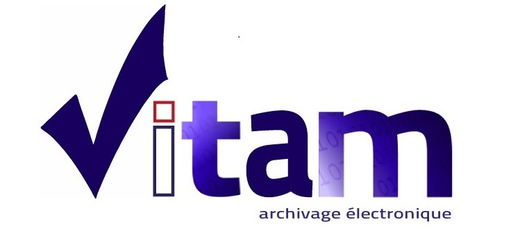

#####
VITAM
#####

.. section-numbering::

Une présentation plus complète en français est disponible `ici <README.rst>`_.

Vitam : A French program
========================

The three ministries in charge of public digital archiving in France (Culture, Defence and Foreign Affairs) decided to develop a specialised software, called Vitam, in order to preserve their digital treasure trove of information. This software will be installed in the IT Department of the three ministries for collecting all the data produce by their services, to store them, to manage them on the long term and to allow the search and the retrieving on this huge and valuable source of information.
This software can and will also be used by other entities in France, and elsewhere, to be their digital preservation system.

Vitam : A digital preservation software 
=======================================

The digital preservation software developped by the Vitam will allow to collect, to preserve, to search and to securely access to very big digital content. In compliance with the OAIS reference model and NFZ 042-13, it will maintain legal value of the data with respect of the information lifecycle. It will be used for all kind of archives including restricted materials. 

The software is free and open source: the code is published on github with open source licences CeCill V2.1 and the documentation in CC by SA 3.0.

-------------------------------------------------------------

.. contents::

Repository structure
=====================

* ``sources``: contains code developped by the Vitam team ;
* ``rpm/vitam-product``: contains rpm packages of external components (when no official rpm exists);
* ``rpm/vitam-external``: contains links to retrieve official rpm from the editor (when exists);
* ``deb/vitam-product``: contains deb packages of external components (when no officiel deb exists) ;
* ``deb/vitam-external``: contains links to retrieve official deb from editor (when exists) ;
* ``deployment``: contains ansible deployment scripts ;
* ``doc``: technical documentation ;
* ``dev-deployment``: contains a Docker environment for development.

