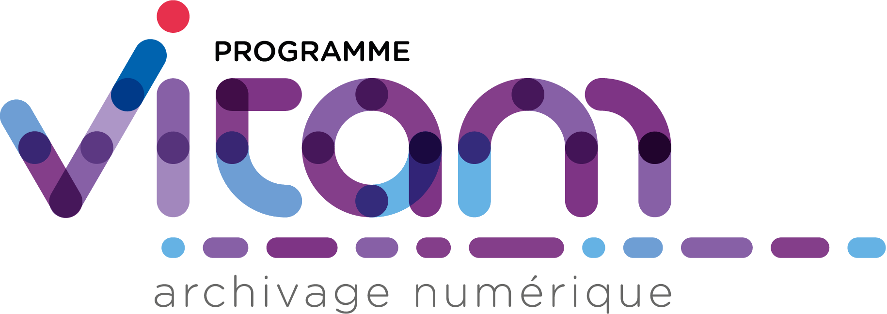

#####
VITAM
#####

.. section-numbering::

For a quick presentation in english, please follow `this link <README.en.rst>`_.

Le programme interministériel Vitam
===================================

Il a pour objectif :

* la conception, la réalisation et la maintenance mutualisées d’une solution logicielle générique d’archivage électronique. Cette solution logicielle est appelée Vitam. Elle est l'objet du document ;
* la mise en place ou la mise à jour, dans chacun des trois ministères porteurs, de plates-formes d’archivage utilisant la solution logicielle Vitam ;
* la réutilisation de la solution logicielle Vitam par le plus grand nombre d’acteurs publics possible, en veillant à sa capacité d'usage dans des contextes divers.
* les documents sont sous "La Licence Ouverte V2" et le code sous CeCILL 2.1
* La "La Licence Ouverte V2" est compatible avec le [Creative Commons CC-By-SA 2.0 license](https://creativecommons.org/licenses/by-sa/2.0/); Une copie de cette licence est disponible dans le fichier [Licence\_CC-By-SA\_2.0-en.txt](./Licence_CC-By-SA_2.0-en.txt).

Pour plus d’information sur le programme, voir `www.programmevitam.fr <http://www.programmevitam.fr/pages/presentation/>`_.

La solution logicielle Vitam
============================

La solution logicielle développée dans le programme Vitam permettra la prise en charge, la conservation, la pérennisation et la consultation sécurisée de très gros volumes d’archives numériques. Elle assurera la gestion complète du cycle de vie des archives et donc la garantie de leur valeur probante. Elle pourra être utilisée pour tout type d'archive, y compris pour des documents classifiés de défense.

Cette solution est développée en logiciel libre pour faciliter sa réutilisation, son évolution, son adaptation à des contextes particuliers si nécessaire, sa maintenance et donc globalement sa pérennité.

L’obligation de mettre en œuvre une solution d’archivage numérique dans les contextes très différents des trois ministères porteurs, tant en termes de pratiques archivistiques qu’en termes de production informatique, a orienté notre choix vers la réalisation d’un back-office. L’objectif est de prendre en compte dans la solution logicielle Vitam, le maximum de fonctions mutualisables et technologiquement complexes, d’autant plus quand elles s’appliquent à des très grands nombres d’objets, et de laisser chaque entité porter ses propres spécificités de processus. Cette vision permet ainsi la réutilisation plus large, tout en assurant la réalisation d’un outil générique intégrable selon les besoins d’acteurs variés dans leur système d’information.

Positionnée comme une brique d’infrastructure, elle prendra en charge toutes les opérations nécessaires pour assurer la pérennisation des documents numériques versés et pour garantir le maintien de leur valeur probante.

C’est le code de ce back-office central qui est ici publié. Des outils annexes sont aussi publiés selon les besoins dans d’autres dépôts (Cf. organisation GitHub `ProgrammeVitam <https://github.com/ProgrammeVitam>`_).

-------------------------------------------------------------

.. contents::

Sructure du projet
==================

Le projet se compose des sous-dossiers suivants :

* ``sources`` : code source des composants développés dans le cadre du programme Vitam ;
* ``rpm/vitam-product`` : packages rpm de composants externes ;
* ``rpm/vitam-external`` : constitution du cache de dépendances vers des packages rpm éditeur ;
* ``deb/vitam-product`` : packages deb de composants externes ;
* ``deb/vitam-external`` : constitution du cache de dépendances vers des packages deb éditeur ;
* ``deployment`` : scripts de déploiement ansible pour la solution Vitam ;
* ``doc`` : documentation technique du projet ;
* ``dev-deployment`` : environnement Docker de développement ;
* ``packaging`` : constitution d'un package standalone de la solution logicielle.

Build
=====

.. tip:: Les conteneurs docker présents (CentOS et Debian) dans le dossier ``dev-deployment`` contient les dépendances permettant de construire une version du logiciel (à l'exception de la documentation) ; son usage est abordé dans le paragraphe dédié du déploiement sur un poste de développement.

.. caution:: Pour construire VITAM au sein d'un environnement public, il est nécessaire de désactiver le profile maven ``vitam`` (activé par défaut) (Cf. `la documentation maven <https://maven.apache.org/guides/introduction/introduction-to-profiles.html#Deactivating_a_profile>`_).

.. caution:: Pour *builder* la solution logicielle VITAM, il est nécessaire, au préalable, de *builder* elasticsearch-metrics-reporter-java (version 2.3.0-VITAM https://github.com/ProgrammeVitam/elasticsearch-metrics-reporter-java/tree/2.3.0-VITAM).

Toutes les instructions suivantes s'exécutent dans le répertoire racine de ce dépôt.

Composants Java
---------------

Les composants Java sont présents dans le répertoire ``sources``.

Pré-requis
**********

* jdk 8
* maven (version 3.3.9 minimale)
* rpm-build

Il est nécessaire de builder la librairie elasticsearch-metrics-reporter-java mise à jour par le projet VITAM:

Cloner le dépot https://github.com/ProgrammeVitam/elasticsearch-metrics-reporter-java.git

Builder le projet elasticsearch-metrics-reporter-java:

.. code-block:: bash

    mvn clean install

Instructions
************

Pour construire globalement les packages VITAM :

.. code-block:: bash

    mvn package rpm:attached-rpm jdeb:jdeb install -f sources/pom.xml -P-vitam

Autres commandes utiles
***********************

Pour ignorer tous les tests:

.. code-block:: bash

    mvn clean install -DskipTests -f sources/pom.xml -P-vitam

Pour ignorer les tests d'intégration:

.. code-block:: bash

    mvn clean test`` ou ``mvn clean install -DskipITs -f sources/pom.xml -P-vitam

Pour exécuter uniquement les tests d'intégration:

.. code-block:: bash

    mvn clean test-compile failsafe:integration-test -f sources/pom.xml -P-vitam

Packages externes
-----------------

Les packages issus de composants externes sont présents dans le répertoire :

* ``rpm``, si déploiement CentOS
* ``deb``, si déploiement Debian

Pré-requis
**********

* rpm-build et rpmdevtools (pour CentOS)
* dpkg-scanpackages (pour Debian)
* golang (>= 1.6)
* npm

.. note:: Pour les packages rpm, la seule plate-forme de compilation possible est CentOS 7 (en raison de la dépendance vers les rpmdevtools).

Instructions
************

CentOS
------

Pour construire les packages rpm dédiés :

.. code-block:: bash

    ./rpm/vitam-product/build-all.sh

Pour construire le cache des packages externes :

.. code-block:: bash

    ./rpm/vitam-external/build_repo.sh

Debian
------

Pour construire les packages deb dédiés :

.. code-block:: bash

    ./deb/vitam-product/build-all.sh

Pour construire le cache des packages externes :

.. code-block:: bash

    ./deb/vitam-external/build_repo.sh

Documentation
-------------

La documentation est présente dans le répertoire ``doc``.

Pré-requis
**********

* jdk 8
* maven (version 3.3.9 minimale)
* rpm-build
* sphinx-build (ainsi que le thème rtd)
* Pour construire le pdf : une distribution latex (Miktex, texlive, mactex, ...)
* make
* raml2html (version minimale : ``raml2html@4.0.0``)

.. tip:: Sur Centos 7, pour l'installation de sphinx, il faut installer les 2 packages ``python-sphinx`` et ``python-sphinx_rtd_theme`` puis créer le lien symbolique : ``ln -s /usr/lib/python2.7/site-packages/sphinx_rtd_theme /usr/lib/python2.7/site-packages/sphinx/themes/``.

Instructions
************

Pour construire la documentation ainsi que le package du serveur de documentation :

.. code-block:: bash

    mvn package rpm:attached-rpm jdeb:jdeb install -f doc/pom.xml -P-vitam

Autres commandes
****************

Il est possibles de construire uniquement le site statique de documentation ; pour cela, il est nécessaire de se placer dans le répertoire ``doc`` et d'exécuter la commande ``make clean symlinks html latexpdf raml autres``. Le résultat est disponible dans ``/doc/target``.

Deploiement sur poste de développement
======================================

2 méthodes existent pour déployer vitam sur un poste de développement.

Alternative 1 : docker
----------------------

Cette méthode permet de construire et déployer un système VITAM de manière presque automatique au sein d'un conteneur docker qui héberge l'intégralité des outils requis pour construire et déployer la solution.

Pré-requis
**********
* Pour *builder* la solution logicielle VITAM, il est nécessaire, au préalable, de *builder* elasticsearch-metrics-reporter-java (version 2.3.0-VITAM https://github.com/ProgrammeVitam/elasticsearch-metrics-reporter-java/tree/2.3.0-VITAM);
* Docker 1.12 minimum avec driver "devicemapper" (en overlay, des comportements non-attendus ont été observés);
* OS récent (des problèmes ont été rencontrés avec Ubuntu 12.04);
* Répertoire contenant un clone du dépôt git vitam/vitam;
* Utilisateur autre que root, soit appartenant au group  docker, soit ayant des capacités de sudo;
* Le répertoire ${HOME}/.m2 sur la machine hôte existe et accessible en écriture ; il sera mappé dans le docker;
* Les ports "classiques" MongoDB (27017), Elasticsearch (9200, 9201), apache (80), SSL (8443) ne sont pas déjà attribués sur l'hôte.

Procédure
*********

* Lancer le script : ``/vitam/dev-deployment/run.sh <environnement>`` , où <environnement> peut être rpm ou deb ;
* Le script demande "Please enter the location of your vitam git repository" (par exemple : ``/$HOME/git/vitam``) ;
* Le script construit (si besoin) le conteneur docker ``vitam/dev-rpm-base`` et le lance (détaché), puis ouvre un terminal à l'intérieur ;
* Une fois le shell ouvert dans le conteneur, les commandes suivantes sont à passer :
mvn clean package rpm:attached-rpm jdeb:jdeb  -f sources/pom.xml -P-vitam -DskipTests  ('adapter au besoin ; rpm pour Redhat ; deb pour Debian)
* Pour redhat, ensuite :
cd /code;cd rpm/vitam-external;./build_repo.sh
cd /code;cd rpm/vitam-product;./build-all.sh
* pour construire l'intégralité des packages (dans le dossier /code) ;
* A l'issue, mettre à jour le "repository" associé en lançant la commande vitam-recreate-repo.
* A l'issue de l'étape suivante, se positionner dans ``/code/deployment`` ;
* Suivre les indications du ``README.rst`` présent dans ce répertoire, en utilisant l'inventaire ``hosts.local``. Les composants sont déployés dans le conteneur ; les ports d'écoute des composants sont mappés à l'extérieur du conteneur, sur les mêmes ports.

Alternative 2 : manuelle (virtualisation)
-----------------------------------------

.. note:: L'installation manuelle de VITAM est plus complexe, et n'inclut pas les étapes de build ; par conséquent, elle n'est conseillée que lorsque la méthode utilisant le conteneur docker ne fonctionne pas.

Pré-requis
**********

Système hôte
++++++++++++

* Virtualbox ou équivalent, avec une machine virtuelle Centos 7 (7.3 conseillé) installée et configurée (SELinux en mode 'disabled') ; le répertoire contenant le dépôt git vitam doit être mappé sur un répertoire à l'intérieur de la VM (par la suite, on considérera que le point de montage dans la VM est ``/code``).
* Répertoire contenant un clone du dépôt git ``vitam/vitam``
* Pouvoir builder VITAM sur le poste local (Cf. paragraphe "Build")

Configuration initiale de la VM
+++++++++++++++++++++++++++++++

* Installer les dépôts epel : ``yum install -y epel-release``
* Installer ansible : ``yum install -y ansible`` ; valider que la version installée est bien au moins la version 2.3 (``ansible --version``)
* Installer les dépendances requises pour la construction d'un dépôt : ``yum install -y createrepo initscripts.x86_64``
* Déclarer un dépôt yum local pointant vers ``/code/target`` ; pour cela, insérer le contenu suivant dans un fichier ``devlocal.repo`` dans le répertoire ``/etc/yum.repos.d`` :

.. code-block:: ini

    [local]
    name=Local repo
    baseurl=file:///code/target
    enabled=1
    gpgcheck=0
    protect=1

* Ajouter ``nameserver 127.0.0.1`` au début du fichier resolv.conf (pour permettre la bonne résolution des noms de service Consul)

Procédure
*********

Sur le poste de développement :

* Exécuter la compilation des sources et la construction de tous les paquets RPM, tel que défini dans les instructions de build présentes plus haut dans cette page.

Dans la VM :

* Se connecter en root dans /code
* Puis rassembler les fichiers rpm produits dans le répertoire ``target/packages``:

.. code-block:: bash

    rm -rf target/packages
    mkdir -p target/packages
    find . -name '*.rpm' -type f -exec cp {} target/packages \;

* Construire l'index du répôt rpm :

.. code-block:: bash

    createrepo -x '.git/*' .

* Construire l'index du répôt deb :

.. code-block:: bash

    dpkg-scanpackages -m. |gzip -9c > Packages.gz

* Nettoyer le cache yum (CentOS) pour prendre en compte les modifications de dépôt :

.. code-block:: bash

    yum clean all

* Nettoyer le cache apt (Debian) pour prendre en compte les modifications de dépôt :

.. code-block:: bash

    apt-get clean

* Puis valider la liste des rpm présents dans le dépôt local, en CentOS :

.. code-block:: bash

    yum --disablerepo="*" --enablerepo="local" list available

* Enfin, se positionner dans le répertoire ``deployment`` et suivre les indications du README.rst présent dans ce répertoire.

L'accès aux composants une fois démarrés dépend de la nature de la connexion réseau présentée par la VM (bridge, NAT ou host).

