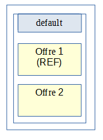
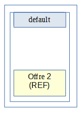
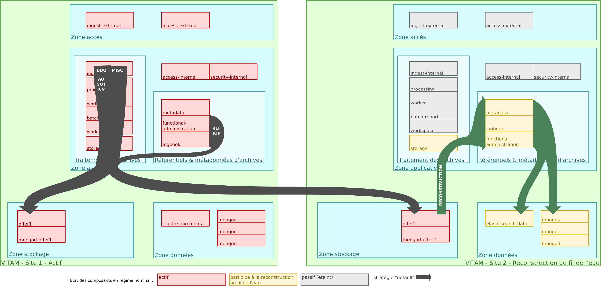
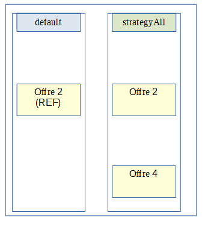
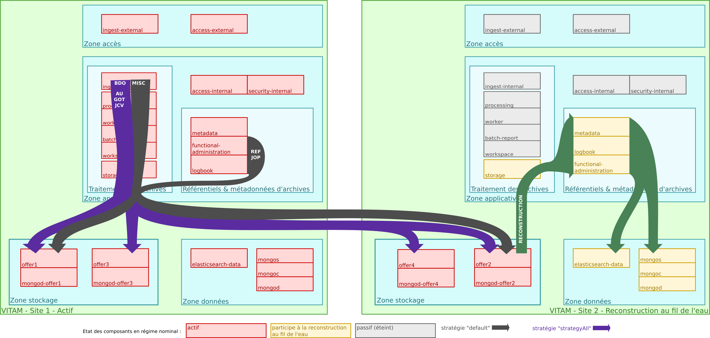
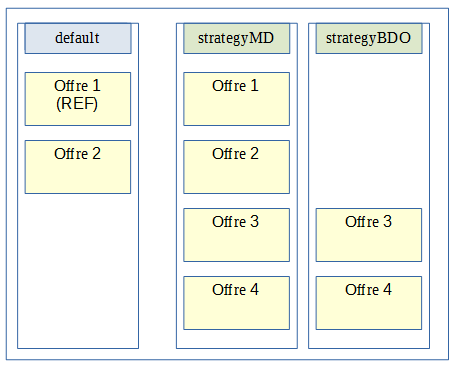
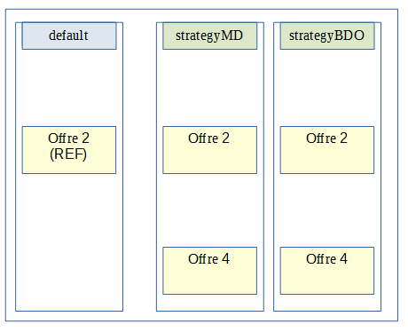
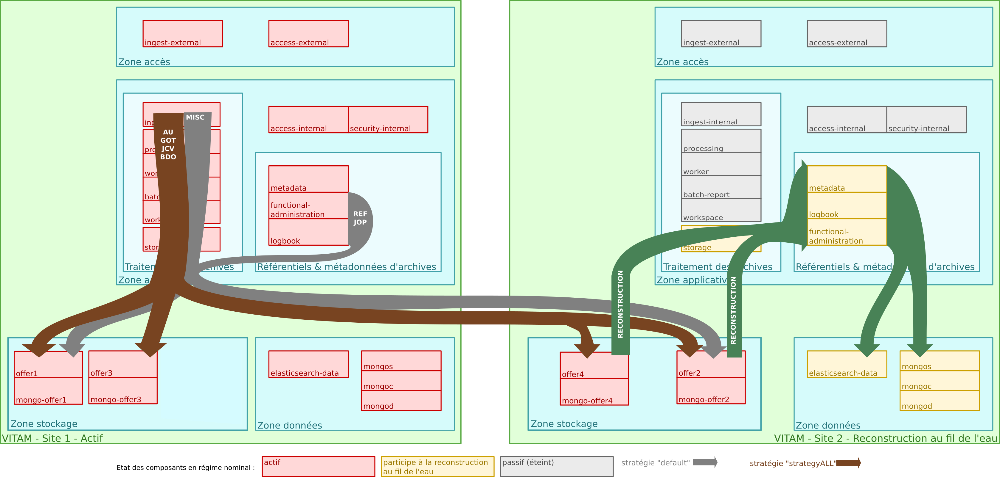

Architecture des données & multisite
####################################

Inventaire des données
======================

.. seealso:: Le modèle de données complet est explicité dans la documentation externe dédiée ("Modèle de données").

Le tableau ci-dessous représente l'inventaire des données gérées par :term:`VITAM`, avec leur localisation et le composant responsable du cycle de vie de la donnée (i.e. règles de création / modification / suppression) :

.. csv-table:: Inventaire des données VITAM
   :file: data/vitam-data-inventory.csv
   :delim: ,
   :class: longtable
   :widths: 1, 4, 2, 2, 2, 1, 1, 1, 1
   :header-rows: 1

Quelques remarques :

* Si une donnée est persistée à plusieurs endroits, l'emplacement de référence (i.e. faisant foi en cas de désynchronisation entre les emplacements) est indiqué par le préfixe ``REF:``. Les processus de reconstruction ou de remise en cohérence de la solution logicielle s'appuient sur cet emplacement référentiel pour alimenter les autres emplacements de stockage. En particulier, les offres de stockage :term:`VITAM` portent la référence des données concernant les archives hébergées par le système :term: `VITAM` : leur contenu binaire (:term:`BDO`), mais également les métadonnées associées au sens large (:term:`AU`, :term:`GOT`, journaux) et les référentiels métier
* Les données de référence à l'origine du registre des fonds sont les journaux opération (JOP)
* Il existe 2 types de journaux d'écriture :

    - Le premier, au niveau du moteur de stockage, qui permet de s'assurer de la bonne prise en compte des écritures par le système :term:`VITAM`. Il s'agit d'un journal métier, participant à la preuve systémique (il est donc sécurisé comme les journaux d'opération et de cycle de vie des archives) ;
    - Le deuxième, au niveau de l'offre de stockage, qui permet de conserver l'ordre d'écriture des éléments stockés pour permettre leur rejeu lors d'une reconstruction (totale ou partielle). Il s'agit donc d'un journal technique, s'inspirant fortement du concept des ``archivelog`` des bases de données.

Stockage et stratégies
======================

.. seealso:: La déscription complète et les usages dans la documentation externe dédiée ("Gestion de multiples stratégies de stockage").

Le stockage des données est pris en charge par le moteur de stockage. Celui-ci est en charge de la gestion du stockage de type *Persistence Storage* par le biais des offres de stockages.
Le moteur de stockage s'appuie sur des stratégies de stockage pour définir la distribution des écritures dans les offres de stockage avec :

* la stratégie de stockage de plateforme *default* (obligatoire)
* une ou plusieurs stratégies additionnelles (optionnel)

La répartition posible des données selon les types de stratégies est alors la suivante : 

.. csv-table:: Inventaire des données selon le type de stratégie VITAM
   :file: data/vitam-data-inventory-strategy.csv
   :delim: ,
   :class: longtable
   :widths: 1, 4, 2, 2
   :header-rows: 1

Les stratégies additionelles utilisées doivent déclarer au moins une offre dite *référente* pour le stockage des ArchiveUnit (AU), ObjectGroup (GOT) et de leur JCV. Pour le stockage des BinaryObject (BDO) il n'y a aucune règle particulière.

.. caution:: L'utilisation en mode standard de :term:`VITAM` est le déploiement mono-stratégie (ie. avec uniquement la stratégie de plateforme *default*). Le déploiement multi-stratégies (ie. avec les stratégies additionnelles) est considéré comme un mode avancé qui ne doit être utilisé que si le besoin a été identifié. 

Multisite
=========

.. figure:: images/dualsite-architecture.*
    :align: center

    Architecture des données d'archives ; fonctionnement multisite.

Le fonctionnement multisite s'appuie fortement sur les capacités de reconstruction de :term:`VITAM` :

* VITAM doit être déployé avec la stratégie de stockage de plateforme *default* comportant une offre de stockage sur chaque site ;
* Le fonctionnement de VITAM sur plusieurs sites fonctionne sur un principe actif / passif : 

    - le site principal fonctionne en mode nominal,
    - le site secondaire fonctionne en mode "reconstruction au fil de l'eau" (les tâches planifiées de sécurisation et d'audit sont arrêtées, les composants frontaux et de traitement de données sont arrêtés (en gris dans le schéma précédent), les tâches planifiées de reconstruction au fil de l'eau sont activées)

* Toute donnée liée aux archives est systématiquement écrite dans les offres de stockage (le cas échéant, en même temps que dans les bases de données), donc sur les 2 sites en même temps ;
* Sur le site secondaire, des processus viennent régulièrement récupérer les données écrites en dernier dans l'offre de stockage de ce site (en se basant sur le contenu des logs d'écriture de l'offre) pour alimenter en update le contenu des bases de données "secondaires" :

    - Référentiels : reconstruction régulière et totale
    - :term:`AU`/:term:`GOT`/:term:`BDO`/Journaux/Graphe : reconstruction au fil de l’eau

En cas de perte du site primaire, l'intégralité des données est donc présente dans le stockage sur le site secondaire, et est presque entièrement reconstruite dans les bases de données du même site. Une fois la reconstruction complètement terminée, le site secondaire est donc accessible ; le niveau d'accessibilité dépendra de la stratégie de stockage sur le site secondaire :

* Soit la dégradation du niveau de résilience des offres est acceptée, et la stratégie de stockage devra être modifiée pour limiter les écritures à une seule offre.
* Soit cette stratégie continue à requérir l'écriture sur 2 offres de stockage, et le système ne sera accessible qu'en lecture seule ; seule une recréation de l'offre de stockage sur le site principal permettra le retour à un fonctionnement nominal (Cf. admonition ci-dessous). Ce scénario est délicat à implémenter, et nécessite notamment la mise en place d'un contrat d'accès spécifique permettant de bloquer les accès en modification.

.. caution:: En cas de bascule de site (:term:`PRA`), les traitements en cours sur le site 1 sont perdus ; en particulier, les ingests non terminés doivent être renvoyés à :term:`VITAM` et les autres *batchs* en cours doivent être relancés. L’incohérence des données sera réglée dans une version ultérieure du système :term:`VITAM`.

Stratégies & multisite
======================

Le fonctionnement multisite multi-stratégie suit le même principe que le mode mono-stratégie.

Pour respecter les normes de l'architecture multisite ainsi que ces processus associés, des règles supplémentaires spécifiques au mode avancé multi-stratégies doivent être respectées:

* La procédure de reconstruction utilise la notion d’offre dite « référente ». Il s’agit d’un groupe d’offres qui doivent contenir TOUTES les données nécessaires à la reconstruction d’un site Vitam à partir des données des offres de stockage. Il est donc obligatoire d’avoir un groupe d’offres de stockage dites « référente » par site, servant de source pour ces données, en vue de garantir la reconstruction. De plus pour des raisons de performance de la reconstruction les données contenues dans ces offres doivent être disjointes entre les offres. 

.. note:: 
    Les données nécessaires à la reconstruction des bases de données sont :
        * les métadonnées des unités archivistiques et groupes d’objets techniques ainsi que leur journal de cycle de vie,
        * les données relatives aux référentiels,
        * les journaux d’opérations.

* La procédure de resynchronisation d’une offre permet de remettre en cohérence le contenu d’une offre à partir d’un autre offre. Pour que ce mécanisme marche il est nécessaire que les offres source et cible de la resynchronisation soient configurées pour être des copies. Les stratégies utilisées doivent être configurées pour contenir qu'une offre aie au moins toujours une autre offre mirroir contenant les même données.

Mode standard: exemple d'architecture mono-stratégie
----------------------------------------------------

Il s’agit du mode par défaut de la solution logicielle Vitam. Dans ce cas nous avons uniquement la stratégie de plateforme *default* déclarant deux offres de stockage avec deux sites.

Stratégies du site principal :

Stratégies du site secondaire :

Flux de stockage :

Mode avancé: exemple d'architecture multi-stratégie orienté Qualité de service
------------------------------------------------------------------------------

Le but d’un déploiement orienté **Qualité de service** de la solution logicielle Vitam est de fournir la possibilité de proposer un nombre de copies stockées différemment en fonction des applications utilisatrices de la plateforme :term:`VITAM`.

Stratégies du site principal :

.. image:: images/multi_strategies_qs_site1.png
    :align: center

Stratégies du site secondaire :

Flux de stockage :

Mode avancé: exemple d'architecture multi-stratégie orienté Offres objets
-------------------------------------------------------------------------

Le but d’un déploiement orienté **Offres objets** de la solution logicielle Vitam est de fournir la possibilité de stocker les objets numériques uniquement sur des offres séparée dites *objets* pour certaines ou toutes les applications utilisatrices de la plateforme :term:`VITAM`. Ce type de déploiement offre donc la possibilité de stocker les objets techniques uniquement sur des offres dites *froides*.

Le but d’un déploiement orienté **Offres objets** de la solution logicielle Vitam est de fournir la possibilité de stocker les objets numériques uniquement sur des offres séparées dites *objets* pour certaines ou toutes les applications utilisatrices de la plateforme :term:`VITAM`.  Ce type de déploiement offre également la possibilité de stocker les objets binaires uniquement sur des offres dites *froides*(sur bande par exemple), mais il est fortement conseillé d’y stocker également les métadonnées associées aux objets.
Une offre dite *référente* doit être une offre de type synchrone (offre dite *chaude*). Elle ne peut pas être un offre de type asynchrone (offre dite *froide*).

Stratégies du site principal :

Stratégies du site secondaire :

Flux de stockage :

