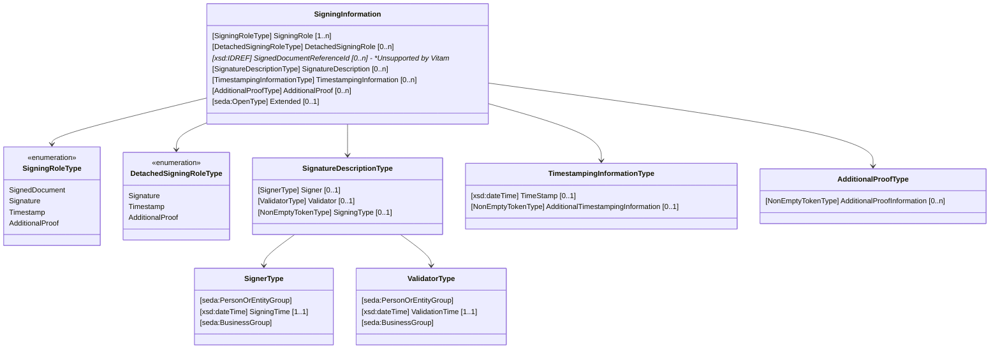

# Signature électronique - Cookbook

Le présent cookbook décrit la modélisation des documents signés numériquement au format SEDA en vue de leur archivage.

## Généralités

Dans sa version 2.3, le standard SEDA prévoit de pouvoir décrire les différents types de document signé numériquement, ainsi que les éventuels documents annexes à la signature électronique.
Par anticipation, la solution logicielle Vitam intègre la description de document signé numériquement dans la version 2.2 du SEDA.

Le standard distingue 4 types de **rôle** (ou **étiquette**) :

- **Le document signé** : il s'agit de tout contenu numérique, tel qu'un rapport textuel, un contrat au format PDF, ou un document XML, qui fait l'objet d'une signature numérique.

- **La signature numérique** ou **signature électronique** : il s'agit de l'équivalent numérique d'une "signature manuscrite" ou d'un "cachet" qui atteste de l'authenticité d'un document numérique et de l'identité de la personne ou de l'entité qui l'a signé. Elle est générée à l'aide de méthodes cryptographiques la rendant quasi-infalsifiable.

- **Horodatage** : il s'agit d'un marqueur temporel appliqué à un document numérique. Cela permet de prouver l'existence du contenu numérique à une date/heure spécifique. L'horodatage implique l'ajout d'une empreinte cryptographique temporelle fiable et vérifiable, typiquement créée par une source de confiance.

- **Preuves complémentaires** : ensemble des données renforçant la crédibilité de la signature numérique. Elles peuvent inclure des informations diverses sur le contexte de signature telles que l'adresse IP de l'appareil utilisé pour signer, des preuves de connexion ou d'authentification, la version technique du dispositif de signature ou de l'outil validant la signature, etc. Ces données sont produites dans un format non standardisé selon l'outil qui les génère.

Un seul objet binaire peut porter plusieurs rôles à la fois. Il peut par exemple contenir le document signé, une ou plusieurs signatures numériques ainsi qu'un ou plusieurs horodatages dans un même binaire au format PDF ou XML.

A contrario, il est également possible que les rôles de signature puissent être portés par des objets binaires distincts. Par exemple, un premier objet binaire contient le document signé, et un second contient la signature effective. On parle alors de *signature détachée*.

## Prise en charge de la signature électronique dans le standard SEDA

**Important** :

> Les versions `2.1` et `2.2` du standard SEDA prévoient un bloc `<Signature>` (au sein du bloc `BaseObjectGroup`). Ce bloc est déprécié et supprimé à partir de la version 2.3 du standard.

> L'utilisation du bloc `<Signature>` est **fortement déconseillée**.

> Vitam ne prévoit pas de migration ou de reprise de données pour les anciens champs du bloc `<Signature>`.

> La description des informations de signature est purement déclarative. Vitam ne fait **AUCUN** contrôle de cohérence structurelle (ex. hiérarchie des unités archivistiques détachées), ou de validité technique (ex. format de signature, validation cryptographique de la signature, date de signature ou d'horodatage, etc.).

Le standard SEDA 2.3 permet de modéliser les informations de signature électronique via un nouveau bloc englobant `<SigningInformation>` qui remplace le bloc `<Signature>` des précédentes versions du SEDA :



Le bloc `<SigningInformation>` permet de décrire les informations de signature de l'objet binaire associé à l'unité archivistique et inclut :

- `<SigningRole>` : décrit le ou les rôles de signature de l'objet binaire. Ces rôles peuvent être combinés, mais ne doivent pas être répétés (pas de doublon possible) :
  - `SignedDocument` : le binaire contient le document signé,
  - `Signature` : le binaire contient une ou plusieurs signatures,
  - `Timestamp` : le binaire contient une ou plusieurs données d'horodatage,
  - `AdditionalProof` : le binaire contient des preuves complémentaires.

- `<DetachedSigningRole>` : décrit les éventuels rôles détachés relatifs au présent binaire, au sein d'un ou plusieurs autres objets binaires annexes. Ces rôles peuvent être combinés, mais ne doivent pas être répétés (pas de doublon possible) :
  - `Signature` : une signature détachée du présent binaire est présente dans un binaire annexe,
  - `Timestamp` : un horodatage détaché du présent binaire est présent dans un binaire annexe,
  - `AdditionalProof` : des preuves complémentaires de signature du présent binaire sont présentes dans un binaire annexe.

- `<SignedDocumentReferenceId>` : référence technique (ID XML) de l'unité archivistique « racine » (qui porte le rôle de `SignedDocument` dans le champ `SigningRole`). Ce champ est **non supporté par Vitam** et est **ignoré** lors du processus de versement.

- `<SignatureDescription>` : bloc décrivant une ou plusieurs signatures.
  Ce bloc est typiquement défini lorsque le champ `SigningRole` prend la valeur `Signature` pour décrire la ou les signatures définies dans le présent binaire.
  Optionnellement, il peut également être utilisé lorsque le `DetachedSigningRole` prend la valeur `Signature` (l'unité archivistique déclarante décrit également des informations de signature détachée redondées ici à des fins d'indexation).

  - `<Signer>` : bloc décrivant l’identité du signataire, qu’il s’agisse d’une personne physique ou morale (`FirstName`, `LastName`, `Corpname`, `Activity`, `Role`, etc.), ainsi qu'une date et heure de signature (`SigningTime`),

  - `<Validator>` : bloc décrivant l’identité du validateur, qu’il s’agisse d’une personne physique ou morale (`FirstName`, `LastName`, `Corpname`, `Activity`, `Role`, etc.), ainsi qu'une date et heure de validation de la signature (`ValidationTime`),

  - `<SigningType>`: décrit le type de signature, au sens juridique du terme. Par exemple, simple, avancée, qualifiée.

- `<TimestampingInformation>` : champ décrivant le ou les horodatages.
  Ce champ est typiquement défini lorsque le champ `SigningRole` prend la valeur `Timestamp` pour décrire le ou les horodatage(s) définis dans le présent binaire.
  Optionnellement, il peut également être utilisé lorsque le `DetachedSigningRole` prend la valeur `Timestamp` (l'unité archivistique déclarante décrit également des informations d'horodatage détachées redondées ici à des fins d'indexation).

  - `<TimeStamp>` : Date et heure d'horodatage,
  - `<AdditionalTimestampingInformation>` : champ textuel optionnel décrivant des informations complémentaires sur l'horodatage.

- `<AdditionalProof>` : bloc permettant de conserver les preuves complémentaires dans un contexte de signature.

  - `<AdditionalProofInformation>` : champ textuel optionnel décrivant des informations complémentaires sur les preuves complémentaires.

- `<Extended>` : permet d'enrichir les informations de signature avec des champs libres d'extension.

**Important** : Afin de simplifier le versement d'archives avec signature électronique, les versions `7.0+` de Vitam supportent le versement d'unités archivistiques avec le bloc `<SigningInformation>` dans le message ArchiveTransfer utilisant les versions `2.1` et `2.2` du SEDA, en tant que champ libre (extension).
À noter cependant que, dans ce cas, la balise `<SigningInformation>` est mutuellement incompatible avec les balises `<Signature>`, `<GPS>`, `<OriginatingSystemIdReplyTo>` et `<TextContent>`.
De même, si plusieurs champs libres (extensions) sont présents, la balise `<SigningInformation>` doit être la première de la liste.
Vitam recommande cependant l'utilisation de la version `2.3` du SEDA, notamment en présence des champs  `<SigningInformation>`.

## Principes de modélisation

Le présent cookbook est livré avec plusieurs exemples de SIP modélisant la signature électronique.

### Cas 1 - Document simple embarquant une signature et un horodatage

Dans le cas d'un binaire simple sans annexes (sans autres binaires complémentaires de signature, d'horodatage ou de preuves complémentaires détachées), la modélisation est la suivante :

- un objet binaire décrit au sein d'une balise `<BinaryDataObject>` ordinaire (BinaryMaster_1)
- une unité archivistique `<ArchiveUnit>` décrivant le binaire et les informations de signature le concernant au sein d'un bloc `<SigningInformation>`

Exemple de document signé avec signature et horodatage embarqués :

```xml

<ArchiveTransfer>
    <!-- ... -->
    <DataObjectPackage>

        <!-- An Object Group with signed and timestamped document to archive (BinaryMaster_1) -->
        <DataObjectGroup id="ID10">
            <BinaryDataObject id="ID11">
                <DataObjectVersion>BinaryMaster_1</DataObjectVersion>
                <Uri>content/ID11.pdf</Uri>
                <!-- ... -->
            </BinaryDataObject>
        </DataObjectGroup>

        <DescriptiveMetadata>
            <ArchiveUnit id="ID12">
                <Content>
                    <DescriptionLevel>Item</DescriptionLevel>
                    <Title>Document</Title>
                    <Description>Signed Document with embedded Signature and TimeStamp</Description>
                    <!-- Other descriptive fields... -->

                    <!-- Signing information -->
                    <SigningInformation>

                        <SigningRole>SignedDocument</SigningRole>
                        <SigningRole>Signature</SigningRole>
                        <SigningRole>Timestamp</SigningRole>

                        <SignatureDescription>
                            <Signer>
                                <FullName>Caroline DISTRIQUIN</FullName>
                                <SigningTime>2023-01-27T10:54:54+01:00</SigningTime>
                            </Signer>
                        </SignatureDescription>
                        <TimestampingInformation>
                            <TimeStamp>2023-01-27T10:54:54+01:00</TimeStamp>
                        </TimestampingInformation>
                    </SigningInformation>
                </Content>

                <!-- The Archive Unit references the Object Group ID of the binary object (BinaryMaster_1) -->
                <DataObjectReference>
                    <DataObjectGroupReferenceId>ID10</DataObjectGroupReferenceId>
                </DataObjectReference>

            </ArchiveUnit>
        </DescriptiveMetadata>
        <!-- ... -->
    </DataObjectPackage>
    <!-- ... -->
</ArchiveTransfer>
```

### Cas 2 - Archive ZIP contenant le document signé et horodaté ainsi que ses preuves complémentaires

Ce cas démontre le cas où un objet binaire contenant à la fois le document signé et horodaté, ainsi que les preuves de
signature (XML, PDF et annexes), le tout packagé dans un seul binaire de type archive ZIP. La modélisation est similaire
au [cas 1](#cas-1---document-simple-embarquant-une-signature-et-un-horodatage):

- Un objet binaire décrit au sein d'un bloc `<BinaryDataObject>`,
- Une unité archivistique `<ArchiveUnit>` décrivant le binaire et les informations de signature le concernant au sein d'un bloc `<SigningInformation>`

```xml

<ArchiveTransfer>
    <!-- ... -->
    <DataObjectPackage>

        <!-- An Object Group defined the binary archive (BinaryMaster_1) -->
        <DataObjectGroup id="ID10">
            <BinaryDataObject id="ID11">
                <DataObjectVersion>BinaryMaster_1</DataObjectVersion>
                <Uri>content/ID11.zip</Uri>
                <!-- ... -->
            </BinaryDataObject>
        </DataObjectGroup>

        <DescriptiveMetadata>
            <ArchiveUnit id="ID12">
                <Content>
                    <DescriptionLevel>Item</DescriptionLevel>
                    <Title>Document</Title>
                    <Description>Archive containing the signed and timestamped document and additional proofs
                    </Description>
                    <!-- Other descriptive fields... -->

                    <!-- Signing information -->
                    <SigningInformation>

                        <SigningRole>SignedDocument</SigningRole>
                        <SigningRole>Signature</SigningRole>
                        <SigningRole>Timestamp</SigningRole>
                        <SigningRole>AdditionalProof</SigningRole>
                        <SignatureDescription>
                            <Signer>
                                <FullName>Caroline DISTRIQUIN</FullName>
                                <SigningTime>2023-01-27T10:54:54+01:00</SigningTime>
                            </Signer>
                        </SignatureDescription>
                        <TimestampingInformation>
                            <TimeStamp>2023-01-27T10:54:54+01:00</TimeStamp>
                        </TimestampingInformation>

                        <!-- Proof details -->
                        <AdditionalProof>
                            <AdditionalProofInformation>Additional proof: Appendix 1</AdditionalProofInformation>
                            <AdditionalProofInformation>Additional proof: Appendix 2</AdditionalProofInformation>
                            <AdditionalProofInformation>Additional proof: XML</AdditionalProofInformation>
                            <AdditionalProofInformation>Additional proof: PDF</AdditionalProofInformation>
                        </AdditionalProof>
                    </SigningInformation>
                </Content>

                <!-- The Archive Unit references the Object Group ID of the binary object (BinaryMaster_1) -->
                <DataObjectReference>
                    <DataObjectGroupReferenceId>ID10</DataObjectGroupReferenceId>
                </DataObjectReference>

            </ArchiveUnit>
        </DescriptiveMetadata>
        <!-- ... -->
    </DataObjectPackage>
    <!-- ... -->
</ArchiveTransfer>
```

### Cas 3 - Binaires multiples

Dans le cas d'un document signé accompagné d'objets binaires détachés (ex : signatures détachées, preuves complémentaires détachées...), les objets binaires sont déclarés dans des groupes d'objets distincts, et décrits via dans une arborescence d'unités archivistiques.

Ainsi, pour décrire par exemple un document signé, ainsi qu'un ensemble de binaires de preuves complémentaires, la modélisation serait ainsi :

- objet binaire représentant le document signé décrit au sein d'un bloc `<BinaryDataObject>` (BinaryMaster_1),
- autres objets binaires de preuves complémentaires également décrits via des blocs `<BinaryDataObject>` (BinaryMaster_1),
- une unité archivistique « racine » `<ArchiveUnit>` décrit le document signé via le bloc `<SigningInformation>`.
  Elle déclare également une balise `<DetachedSigningRole>` avec pour valeur `AdditionalProof` pour indiquer la présence
  de binaires détachés de type preuves complémentaires.
- des unités archivistiques « filles » `<ArchiveUnit>`, rattachées **directement** à l'unité racine, décrivent les
  différents documents détachés liés au document signé, via des blocs `<SigningInformation>`.

```xml

<ArchiveTransfer>
    <!-- ... -->
    <DataObjectPackage>

        <!-- Signed document -->
        <DataObjectGroup id="ID10">
            <BinaryDataObject id="ID11">
                <DataObjectVersion>BinaryMaster_1</DataObjectVersion>
                <Uri>content/ID11.pdf</Uri>
                <!-- ... -->
            </BinaryDataObject>
        </DataObjectGroup>


        <!-- Additional proofs (detached) -->
        <DataObjectGroup id="ID17">
            <BinaryDataObject id="ID23">
                <DataObjectVersion>BinaryMaster_1</DataObjectVersion>
                <Uri>content/ID23.xml</Uri>
                <!-- ... -->
            </BinaryDataObject>
        </DataObjectGroup>
        <DataObjectGroup id="ID18">
            <BinaryDataObject id="ID21">
                <DataObjectVersion>BinaryMaster_1</DataObjectVersion>
                <Uri>content/ID21.pdf</Uri>
                <!-- ... -->
            </BinaryDataObject>
        </DataObjectGroup>
        <DataObjectGroup id="ID19">
            <BinaryDataObject id="ID22">
                <DataObjectVersion>BinaryMaster_1</DataObjectVersion>
                <Uri>content/ID22.pdf</Uri>
                <!-- ... -->
            </BinaryDataObject>
        </DataObjectGroup>
        <DataObjectGroup id="ID20">
            <BinaryDataObject id="ID24">
                <DataObjectVersion>BinaryMaster_1</DataObjectVersion>
                <Uri>content/ID24.pdf</Uri>
                <!-- ... -->
            </BinaryDataObject>
        </DataObjectGroup>

        <DescriptiveMetadata>
            <!-- Root Archive Unit referencing the signed document -->
            <ArchiveUnit id="ID12">
                <Content>
                    <DescriptionLevel>Item</DescriptionLevel>
                    <Title>Document</Title>
                    <Description>Signed Document with embedded Signature and TimeStamp</Description>
                    <!-- Other descriptive fields... -->

                    <!-- Signing information -->
                    <SigningInformation>

                        <SigningRole>SignedDocument</SigningRole>
                        <SigningRole>Signature</SigningRole>
                        <SigningRole>Timestamp</SigningRole>

                        <!-- Additional proof binaries are "detached" -->
                        <DetachedSigningRole>AdditionalProof</DetachedSigningRole>
                        <SignatureDescription>
                            <Signer>
                                <FullName>Caroline DISTRIQUIN</FullName>
                                <SigningTime>2023-01-27T10:54:54+01:00</SigningTime>
                            </Signer>
                        </SignatureDescription>
                        <TimestampingInformation>
                            <TimeStamp>2023-01-27T10:54:54+01:00</TimeStamp>
                        </TimestampingInformation>

                    </SigningInformation>
                </Content>

                <!-- Child Archive Units referencing detached binaries -->
                <ArchiveUnit id="ID16">
                    <Content>
                        <DescriptionLevel>Item</DescriptionLevel>
                        <Title>Additional proof: Appendix 2</Title>
                        <SigningInformation>
                            <SigningRole>AdditionalProof</SigningRole>
                            <AdditionalProof>
                                <AdditionalProofInformation>Additional proof: Appendix 2</AdditionalProofInformation>
                            </AdditionalProof>
                        </SigningInformation>
                    </Content>
                    <DataObjectReference>
                        <DataObjectGroupReferenceId>ID19</DataObjectGroupReferenceId>
                    </DataObjectReference>
                </ArchiveUnit>
                <ArchiveUnit id="ID15">
                    <Content>
                        <DescriptionLevel>Item</DescriptionLevel>
                        <Title>Additional proof: Appendix 1</Title>
                        <SigningInformation>
                            <SigningRole>AdditionalProof</SigningRole>
                            <AdditionalProof>
                                <AdditionalProofInformation>Additional proof: Appendix 1</AdditionalProofInformation>
                            </AdditionalProof>
                        </SigningInformation>
                    </Content>
                    <DataObjectReference>
                        <DataObjectGroupReferenceId>ID20</DataObjectGroupReferenceId>
                    </DataObjectReference>
                </ArchiveUnit>
                <ArchiveUnit id="ID13">
                    <Content>
                        <DescriptionLevel>Item</DescriptionLevel>
                        <Title>Additional proof: PDF</Title>
                        <SigningInformation>
                            <SigningRole>AdditionalProof</SigningRole>
                            <AdditionalProof>
                                <AdditionalProofInformation>Additional proof: PDF</AdditionalProofInformation>
                            </AdditionalProof>
                        </SigningInformation>
                    </Content>
                    <DataObjectReference>
                        <DataObjectGroupReferenceId>ID18</DataObjectGroupReferenceId>
                    </DataObjectReference>
                </ArchiveUnit>
                <ArchiveUnit id="ID14">
                    <Content>
                        <DescriptionLevel>Item</DescriptionLevel>
                        <Title>Additional proof: XML</Title>
                        <SigningInformation>
                            <SigningRole>AdditionalProof</SigningRole>
                            <AdditionalProof>
                                <AdditionalProofInformation>Additional proof: XML</AdditionalProofInformation>
                            </AdditionalProof>
                        </SigningInformation>
                    </Content>
                    <DataObjectReference>
                        <DataObjectGroupReferenceId>ID17</DataObjectGroupReferenceId>
                    </DataObjectReference>
                </ArchiveUnit>

                <!-- The root Archive Unit references the Object Group ID of the signed document (BinaryMaster_1) -->
                <DataObjectReference>
                    <DataObjectGroupReferenceId>ID10</DataObjectGroupReferenceId>
                </DataObjectReference>

            </ArchiveUnit>
        </DescriptiveMetadata>
        <!-- ... -->
    </DataObjectPackage>
    <!-- ... -->
</ArchiveTransfer>
```

### Cas 4 - Binaires multiples avec arborescence râteau

Dans le cas d'un document signé accompagné de binaires détachés, les unités archivistiques peuvent être modélisées en mode « râteau ».

La modélisation est similaire au [cas 3](#cas-3---binaires-multiples), seulement, les unités archivistiques « filles » sont
déclarées à la racine du bloc `<DescriptiveMetadata>`, et sont référencées via le champ `<ArchiveUnitRefId>` au niveau de l'unité archvistique « racine ».

```xml

<ArchiveTransfer>
    <!-- ... -->
    <DataObjectPackage>

        <!-- Signed document -->
        <DataObjectGroup id="ID10">
            <BinaryDataObject id="ID11">
                <DataObjectVersion>BinaryMaster_1</DataObjectVersion>
                <Uri>content/ID11.pdf</Uri>
                <!-- ... -->
            </BinaryDataObject>
        </DataObjectGroup>


        <!-- Additional proofs (detached) -->
        <DataObjectGroup id="ID17">
            <BinaryDataObject id="ID23">
                <DataObjectVersion>BinaryMaster_1</DataObjectVersion>
                <Uri>content/ID23.xml</Uri>
                <!-- ... -->
            </BinaryDataObject>
        </DataObjectGroup>
        <DataObjectGroup id="ID18">
            <BinaryDataObject id="ID21">
                <DataObjectVersion>BinaryMaster_1</DataObjectVersion>
                <Uri>content/ID21.pdf</Uri>
                <!-- ... -->
            </BinaryDataObject>
        </DataObjectGroup>
        <DataObjectGroup id="ID19">
            <BinaryDataObject id="ID22">
                <DataObjectVersion>BinaryMaster_1</DataObjectVersion>
                <Uri>content/ID22.pdf</Uri>
                <!-- ... -->
            </BinaryDataObject>
        </DataObjectGroup>
        <DataObjectGroup id="ID20">
            <BinaryDataObject id="ID24">
                <DataObjectVersion>BinaryMaster_1</DataObjectVersion>
                <Uri>content/ID24.pdf</Uri>
                <!-- ... -->
            </BinaryDataObject>
        </DataObjectGroup>

        <DescriptiveMetadata>
            <!-- Root Archive Unit referencing the signed document -->
            <ArchiveUnit id="ID12">
                <Content>
                    <DescriptionLevel>Item</DescriptionLevel>
                    <Title>Document</Title>
                    <Description>Signed Document with embedded Signature and TimeStamp</Description>
                    <SigningInformation>
                        <SigningRole>SignedDocument</SigningRole>
                        <SigningRole>Signature</SigningRole>
                        <SigningRole>Timestamp</SigningRole>

                        <!-- Additional proof binaries are "detached" -->
                        <DetachedSigningRole>AdditionalProof</DetachedSigningRole>
                        <SignatureDescription>
                            <Signer>
                                <FullName>Caroline DISTRIQUIN</FullName>
                                <SigningTime>2023-01-27T10:54:54+01:00</SigningTime>
                            </Signer>
                        </SignatureDescription>
                        <TimestampingInformation>
                            <TimeStamp>2023-01-27T10:54:54+01:00</TimeStamp>
                        </TimestampingInformation>

                    </SigningInformation>
                </Content>

                <!-- Reference to "Child" Archive Units -->
                <ArchiveUnit id="ID121">
                    <ArchiveUnitRefId>ID16</ArchiveUnitRefId>
                </ArchiveUnit>
                <ArchiveUnit id="ID122">
                    <ArchiveUnitRefId>ID15</ArchiveUnitRefId>
                </ArchiveUnit>
                <ArchiveUnit id="ID123">
                    <ArchiveUnitRefId>ID13</ArchiveUnitRefId>
                </ArchiveUnit>
                <ArchiveUnit id="ID124">
                    <ArchiveUnitRefId>ID14</ArchiveUnitRefId>
                </ArchiveUnit>

                <!-- The root Archive Unit references the Object Group ID of the signed document (BinaryMaster_1) -->
                <DataObjectReference>
                    <DataObjectGroupReferenceId>ID10</DataObjectGroupReferenceId>
                </DataObjectReference>
            </ArchiveUnit>

            <!-- Child Archive Units referencing detached binaries -->
            <ArchiveUnit id="ID16">
                <Content>
                    <DescriptionLevel>Item</DescriptionLevel>
                    <Title>Additional proof: Appendix 2</Title>
                    <SigningInformation>
                        <SigningRole>AdditionalProof</SigningRole>
                        <AdditionalProof>
                            <AdditionalProofInformation>Additional proof: Appendix 2</AdditionalProofInformation>
                        </AdditionalProof>
                    </SigningInformation>
                </Content>
                <DataObjectReference>
                    <DataObjectGroupReferenceId>ID19</DataObjectGroupReferenceId>
                </DataObjectReference>
            </ArchiveUnit>
            <ArchiveUnit id="ID15">
                <Content>
                    <DescriptionLevel>Item</DescriptionLevel>
                    <Title>Additional proof: Appendix 1</Title>
                    <SigningInformation>
                        <SigningRole>AdditionalProof</SigningRole>
                        <AdditionalProof>
                            <AdditionalProofInformation>Additional proof: Appendix 1</AdditionalProofInformation>
                        </AdditionalProof>
                    </SigningInformation>
                </Content>
                <DataObjectReference>
                    <DataObjectGroupReferenceId>ID20</DataObjectGroupReferenceId>
                </DataObjectReference>
            </ArchiveUnit>
            <ArchiveUnit id="ID13">
                <Content>
                    <DescriptionLevel>Item</DescriptionLevel>
                    <Title>Additional proof: PDF</Title>
                    <SigningInformation>
                        <SigningRole>AdditionalProof</SigningRole>
                        <AdditionalProof>
                            <AdditionalProofInformation>Additional proof: PDF</AdditionalProofInformation>
                        </AdditionalProof>
                    </SigningInformation>
                </Content>
                <DataObjectReference>
                    <DataObjectGroupReferenceId>ID18</DataObjectGroupReferenceId>
                </DataObjectReference>
            </ArchiveUnit>
            <ArchiveUnit id="ID14">
                <Content>
                    <DescriptionLevel>Item</DescriptionLevel>
                    <Title>Additional proof: XML</Title>
                    <SigningInformation>
                        <SigningRole>AdditionalProof</SigningRole>
                        <AdditionalProof>
                            <AdditionalProofInformation>Additional proof: XML</AdditionalProofInformation>
                        </AdditionalProof>
                    </SigningInformation>
                </Content>
                <DataObjectReference>
                    <DataObjectGroupReferenceId>ID17</DataObjectGroupReferenceId>
                </DataObjectReference>

            </ArchiveUnit>
        </DescriptiveMetadata>
        <!-- ... -->
    </DataObjectPackage>
    <!-- ... -->
</ArchiveTransfer>
```

### Cas 5 - Duplication des informations de signature dans l'unité archivistique racine

Dans le cas d'un document signé accompagné de binaires détachés, il est possible de recopier/dupliquer les
informations de signature des unités archivistiques « filles » au niveau de l'unité archivistique « racine ».

Ceci permet de décrire et d'indexer au sein d'une seule unité archivistique racine l'ensemble des informations de signature
et de simplifier certains types de requêtes.

**Important :**

> Il est à noter que la duplication d'informations peut causer des incohérences dans la description des
archives si des modifications partielles sont réalisées.

> Ceci rajoute également un surcoût de stockage pour l'indexation des données.

Ainsi, pour décrire par exemple un document signé, ainsi qu'un ensemble de binaires de preuves complémentaires avec
duplication des informations de signature dans l'unité racine, la modélisation serait ainsi :

- objet binaire représentant le document signé portant la signature et l'horodatage décrit au sein d'un bloc `<BinaryDataObject>`  
  (BinaryMaster_1)
- autres objets binaires de preuves complémentaires également décrits via des blocs `<BinaryDataObject>`
  (BinaryMaster_1)
- une unité archivistique « racine » `<ArchiveUnit>` décrit le document racine via le bloc `<SigningInformation>`.
  Elle déclare également un champ `<DetachedSigningRole>` avec pour valeur `AdditionalProof` pour indiquer la présence
  de binaires détachés de type preuves complémentaires. Enfin, l'unité d'archives duplique également les informations
  des preuves complémentaires via un champ `<AdditionalProof>`.
- des unités archivistiques « filles » `<ArchiveUnit>`, rattachées à l'unité archivistique racine, décrivent les différents documents
  détachés liés au document signé, via des blocs `<SigningInformation>`.

```xml

<ArchiveTransfer>
    <!-- ... -->
    <DataObjectPackage>

        <!-- Signed document -->
        <DataObjectGroup id="ID10">
            <BinaryDataObject id="ID11">
                <DataObjectVersion>BinaryMaster_1</DataObjectVersion>
                <Uri>content/ID11.pdf</Uri>
                <!-- ... -->
            </BinaryDataObject>
        </DataObjectGroup>


        <!-- Additional proofs (detached) -->
        <DataObjectGroup id="ID17">
            <BinaryDataObject id="ID23">
                <DataObjectVersion>BinaryMaster_1</DataObjectVersion>
                <Uri>content/ID23.xml</Uri>
                <!-- ... -->
            </BinaryDataObject>
        </DataObjectGroup>
        <DataObjectGroup id="ID18">
            <BinaryDataObject id="ID21">
                <DataObjectVersion>BinaryMaster_1</DataObjectVersion>
                <Uri>content/ID21.pdf</Uri>
                <!-- ... -->
            </BinaryDataObject>
        </DataObjectGroup>
        <DataObjectGroup id="ID19">
            <BinaryDataObject id="ID22">
                <DataObjectVersion>BinaryMaster_1</DataObjectVersion>
                <Uri>content/ID22.pdf</Uri>
                <!-- ... -->
            </BinaryDataObject>
        </DataObjectGroup>
        <DataObjectGroup id="ID20">
            <BinaryDataObject id="ID24">
                <DataObjectVersion>BinaryMaster_1</DataObjectVersion>
                <Uri>content/ID24.pdf</Uri>
                <!-- ... -->
            </BinaryDataObject>
        </DataObjectGroup>

        <DescriptiveMetadata>
            <!-- Root Archive Unit referencing the Signed document -->
            <ArchiveUnit id="ID12">
                <Content>
                    <DescriptionLevel>Item</DescriptionLevel>
                    <Title>Document</Title>
                    <Description>Signed Document with embedded Signature and TimeStamp</Description>
                    <!-- Other descriptive fields... -->

                    <!-- Signing information -->
                    <SigningInformation>

                        <SigningRole>SignedDocument</SigningRole>
                        <SigningRole>Signature</SigningRole>
                        <SigningRole>Timestamp</SigningRole>

                        <!-- Additional proof binaries are "detached" -->
                        <DetachedSigningRole>AdditionalProof</DetachedSigningRole>
                        <SignatureDescription>
                            <Signer>
                                <FullName>Caroline DISTRIQUIN</FullName>
                                <SigningTime>2023-01-27T10:54:54+01:00</SigningTime>
                            </Signer>
                        </SignatureDescription>
                        <TimestampingInformation>
                            <TimeStamp>2023-01-27T10:54:54+01:00</TimeStamp>
                        </TimestampingInformation>

                        <!-- Duplication of detached additionnal proof binaries in root Archive Unit -->
                        <AdditionalProof>
                            <AdditionalProofInformation>Additional proof: Appendix 1</AdditionalProofInformation>
                            <AdditionalProofInformation>Additional proof: Appendix 2</AdditionalProofInformation>
                            <AdditionalProofInformation>Additional proof: XML</AdditionalProofInformation>
                            <AdditionalProofInformation>Additional proof: PDF</AdditionalProofInformation>
                        </AdditionalProof>

                    </SigningInformation>
                </Content>

                <!-- Child Archive Units referencing detached binaries -->
                <ArchiveUnit id="ID16">
                    <Content>
                        <DescriptionLevel>Item</DescriptionLevel>
                        <Title>Additional proof: Appendix 2</Title>
                        <SigningInformation>
                            <SigningRole>AdditionalProof</SigningRole>
                            <AdditionalProof>
                                <AdditionalProofInformation>Additional proof: Appendix 2</AdditionalProofInformation>
                            </AdditionalProof>
                        </SigningInformation>
                    </Content>
                    <DataObjectReference>
                        <DataObjectGroupReferenceId>ID19</DataObjectGroupReferenceId>
                    </DataObjectReference>
                </ArchiveUnit>
                <ArchiveUnit id="ID15">
                    <Content>
                        <DescriptionLevel>Item</DescriptionLevel>
                        <Title>Additional proof: Appendix 1</Title>
                        <SigningInformation>
                            <SigningRole>AdditionalProof</SigningRole>
                            <AdditionalProof>
                                <AdditionalProofInformation>Additional proof: Appendix 1</AdditionalProofInformation>
                            </AdditionalProof>
                        </SigningInformation>
                    </Content>
                    <DataObjectReference>
                        <DataObjectGroupReferenceId>ID20</DataObjectGroupReferenceId>
                    </DataObjectReference>
                </ArchiveUnit>
                <ArchiveUnit id="ID13">
                    <Content>
                        <DescriptionLevel>Item</DescriptionLevel>
                        <Title>Additional proof: PDF</Title>
                        <SigningInformation>
                            <SigningRole>AdditionalProof</SigningRole>
                            <AdditionalProof>
                                <AdditionalProofInformation>Additional proof: PDF</AdditionalProofInformation>
                            </AdditionalProof>
                        </SigningInformation>
                    </Content>
                    <DataObjectReference>
                        <DataObjectGroupReferenceId>ID18</DataObjectGroupReferenceId>
                    </DataObjectReference>
                </ArchiveUnit>
                <ArchiveUnit id="ID14">
                    <Content>
                        <DescriptionLevel>Item</DescriptionLevel>
                        <Title>Additional proof: XML</Title>
                        <SigningInformation>
                            <SigningRole>AdditionalProof</SigningRole>
                            <AdditionalProof>
                                <AdditionalProofInformation>Additional proof: XML</AdditionalProofInformation>
                            </AdditionalProof>
                        </SigningInformation>
                    </Content>
                    <DataObjectReference>
                        <DataObjectGroupReferenceId>ID17</DataObjectGroupReferenceId>
                    </DataObjectReference>
                </ArchiveUnit>

                <!-- The root Archive Unit references the Object Group ID of the Signed document (BinaryMaster_1) -->
                <DataObjectReference>
                    <DataObjectGroupReferenceId>ID10</DataObjectGroupReferenceId>
                </DataObjectReference>

            </ArchiveUnit>
        </DescriptiveMetadata>
        <!-- ... -->
    </DataObjectPackage>
    <!-- ... -->
</ArchiveTransfer>
```

### Cas 6 - Rattachement de binaires à un document signé

Il se peut qu'un ou plusieurs binaires complémentaires aient besoin d'être versés ultérieurement. Ceci peut se produire
lorsque la signature, l'horodatage et/ou les preuves complémentaires ne sont pas versées au même moment que le document
signé.

Dans ce cas, il convient simplement de procéder à un rattachement d'unités archivistiques « filles » à l'unité archivistique
« racine » via le bloc `<UpdateOperation>`.

Ainsi, un exemple de modélisation d'un premier versement contenant un document signé et horodaté serait comme suit :

```xml

<ArchiveTransfer>
    <!-- ... -->
    <DataObjectPackage>

        <!-- Signed document -->
        <DataObjectGroup id="ID10">
            <BinaryDataObject id="ID11">
                <DataObjectVersion>BinaryMaster_1</DataObjectVersion>
                <Uri>content/ID11.pdf</Uri>
                <!-- ... -->
            </BinaryDataObject>
        </DataObjectGroup>

        <DescriptiveMetadata>
            <!-- Root Archive Unit referencing the Signed document -->
            <ArchiveUnit id="ID12">
                <Content>
                    <DescriptionLevel>Item</DescriptionLevel>
                    <Title>Document</Title>
                    <Description>Signed Document with embedded Signature and TimeStamp</Description>
                    <!-- Other descriptive fields... -->

                    <!-- Signing information -->
                    <SigningInformation>

                        <SigningRole>SignedDocument</SigningRole>
                        <SigningRole>Signature</SigningRole>
                        <SigningRole>Timestamp</SigningRole>

                        <!-- Additional proof binaries are "detached" -->
                        <DetachedSigningRole>AdditionalProof</DetachedSigningRole>
                        <SignatureDescription>
                            <Signer>
                                <FullName>Caroline DISTRIQUIN</FullName>
                                <SigningTime>2023-01-27T10:54:54+01:00</SigningTime>
                            </Signer>
                        </SignatureDescription>
                        <TimestampingInformation>
                            <TimeStamp>2023-01-27T10:54:54+01:00</TimeStamp>
                        </TimestampingInformation>

                    </SigningInformation>
                </Content>

                <!-- The root Archive Unit references the Object Group ID of the Signed document (BinaryMaster_1) -->
                <DataObjectReference>
                    <DataObjectGroupReferenceId>ID10</DataObjectGroupReferenceId>
                </DataObjectReference>

            </ArchiveUnit>
        </DescriptiveMetadata>
        <!-- ... -->
    </DataObjectPackage>
    <!-- ... -->
</ArchiveTransfer>
```

Le rattachement de preuves complémentaires au précédent binaire se ferait au moyen d'une modélisation comme suit :

```xml

<ArchiveTransfer>
    <!-- ... -->
    <DataObjectPackage>

        <!-- Additional proofs (detached) -->
        <DataObjectGroup id="ID17">
            <BinaryDataObject id="ID23">
                <DataObjectVersion>BinaryMaster_1</DataObjectVersion>
                <Uri>content/ID23.xml</Uri>
                <!-- ... -->
            </BinaryDataObject>
        </DataObjectGroup>
        <DataObjectGroup id="ID18">
            <BinaryDataObject id="ID21">
                <DataObjectVersion>BinaryMaster_1</DataObjectVersion>
                <Uri>content/ID21.pdf</Uri>
                <!-- ... -->
            </BinaryDataObject>
        </DataObjectGroup>
        <DataObjectGroup id="ID19">
            <BinaryDataObject id="ID22">
                <DataObjectVersion>BinaryMaster_1</DataObjectVersion>
                <Uri>content/ID22.pdf</Uri>
                <!-- ... -->
            </BinaryDataObject>
        </DataObjectGroup>
        <DataObjectGroup id="ID20">
            <BinaryDataObject id="ID24">
                <DataObjectVersion>BinaryMaster_1</DataObjectVersion>
                <Uri>content/ID24.pdf</Uri>
                <!-- ... -->
            </BinaryDataObject>
        </DataObjectGroup>

        <DescriptiveMetadata>
            <!-- Root Archive Unit referenced by SystemId (GUID) -->
            <ArchiveUnit id="ID12">
                <Management>
                    <UpdateOperation>
                        <SystemId>#### GUID OF ROOT ARCHIVE UNIT ####</SystemId>
                    </UpdateOperation>
                </Management>
                <Content>
                    <DescriptionLevel>Item</DescriptionLevel>
                    <Title>Document</Title>
                </Content>

                <!-- Child Archive Units referencing detached binaries -->
                <ArchiveUnit id="ID16">
                    <Content>
                        <DescriptionLevel>Item</DescriptionLevel>
                        <Title>Additional proof: Appendix 2</Title>
                        <SigningInformation>
                            <SigningRole>AdditionalProof</SigningRole>
                            <AdditionalProof>
                                <AdditionalProofInformation>Additional proof: Appendix 2</AdditionalProofInformation>
                            </AdditionalProof>
                        </SigningInformation>
                    </Content>
                    <DataObjectReference>
                        <DataObjectGroupReferenceId>ID19</DataObjectGroupReferenceId>
                    </DataObjectReference>
                </ArchiveUnit>
                <ArchiveUnit id="ID15">
                    <Content>
                        <DescriptionLevel>Item</DescriptionLevel>
                        <Title>Additional proof: Appendix 1</Title>
                        <SigningInformation>
                            <SigningRole>AdditionalProof</SigningRole>
                            <AdditionalProof>
                                <AdditionalProofInformation>Additional proof: Appendix 1</AdditionalProofInformation>
                            </AdditionalProof>
                        </SigningInformation>
                    </Content>
                    <DataObjectReference>
                        <DataObjectGroupReferenceId>ID20</DataObjectGroupReferenceId>
                    </DataObjectReference>
                </ArchiveUnit>
                <ArchiveUnit id="ID13">
                    <Content>
                        <DescriptionLevel>Item</DescriptionLevel>
                        <Title>Additional proof: PDF</Title>
                        <SigningInformation>
                            <SigningRole>AdditionalProof</SigningRole>
                            <AdditionalProof>
                                <AdditionalProofInformation>Additional proof: PDF</AdditionalProofInformation>
                            </AdditionalProof>
                        </SigningInformation>
                    </Content>
                    <DataObjectReference>
                        <DataObjectGroupReferenceId>ID18</DataObjectGroupReferenceId>
                    </DataObjectReference>
                </ArchiveUnit>
                <ArchiveUnit id="ID14">
                    <Content>
                        <DescriptionLevel>Item</DescriptionLevel>
                        <Title>Additional proof: XML</Title>
                        <SigningInformation>
                            <SigningRole>AdditionalProof</SigningRole>
                            <AdditionalProof>
                                <AdditionalProofInformation>Additional proof: XML</AdditionalProofInformation>
                            </AdditionalProof>
                        </SigningInformation>
                    </Content>
                    <DataObjectReference>
                        <DataObjectGroupReferenceId>ID17</DataObjectGroupReferenceId>
                    </DataObjectReference>
                </ArchiveUnit>

            </ArchiveUnit>
        </DescriptiveMetadata>
        <!-- ... -->
    </DataObjectPackage>
    <!-- ... -->
</ArchiveTransfer>
```

### Cas 7 - Extensions (champs libres)

Le standard SEDA prévoit la possibilité de rajouter des champs libres (extensions) pour rajouter des informations additionnelles via le champ `<Extended>`

**Important** : Il est fortement recommandé de décrire les champs libres dans l'ontologie et d'adapter la configuration du mapping Elasticsearch de Vitam pour la bonne indexation de ces champs.

Exemple de document signé avec signature et horodatage embarqués avec champs libres :

```xml

<ArchiveTransfer>
  <!-- ... -->
  <DataObjectPackage>

    <!-- An Object Group with signed and timestamped document to archive (BinaryMaster_1) -->
    <DataObjectGroup id="ID10">
      <BinaryDataObject id="ID11">
        <DataObjectVersion>BinaryMaster_1</DataObjectVersion>
        <Uri>content/ID11.pdf</Uri>
        <!-- ... -->
      </BinaryDataObject>
    </DataObjectGroup>

    <DescriptiveMetadata>
      <ArchiveUnit id="ID12">
        <Content>
          <DescriptionLevel>Item</DescriptionLevel>
          <Title>Document</Title>
          <Description>Signed Document with embedded Signature and TimeStamp</Description>
          <!-- Other descriptive fields... -->

          <!-- Signing information -->
          <SigningInformation>

            <SigningRole>SignedDocument</SigningRole>
            <SigningRole>Signature</SigningRole>
            <SigningRole>Timestamp</SigningRole>

            <SignatureDescription>
              <Signer>
                <FullName>Caroline DISTRIQUIN</FullName>
                <SigningTime>2023-01-27T10:54:54+01:00</SigningTime>
              </Signer>
            </SignatureDescription>
            <TimestampingInformation>
              <TimeStamp>2023-01-27T10:54:54+01:00</TimeStamp>
            </TimestampingInformation>

            <!-- Extended fields -->
            <Extended>
              <ExtraField1>Value 1</ExtraField1>
              <ExtraField1>Value 2</ExtraField1>
              <ExtraField2>
                <SubField2>Value 3</SubField2>
              </ExtraField2>
            </Extended>

          </SigningInformation>
        </Content>

        <!-- The Archive Unit references the Object Group ID of the binary object (BinaryMaster_1) -->
        <DataObjectReference>
          <DataObjectGroupReferenceId>ID10</DataObjectGroupReferenceId>
        </DataObjectReference>

      </ArchiveUnit>
    </DescriptiveMetadata>
    <!-- ... -->
  </DataObjectPackage>
  <!-- ... -->
</ArchiveTransfer>
```