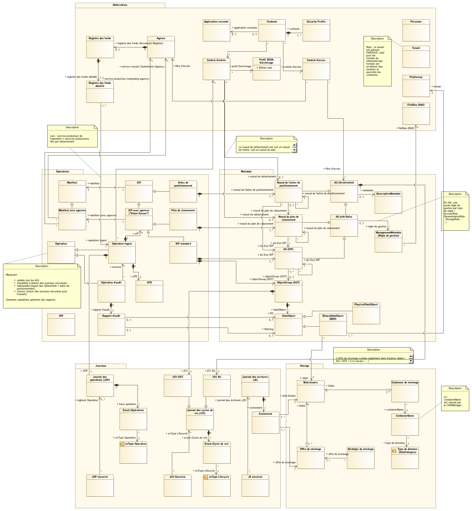

Annexes
#######

Valeurs possibles pour le champ evType du LogBook Operation
-----------------------------------------------------------

L'ensemble des étapes, tâches et traitements sont détaillés dans la documentation Modèle de workflow.

Valeurs possibles pour le champ evType du LogBook LifeCycle
-----------------------------------------------------------
  
L'ensemble des étapes, tâches et traitements sont détaillées dans la documentation Modèle de workflow.

Valeurs possibles pour le champ evTypeProc (type de processus)
--------------------------------------------------------------

.. csv-table::
  :header: "Process Type","Valeur", "Description"

  "Audit type process","AUDIT", "Audit"
  "Check type process","CHECK", "Vérification"
  "Destruction type process (v2)","DESTRUCTION", "Élimination"
  "Ingest type process","INGEST", "Entrée"
  "Preservation type process","PRESERVATION", "Préservation"
  "Rules Manager process","MASTERDATA", "Données de base"
  "Traceability type process","TRACEABILITY", "Sécurisation"
  "Update process","UPDATE", "Mise à jour"

Catégories de règles possibles
------------------------------

.. csv-table::
  :header: "Prefixe (Peut être modifié)", "Type de règle correspondante", "Description du type de règle"

  "ACC", "AccessRule", "Règle d'accès / délai de communicabilité"
  "APP", "Appraisal", "Règle correspondant à la durée d'utilité administrative (DUA)/ Durée de rétention / conservation"
  "CLASS", "ClassificationRule", "Règle de classification"
  "DIS", "DisseminationRule", "Règle de diffusion"
  "REU", "ReuseRule", "Règle de réutilisation"
  "STO", "StorageRule", "Durée d'utilité courante / durée de conservation au sens de la loi Informatique et Libertés"

Valeurs possibles pour le champ Status de la collection AccessionRegisterDetail
-------------------------------------------------------------------------------

.. csv-table::
  :header: "Status type", "Valeur"

  "Le fonds est complet sauvegardé", "STORED_AND_COMPLETED"
  "Le fonds est mis à jour et sauvegardé", "STORED_AND_UPDATED"
  "Le fonds n'est pas sauvegardé", "UNSTORED"

Valeurs possibles pour le champ Name de la collection VitamSecquence
--------------------------------------------------------------------

.. csv-table::
  :header: "Prefixe", "Type de collection correspondante", "Decription"

  "AC", "AccessContract", "Contrats d'accès"
  "IC", "IngestContract", "Contrats d'entrée"
  "PR", "Profile", "Profils d'archivage"
  "CT", "Context", "Contextes applicatifs"
  "AG", "Agencies", "Services agents"
  "RULE", "FileRules", "Règles de gestion"
  "SEC_PROFILE", "SecurityProfiles", "Profils de sécurité"
  
Diagramme du modèle de données Vitam
------------------------------------

    Modèle de données métier : vue d'ensemble.

Type d'indexation dans ElasticSearch par collection et par champ
----------------------------------------------------------------

**Collection AccessContract**

.. csv-table::
  :header: "Champ", "Type d'indexation"

	"DataObjectVersion", "Non analysé"
	"Description", "Analysé"
	"Identifier", "Non analysé"
	"Name", "Analysé"
	"OriginatingAgencies", "Non analysé"
	"RootUnits", "Non analysé"
	"Status", "Non analysé"

**Collection AccessionRegisterDetail**

.. csv-table::
  :header: "Champ", "Type d'indexation"

	"ArchivalAgreement", "Non analysé"
	"OperationIds", "Non analysé"
	"OriginatingAgency", "Non analysé"
	"Status", "Non analysé"
	"SubmissionAgency", "Non analysé"

**Collection AccessionRegisterSummary**

.. csv-table::
  :header: "Champ", "Type d'indexation"

  "OriginatingAgency", "Non analysé"

**Collection Agencies**

.. csv-table::
  :header: "Champ", "Type d'indexation"

	"Description", "Analysé"
	"Identifier", "Non analysé"
	"Name", "Analysé"

**Collection Context**

.. csv-table::
  :header: "Champ", "Type d'indexation"

	"Identifier", "Non analysé"
	"Name", "Analysé"
	"Permissions.AccessContracts", "Non analysé"
	"Permissions.IngestContracts", "Non analysé"
	"SecurityProfile", "Non analysé"

**Collection FileFormat**

.. csv-table::
  :header: "Champ", "Type d'indexation"

	"Comment", "Analysé"
	"Extension", "Non analysé"
	"Group", "Analysé"
	"HasPriorityOverFileFormatID", "Non analysé"
	"MIMEType", "Analysé"
	"Name", "Analysé"
	"PUID", "Non analysé"
	"Version", "Non analysé"
	"VersionPronom", "Non analysé"

**Collection FileRule**

.. csv-table::
  :header: "Champ", "Type d'indexation"

	"RuleDescription", "Analysé"
	"RuleDuration", "Non analysé"
	"RuleId", "Non analysé"
	"RuleMeasurement", "Non analysé"
	"RuleType", "Non analysé"
	"RuleValue", "Analysé"

**Collection IngestContract**

.. csv-table::
  :header: "Champ", "Type d'indexation"

	"ArchiveProfiles", "Non analysé"
	"Description", "Analysé"
	"Identifier", "Non analysé"
	"LinkParentId", "Non analysé"
	"Name", "Analysé"
	"Status", "Non analysé"
	
**Collection Profile**

.. csv-table::
  :header: "Champ", "Type d'indexation"

	"Description", "Analysé"
	"Format", "Non analysé"
	"Identifier", "Non analysé"
	"Name", "Analysé"
	"Path", "Non analysé"
	"Status", "Non analysé"

**Collection ObjectGroup**

.. csv-table::
  :header: "Champ", "Type d'indexation"

  "FileInfo.CreatingApplicationName", "Analysé"
  "FileInfo.CreatingApplicationVersion", "Analysé"
  "FileInfo.CreatingOs", "Analysé"
  "FileInfo.CreatingOsVersion", "Analysé"
  "FileInfo.Filename", "Analysé"
  "Metadata.", "Analysé"
  "OtherMetadata", "Analysé"
  "_ops", "Non analysé"
  "_opi", "Non analysé"
  "_profil", "Non analysé"
  "_qualifiers.qualifier", "Non analysé"
  "_qualifiers.versions.Algorithm", "Non analysé"
  "_qualifiers.versions.DataObjectGroupId", "Non analysé"
  "_qualifiers.versions.DataObjectVersion", "Non analysé"
  "_qualifiers.versions.FileInfo.CreatingApplicationName", "Analysé"
  "_qualifiers.versions.FileInfo.CreatingApplicationVersion", "Analysé"
  "_qualifiers.versions.FileInfo.CreatingOs", "Analysé"
  "_qualifiers.versions.FileInfo.CreatingOsVersion", "Analysé"
  "_qualifiers.versions.FileInfo.Filename", "Analysé"
  "_qualifiers.versions.FormatIdentification.Encoding", "Analysé"
  "_qualifiers.versions.FormatIdentification.FormatId", "Non analysé"
  "_qualifiers.versions.FormatIdentification.FormatLitteral", "Analysé"
  "_qualifiers.versions.FormatIdentification.MimeType", "Analysé"
  "_qualifiers.versions.MessageDigest", "Non analysé"
  "_qualifiers.versions.PhysicalDimensions.Depth.unit", "Non analysé"
  "_qualifiers.versions.PhysicalDimensions.Depth.value", "Non analysé"
  "_qualifiers.versions.PhysicalDimensions.Diameter.unit", "Non analysé"
  "_qualifiers.versions.PhysicalDimensions.Diameter.value", "Non analysé"
  "_qualifiers.versions.PhysicalDimensions.Height.unit", "Non analysé"
  "_qualifiers.versions.PhysicalDimensions.Height.value", "Non analysé"
  "_qualifiers.versions.PhysicalDimensions.Length.unit", "Non analysé"
  "_qualifiers.versions.PhysicalDimensions.Length.value", "Non analysé"
  "_qualifiers.versions.PhysicalDimensions.Shape", "Non analysé"
  "_qualifiers.versions.PhysicalDimensions.Thickness.unit", "Non analysé"
  "_qualifiers.versions.PhysicalDimensions.Thickness.value", "Non analysé"
  "_qualifiers.versions.PhysicalDimensions.Weight.unit", "Non analysé"
  "_qualifiers.versions.PhysicalDimensions.Weight.value", "Non analysé"
  "_qualifiers.versions.PhysicalDimensions.Width.unit", "Non analysé"
  "_qualifiers.versions.PhysicalDimensions.Width.value", "Non analysé"
  "_qualifiers.versions.PhysicalId", "Non analysé"
  "_qualifiers.versions.Uri", "Non analysé"
  "_qualifiers.versions._id", "Non analysé"
  "_qualifiers.versions._storage.offerIds", "Non analysé"
  "_qualifiers.versions._storage.strategyId", "Non analysé"
  "_sp", "Non analysé"
  "_sps", "Non analysé"
  "_storage.offerIds", "Non analysé"
  "_storage.strategyId", "Non analysé"
  "_up", "Non analysé"
  "_us", "Non analysé"

**Collection Unit**

.. csv-table::
  :header: "Champ", "Type d'indexation"

	"Addressee.BirthName", "Analysé"
	"Addressee.BirthPlace.Address", "Analysé"
	"Addressee.BirthPlace.City", "Analysé"
	"Addressee.BirthPlace.Country", "Analysé"
	"Addressee.BirthPlace.Geogname", "Analysé"
	"Addressee.BirthPlace.PostalCode", "Non analysé"
	"Addressee.BirthPlace.Region", "Analysé"
	"Addressee.Corpname", "Analysé"
	"Addressee.DeathPlace.Address", "Analysé"
	"Addressee.DeathPlace.City", "Analysé"
	"Addressee.DeathPlace.Country", "Analysé"
	"Addressee.DeathPlace.Geogname", "Analysé"
	"Addressee.DeathPlace.PostalCode", "Non analysé"
	"Addressee.DeathPlace.Region", "Analysé"
	"Addressee.FirstName", "Analysé"
	"Addressee.Gender", "Analysé"
	"Addressee.GivenName", "Analysé"
	"Addressee.Identifier", "Non analysé"
	"Addressee.Nationality", "Analysé"
	"ArchivalAgencyArchiveUnitIdentifier", "Non analysé"
	"ArchiveUnitProfile", "Non analysé"
	"AuthorizedAgent.BirthName", "Analysé"
	"AuthorizedAgent.BirthPlace.Address", "Analysé"
	"AuthorizedAgent.BirthPlace.City", "Analysé"
	"AuthorizedAgent.BirthPlace.Country", "Analysé"
	"AuthorizedAgent.BirthPlace.Geogname", "Analysé"
	"AuthorizedAgent.BirthPlace.PostalCode", "Non analysé"
	"AuthorizedAgent.BirthPlace.Region", "Analysé"
	"AuthorizedAgent.Corpname", "Analysé"
	"AuthorizedAgent.DeathPlace.Address", "Analysé"
	"AuthorizedAgent.DeathPlace.City", "Analysé"
	"AuthorizedAgent.DeathPlace.Country", "Analysé"
	"AuthorizedAgent.DeathPlace.Geogname", "Analysé"
	"AuthorizedAgent.DeathPlace.PostalCode", "Non analysé"
	"AuthorizedAgent.DeathPlace.Region", "Analysé"
	"AuthorizedAgent.FirstName", "Analysé"
	"AuthorizedAgent.Gender", "Analysé"
	"AuthorizedAgent.GivenName", "Analysé"
	"AuthorizedAgent.Identifier", "Non analysé"
	"AuthorizedAgent.Nationality", "Analysé"
	"Coverage.Juridictional", "Analysé"
	"Coverage.Spatial", "Analysé"
	"Coverage.Temporal", "Analysé"
	"CustodialHistory.CustodialHistoryFile.DataObjectGroupReferenceId", "Non analysé"
	"CustodialHistory.CustodialHistoryItem", "Analysé"
	"Description", "Analysé"
	"DescriptionLanguage", "Analysé"
	"DescriptionLevel", "Non analysé"
	"Descriptions.*", "Analysé"
	"DocumentType", "Analysé"
	"Event.EventDetail", "Analysé"
	"Event.EventIdentifier", "Non analysé"
	"Event.EventType", "Analysé"
	"FilePlanPosition", "Non analysé"
	"Gps.GpsAltitude", "Non analysé"
	"Gps.GpsAltitudeRef", "Non analysé"
	"Gps.GpsDateStamp", "Non analysé"
	"Gps.GpsLatitude", "Non analysé"
	"Gps.GpsLatitudeRef", "Non analysé"
	"Gps.GpsLongitude", "Non analysé"
	"Gps.GpsLongitudeRef", "Non analysé"
	"Gps.GpsVersionID", "Non analysé"
	"Keyword.KeywordContent", "Non analysé"
	"Keyword.KeywordReference", "Non analysé"
	"Keyword.KeywordType", "Non analysé"
	"Language", "Analysé"
	"OriginatingAgency.Identifier", "Non analysé"
	"OriginatingAgencyArchiveUnitIdentifier", "Non analysé"
	"OriginatingSystemId", "Non analysé"
	"Recipient.BirthName", "Analysé"
	"Recipient.BirthPlace.Address", "Analysé"
	"Recipient.BirthPlace.City", "Analysé"
	"Recipient.BirthPlace.Country", "Analysé"
	"Recipient.BirthPlace.Geogname", "Analysé"
	"Recipient.BirthPlace.PostalCode", "Non analysé"
	"Recipient.BirthPlace.Region", "Analysé"
	"Recipient.Corpname", "Analysé"
	"Recipient.DeathPlace.Address", "Analysé"
	"Recipient.DeathPlace.City", "Analysé"
	"Recipient.DeathPlace.Country", "Analysé"
	"Recipient.DeathPlace.Geogname", "Analysé"
	"Recipient.DeathPlace.PostalCode", "Non analysé"
	"Recipient.DeathPlace.Region", "Analysé"
	"Recipient.FirstName", "Analysé"
	"Recipient.Gender", "Analysé"
	"Recipient.GivenName", "Analysé"
	"Recipient.Identifier", "Non analysé"
	"Recipient.Nationality", "Analysé"
	"RelatedObjectReference.IsPartOf.ArchiveUnitRefId", "Non analysé"
	"RelatedObjectReference.IsPartOf.DataObjectReference.DataObjectGroupReferenceId", "Non analysé"
	"RelatedObjectReference.IsPartOf.DataObjectReference.DataObjectReferenceId", "Non analysé"
	"RelatedObjectReference.IsPartOf.RepositoryArchiveUnitPID", "Non analysé"
	"RelatedObjectReference.IsPartOf.RepositoryObjectPID", "Non analysé"
	"RelatedObjectReference.IsVersionOf.ArchiveUnitRefId", "Non analysé"
	"RelatedObjectReference.IsVersionOf.DataObjectReference.DataObjectGroupReferenceId", "Non analysé"
	"RelatedObjectReference.IsVersionOf.DataObjectReference.DataObjectReferenceId", "Non analysé"
	"RelatedObjectReference.IsVersionOf.RepositoryArchiveUnitPID", "Non analysé"
	"RelatedObjectReference.IsVersionOf.RepositoryObjectPID", "Non analysé"
	"RelatedObjectReference.References.ArchiveUnitRefId", "Non analysé"
	"RelatedObjectReference.References.DataObjectReference.DataObjectGroupReferenceId", "Non analysé"
	"RelatedObjectReference.References.DataObjectReference.DataObjectReferenceId", "Non analysé"
	"RelatedObjectReference.References.RepositoryArchiveUnitPID", "Non analysé"
	"RelatedObjectReference.References.RepositoryObjectPID", "Non analysé"
	"RelatedObjectReference.Replaces.ArchiveUnitRefId", "Non analysé"
	"RelatedObjectReference.Replaces.DataObjectReference.DataObjectGroupReferenceId", "Non analysé"
	"RelatedObjectReference.Replaces.DataObjectReference.DataObjectReferenceId", "Non analysé"
	"RelatedObjectReference.Replaces.RepositoryArchiveUnitPID", "Non analysé"
	"RelatedObjectReference.Replaces.RepositoryObjectPID", "Non analysé"
	"RelatedObjectReference.Requires.ArchiveUnitRefId", "Non analysé"
	"RelatedObjectReference.Requires.DataObjectReference.DataObjectGroupReferenceId", "Non analysé"
	"RelatedObjectReference.Requires.DataObjectReference.DataObjectReferenceId", "Non analysé"
	"RelatedObjectReference.Requires.RepositoryArchiveUnitPID", "Non analysé"
	"RelatedObjectReference.Requires.RepositoryObjectPID", "Non analysé"
	"Signature.Masterdata", "Non analysé"
	"Signature.ReferencedObject.SignedObjectDigest.Algorithm", "Non analysé"
	"Signature.ReferencedObject.SignedObjectDigest.Value", "Non analysé"
	"Signature.ReferencedObject.SignedObjectId", "Non analysé"
	"Signature.Signer.Activity", "Non analysé"
	"Signature.Signer.BirthName", "Analysé"
	"Signature.Signer.BirthPlace.Address", "Analysé"
	"Signature.Signer.BirthPlace.City", "Analysé"
	"Signature.Signer.BirthPlace.Country", "Analysé"
	"Signature.Signer.BirthPlace.Geogname", "Analysé"
	"Signature.Signer.BirthPlace.PostalCode", "Non analysé"
	"Signature.Signer.BirthPlace.Region", "Analysé"
	"Signature.Signer.Corpname", "Analysé"
	"Signature.Signer.DeathPlace.Address", "Analysé"
	"Signature.Signer.DeathPlace.City", "Analysé"
	"Signature.Signer.DeathPlace.Country", "Analysé"
	"Signature.Signer.DeathPlace.Geogname", "Analysé"
	"Signature.Signer.DeathPlace.PostalCode", "Non analysé"
	"Signature.Signer.DeathPlace.Region", "Analysé"
	"Signature.Signer.FirstName", "Analysé"
	"Signature.Signer.Function", "Non analysé"
	"Signature.Signer.Gender", "Analysé"
	"Signature.Signer.GivenName", "Analysé"
	"Signature.Signer.Identifier", "Non analysé"
	"Signature.Signer.Nationality", "Analysé"
	"Signature.Signer.Position", "Analysé"
	"Signature.Signer.Role", "Analysé"
	"Signature.Validator.Activity", "Non analysé"
	"Signature.Validator.BirthName", "Analysé"
	"Signature.Validator.BirthPlace.Address", "Analysé"
	"Signature.Validator.BirthPlace.City", "Analysé"
	"Signature.Validator.BirthPlace.Country", "Analysé"
	"Signature.Validator.BirthPlace.Geogname", "Analysé"
	"Signature.Validator.BirthPlace.PostalCode", "Non analysé"
	"Signature.Validator.BirthPlace.Region", "Analysé"
	"Signature.Validator.Corpname", "Analysé"
	"Signature.Validator.DeathPlace.Address", "Analysé"
	"Signature.Validator.DeathPlace.City", "Analysé"
	"Signature.Validator.DeathPlace.Country", "Analysé"
	"Signature.Validator.DeathPlace.Geogname", "Analysé"
	"Signature.Validator.DeathPlace.PostalCode", "Non analysé"
	"Signature.Validator.DeathPlace.Region", "Analysé"
	"Signature.Validator.FirstName", "Analysé"
	"Signature.Validator.Function", "Non analysé"
	"Signature.Validator.Gender", "Analysé"
	"Signature.Validator.GivenName", "Analysé"
	"Signature.Validator.Identifier", "Non analysé"
	"Signature.Validator.Nationality", "Analysé"
	"Signature.Validator.Position", "Analysé"
	"Signature.Validator.Role", "Analysé"
	"Source", "Analysé"
	"Status", "Non analysé"
	"SubmissionAgency.Identifier", "Non analysé"
	"SystemId", "Non analysé"
	"Tag", "Non analysé"
	"Title", "Analysé"
	"Titles.*", "Analysé"
	"TransferringAgencyArchiveUnitIdentifier", "Non analysé"
	"Type", "Non analysé"
	"Version", "Non analysé"
	"Writer.Activity", "Non analysé"
	"Writer.BirthName", "Analysé"
	"Writer.BirthPlace.Address", "Analysé"
	"Writer.BirthPlace.City", "Analysé"
	"Writer.BirthPlace.Country", "Analysé"
	"Writer.BirthPlace.Geogname", "Analysé"
	"Writer.BirthPlace.PostalCode", "Non analysé"
	"Writer.BirthPlace.Region", "Analysé"
	"Writer.DeathPlace.Address", "Analysé"
	"Writer.DeathPlace.City", "Analysé"
	"Writer.DeathPlace.Country", "Analysé"
	"Writer.DeathPlace.Geogname", "Analysé"
	"Writer.DeathPlace.PostalCode", "Non analysé"
	"Writer.DeathPlace.Region", "Analysé"
	"Writer.FirstName", "Analysé"
	"Writer.Function", "Non analysé"
	"Writer.Gender", "Analysé"
	"Writer.GivenName", "Analysé"
	"Writer.Identifier", "Non analysé"
	"Writer.Nationality", "Analysé"
	"Writer.Position", "Analysé"
	"Writer.Role", "Analysé"
	"_mgt.AccessRule.Inheritance.PreventRulesId", "Non analysé"
	"_mgt.AccessRule.Rules.Rule", "Non analysé"
	"_mgt.AppraisalRule.FinalAction", "Non analysé"
	"_mgt.AppraisalRule.Inheritance.PreventRulesId", "Non analysé"
	"_mgt.AppraisalRule.Rules.Rule", "Non analysé"
	"_mgt.ClassificationRule.Inheritance.PreventRulesId", "Non analysé"
	"_mgt.ClassificationRule.Rules.ClassificationLevel", "Non analysé"
	"_mgt.ClassificationRule.Rules.ClassificationOwner", "Analysé"
	"_mgt.ClassificationRule.Rules.Rule", "Non analysé"
	"_mgt.DisseminationRule.Inheritance.PreventRulesId", "Non analysé"
	"_mgt.DisseminationRule.Rules.Rule", "Non analysé"
	"_mgt.OriginatingAgency", "Non analysé"
	"_mgt.ReuseRule.Inheritance.PreventRulesId", "Non analysé"
	"_mgt.ReuseRule.Rules.Rule", "Non analysé"
	"_mgt.StorageRule.FinalAction", "Non analysé"
	"_mgt.StorageRule.Inheritance.PreventRulesId", "Non analysé"
	"_mgt.StorageRule.Rules.Rule", "Non analysé"
	"_og", "Non analysé"
	"_ops", "Non analysé"
   "_opi", "Non analysé"
	"_sp", "Non analysé"
	"_sps", "Non analysé"
	"_storage.offerIds", "Non analysé"
	"_storage.strategyId", "Non analysé"
	"_unitType", "Non analysé"
	"_up", "Non analysé"
	"_us", "Non analysé"

**Collection SecurityProfile**

.. csv-table::
  :header: "Champ", "Type d'indexation"

	"Identifier", "Non analysé"
	"Name", "Analysé"
	"Permissions", "Non analysé"

Correspondances des champs spéciaux dans Vitam
----------------------------------------------

Les champs dont le nom est préfixé d'un "_" ne sont pas accessible directement, une correspondance est nécessaire pour y accéder.

**Collection LogbookOperation**

.. csv-table::
  :header: "Champ", "Champ interne"

	"#id","_id"
	"#tenant","_tenant"

**Collection AccessContract**

.. csv-table::
  :header: "Champ", "Champ interne"

	"#id","_id"
	"#tenant","_tenant"

**Collection AccessionRegisterDetail**

.. csv-table::
  :header: "Champ", "Champ interne"

	"#id","_id"
	"#tenant","_tenant"

**Collection AccessionRegisterSummary**

.. csv-table::
  :header: "Champ", "Champ interne"

	"#id","_id"
	"#tenant","_tenant"

**Collection Agencies**

.. csv-table::
  :header: "Champ", "Champ interne"

	"#id","_id"
	"#tenant","_tenant"

**Collection Context**

.. csv-table::
  :header: "Champ", "Champ interne"

	"#id","_id"

**Collection FileFormat**

.. csv-table::
  :header: "Champ", "Champ interne"

	"#id","_id"

**Collection FileRule**

.. csv-table::
  :header: "Champ", "Champ interne"

	"#id","_id"
	"#tenant","_tenant"
	"#version","_v"

**Collection IngestContract**

.. csv-table::
  :header: "Champ", "Champ interne"

	"#id","_id"
	"#tenant","_tenant"
	
**Collection Profile**

.. csv-table::
  :header: "Champ", "Champ interne"

	"#id","_id"
	"#tenant","_tenant"

**Collection Unit**

.. warning:: Le champs "_uds" n'est pas accessible en externe.

.. csv-table::
  :header: "Champ", "Champ interne"

	"#id","_id"
	"#management","_mgt"
    "#min","_min"
    "#max","_max"
    "#nbunits","_nbc"
    "#object","_og"
    "#originating_agency","_sp"
    "#originating_agencies","_sps"
    "BLOQUÉ","_uds"
    "#unitups","_up"
    "#allunitups","_us"
    "#nbunits","_nbc"
    "#unitType","_unitType"
    "#storage","_storage"
    "#operations","_ops"
    "#opi","_opi"
    "#score","_score"
    "#version","_v"
	"#tenant","_tenant"

**Collection ObjectGroup**

.. csv-table::
  :header: "Champ", "Champ interne"

	"#id","_id"
	"#profil","_profil"
    "#qualifiers","_qualifiers"
	"#size","_qualifiers.versions.size"
    "#nbobjects","_nbc"
    "#originating_agency","_sp"
    "#originating_agencies","_sps"
    "#unitups","_up"
    "#storage","_storage"
    "#operations","_ops"
    "#opi","_opi"
    "#score","_score"
    "#version","_v"
	"#tenant","_tenant"
