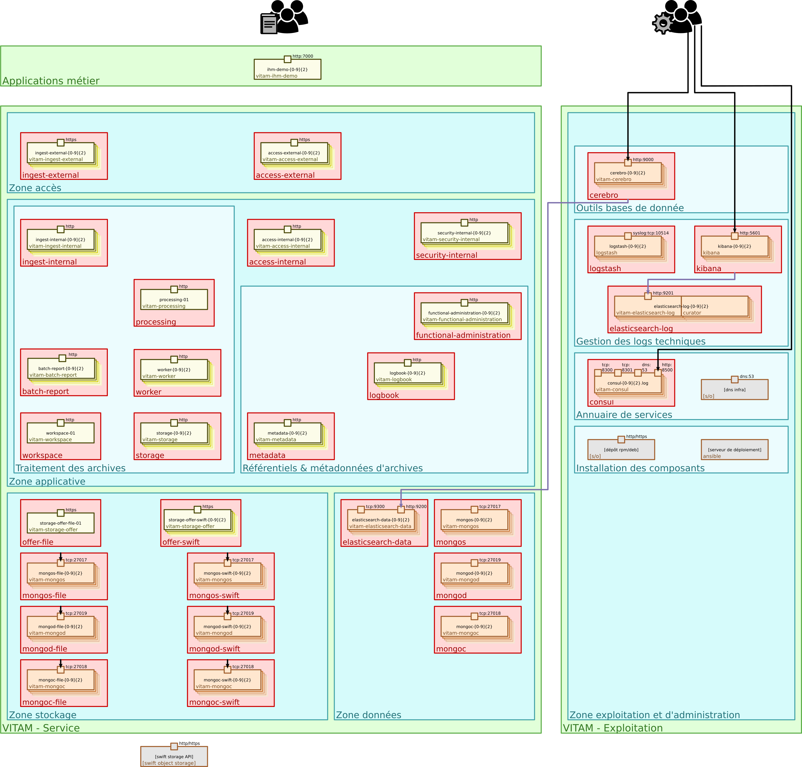

Architecture de la solution logicielle VITAM
############################################

Le schéma ci-dessous représente une solution logicielle :term:`VITAM` :

.. FIXME : not so nice (to be sure DIN display is correct)

	Vue d'ensemble d'un déploiement :term:`VITAM` : zones, composants

.. Pas de titre ici ; il sera rajouté par l'include

.. seealso:: Se référer au :term:`DAT` (et notamment le chapitre dédié à l'architecture technique) pour plus de détails, en particulier concernant les flux entre les composants.
