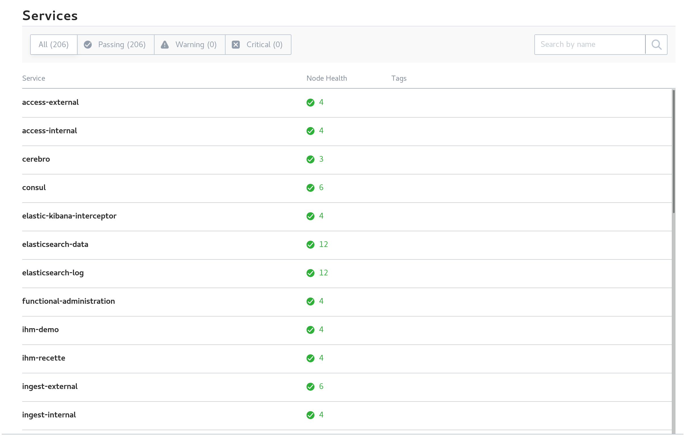

Analyse de premier niveau
##########################

Cette section a pour but de présenter les premiers outils à utiliser pour réaliser une analyse de premier niveau, en cas de problème avec la solution logicielle :term:`VITAM`.

Etat par Consul
================

Se connecter à l'IHM de Consul et recenser les états des composants de la solution logicielle :term:`VITAM`.

A l'heure actuelle, tous les composants doivent avoir un statut de couleur verte. Si ce n'est pas le cas :

1. seul un composant est KO, alors redémarrer le composant incriminé
2. si plusieurs services sont KO, suivre la procédure de redémarrage de VITAM
3. si tous les "check-DNS" (visible dans le détail des checks de chaque service) sont  KO, s'assurer que, sur les machines hébergeant VITAM, le fichier ``/etc/resolv.conf`` contient, en début de fichier, la ligne : ``nameserver 127.0.0.1``.

Etat par Kibana
================

Se connecter à Kibana, aller dans "Dashboards". Cliquer sur le bouton "Load Saved Dashboard" et sélectionner "Composants VITAM".
Eventuellement, changer la résolution (en haut à droite, par défaut, réglé sur les 15 dernières minutes).

Sur "pie-logback-error-level", cliquer sur la section de camembert d'intérêt (ERROR) et regarder, en bas de page, les éventuelles erreurs remontées dans Kibana.

Playbook ansible pour échanger avec le support
##############################################

Afin de simplifier et minimiser les échanges, un playbook à fins d'exploitation/support a été développé. 

Celui-ci comprend :

  - la récupération des informations machines de la solution logicielle :term:`VITAM`
  - l'état Consul des composants
  - la récupération des traces applicatives (fichiers log) de moins de 2 jours
  - l'état des clusters Elasticsearch
  - la possibilité, au choix de l'exploitant, de fournir également les clés publiques des certificats

et compacte l'ensemble des données collectées, tout en purgeant le répertoire temporaire de récupération des données. Ce fichier est alors à envoyer par *mail* au support.

La commande pour générer le fichier est à lancer depuis le répertoire ``deployment`` :

``ansible-playbook -i environments/<fichier d'inventaire> ansible-vitam-exploitation/troubleshoot.yml --vault-password-file vault_pass.txt``

Identification des AU non conformes  
####################################

Le schéma JSON des AU a été corrigé et rationalisé. Toute donnée issue d’un Ingest d’une release précédente est conforme à cette expression corrigée du schéma. Dans les versions précédentes, le DSL autorisait des modifications non conformes au SEDA. Ce n’est plus possible dans la présente version. 

Si des modifications non conformes ont eu lieu, alors des AU non conformes peuvent donc se retrouver en base. Lorsque cela arrive :
* L’export DIP de l’AU peut échouer. 
* La modification d’un champ A rapportera une erreur sur un champs B non-conforme. La correction de ce problème se fera avec une requête DSL qui modifie le champ A et le champs B (en lui donnant une valeur
conforme).
* Maintenant les champs SEDA sont soit des tableaux, soit des valeurs simples (string ou objet). Certains champs qui pouvaient s’écrire sous forme de valeurs non tabulaires, doivent maintenant être écrits sous forme de tableau, même s’ils n’ont qu’un seul élément. Ex : Coverage.Spatial. 

Cette procédure scriptée permet de détecter l’ensemble des AU non conformes. Les retours associés pourront être transmis au support VITAM (assistance@programmevitam.fr). 

La commande pour générer le fichier est à lancer depuis le répertoire ``deployment`` :

``ansible-playbook -i environments/<fichier d'inventaire> ansible-vitam-exploitation/check_unit_compatibility.yml --vault-password-file vault_pass.txt``

A l'issue, si des :term:`AU` sont considérées en erreur, se rapprocher du métier pour réaliser une première analyse / tentative de correction, par correction des données incorrectes.

Si l'erreur persiste, contacter le support.