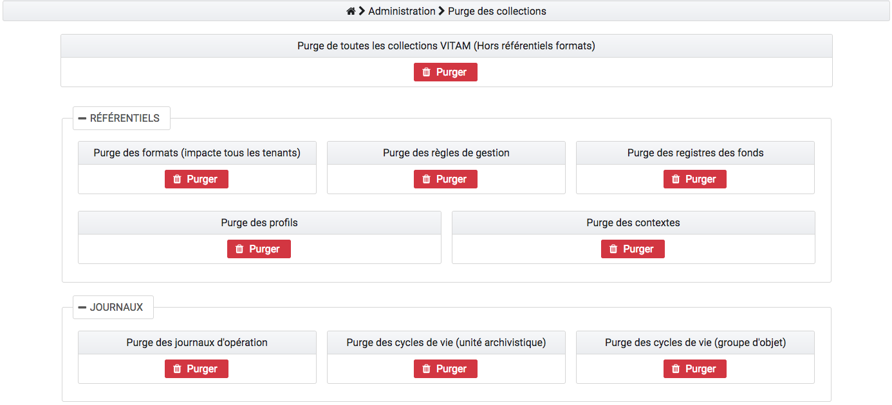
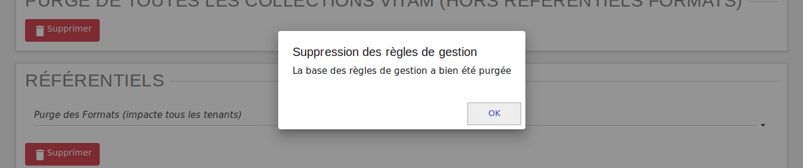

Administration des collections
##############################

L'administration des collections permet de supprimer certains ou tous les référentiels / journaux / objets dans le but de recetter la solution logicielle Vitam ou de faire des tests variés pour éprouver la stabilité du système.

L'utilisateur y accède par le menu, en cliquant sur "Administration des collections", ou par défaut lors de sa connexion. 

Actions de suppression
=======================

Chaque action comporte un bouton "Purger". 
Lors du clic sur ce bouton "Purger", une fenêtre modale apparaît et demande de confirmer l'action de suppression.
Il existe deux types de purges.

Purge de toutes les collections de la solution logicielle Vitam
---------------------------------------------------------------

La purge de toutes les collections correspond à la suppression de tous les référentiels, de tous les journaux ainsi que de tous les objets et unités archivistiques à l'exception du référentiel des formats.
Suite à cette opération, chaque IHM correspondante est vide de contenu et plus aucune archive n'est présente dans la solution logicielle Vitam.

Purge des référentiels
----------------------

Il est possible de supprimer isolément un référentiel. Pour cela, il faut choisir un référentiel et cliquer sur "Purger" :

* Un clic sur la croix de la fenêtre modale ou sur "Non", annule la demande de suppression
* Un clic sur "Oui", valide la demande de suppression, la fenêtre modale se ferme et la suppression est effectuée

Une fois la suppression effectuée, un message de confirmation s'affiche dans une fenêtre modale.

**Référentiel des formats**

Le référentiel des formats de la solution logicielle Vitam est supprimé **pour tous les tenants**. L'IHM du référentiel de formats est vide de contenu. Sans référentiel des formats, aucun SIP ne pourra être importé dans la solution logicielle Vitam.

**Référentiel des règles de gestion**

Le référentiel des règles de gestion de la solution logicielle Vitam est supprimé pour le tenant sélectionné par l'utilisateur. L'IHM du référentiel des règles de gestion est vide de contenu. Sans référentiel des règles de gestion, aucun SIP ne pourra être importé sur le tenant dans la solution logicielle Vitam.

**Registre des fonds**

Le contenu du registre des fonds de la solution logicielle Vitam est supprimé. L'IHM du "registre des fonds" est vide de contenu.

**Purge des profils d'archivage**

Tous les profils sont supprimés de la solution logicielle Vitam. L'IHM du "référentiel des profils" est vide de contenu.

**Purge des contextes applicatifs**

Lors de son exécution, la fonctionnalité de purge des contextes contrôle qu'il y a plus d'un contexte dans le référentiel. Si tel n'est pas le cas, la purge n'est pas réalisée. Si le référentiel contient plus d'un contexte, ils sont supprimés de la solution logicielle Vitam à l'exception de celui nommé « admin-context ».

**Purge des services agents**

Le référentiel des services agents de la solution logicielle Vitam est supprimé pour le tenant sélectionné par l'utilisateur. L'IHM du référentiel des services agents est vide de contenu. Sans référentiel de service agents, aucun SIP ne pourra être importé sur le tenant dans la solution logicielle Vitam.

Purge des journaux
------------------

**Journal du cycle de vie** (unités archivistiques)

Tous les journaux du cycle de vie des unités archivistiques sont supprimés de la solution logicielle Vitam. L'IHM de chaque "Journal du cycle de vie" d'une unité archivistique est vide de contenu.

**Journal du cycle de vie** (groupes d'objets)

Tous les journaux du cycle de vie des objets sont supprimés de la solution logicielle Vitam. L'IHM de chaque "Journal du cycle de vie" d'un objet est vide de contenu.

**Journaux des opérations**

Tous les journaux des opérations sont supprimés de la solution logicielle Vitam. Les IHM "Journal des opérations" et "Journal des opérations d'entrées" sont vides de contenu.

Purge des Unités Archivistiques et Groupes d'Objets
---------------------------------------------------

**Purge des Unités Archivistiques**

Toutes les unités archivistiques sont supprimées de la solution logicielle Vitam. L'IHM "Recherche d'archives" ne comprend plus d'objet.

**Purge des groupes d'objets**

Tous les objets sont supprimés de la solution logicielle Vitam. L'IHM "Détail d'une unité archivistique" ne comprend plus d'objet.

Purge des contrats
------------------

**Contrats d'accès**

Tous les contrats d'accès sont supprimés de la solution logicielle Vitam. L'IHM "Contrats d'accès" est vide de contenu.

**Contrats d'entrée**

Tous les contrats d'entrée sont supprimés de la solution logicielle Vitam. L'IHM "Contrats d'entrée" est vide de contenu.
