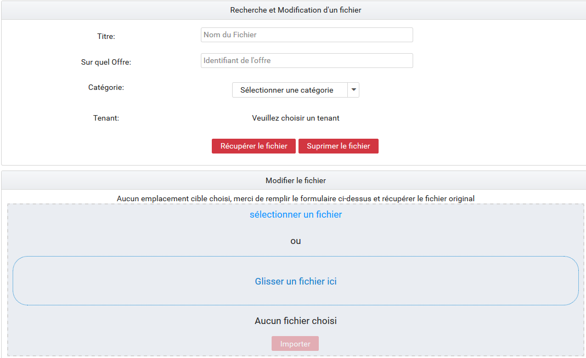
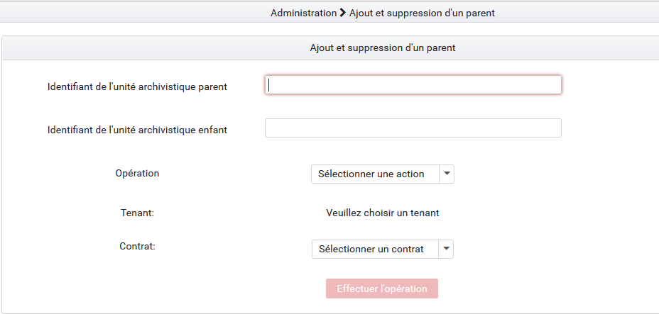
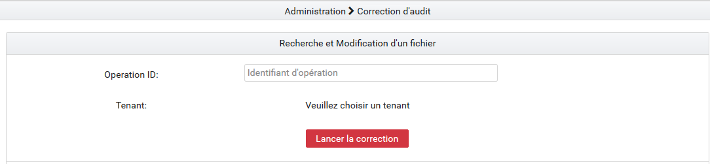

Administration des collections
##############################

L'administration des collections permet de supprimer certains ou tous les référentiels / journaux / objets / contrats dans le but de recetter la solution logicielle Vitam ou de faire des tests variés pour éprouver la stabilité du système.

L'utilisateur y accède par le menu, en cliquant sur "Administration des collections", ou par défaut lors de sa connexion.

.. image:: images/RECETTE_admin_collections.png

Actions de suppression
=======================

Chaque collection comporte un bouton "Purger".
Lors du clic sur ce bouton "Purger", une fenêtre modale apparaît et demande de confirmer l'action de suppression.
Il existe deux types de purges.

Purge de toutes les collections de la solution logicielle Vitam
---------------------------------------------------------------

La purge de toutes les collections correspond à la suppression de tous les référentiels, contrats et journaux ainsi que de tous les objets et unités archivistiques à l'exception du référentiel des formats, des contextes et des ontologies externes.
Suite à cette opération, chaque IHM correspondante est vide de contenu et plus aucune archive n'est présente dans la solution logicielle Vitam.

Purge des référentiels
----------------------

Il est possible de supprimer isolément un référentiel. Pour cela, il faut choisir un référentiel et cliquer sur "Purger" :

* Un clic sur la croix de la fenêtre modale ou sur "Non", annule la demande de suppression
* Un clic sur "Oui", valide la demande de suppression, la fenêtre modale se ferme et la suppression est effectuée

.. image:: images/administration_purge_pop_up.png

Une fois la suppression effectuée, un message de confirmation s'affiche dans une fenêtre modale.

.. image:: images/administration_purge_pop_up_ok.png

**Purge des référentiels impactant tous les tenants**

 - Référentiel des formats

Le référentiel des formats de la solution logicielle Vitam est supprimé **pour tous les tenants**. L'IHM du référentiel de formats est vide de contenu. Sans référentiel des formats, aucun SIP ne pourra être importé dans la solution logicielle Vitam.

 - Purge des contextes applicatifs 

Lors de son exécution, la fonctionnalité de purge des contextes contrôle qu'il y a plus d'un contexte dans le référentiel. Si tel n'est pas le cas, la purge n'est pas réalisée. Si le référentiel contient plus d'un contexte, ils sont supprimés de la solution logicielle Vitam à l'exception de celui nommé « admin-context ». 

 - Purge des ontologies externes 

La purge des ontologies externes supprime en réalité toutes les ontologies présentes dans le système Vitam et ce sur les différents tenants. Les vocabulaires internes (embarqués avec la solution) et externes sont supprimés. Les vocabulaires internes sont automatiquement réimportés. Cette fonctionnalité permet de revenir à l'état initial concernant le référentiel des ontologies. 

**Purge des référentiels sur un seul tenant**

 - Référentiel des règles de gestion

Le référentiel des règles de gestion de la solution logicielle Vitam est supprimé pour le tenant sélectionné par l'utilisateur. L'IHM Démo du référentiel des règles de gestion est vide de contenu. Sans référentiel des règles de gestion, aucun SIP comportant des règles de gestion ne pourra être importé sur le tenant dans la solution logicielle Vitam.

 - Registre des fonds

Le contenu du registre des fonds de la solution logicielle Vitam est supprimé pour le tenant séléctionné par l'utilisateur. L'IHM Démo du "registre des fonds" est vide de contenu.

 - Purge des profils d'archivage 

Tous les profils sont supprimés de la solution logicielle Vitam pour le tenant séléctionné par l'utilisateur. L'IHM Démo du "référentiel des profils" est vide de contenu.

 
 - Purge des services agents

Le référentiel des services agents de la solution logicielle Vitam est supprimé pour le tenant sélectionné par l'utilisateur. L'IHM Démo du référentiel des services agents est vide de contenu. Sans référentiel de service agents, aucun SIP ne pourra être importé sur le tenant dans la solution logicielle Vitam.

 - Purge des documents type 

Le référentiel des profils d'unités archivistiques (documents type) de la solution logicielle Vitam est supprimé pour le tenant sélectionné par l'utilisateur. L'IHM Démo du référentiel des profils d'unités archivistiques (documents type) est vide de contenu.

Purge des journaux
------------------

 * Journal du cycle de vie (unités archivistiques)

Tous les journaux du cycle de vie des unités archivistiques sont supprimés de la solution logicielle Vitam pour le tenant sélectionné par l'utilisateur. L'IHM Démo de chaque "Journal du cycle de vie" d'une unité archivistique est vide de contenu.

 * Journal du cycle de vie (groupes d'objets)

Tous les journaux du cycle de vie des objets sont supprimés de la solution logicielle Vitam pour le tenant sélectionné par l'utilisateur. L'IHM Démo de chaque "Journal du cycle de vie" d'un objet est vide de contenu.

 * Journaux des opérations

Tous les journaux des opérations sont supprimés de la solution logicielle Vitam pour le tenant sélectionné par l'utilisateur. Les IHM Démo"Journal des opérations" et "Journal des opérations d'entrées" sont vides de contenu.

Purge des Unités Archivistiques et Groupes d'Objets
---------------------------------------------------

 * Purge des Unités Archivistiques

Toutes les unités archivistiques sont supprimées de la solution logicielle Vitam pour le tenant sélectionné par l'utilisateur. L'IHM Démo "Recherche d'archives" ne retourne plus d'unité archivistique.

 * Purge des groupes d'objets 

Tous les objets sont supprimés de la solution logicielle Vitam pour le tenant sélectionné par l'utilisateur. Les IHM "Recherche d'archives" et "Détail d'une unité archivistique" ne retournent plus de résultats.

Purge des contrats
------------------

 * Contrats d'accès

Tous les contrats d'accès sont supprimés de la solution logicielle Vitam pour le tenant sélectionné par l'utilisateur. L'IHM Démo "Contrats d'accès" est vide de contenu.

 * Contrats d'entrée

Tous les contrats d'entrée sont supprimés de la solution logicielle Vitam pour le tenant sélectionné par l'utilisateur. L'IHM Démo "Contrats d'entrée" est vide de contenu.

Recherche et Modification d'un fichier 
======================================

 * Recherche d'un fichier

Il est possible de rechercher un fichier grâce à son identifiant dans le champ "Titre", en sélectionnant spécifiquement la catégorie de recherche : au niveau de l'unité archivistique, de l'objet binaires ou des groupes d'objets techniques. 

Il faut également sélectionner l'offre de stockage sur laquelle effectuer la recherche.

Il faut également sélectionner un tenant au préalable. 

En cliquant sur le bouton "Récupérer le fichier", le fichier est exporté, et disponible dans le but d'être modifié. 

 * Modification d'un fichier

Un fois le fichier téléchargé, il est possible de le modifier, et l'importer à nouveau, en sachant que la version importée, sera enregistrée à la place de la dernière version exportée. 

Ajout et suppression d'un parent
================================

Il est possible d'ajouter ou de supprimer un lien entre deux unités archivistiques présentes dans la solution.

Pour cela, il faut rentrer les identifiants des unités archivistiques dans les champs correspondants, sélectionner un type d'opération "ajouter ou supprimer un lien", et aussi sélectionner le contrat d'accès permettant d'avoir les droits pour les différentes modifications. 

.. NOTE:: il est possible d'avoir une visualisation de ces modifications de liens dans la section "visualisation du graphe".

Test Audit correctif
====================

Il est possible de lancer une opération de correction suite à un audit de cohérence qui aurait décelé une ou plusieurs erreurs de cohérence de données. 

L'opération a pour but de remplacer les valeurs incorrectes détectées dans les offres de stockages ou dans la base de données. Pour cela, il faut sélectionner à la fois le tenant et l'identifiant de l'opération liée à l'audit de cohérence. 

