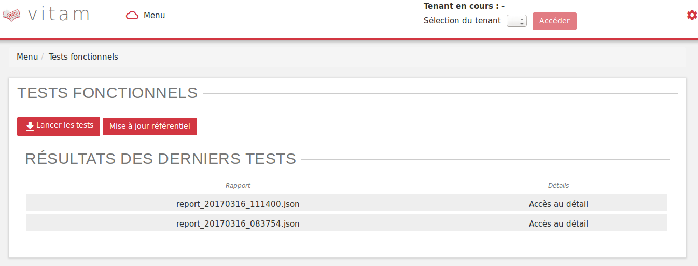
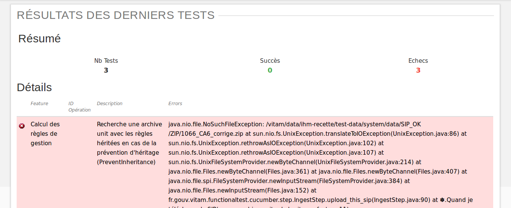

Tests fonctionnels
##################

Introduction
============

La partie "Tests Fonctionnels" contient les écrans de lancement et de consultation des résultats des TNR. 

Elle est accessible depuis l'IHM de recette, par le menu Menu > Test Fonctionnels

Les tests ne sont pas segmentés par tenant. Ces derniers sont directement configurés dans les tests. Il n'est donc pas nécessaire de sélectionner un tenant pour accéder au contenu de cette section.

**NB** : La configuration des TNR ne s'effectue pas depuis ces écrans. La procédure de configuration est décrite dans la documentation dédiée à ce sujet.

Page Tests Fonctionnels
=======================

La page est divisée en deux parties : 

  * Boutons de gestion
  * Résultats des derniers tests

**Boutons de gestion**

  * Bouton "Lancer les tests" : permet de rejouer les tests configurés. Ceci donnera lieu à la création d'un nouveau rapport.
  * Bouton "Mise à jour référentiel" : permet de récupérer les derniers fichiers de configuration des tests depuis "Git" (gestionnaire de sources). Ainsi, si un utilisateur a ajouté des tests et que ceux-ci ont été intégrés à git, le fait de cliquer sur ce bouton permettera de les prendre en compte au prochain clic sur le bouton "Lancer les Tests".

**Résultat des derniers tests**

Les résultats de tests sont affichés dans un tableau à deux colonnes :

  * Rapport
  * Détail
    
Chaque ligne représente le rapport issu d'une campagne de tests. La colonne "Rapport" indique le nom du rapport. Celui-ci est constitué de la façon suivante : report_AAAAMMJJ_HHmmss.json. Ainsi le rapport correspondant à la dernière campagne de tests se trouve au-dessus de la liste. 

La colonne détail affiche simplement la mention "accès au détail". 

Au clic sur une ligne, la page du détail du rapport concerné s'affichera dans un nouvel onglet.

Détail des tests
================

L'écran de détail d'une campagne de tests est divisé en deux parties :

  * Partie Résumé
  * Partie Détails
    

**Parite Résumé**

La partie résumé comporte les trois indications suivantes :

  * NB Tests : nombre de tests inclus dans la campagne
  * Succès : nombre de tests en succès
  * Echecs : nombre de tests en échec

**Partie Détails**

Chaque ligne du tableau représente le résultat d'un test. Celle-ci est sur fond vert lorsque le test est en succès, sur fond rouge lorsqu'il est en échec.

Ci-après l'exemple de lignes correspondant à un test en succès. Par défaut, les tests en échec s'affichent en premier.

Le tableau est constitué de cinq colonnes :

    * Icône : Correspond au statut du test. Il s'agit d'une coche verte pour un succès, d'une croix rouge pour un échec.
    * feature : Correspond à la fonctionnalité testée. Par défaut, un fichier de configuration correspond à une fonctionnalité. On a par exemple un fichier de configurtion pour réaliser tous les tests sur l'INGEST. Dans ce cas, le nom de la fonctionnalité sera indiqué dans tous les cas de test correspondant dans le tableau de restitution. 
    * ID opération : Identifiant de l'opération correspondant au test. On peut aisnsi s'en servir pour trouver plus de détails sur le test dans le journal des opérations.
    * Description : Il s'agit d'une description du cas de test effectué. Celle-ci est indiquée dans le fichier de configuration pour chacun des test.
    * Errors : Erreur technique liée à l'échec du test. Cette colonne est vide pour les tests en succès.