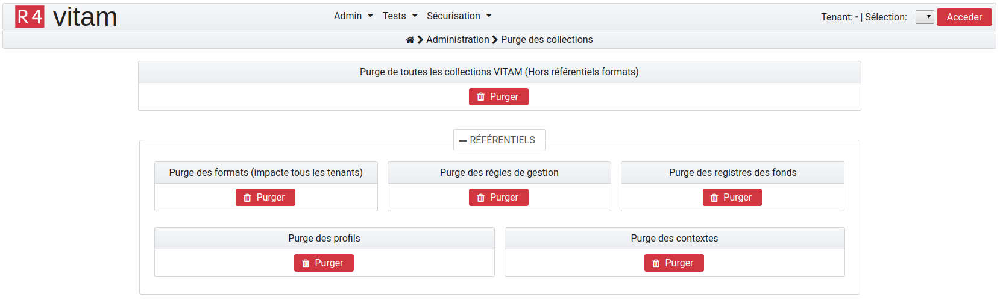
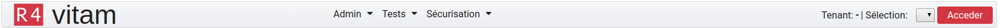
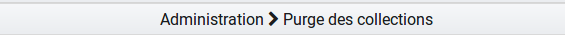
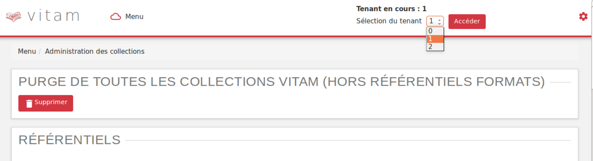

Recette
#######

Principes généraux
==================

Avertissement
-------------

L'IHM de recette est développée à des fins de test uniquement.

**Elle n'a aucunement vocation à être utilisée en production**

Elle contient des interfaces utilisateurs permettant, par tenant, de :

  * Administrer les collections MongoDB (référentiels, journaux, objets...)
  * Lancer des tests automatisés via SOAP UI
  * Sécuriser manuellement les journaux des opérations
  * Consulter les journaux de sécurisation

Certificat
----------

L'accès de l'IHM recette de la solution logicielle Vitam nécéssite l'utilisation d'un certificat. Celui-ci sera mis à disposition par l'administrateur de la soution logicielle Vitam.
    
Accès 
-----

L'accès à l'IHM de recette s'effectue par un chemin différent de l'IHM démo. Par défaut, son adresse est :

**addresse_de_votre_serveur/ihm-recette/#!/login**

Par soucis de distinction visuelle avec l'interface de démo, la couleur dominante de cette IHM est le rouge.

Navigation
----------

Par défaut, suite à sa connexion l'utilisateur accède à la page d'administration des collections.

Le menu de navigation contient trois menus

Les pages accesibles sont réparties de la façon suivante.

**Admin**

	* Administreation des collections

**Tests**

	* Tests de performance
	* Tests fonctionnels
	* Tests requêtes DSL

**Sécurisation**

	* Sécurisation du journal des opérations

Fil d'Ariane
------------

Le fil d’Ariane est un élément qui permet de visualiser le chemin d’accès à la page affichée. Il est situé sur toutes les pages, en dessous du menu.

Il est est composé d'un symbole "home" du nom du menu dans lequel se trouve la page en cours puis de la page en cours.

Titre des onglets
-----------------

Sur IHM recette, le titre des pages est celui du dernier nœud du fil d’Ariane, précédé du mot “Recette -”. Par exemple :

* Recette - Test Fonctionnels
* Recette - Administration des collections

Sélection d'un tenant
---------------------

Lors de la connexion, l'utilisateur n'est positionné sur aucun tenant.
De ce fait, ses actions d'administration sont restreintes car celles-ci sont pour la plupart liées à un tenant. Par défaut, un certain nombre de boutons sont donc grisés et inactifs.

Pour sélectionner un tenant, il suffit de choisir celui désiré dans le menu déroulant en haut à droite de l'écran et de valider sa sélection en cliquant sur le bouton "Accéder".

Une fois le tenant sélectionné, les boutons sont activés et l'intégralité de l'interface de recette est disponible.

Dans le reste de ce document, il est considéré que l'utilisateur s'est placé dans le tenant dans lequel il veut effectuer ses opérations.
L'utilisateur peut changer de tenant à tout moment, en réitérant l'opération précédente.

NB : le référentiel des formats est lié à la plateforme et non à un tenant. C'est pour cette raison que l'option de suppression du référentiel des formats est toujours disponible, même si aucun tenant n'est sélectionné.

