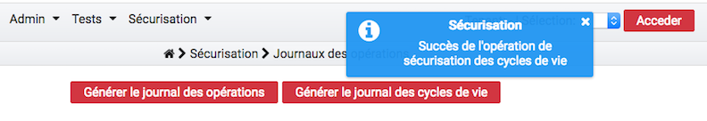

Sécurisation des journaux
#########################

La sécurisation des journaux est une action visant à assurer la valeur probante de l'information prise en charge dans la solution logicielle Vitam.

Lancer une opération de sécurisation
====================================

L'interface de lancement est accessible par le menu : Sécurisation > Sécurisation des journaux.

L'interface contient plusieurs boutons: 

* "Générer le journal des opérations" 
* "Générer le journal des cycles de vie"
* "Générer le journal des offres de stockage" 
* "Générer le journal des cycles de vie des unités archivistiques"
* "Générer le journal des cycles de vie des groupes d'objets"

Au clic sur ce bouton, le système va lancer l'opération de sécurisation des journaux. Elle prendra en compte tous les journaux, du dernier créé au dernier non sécurisé. Un message s'affiche alors sur l'écran précisant le succès de l'opération.

Si aucun journal n'a encore été sécurisé, alors l'opération de sécurisation prendra en compte tous les journaux d'opération existant dans la solution logicielle Vitam.

A la fin de l'opération, un message avertit du succès ou de l'échec de l'opération.

Un fichier .zip est créé et placé dans le l'offre de stockage de Vitam dans le répertoire suivant :

::

  /browse/data/storage-offer-default/0/Logbook

Il contient les fichiers suivants :

  * *operation.json* : liste des opérations sécurisées, la première étant l'opération "traceability"
  * *merkleTree.json* : contient une sérialisation JSON de l'arbre de merkle
  * *token.tsp* : horodatage de la combinaison de la racine de l'arbre de merkle, des empreintes des opérations de sécurisation antérieures (la dernière réalisée, celle du mois précédent et celle de l'année précédente)
  * *computing_information.txt* : reprend les différentes empreintes qui ont permis de réaliser l'horodatage
  * *additional_information.txt* : contient le nombre d'informations sécurisées, ainsi que les dates du premier et du dernier élement

Journalisation des opérations de sécurisation
=============================================

La sécurisation des journaux des opérations donne lieu à la création d'un journal des opérations de type TRACEABILITY, consultable depuis l'IHM démo.

Ces journaux sont créés par tenant.
