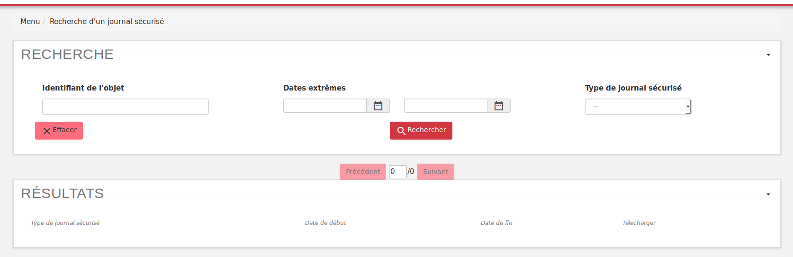
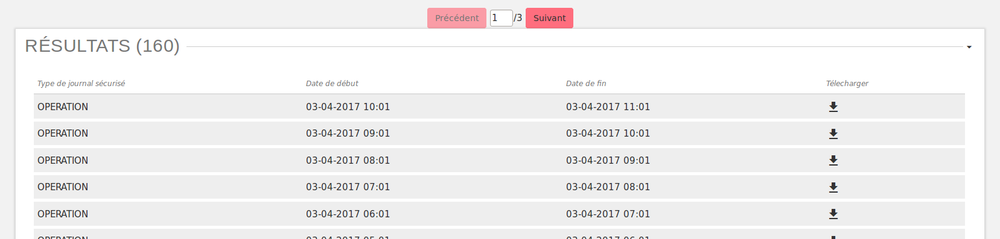
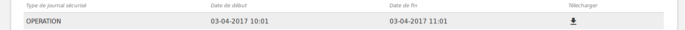

Sécurisation des journaux
#########################

La sécurisation des journaux est une action visant à assurer la valeur probante de l'information prise en charge dans la solution logicielle Vitam.

Lancer une opération de sécurisation
====================================

L'interface de lancement est accessible par le menu : Menu > Sécurisation du journal des opérations

L'interface contient simplement un bouton "Générer le journal des opérations". Au clic sur ce bouton, le système va lancer l'opération de sécurisation des journaux. Elle prendra en compte tous les journaux du dernier créé au dernier non sécurisé.

Il est également possible d'afficher le JSON de résultat en cliquant sur le lien nommé "Lien vers les résulstats Json". Le fichier apparait en plein écran et il est possile de l'enregistrer.

.. image:: images/RECETTE_lancer_secu.png

Si aucun journal n'a encore été sécurisé, alors l'opération de sécurisation prendra en compte tous les journaux.

A la fin de l'opération, un message avertit du succès ou de l'échec de l'opération.

Un fichier .zip est créé et placé dans le l'offre de stockage de Vitam dans le répertoire suivant :

::

  /browse/data/storage-offer-default/0/Logbook

Il contient les fichiers suivants :

  * *operation.json* : liste des opérations sécurisées, la première étant l'opération "tracability"
  * *merkleTree.json* : contient une sérialisation JSON de l'arbre de merkle
  * *token.tsp* : horodatage de la combinaison de la racine de l'arbre de merkle, des empreintes des opérations de sécurisation antérieures (la dernière réalisée, celle du mois précédent et celle de l'année précédente)
  * *computing_information.txt* : reprend les différentes empreintes qui ont permis de réaliser l'horodatage
  * *additional_information.txt* : contient le nombre d'informations sécurisées, ainsi que les dates du premier et du dernier élement

Journalisation des opérations de sécurisation
=============================================

La sécurisation des journaux des opérations donne lieu à la création d'un journal des opérations de type TRACEABILITY. 

Ces journaux sont créés par tenant.

Rechercher des journaux sécurisés
=================================

L’interface de consultation des journaux sécurisés est accessible par le menu : Menu > Rechercher un journal sécurisé

L’interface est consituée de trois éléments :

* Un formulaire
* Un paginateur
* Une zone d’affichage des résultats

**Lancer une recherche**

Par défaut, aucun résultat n'est affiché. Il faut lancer une recherche pour faire apparaître des résultats.

Pour lancer une recherche en prenant en compte cette date, cliquer sur le bouton "Rechercher" après l'avoir sélectionné.

Si l'utilisateur clique sur le bouton "Rechercher" sans sélectionner de date, alors tous les journaux disponibles s'affichent.

**Utilisation du formulaire**

Le formulaire est composé des champs suivants :

* Identifiant de l’objet : nom du fichier recherché
* Dates extrêmes : intervalle de dates permettant de rechercher sur les date de début d’un opération de sécurisation
* Type de journal sécurisé : liste déroulante permettant de cib

**Zone de résultats**

La zone de résultats est composée des colonnes suivantes :

* Type de journal sécurisé : affiche le type de journal sécurisé
* Date de début : indique la date de début de l’opération de sécurisation
* Date de fin : indique la date de fin de l’opération de sécurisation
* Télécharger : icône permettant de télecharger l’opération

**Consultation du détail d'un journal**

Chaque ligne représente un journal de type sécurisation. En cliquant sur cette ligne, l'IHM affiche le détail du journal dans une nouvelle fenêtre.

**Télechargement d'un journal**

Chaque ligne représentant un journal comporte un symbole de téléchargement. En cliquant sur ce symbole, le journal est téléchargé sous forme de zip. Le nom de ce fichier correspond à la valeur du champ FileName du dernier event du journal de l'opération.

