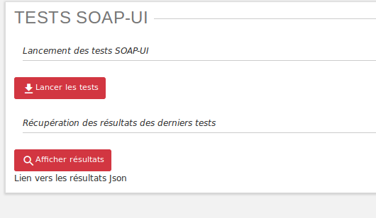
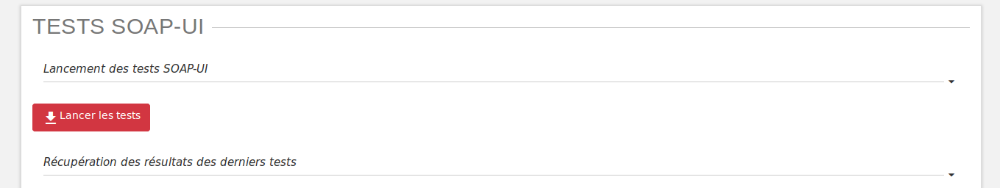
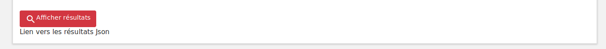
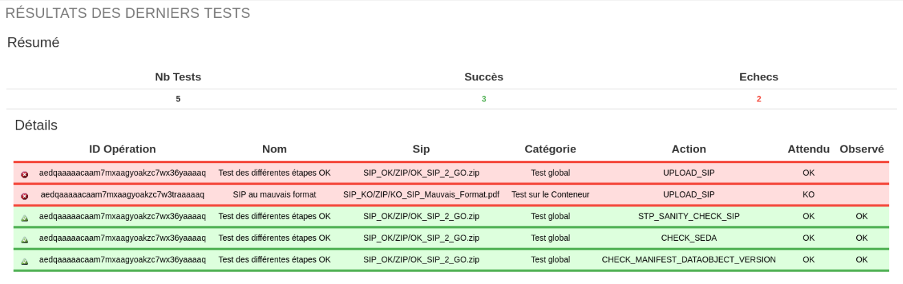

Tests SOAP-UI
#############

Principes
=========

Cette interface a pour objectif de lancer des tests fonctionnels automatisés avec SOAP UI, construits via un fichier JSON.

L'équipe d'exploitation réalise le fichier Json avec les archivistes, puis le place dans la solution logicielle Vitam.

L'exécution des tests est ensuite lancée par les archivistes via l'IHM.

Cette partie présente à la fois l'IHM et les différentes configurations à réaliser par les archivistes.

Fichier de configuration
========================

Les jeux de test à exécuter sont déclarés dans le fichier *data.json*.

Chaque SIP à utiliser pour valider un cas fonctionnel sera donc déclaré dans ce fichier, selon un méthode détaillée ci-après.

Structuration du fichier de configuration
-----------------------------------------

Le fichier de configuration contient un champ "params" dont la valeur est un tableau. Ce tableau contient l'ensemble des jeux de tests à exécuter, chaque ligne rerésentant un test.

::

  {"params":
    [
      {Configuration du test 1},
      {Configuration du test 2},
      {Configuration du test 3}
    ]
  }

Configuration d'un jeux de test
-------------------------------

Chaque jeux de test est composé des huits élements suivants :
  * sipName
  * expected
  * httpStatusCode
  * testName
  * category
  * action [
    * name
    * expected

**"sipName"**

La valeur contenue dans ce champ doit être une chaîne de caractères. Il contient le nom du fichier à utiliser en entrée ainsi que sa localisation dans le système de fichier.

La localisation du fichier est une URI relative par rapport à la racine des tests SoapUI déterminée par votre exploitant.

On a donc par défaut l'arborescence suivante (le schéma suivant ne tient pas compte des autres dossiers et fichiers du repertoire SoapUI)

::

  RACINE
    |------- data.json
    \------- test.zip

Pour un fichier *test.zip* placé dans le dossier *RACINE*, on entrera alors :

::

  "sipName":"test.zip"

Si ce fichier est placé dans un dossier *data*, enfant de *RACINE*, c'est à dire placé commme ceci :

::

  RACINE
    |------- data.json
    \------- data
              \------- test.zip

on entrera alors :

::

  "sipName":"test_arborescence/test.zip"

**"expected"**

La valeur contenue dans ce champ doit être une chaîne de caractères. Il contient le statut attendu à l'issue de l'opération d'entrée du SIP. La valeur de ce champ n'est utilisée que si les valeurs du tableau "Action" (détaillé plus bas) ne sont pas renseignées. Ceci permet de garder une compatibilité avec les anciens tests de non régression qui ne contenaient pas de tableau "Action".

Les valeurs contenues dans ces champs sont, en revanche, ignorées si le tableau "Action" contient des valeurs.

Par exemple :

::

  "expected":"OK",

**"httpStatusCode"**

La valeur contenue dans ce champs est un nombre entier. Il contient le code retour HTTP attendu.

Par exemple :

::

  "httpStatusCode":200,

**"testName"**

La valeur contenue dans ce champ doit être une chaîne de caractères. Il s'agit du nom du test tel qu'il sera reporté dans le rapport final.

Par exemple :

::

  "Jeux de données possédant une arborescence complexe"

**"category"**: La valeur contenue dans ce champ doit être une chaîne de caractères.

Par exemple :

::

  "category":"Tests sur les arborescences"

**action** : ce champ contient un tableau de n objets ayant pour but de tester des actions précises du workflow. Un objet est structuré de la façon suivante :

      **name** : contient le nom de l'action à tester

      **expected** : contient l'état attendu

voici l'exemple d'une configuration pour un jeu de test

*NB :* l'exemple de configuration d'un jeu de test ci-dessous a été indenté pour une meilleure compréhension. Par défaut, dans le fichier de configuration global, la configuration d'un test est placée sur une ligne seulement.

::

  {
      "sipName": "SIP_OK/ZIP/OK_SIP_2_GO.zip",
      "expected": "OK",
      "httpStatusCode": 200,
      "testName": "Test des différentes étapes OK",
      "category": "Test global",
      "actions": [
        {
          "name": "UPLOAD_SIP",
          "expected": "OK"
        },
        {
          "name": "STP_SANITY_CHECK_SIP",
          "expected": "OK"
        },
    }

Exemple de configuration
------------------------

Ci-après un exemple de configuration contenant 4 jeux de tests

::

    {
        "params": [
            {
             "sipName": "SIP_OK/ZIP/OK_SIP_2_GO.zip",
             "expected": "OK",
             "httpStatusCode": 200,
             "testName": "Test des différentes étapes OK",
             "category": "Test global",
             "actions": [
                {
                "name": "UPLOAD_SIP",
                "expected": "OK"
                },
                {
                "name": "STP_SANITY_CHECK_SIP",
                "expected": "OK"
                },
                {
                "name": "CHECK_SEDA",
                "expected": "OK"
                },
                {
                "name": "CHECK_MANIFEST_DATAOBJECT_VERSION",
                "expected": "OK"
                }
                        ]
                },
            {
            "sipName": "SIP_KO/ZIP/KO_SIP_Mauvais_Format.pdf",
            "expected": "KO",
            "httpStatusCode": 200,
            "testName": "SIP au mauvais format",
            "category": "Test sur le Conteneur",
            "actions": [
                {
                "name": "UPLOAD_SIP",
                "expected": "KO"
                }
                ]
            }
        ]
    }

Configuration de test pour api external avec multi-tenant
----------------------------------------------------------

Chaque jeu de test est composé des élements suivants :
  * sipName / ruleName / formatName
  * testName
  * category
  * tenant
  * action [

    * name
    * endpoint
    * request
    * method
    * tenant
    * expected

**"sipName / ruleName / formatName"**

La valeur contenue dans ce champ doit être une chaîne de caractères. Il contient le nom du fichier à utiliser en entrée
ainsi que sa localisation dans le système de fichier

La localisation du fichier est une URI relative par rapport à la racine des tests SoapUI déterminée par l'exploitant.

On a donc par défaut l'arborescence suivante: (le schéma suivant ne tient pas compte des autres dossiers et fichiers du repertoire SoapUI)

::

  RACINE
    |------- data.json
    \------- SIP_KO
    \------- SIP_OK
              \------- ZIP
                       \------- OK_SIP.ZIP
              \------- TAR
    \------- SIP_WARNING
    \------- formats
    \------- rules
              \------- regles_CSV.csv

Pour un SIP *OK_SIP.zip* et un fichier de règles de gestion *regles_CSV.csv* placés dans le dossier *RACINE*, on entrera alors :

::

 "sipName": "SIP_OK\/ZIP\/OK_SIP.ZIP"

::

 "ruleName": "rules\/regles_CSV.csv"

**"testName"**

La valeur contenue dans ce champ doit être une chaîne de caractères. Il s’agit du nom du test tel qu’il sera reporté dans le rapport final. Par exemple:

::

 "testName": "SRC1 : chercher des unités d’archives contenant des objets dans un intervalle de dates extrêmes",

**"category"**

La valeur contenue dans ce champ doit être une chaîne de caractères. Elle doit toujours être qualifiée de : “Test API external”

**"tenant"**

La valeur contenue dans ce champ doit être une chaîne de caractères. Il s’agit du tenant qui a téléchargé le fichier SIP/règle/format. Par exemple:

::

 "tenant" : "0"

**"action"**

ce champs contient un tableau de n objets ayant pour but de contrôler les réponses de l'API external. Un objet est structuré de la façon suivante :

    **name** : contient le nom de l'action à tester

    **endpoint** : contient l'endpoint de l'api external

    **request** : contient la requête

    **method** : contient la méthode

    **tenant** : contient le tenant

    **expected** : est un tableau qui contient le code retour HTTP attendu (httpStatusCode) et les champs attendus dans la réponse

Par exemple:

::

"actions": [{
"name": "SEARCH_RULES_TENANT_0",
"endpoint" : "admin-external/v1/rules",
"request" : "{\"$query\":{\"$and\":[{\"$eq\":{\"RuleValue\":\"Dossier individuel d’agent civil\"}},{\"$eq\":{\"RuleType\":\"AppraisalRule\"}}]},\"$filter\":{},\"$projection\":{}}",
"method" : "POST",
"tenant" : "0",
"expected" : [{"httpStatusCode":200},{"RuleId": ["APP-00001"]}]},{
"name": "SEARCH_RULES_TENANT_1",
"endpoint" : "admin-external/v1/rules",
"request" : "{\"$query\":{\"$and\":[{\"$eq\":{\"RuleValue\":\"Dossier individuel d’agent civil\"}},{\"$eq\":{\"RuleType\":\"AppraisalRule\"}}]},\"$filter\":{},\"$projection\":{}}",
"method" : "POST",
"tenant" : "1",
"expected" : [{"httpStatusCode":404}]}]

IHM
===

Lancement des tests
-------------------

Une fois le fichier *data.json*, ainsi que le SIP déposés sur le serveur Vitam par l'exploitant, les tests peuvent être lancés via l'IHM en cliquant sur le bouton "lancer les tests"

Affichage du rapport
--------------------

Pour afficher le rapport, cliquer sur le bouton "Afficher résultats".

Les deux tableaux de rapports apparaîssent alors en bas de l'écran.

Le premier contient la synthèse des tests et est constitué des informations suivantes :

  * Nombre de tests réalisés
  * Nombre de tests en succès
  * Nombre de tests en échec

Le second contient le détail des tests et est constitué des colonnes suivantes :

  * ID Opération
  * Nom du test
  * Nom du SIP
  * Catégorie
  * Action
  * Résultat attendu
  * Résultat constaté

Les lignes pour lesquelles le résultat attendu est égal au résultat constaté apparaissent sur fond vert.
Les lignes pour lesquelles le résultat attendu est différent du résultat constaté apparaissent sur fond rouge

Résultat au format JSON
-----------------------

Il est également possible d'afficher le JSON de résultat en cliquant sur le lien nommé "Lien vers les résultats Json". Le fichier apparait en plein écran et il est possile de l'enregistrer.

