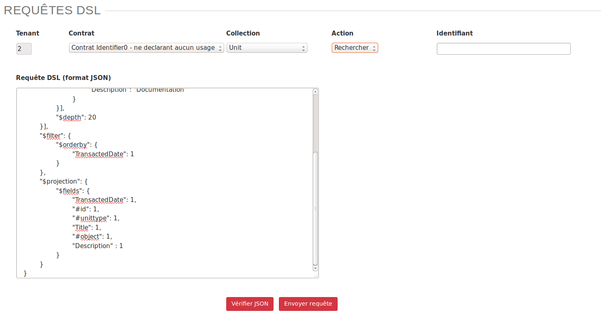
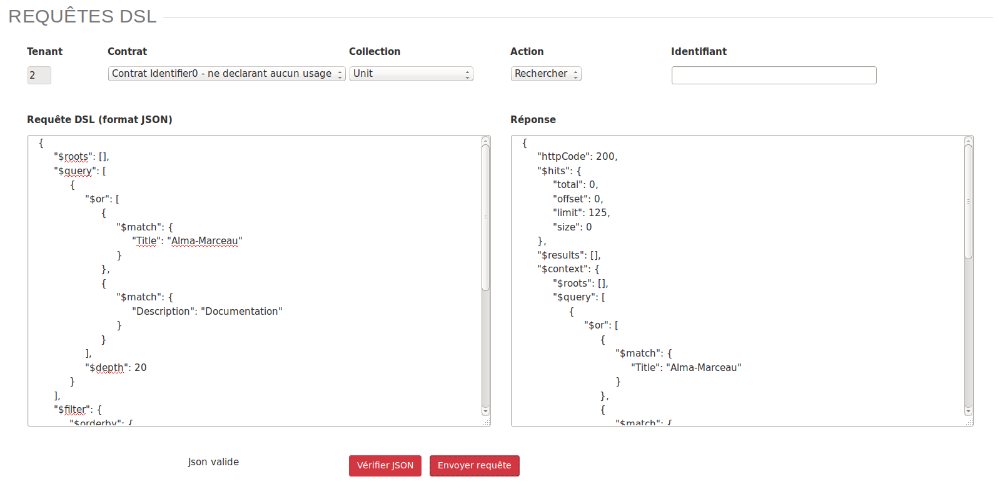
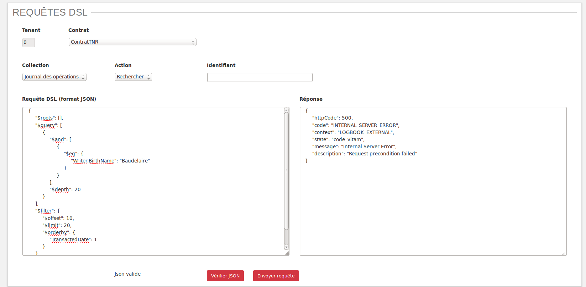
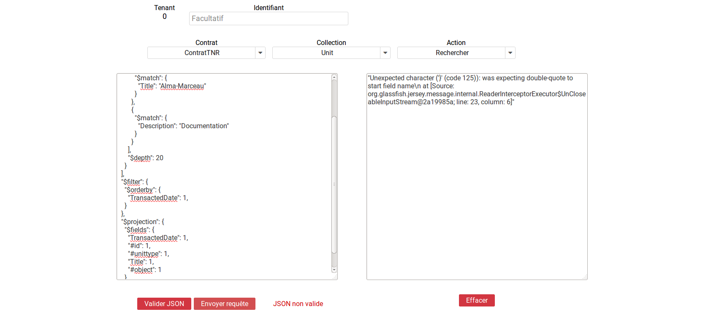

Tests
#####

Tests de performance
====================

Principe
--------

Les tests de performance consistent à réaliser plusieurs fois l'entrée d'un SIP et d'en mesurer le temps. Ces entrées peuvent être réalisées par une ou plusieurs tâches parallèles. 

Champs disponibles
------------------

L'IHM est constituée de trois champs :

* Liste des SIP : liste des SIP disponibles pour réaliser le test. Ces SIP sont ceux déposés dans le dépôt vitam-itest. Il n'est possible de sélectionner qu'un SIP à la fois.
* Nb Thread : Permet de définir le nombre de tâches parallèles qui exécuteront les entrées.
* Nb total : Permet de définir le nombre total d'entrées à réaliser.

Un bouton "lancer" permet d’exécuter le test de performance.

Résultats
---------

Les résultats sont disponibles dans la section en bas de la page.

Chaque ligne représente un test de performance. Le nom du test est formaté de la façon suivante : report_AAAAMMJJ_HHmmSS.csv. Le bouton de téléchargement permet de récupérer le fichier csv contenant les données du test.

Chaque ligne du csv représente une entrée. Les colonnes sont :

* OperationID
* PROCESS_SIP_UNITARY
* SANITY_CHECK_SIP	
* CHECK_CONTAINER	
* STP_SANITY_CHECK_SIP	
* STP_UPLOAD_SIP	
* STP_INGEST_CONTROL_SIP
 
La première contient le GUID de l'opération d'entrée. Les autres colonnes indique le temps en millisecondes qui a été nécessaire pour passer l'étape.

Tests fonctionnels
==================

Introduction
------------

La partie "Tests Fonctionnels" contient les écrans de lancement et de consultation des résultats des TNR. 

Elle est accessible depuis l'IHM de recette, par le menu Menu > Test Fonctionnels

Les tests ne sont pas segmentés par tenant. Ces derniers sont directement configurés dans les tests. Il n'est donc pas nécessaire de sélectionner un tenant pour accéder au contenu de cette section.

**NB** : La configuration des TNR ne s'effectue pas depuis ces écrans. La procédure de configuration est décrite dans la documentation dédiée à ce sujet.

Page Tests Fonctionnels
-----------------------

La page est divisée en deux parties : 

  * Boutons de gestion
  * Résultats des derniers tests

.. image:: images/RECETTE_test_fonctionnels_ecran_principal.png

**Boutons de gestion**

  * Bouton "Lancer les tests" : permet de rejouer les tests configurés. Ceci donnera lieu à la création d'un nouveau rapport.
  * Bouton "Mise à jour référentiel" : permet de récupérer les derniers fichiers de configuration des tests depuis "Git" (gestionnaire de sources). Ainsi, si un utilisateur a ajouté des tests et que ceux-ci ont été intégrés à git, le fait de cliquer sur ce bouton permettera de les prendre en compte au prochain clic sur le bouton "Lancer les Tests".

**Résultat des derniers tests**

Les résultats de tests sont affichés dans un tableau à deux colonnes :

  * Rapport
  * Détail
    
Chaque ligne représente le rapport issu d'une campagne de tests. La colonne "Rapport" indique le nom du rapport. Celui-ci est constitué de la façon suivante : report_AAAAMMJJ_HHmmss.json. Ainsi le rapport correspondant à la dernière campagne de tests se trouve au-dessus de la liste. 

La colonne détail affiche simplement la mention "accès au détail". 

Au clic sur une ligne, la page du détail du rapport concerné s'affichera dans un nouvel onglet.

Détail des tests
----------------

L'écran de détail d'une campagne de tests est divisé en deux parties :

  * Partie Résumé
  * Partie Détails
    
.. image:: images/RECETTE_detail_tests.png

**Parite Résumé**

La partie résumé comporte les trois indications suivantes :

  * NB Tests : nombre de tests inclus dans la campagne
  * Succès : nombre de tests en succès
  * Echecs : nombre de tests en échec

**Partie Détails**

Chaque ligne du tableau représente le résultat d'un test. Celle-ci est sur fond vert lorsque le test est en succès, sur fond rouge lorsqu'il est en échec.

Ci-après l'exemple de lignes correspondant à un test en succès. Par défaut, les tests en échec s'affichent en premier.

.. image:: images/RECETTE_detail_test_OK.png

Le tableau est constitué de cinq colonnes :

    * Icône : Correspond au statut du test. Il s'agit d'une coche verte pour un succès, d'une croix rouge pour un échec.
    * feature : Correspond à la fonctionnalité testée. Par défaut, un fichier de configuration correspond à une fonctionnalité. On a par exemple un fichier de configurtion pour réaliser tous les tests sur l'INGEST. Dans ce cas, le nom de la fonctionnalité sera indiqué dans tous les cas de test correspondant dans le tableau de restitution. 
    * ID opération : Identifiant de l'opération correspondant au test. On peut aisnsi s'en servir pour trouver plus de détails sur le test dans le journal des opérations.
    * Description : Il s'agit d'une description du cas de test effectué. Celle-ci est indiquée dans le fichier de configuration pour chacun des test.
    * Errors : Erreur technique liée à l'échec du test. Cette colonne est vide pour les tests en succès.
    
Testeur de requêtes DSL
=======================

Le testeur de requêtes DSL met à disposition des administrateurs une interface graphique permettant de simplifier l'exécution de requêtes sur les API de la solution logicielle Vitam.

Celle-ci contient un formulaire composé de plusieurs champs.

Champs disponibles
------------------

**Tenant** : champ obligatoire. Indique le tenant sur lequel la requête va être exécutée. Ce champs est contribué automatiquement avec le numéro du tenant sélectionné par l’administrateur.

**Contrat** : champ optionnel. Liste permettant de sélectionner un contrat d'accès qui sera associé à la requête.

**Collection** : champ obligatoire. Liste permettant de sélectionner la collection sur laquelle la requête va être exécutée.

**Action** : champ obligatoire. Liste permettant de sélectionner le type d'action à effectuer. Il est possible de sélectionner l'action "Rechercher" pour l'ensemble des collections.

Pour les collections suivantes, il est également possible de choisir l'action "Mise à jour" :

* Unit
* Contrat d'accès
* Contrat d'entrée
* Contexte
* Opération

**Identifiant** : champs optionnel. Permet de renseigner le GUID de l'objet ciblé dans la collection.

**Requête DSL** : champ obligatoire. Permet de saisir la requête DSL au format Json.

Réaliser une requête
--------------------

Pour réaliser une requête, l'administrateur rempli les champs du formulaire afin que leur contenu soit cohérent avec la requête qu'il souhaite exécuter. 

Pour vérifier la validité du formatage du Json, l'administrateur clique sur bouton "Vérifier Json". Si le Json est valide, le texte est mis en forme et la mention "Json Valide" est affichée à gauche du bouton. Dans le cas contraire, la mention "Json non valide" est indiquée.

Pour exécuter la requête, l'administrateur clique sur le bouton "Envoyer la requête". Une zone de résultat est alors affichée à droite de l'écran et contient le retour envoyé par la solution logicielle Vitam.

Si la requête contient une erreur autre que le non-respect du formatage de la requête Json, le retour envoyé par la solution logicielle Vitam contiendra un code d’erreur et sera affiché de la façon suivante :

Si la requête envoyée par l'administrateur ne respecte pas le formatage de la requête Json, l'endroit où se trouve l'erreur sera indiqué dans le retour de la façon suivante :

