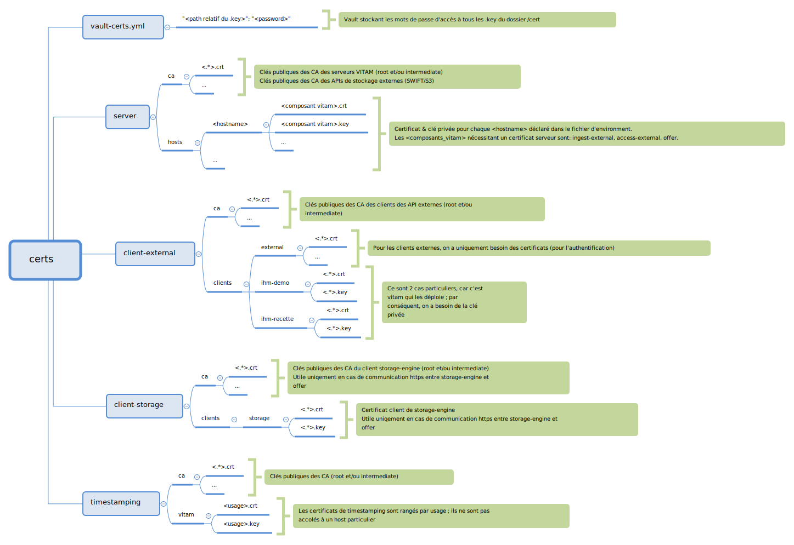

Cas 2: Je dispose d'une PKI
===========================

Procédure générale
------------------

Si vous disposez d'une PKI, il n'est pas nécessaire d'utiliser celle de Vitam.

Il est par contre être nécessaire de :

* déposer les certificats et les autorités de certifications correspondantes dans les bon répertoires.
* renseigner les mots de passe des clés privées des certificats dans le vault ansible environmements/certs/vault-certs.yml
* utiliser le script Vitam permettant de générer les différents keystores.

Intégration de certificats existants
------------------------------------

Si vous possédez déjà une :term:`PKI`, il convient de positionner les certificats et CA sous ``environmements/certs/....`` en respectant la structure indiquée ci-dessous.

    Vue détaillée de l'arborescence des certificats

.. tip::

    Dans le doute, n'hésitez pas à utiliser la PKI de test (étapes de génération de CA et de certificats) pour générer les fichiers requis au bon endroit et ainsi voir la structure exacte attendue ;
    il vous suffira ensuite de remplacer ces certificats "placeholders" par les certificats définitifs avant de lncer le déploiement.

Ne pas oublier de renseigner le vault contenant les passphrases des clés des certificats: ``environmements/certs/vault-certs.yml``

Dans le cas d'ajout de certificats :term:`SIA` externes, éditer le fichier ``environments/group_vars/all/vitam_security.yml`` et ajouter le(s) entrée(s) supplémentaire(s)  (sous forme répertoire/fichier.crt)
dans  la directive ``admin_context_certs`` pour que ceux-ci soient ajoutés aux profils de sécurité durant le déploiement de la solution logicielle :term:`VITAM`.

Pour modifier/créer un vault ansible, se référer à la documentation sur `cette url <http://docs.ansible.com/ansible/playbooks_vault.html>`_.

.. include:: keystores.rst
