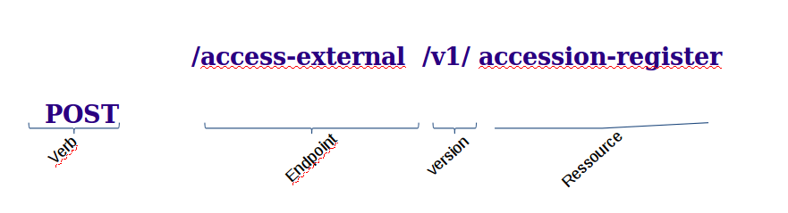
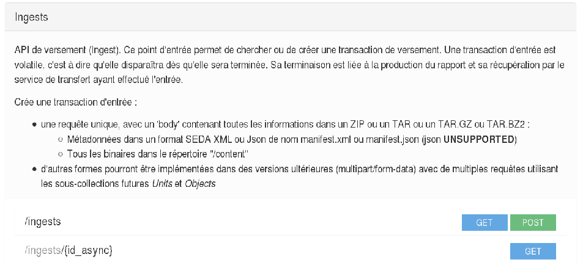
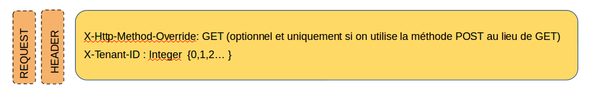
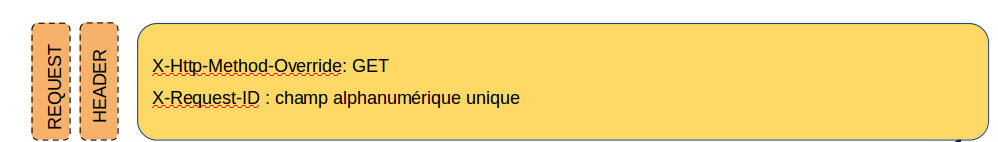
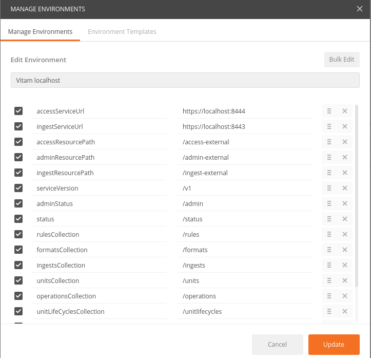
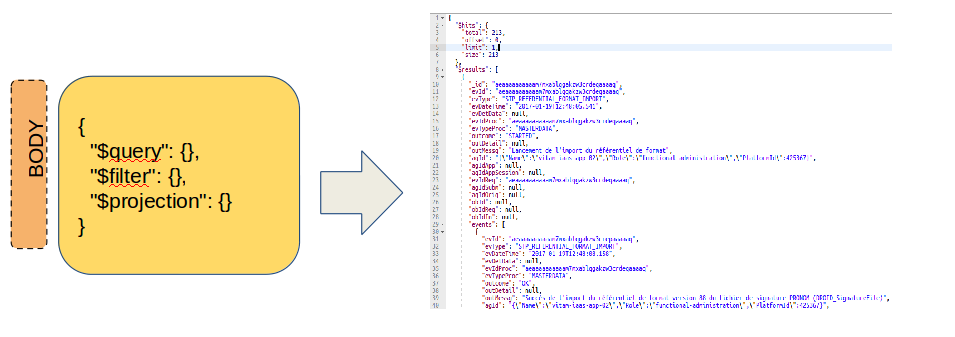
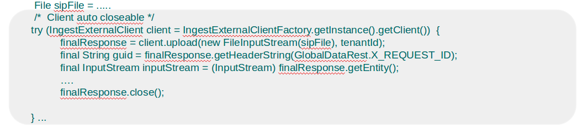
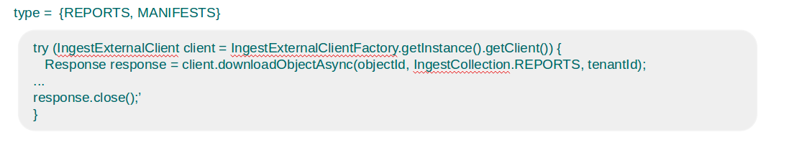
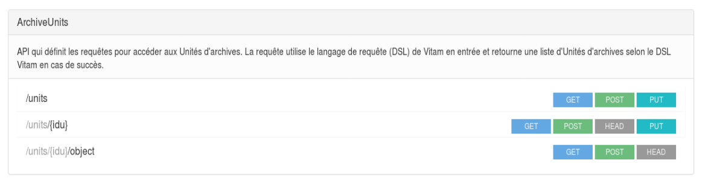
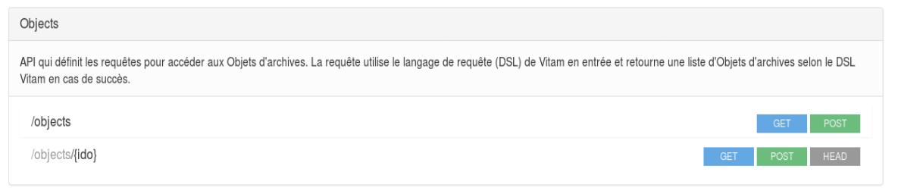

API
###

Documentation
=============

Services
--------

* ingest-external : opérations d’entrées 
* access-external : accès et journaux d’opérations
* admin-external : gestion du référentiel et opérations d’administration
  
Quelques Ressources
-------------------

* /ingest-external/v1/ingests
* /admin-external/v1/formats 
* /access-external/v1/units
  
Formation générale des API externes
-----------------------------------

RAML
----

* http://www.programmevitam.fr/ressources/Doc0.20.1/raml/externe/introduction.html
* http://www.programmevitam.fr/ressources/Doc0.20.1/raml/externe/ingest.html
* http://www.programmevitam.fr/ressources/Doc0.20.1/raml/externe/access.html
* http://www.programmevitam.fr/ressources/Doc0.20.1/raml/externe/functional-administration.html
* http://www.programmevitam.fr/ressources/Doc0.20.1/raml/externe/logbook.html

exemple d'interface du RAML

Javadoc
-------

* http://www.programmevitam.fr/ressources/Doc0.20.1/javadoc

Notamment pour les packages des clients suivants :

* Ingest External Client : fr.gouv.vitam.ingest.external.client;
* Access External Client : fr.gouv.vitam.access.external.client;

   * Plus tard ce package sera découpé en trois parties :

      * AccessExternalClient
      * AdminExternalClient
      * LogbookExternalClient

Requêtes et réponses
--------------------

Les requêtes HTTP VITAM ont en commun les attributs suivants :

Les réponses HTTP de VITAM ont en commun les attributs suivants : 

Utilisation de PostMan
----------------------

Possibilité de gestion des collections

Exemples d'élements à renseigner pour une requête, ici :

POST /ingest-external/v1/ingests

Ingest
======

Exemple d'implémentation Java de 

/ingest-external/v1/ingests

sur /ingest-external/v1/ingests/{objectId}/{type} 

Access
======

RAML

http://www.programmevitam.fr/ressources/Doc0.20.1/raml/access/introduction.html

API qui définit les requêtes pour accéder aux Unités d'archives.
 
La requête utilise le langage de requête (DSL) de Vitam en entrée et retourne une liste d'Unités d'archives selon le DSL Vitam en cas de succès.

/units

/objects

