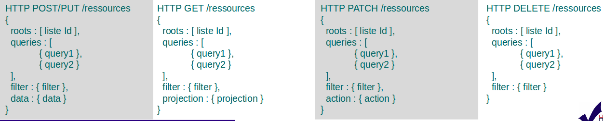

.. raw:: html

    

DSL
###

Principes
=========

* Dans le body - langage de requête

 * DSL VITAM

  * SQL : pas de plein texte, parser difficile
  * NoSQL : pas de norme
  * Abstraction indispensable (masquer l'implémentation)

* Typographie

 * Snake - « propriete_avec_multiple_noms »

  * Mais pas « proprieteAvecMultipleNoms »

 * Body au format JSON

  * Contient des informations spécifiques à la requête pour la collection
  * Peut contenir une « Query » (DSL)

* Pagination

 * offset / limit dans la Query
 * Range dans le Header pour les octets d'un fichier binaire

* Tri

 * orderby dans la Query

Corps de la requête
===================
Une requête DSL se décompose en 4 parties principales :

.. raw:: html

  
  :red.'Projections', :blue.'Collections', Requêtes (critères=query), :green.'Filtres (tri, limite)'

Pour comparaison avec le langage SQL ::

:red.'SELECT field1, field2' :blue.'FROM table' WHERE field3 < value :green.'LIMIT n SORT field1 ASC'

- *SELECT field1, field2* : la Projection
- *FROM table* : la Collection
- *WHERE field3 < value* : la partie Query
- *LIMIT n SORT field1 ASC* : les filtres

Dans le cas de multiples queries, un champ de plus peut intervenir, il s'agit du paramètre **$depth** qui indique la direction dans l'arborescence de chaque *Query*.

**Modèle générique CRUD**

::

 Create = POST
  data : { champ : valeur, champ : { champ : valeur } }

::

 Read = GET
  filter : { limit, offset, orderby }, projection : { field : 0/1, … }

::

 Update = PUT (avec forme ~ POST) / PATCH
  action : { set : { field : value, …}, inc : { field : value }, … }

::

 Delete = DELETE
  filter : { mult : true/false }
  roots = liste des Id de départ (sommet de l'arbre de classement)

Une query est exprimée avec des opérateurs (inspirés de MongoDB / Elastic)

+-----------------+------------------------------------------+--------------------------------------------+------------------------------------------------------------------------------+
| Catégorie       | Opérateurs                               | Arguments                                  | Commentaire                                                                  |
+=================+==========================================+============================================+==============================================================================+
| Accès direct    | $path                                    | identifiants                               | Accès direct à un noeud                                                      |
+-----------------+------------------------------------------+--------------------------------------------+------------------------------------------------------------------------------+
| Booléens        | $and, $or, $not                          | opérateurs                                 | Combinaison logique d'opérateurs                                             |
+-----------------+------------------------------------------+--------------------------------------------+------------------------------------------------------------------------------+
| Comparaison     | $eq, $ne, $lt, $lte, $gt, $gte           | Champ et valeur                            | Comparaison de la valeur d'un champ et la valeur passée en argument          |
+-----------------+------------------------------------------+--------------------------------------------+------------------------------------------------------------------------------+
|                 | $range                                   | Champ, $lt, $lte, $gt, $gte et valeurs     | Comparaison de la valeur d'un champ avec l'intervalle passé en argument      |
+-----------------+------------------------------------------+--------------------------------------------+------------------------------------------------------------------------------+
| Existence       | $exists, $missing, $isNull               | Champ                                      | Existence d'un champ                                                         |
+-----------------+------------------------------------------+--------------------------------------------+------------------------------------------------------------------------------+
| Tableau         | $in, $nin                                | Champ et valeurs                           | Présence de valeurs dans un tableau                                          |
+-----------------+------------------------------------------+--------------------------------------------+------------------------------------------------------------------------------+
|                 | $size                                    | Champ et taille                            | Comparaison (égale) de la taille d'un tableau                                |
+-----------------+------------------------------------------+--------------------------------------------+------------------------------------------------------------------------------+
|                 | [n] **UNSUPPORTED**                      | Position (n >= 0)                          | Élément d'un tableau                                                         |
+-----------------+------------------------------------------+--------------------------------------------+------------------------------------------------------------------------------+
| Textuel         | $term, $wildcard                         | Champ, mot clef                            | Comparaison de champs mots-clefs à valeur exacte                             |
+-----------------+------------------------------------------+--------------------------------------------+------------------------------------------------------------------------------+
|                 | $match, $matchPhrase, $matchPhrasePrefix | Champ, phrase, $max_expansions (optionnel) | Recherche plein texte soit sur des mots, des phrases ou un préfixe de phrase |
+-----------------+------------------------------------------+--------------------------------------------+------------------------------------------------------------------------------+
|                 | $regex                                   | Champ, Expression régulière                | Recherche via une expression régulière                                       |
+-----------------+------------------------------------------+--------------------------------------------+------------------------------------------------------------------------------+
|                 | $search                                  | Champ, valeur                              | Recherche du type moteur de recherche                                        |
+-----------------+------------------------------------------+--------------------------------------------+------------------------------------------------------------------------------+
|                 | $flt, $mlt                               | Champ, valeur                              | Recherche « More Like This », soit par valeurs approchées                    |
+-----------------+------------------------------------------+--------------------------------------------+------------------------------------------------------------------------------+
| Géomatique      | $geometry, $box, $polygon, $center       | Positions                                  | Définition d'une position géographique                                       |
+-----------------+------------------------------------------+--------------------------------------------+------------------------------------------------------------------------------+
| **UNSUPPORTED** | $geoWithin, $geoIntersects, $near        | Une forme                                  | Recherche par rapport à une forme géométrique                                |
+-----------------+------------------------------------------+--------------------------------------------+------------------------------------------------------------------------------+

Chaque Query dispose éventuellement d'arguments additionnels pour gérer l'arborescence :

+------------+---------------------+-----------------+-------------------------------------------------------------------------------------------------------------------------------------------------------------------------------------------------+
| Catégorie  | Opérateur           | Arguments       | Commentaire                                                                                                                                                                                     |
+============+=====================+=================+=================================================================================================================================================================================================+
| Profondeur | $depth, $exactdepth | \+ ou - n       | Permet de spécifier si la query effectue une recherche vers les racines (-) ou vers les feuilles (+) et de quelle profondeur (n), avec une profondeur relative ($depth) ou exacte ($exactdepth) |
|            |                     |                 | - $depth = 0 signifie que l'on ne change pas de profondeur (mêmes objets concernés)                                                                                                             |
|            |                     |                 | - $depth > 0 indique une recherche vers les fils uniquement                                                                                                                                     |
|            |                     |                 | - $depth < 0 indique une recherche vers les pères uniquements (cf. schéma sur les multiples queries)                                                                                            |
+------------+---------------------+-----------------+-------------------------------------------------------------------------------------------------------------------------------------------------------------------------------------------------+
| Collection | $source             | units / objects | Permet dans une succession de Query de changer de collection. Attention, la dernière Query doit respecter la collection associée à la requête                                                   |
+------------+---------------------+-----------------+-------------------------------------------------------------------------------------------------------------------------------------------------------------------------------------------------+

API Java et documentation
=========================

Documentation :

 * http://www.programmevitam.fr/ressources/Doc0.20.1/raml/externe/introduction.html

API java :

 * Dans common/common-database-vitam/common-database-public

   * fr.gouv.vitam.common.database.builder.query; notamment **VitamFieldsHelper** et **QueryHelper**
   * fr.gouv.vitam.common.database.builder.query.action; dont **UpdateActionHelper**
   * fr.gouv.vitam.common.database.builder.request.multiple; dont **DeleteMultiQuery**, **SelectMultiQuery**, **InsertMultiQuery**, **UpdateMultiQuery**
   * fr.gouv.vitam.common.database.builder.request.single; dont **Delete**, **Insert**, **Select**, **Update**
   
