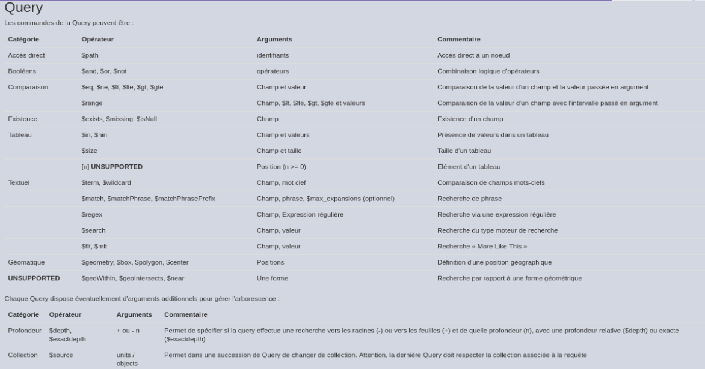

DSL
###

Principes
=========

* Dans le body - langage de requête
	* DSL VITAM
		* SQL : pas de plein texte, parser difficile
		* NoSQL : pas de norme
		* Abstraction indispensable (masquer l'implémentation)
* Typographie
	* Snake - « propriete_avec_multiple_noms »
		* Mais pas « proprieteAvecMultipleNoms »
	* Body au format JSON
		* Contient des informations spécifiques à la requête pour la collection
		* Peut contenir une « Query » (DSL)
* Pagination
	* offset / limit dans la Query
	* Range dans le Header pour les octets d'un fichier binaire
* Tri
	* orderby dans la Query

Corps de la requête
===================

::

Projections, Collections, Requêtes (critères=query), Filtres (tri, limite)

::

SELECT field1, field2 FROM table WHERE field3 < value LIMIT n SORT field1 ASC

**Modèle générique CRUD**

::

	Create = POST
		data : { champ : valeur, champ : { champ : valeur } }

::

	Read = GET
		filter : { limit, offset, orderby }, projection : { field : 0/1, … }

::

	Update = PUT (avec forme ~ POST) / PATCH
		action : { set : { field : value, …}, inc : { field : value }, … }

::

	Delete = DELETE
		filter : { mult : true/false }
		roots = liste des Id de départ (sommet de l'arbre de classement)

.. image:: images/DSL_corps_requete.png

Une query est exprimée avec des opérateurs (inspé de MongoDB / Elastic)

API Java et documentation
=========================

Documentation :

	* http://www.programmevitam.fr/ressources/Doc0.11.1/raml/externe/introduction.html

API java :

	* Dans common/common-database-vitam/common-database-public
	* fr.gouv.vitam.common.database
	* fr.gouv.vitam.common.database.builder.request.multiple;
	* fr.gouv.vitam.common.database.builder.request.single;