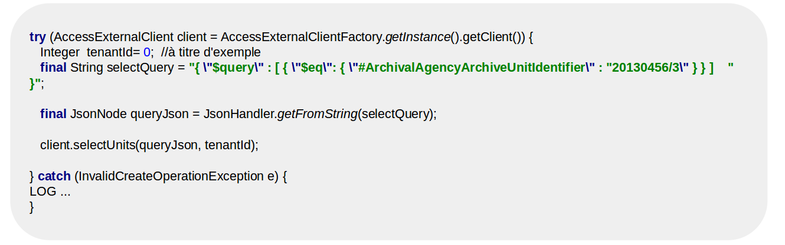
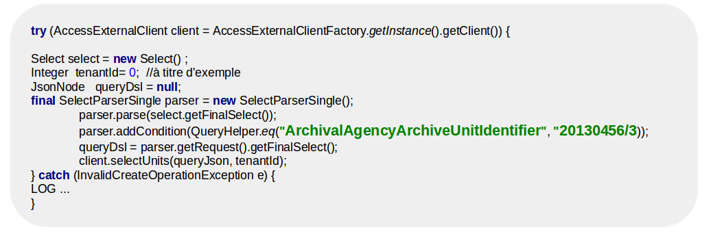
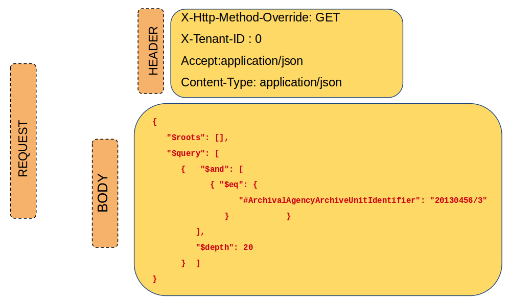
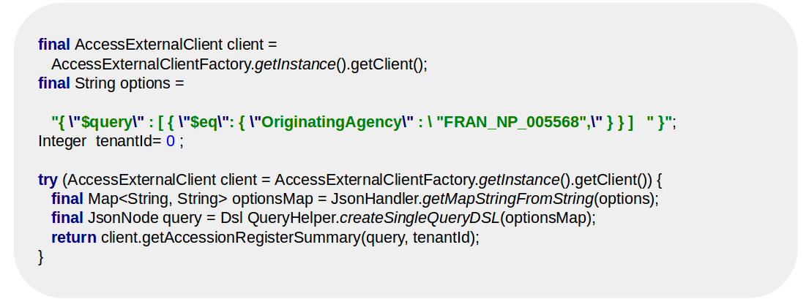
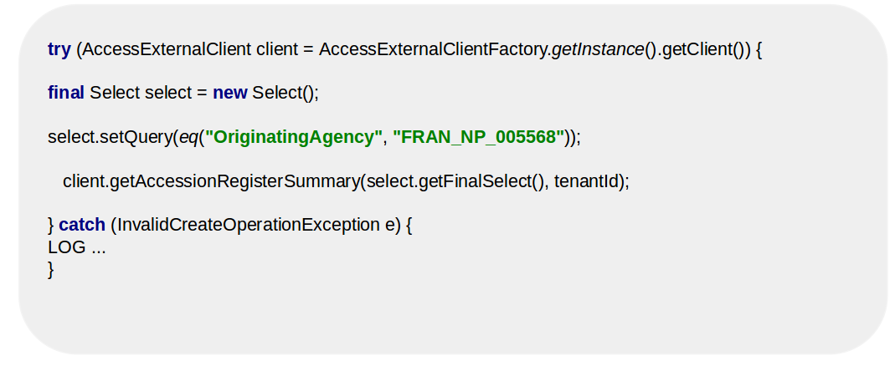
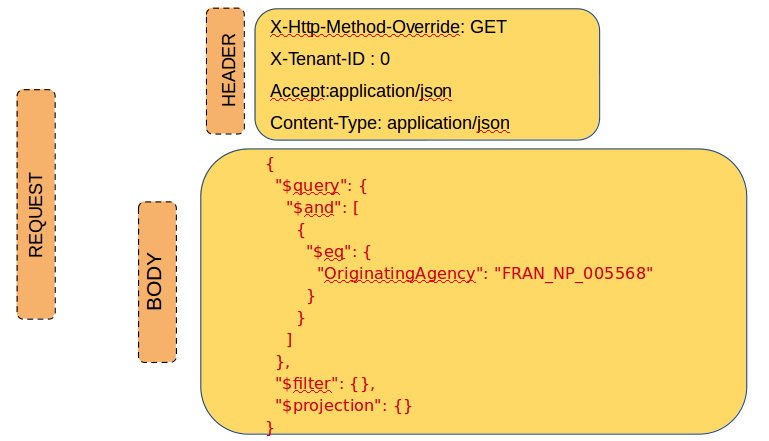
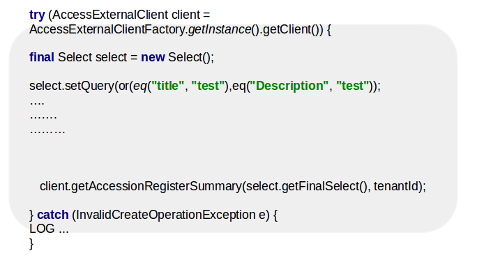
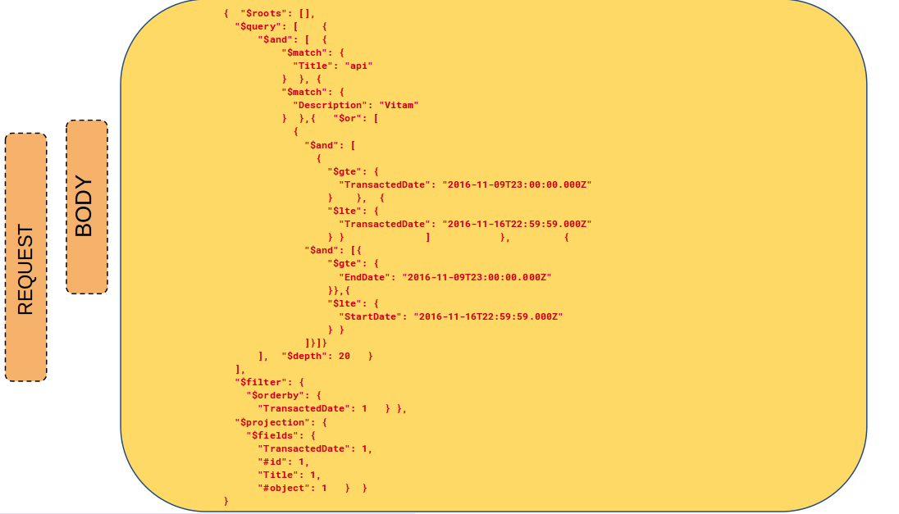
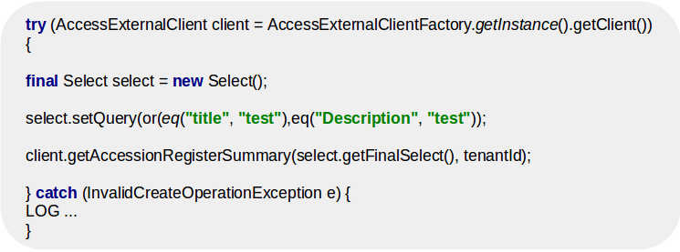
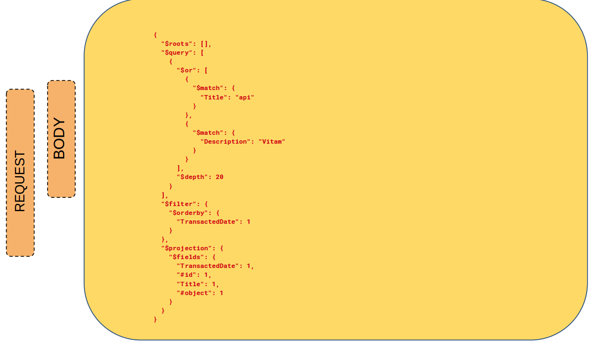

Exemples
########

Recherche par ArchivalAgencyArchiveUnitIdentifier
=================================================

EndPoint: /access-external/v1/units

**Client Java**

**Client Java avec construction DSL**

EndPoint: access-external/v1/units

**Postman**

POST /access-external/v1/units

Recherche par producteur (FRAN_NP_005568)
=========================================

**Client Java**

Endpoint : /admin-external/v1/accession-registers

**Client Java avec construction DSL**

Endpoint : /admin-external/v1/accession-registers

**Postman**

POST /admin-external/v1/accession-registers

Recherche par titre AND description AND dates
=============================================

**Client Java**

Endpoint : /access-external/v1/units

**Postman**

GET /access-external/v1/units

Recherche libre titre OR description
====================================

**Client Java**

Endpoint : /access-external/v1/units

**Postman**

GET /access-external/v1/units

