Administration
##############

Cette partie décrit les fonctionnalités d'administration suivantes proposées à l'utilisateur :

- Consultation du journal des opérations
- Import et consultation du référentiel des formats
- Import et consultation du référentiel des règles de gestion

Journal des opérations
======================

Le journal des opérations permet à l'utilisateur d'accéder à toutes les opérations effectuées dans la solution logicielle Vitam, par type d'opération.

Ces opérations sont :

- Entrée
- Mise à jour  des métadonnées de description
- Données de base
- Sécurisation
- Audit (non encore développée)
- Elimination (non encore développée)
- Préservation (non encore développée)
- Vérification (non encore développée)

Pour consulter le journal des opérations, l'utilisateur clique sur le menu "Administration", puis sur le sous-menu "Journal des opérations".

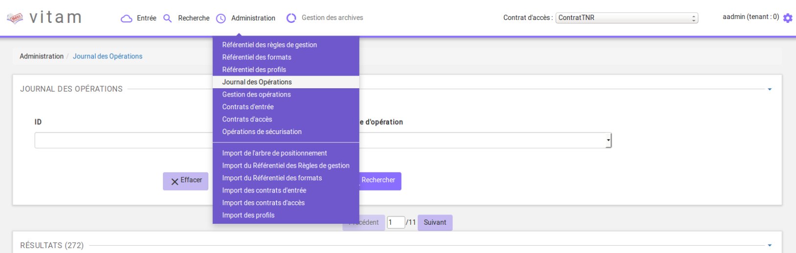

Formulaire de recherche
-----------------------

Pour effectuer une recherche précise, on utilise les champs "ID" ou "Type d'opération" :

- L'ID est un champ libre, correspondant à l'identifiant de l'opération donné par le système.
- Les types d'opération sont présentés sous forme de liste, permettant à l'utilisateur de sélectionner un type d'opération en particulier.

NB : Il est impossible d'effectuer une recherche croisée par ID et type d'opération.

Pour initier la recherche, l'utilisateur saisit son critère de recherche et clique sur le bouton "Rechercher".

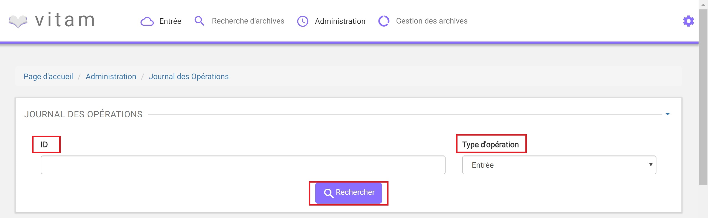

La recherche met à jour le tableau, affichant le résultat de la requête, trié par date de fin d'opération, de la plus récente à la plus ancienne.
Les opérations en cours sont affichées en haut de la liste et sont triées chronologiquement par ordre d'opération, de la plus récente à la plus ancienne.

Si aucun résultat n'est trouvé par la solution logicielle Vitam, alors un message indique à l'utilisateur qu'aucun résultat n'est disponible pour sa recherche.

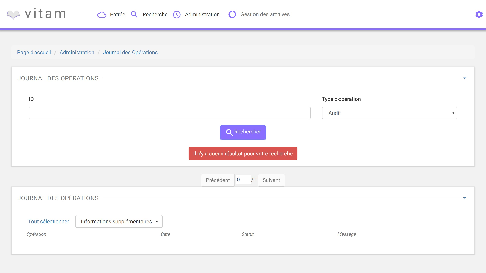

Affichage des résultats
-----------------------
Suite à la recherche, le résultat de la recherche est affiché sous forme de tableau, comportant les colonnes suivantes :

- la catégorie de l'opération (actuellement : Entrée ou INGEST, Mise à jour  des métadonnées de description ou  UPDATE, Données de base ou MASTERDATA, Sécurisation ou TRACEABILITY)
- le type d'opération
- la date de fin d'opération
- le statut de l'opération (en cours, échec, succès, avertissement)
- Le message de l'opération (Identifiant de l'opération)

.. image:: images/op_resultat.png

L'utilisateur a la possibilité d'afficher des colonnes supplémentaires afin de faire apparaître les autres informations contenues dans le journal des opérations.

Pour cela il clique sur le bouton "Informations complémentaires" et sélectionne les informations qu'il souhaite afficher.

Celles-ci sont :

- Identifiant de l'évènement
- Détail des données de l'évènement
- Identifiant de l'opération
- Code d'erreur technique
- Identifiant de l'agent interne
- Identifiant de l'application externe
- Identifiant donné par l'application externe
- Identifiant de la requête
- Identifiant du service versant
- Identifiant du service producteur
- Identifiant interne de l'objet
- Identifiant externe de l'objet
- Identifiant du tenant

L'utilisateur a la possibité d'afficher toutes les colonnes supplémentaires en cliquant sur "Tout  sélectionner".

.. image:: images/op_tout_selectionner.png

Une fois l'ensemble des colonnes affichées, l'utilisateur peut cliquer sur "Tout désélectionner" afin de revenir à l'affichage d'origine.

.. image:: images/op_tout_deselectionner.png

Consultation du détail d'une opération
--------------------------------------

Suite à la recherche d'une opération, l'utilisateur peut choisir de consulter le détail des événements intervenus durant l'opération.
Pour cela, il clique sur la ligne voulue.
Un nouvel onglet s'ouvre, pour présenter le détail de l'opération, sans quitter la liste globale des résultats.

Le détail est affiché sous forme de tableau comportant pour chaque événement les éléments suivants :

- Etape : nom de l'étape correspondante
- Date : date à laquelle l'étape a été effectuée
- Statut : statut final de l'étape
- Message : message expliquant le statut de cette étape

.. image:: images/op_detail.png

Référentiel des formats
=======================

Cette partie décrit les fonctionnalités d'import du référentiel des formats, basé sur une version récente du référentiel des formats PRONOM mis à disposition par les Archives nationales britanniques, pour ensuite le consulter et rechercher des formats spécifiques.

Import du référentiel des formats
---------------------------------

L'import du référentiel des formats s'effectue depuis l'écran "Import du référentiel des formats".
Pour cela, l'utilisateur clique sur le menu "Administration", puis sur le sous-menu "Import du référentiel des formats".

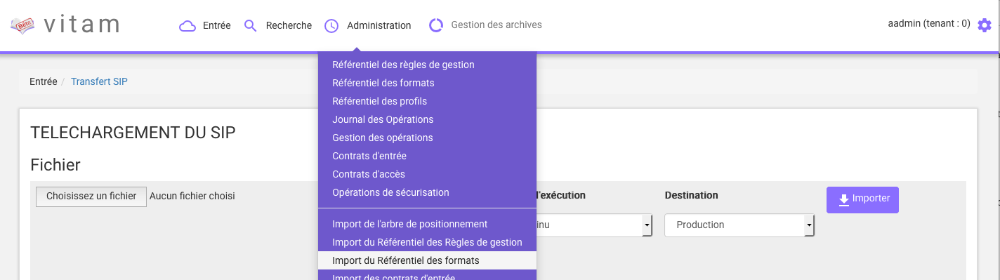

L'import du référentiel ne peut être effectué sans le fichier PRONOM.
Pour cela, l'utilisateur peut récuperer ce fichier dans sa version la plus récente sur le site des Archives nationales britanniques :

- http://www.nationalarchives.gov.uk/
- Section "PRONOM" > "DROID signature files"

Le processus d'import du référentiel se décrit comme ceci :

- L'utilisateur accède à l'écran d'import du référentiel des formats et clique sur le bouton "Choisissez un fichier" pour sélectionner un fichier
- Le fichier à sélectionner est le fichier XML PRONOM récupéré précédemment
- L'utilisateur valide son choix
- La solution logicielle Vitam vérifie l'intégrité et la cohérence du fichier

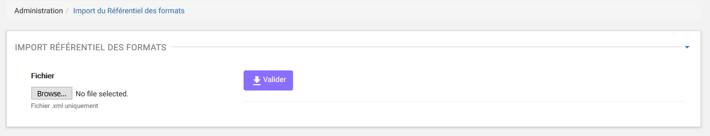

A l'issue du contrôle de cohérence et d'intégrité du fichier, plusieurs cas sont possibles :

- En cas d'erreur de fichier : La solution logicielle Vitam détecte des erreurs contenues dans le fichier, l'import de ce dernier n'est pas possible, un message d'erreur s'affiche. L'utilisateur doit corriger ces erreurs et soumettre à nouveau le fichier s'il souhaite toujours effectuer son import.

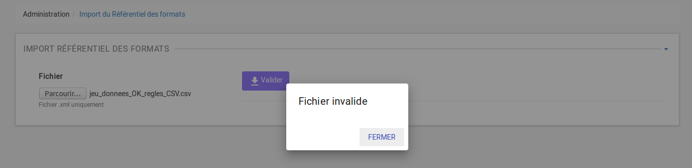

- En cas d'erreur pour cause de référentiel déjà existant : la solution logicielle Vitam détecte la présence d'un référentiel des formats. Par conséquent un message d'erreur indiquant "Référentiel des formats déjà existant" est affiché. L'import est alors impossible.

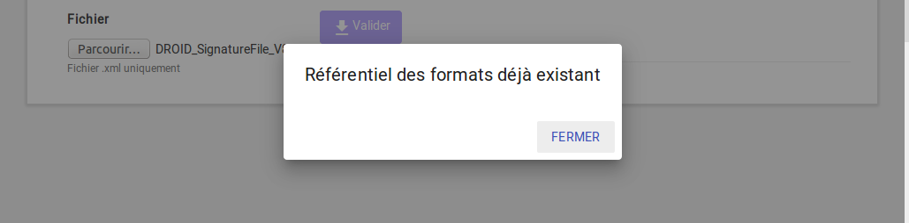

- En cas de succès : La solution logicielle Vitam indique à l'utilisateur que son fichier est valide et lui propose d'importer définitivement le fichier. L'utilisateur accepte l'import définitif, le référentiel des formats est créé à partir des informations contenues dans le fichier XML soumis.

.. image:: images/import_rf_format_OK.jpg

Recherche d'un format
---------------------

La recherche d'un format dans le référentiel des formats s'effectue depuis l'écran "Référentiel des formats".
Pour cela, l'utilisateur clique sur le menu "Administration", puis sur le sous-menu "Référentiel des formats".

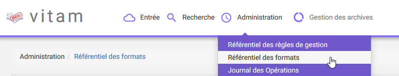

Par défaut, les formats sont affichés sous le formulaire de recherche et sont classés par ordre alphabétique.

Pour effectuer une recherche précise, on utilise le champ "Nom de format" ou le champ "PUID" (Le PUID étant l'ID unique du format dans PRONOM). Si on renseigne les deux champs de façon simultanée, l'opérateur booléen "ET" est implicitement utilisé. La recherche alliera donc le nom du format avec le PUID et donnera ainsi un résultat plus précis.

NB : La recherche n'a pas besoin d'être exacte. L'utilisateur peut saisir une chaîne de caractères avec ou sans accent, des mots au singulier comme au pluriel, voire avec une légère tolérance de faute : la solution logicielle Vitam pourra trouver des résultats correspondants.

Pour initier la recherche, l'utilisateur saisit ses critères de recherche et clique sur le bouton "Rechercher" ou appuie sur la touche "Entrée" si son curseur est positionné dans le champ de recherche.

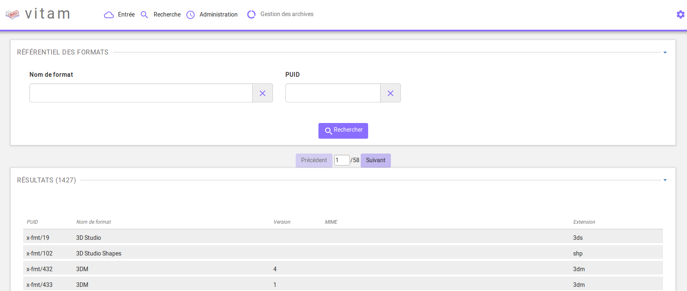

Il est possible de vider le contenu des champs "Nom du format" et "PUID" en cliquant sur la croix située à droite de chacun des champs de recherche.

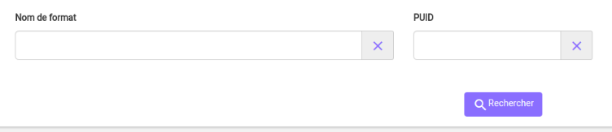

Affichage du résultat
---------------------

Suite à la recherche, les résultats sont affichés dans un tableau comportant les informations suivantes :

- PUID : ID unique du format
- Nom de format
- Version : version du format
- MIME : Identifiant de format de données (Type MIME)
- Extensions

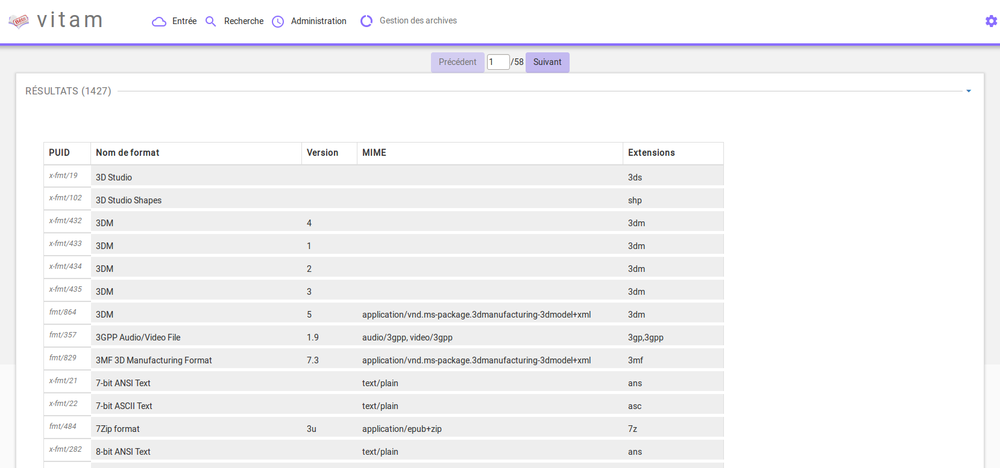

Affichage d'un détail du format
-------------------------------

Pour accéder au détail de chaque format, l'utilisateur clique sur la ligne du format désiré.

Une fenêtre de type "modale" s'ouvre, pour présenter le détail du format, tout en conservant la liste des résultats.

.. image:: images/rf_format_detail.png

Le détail d'un format est composé des informations suivantes :

- PUID
- Nom du format
- Type MIME
- Extensions
- Priorité sur les versions précédentes
- Version de PRONOM : contient un lien renvoyant vers la fiche correspondante au format dans le référentiel des formats PRONOM sur le site des Archives nationales britanniques

Un clic sur le bouton "Fermer" ou hors de la fenêtre "modale" referme celle-ci.

Référentiel des règles de gestion
=================================

Cette partie décrit les fonctionnalités d'import du référentiel des règles de gestion, matérialisé par un fichier CSV, permettant de le consulter et de rechercher des règles de gestion spécifiques.

Import du référentiel des règles de gestion
-------------------------------------------

L'import du référentiel des règles de gestion s'effectue depuis le menu "Administration", puis en cliquant sur le sous-menu "Import du référentiel des règles de gestion".

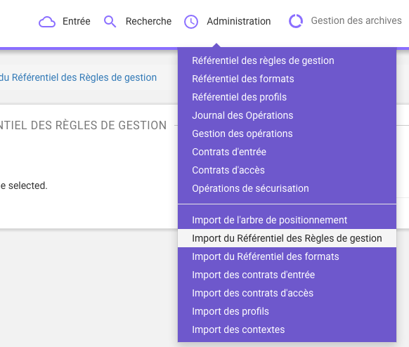

L'utilisateur doit au préalable créer le référentiel des règles de gestion au format CSV, puis l'importer dans Vitam.

Plusieurs critères doivent être respectés pour s'assurer de la bonne construction des règles de gestion :

- Identifiants de la règle (obligatoire et unique)
- Types de règle (Obligatoire) :

  - Durée d'utilité Administrative (DUA) : AppraisalRule
  - Délai de Communicabilité (DCOMM) : AccessRule
  - Durée d'utilité courante (DUC) : StorageRule
  - Délai de diffusion (DDIFF) : DisseminationRule
  - Durée de réutilisation (DREUT) : ReuseRule
  - Durée de classification (DCLASS) : ClassificationRule

- Intitulé de la règle (Obligatoire)
- Durée associée à la règle (Obligatoire)
- Unité de valeur associée: jours, mois, année (Obligatoire)
- Description (Optionnel)

Un fichier valide est un fichier respectant toutes les conditions suivantes :

- Il s'agit d'un format CSV dont la structure est bien formée
- Il possède des valeurs dont le format est correct
- Il comporte des valeurs dans tous les champs obligatoires
- Il possède des valeurs cohérentes avec les besoins métier

Le processus d'import du référentiel se décrit comme ceci :

- L'utilisateur accède à l'interface d'import du référentiel des règles de gestion et clique sur le bouton "Choisissez un fichier" pour sélectionner un fichier
- Le fichier à selectionner est le fichier CSV précédemment décrit
- L'utilisateur valide son choix
- Le système vérifie l'intégrité et la cohérence du fichier

.. image:: images/Import_rf_gestion.jpg

A l'issue du contrôle de cohérence et d'intégrité du fichier, deux cas sont possibles :

- En cas d'erreur : La solution logicielle Vitam détecte des erreurs contenues dans le fichier, l'import de ce dernier n'est pas possible. Un message d'erreur est alors affiché. L'utilisateur doit corriger ses erreurs et procéder à nouveau au import du fichier.

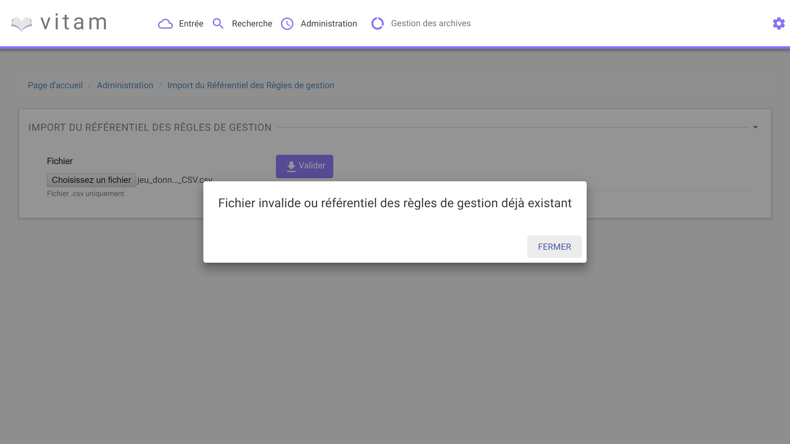

- En cas de succès : La solution logicielle Vitam indique à l'utilisateur que son fichier est valide et lui propose l'import définitif ou son annulation. Si l'utilisateur lance l'import définitif, le référentiel des règles de gestion est créé à partir des informations contenues dans le fichier CSV soumis.

.. image:: images/Import_rf_gestion_OK.jpg

Recherche d'une règle de gestion
--------------------------------

La recherche d'une règle de gestion dans le référentiel des règles de gestion s'effectue depuis l'écran "Référentiel des règles de gestion".
Pour cela, l'utilisateur clique sur le menu "Administration", puis sur le sous-menu "Référentiel des règles de gestion".

.. image:: images/menu_rg.png

Par défaut, les règles de gestion sont affichées sous le formulaire de recherche et sont classées par ordre alphabétique.

Pour effectuer une recherche précise, on utilise le champ "Intitulé" et/ou le champ "Type".

NB : La recherche n'a pas besoin d'être exacte. L'utilisateur peut saisir une chaîne de caractères avec ou sans accent, des mots au singulier comme au pluriel, voir même avec une légère tolérance de faute : la solution logicielle Vitam pourra trouver des résultats correspondants.

Pour initier la recherche, l'utilisateur saisit ses critères de recherche et clique sur le bouton "Rechercher".
La liste du référentiel est alors actualisée avec les résultats correspondants à la recherche souhaitée.

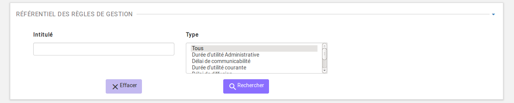

Affichage du résultat
---------------------

Suite à la recherche, les résultats sont affichés dans un tableau comportant les informations suivantes :

- Intitulé de la règle
- Type de règle
- Durée de la règle
- Description de la règle
- Identifiant de la règle

Les résultats sont triés par défaut par ordre alphabétique des intitulés des règles de gestion.

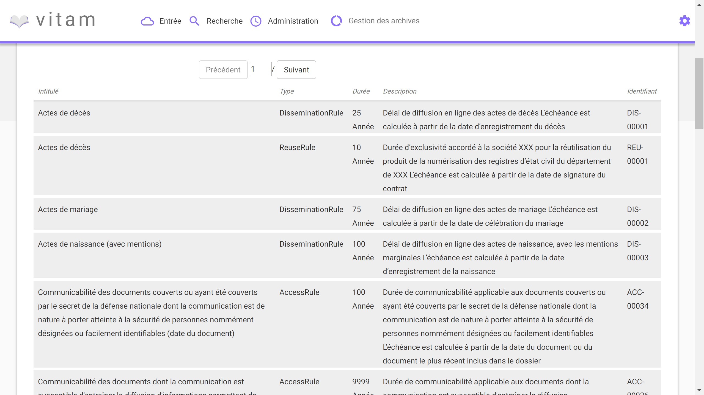

Affichage du détail d'une règle de gestion
------------------------------------------

Pour accéder au détail de chaque règle de gestion, l'utilisateur clique sur la ligne de la règle désirée.

Une fenêtre de type "modale" s'ouvre, pour présenter le détail de la règle de gestion, tout en conservant la liste des résultats.

.. image:: images/rf_gestion_detail.jpg

Le détail d'une règle de gestion est composé des informations suivantes :

- Intitulé de la règle
- Identifiant de la règle
- Description de la règle
- Durée de la règle
- Type de règle
- Mesure
- Date de création de la règle, correspond à la date d'import du référentiel de règle de gestion
- Date de dernière modification

Un clic sur le bouton "Fermer" ou hors de la fenêtre "modale" referme celle-ci.

Contrats
========

Les contrats permettent de gérer les droits donnés aux utilisateurs et applications. Deux types de contrats sont disponibles dans la solution logicielle Vitam :

* Contrats d'entrée
* Contrats d'accès

Accès au menus de gestion des contrats
--------------------------------------

Les sous-menus permettant d'accéder aux interfaces de recherche et d’import de contrat sont disponibles dans le menu "Administration".

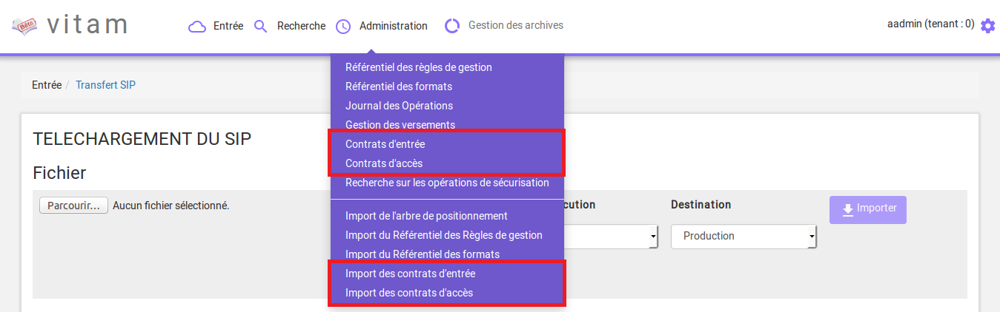

Contrats d'accès
----------------

**Importer un contrat d'accès**

L'import du contrat est une fonctionnalité réservée à un utilisateur ayant des droits d'administration. La structure et les valeurs des contrats sont décrites dans la documentation du modèle de données.
Pour importer un contrat d'accès, l'utilisateur clique sur le menu "Administration" puis sur le sous-menu "import des contrat d'accès".

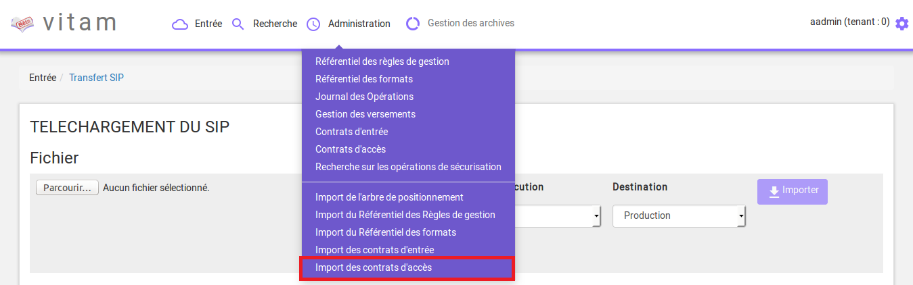

Il sélectionne ensuite le fichier à  importer en cliquant sur "parcourir", puis clique sur "importer" pour lancer l'opération.

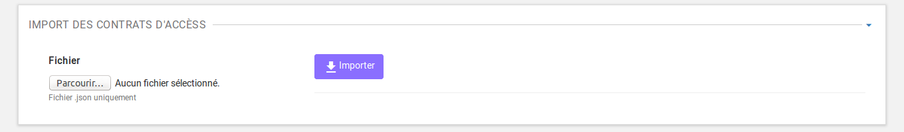

Une fenêtre modale s'ouvre alors pour indiquer soit :

* Que les contrats ont bien été importés
* Un échec de l'import du fichier. Ceci peut être causé par :
	* Le fait que les contrats mentionnés existent déjà  pour le tenant
	* Le fait que le fichier est invalide

Cette opération est journalisée et disponible dans le Journal des Opérations.

**Rechercher un contrat d'accès**

Pour accéder à la recherche de contrats d'accès, l'utilisateur clique sur le menu "Administration", puis sur le sous-menu "Contrat d'accès".

La page affiche un formulaire de recherche composé des champs suivants :

* Nom du contrat : permet d'effectuer une recherche approchante sur les noms des contrats d'accès disponibles dans la solution logicielle Vitam.
* Identifiant : permet d'effectuer une recherche exacte sur les identifiants des contrats.

Par défaut, la solution logicielle Vitam affiche tous les contrats disponibles dans la liste de résultats et l'affine en fonction de la recherche effectuée. La liste des résultats est composée des colonnes suivantes :

* Nom
* Identifiant
* Description
* Tenant
* Statut
* Date de création

En cliquant sur une ligne, l'utilisateur ouvre le détail du contrat d'accès dans un nouvel onglet.

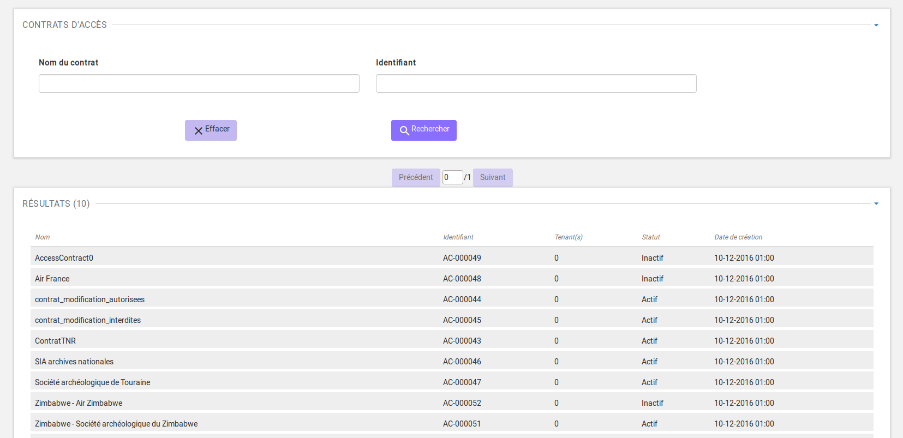

**Détail d'un contrat d'accès**

La page "Détail d'un contrat d'accès" contient les informations suivantes :

* ID
* Nom
* Description
* Date de création
* Statut
* Service producteur
* Date d'activation
* Date de mise à  jour
* Date de désactivation

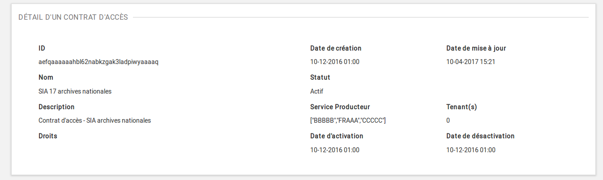

** Utilisation des contrats d'accès **

Chaque profil utilisateur peut être relié à un ou plusieurs contrats, qui restreignent totalement, de manière partielle ou autorisent pleinement l'accès et/ou la modification d'une archive.

*Sélection d'un contrat*
Pour accéder à  un contrat spécifique, l'utilisateur peut choisir dans le menu déroulant en haut à  droite le contrat concerné.
Une fois sélectionné, il peut opérer sa recherche d'archive. NB : les contrats du menu déroulants sont les contrats actifs pour l'utilisateur, les contrats inactifs ne sont pas listés.

*Autorisation d'écriture au sein d'une archive*
L'utilisateur peut écrire et modifier les metadonnées d'une unitié archivistique si le contrat activé l'autorise.

*Activation / désactivation d'un contrat*
L'administrateur a la possibilité d'activer / désactiver un contrat. Dans l'onglet recherche de contrat, choisir le contrat sélectionné. Activer / désactiver le bouton Actif / Inactif.

*Restriction d'accès par usage de l'objet*
Un contrat peut interdire l'accès à  un ou plusieurs usages d'objets spécifiques. (ex. : l'utilisateur peut accéder aux usages de diffusions mais pas à la source de l'objet)

Contrats d'entrée
-----------------

**Importer un contrat d'entrée**

L'import du contrat est une fonctionnalité réservée à un utilisateur ayant des droits d'administration. La structure et les valeurs des contrats sont décrites dans la documentation du modèle de données.
Pour importer un contrat d'entrée, l'utilisateur clique sur le menu "Administration" puis sur le sous-menu "import des contrats d'entrée".

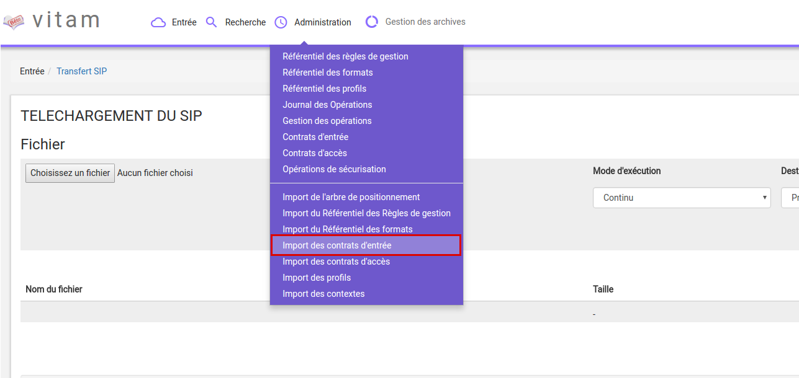

Il sélectionne ensuite le fichier à  importer en cliquant sur "parcourir", puis clique sur "importer" pour lancer l'opération.

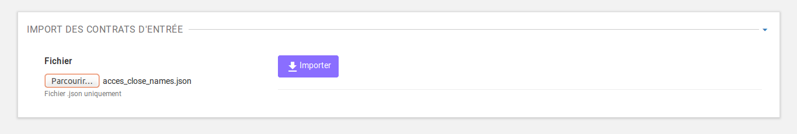

Une fenêtre modale s'ouvre alors pour indiquer soit :

* Que les contrats ont bien été importés
* Un échec de l'import du fichier. Ceci peut être causé par :
	* Le fait que les contrats mentionnés existent déjà  pour le tenant
	* Le fait que le fichier est invalide

Cette opération est journalisée et disponible dans le Journal des Opérations.

**Rechercher un contrat d'entrée**

Pour accéder à la recherche de contrats d'entrées, l'utilisateur clique sur le menu "Administration", puis sur le sous-menu "Contrat d'entrées".

La page affiche un formulaire de recherche composé des champs suivants :

* Nom du contrat : permet d'effectuer une recherche approchante sur les noms des contrats d'entrées disponibles dans la solution logicielle.
* Identifiant : permet d'effectuer une recherche exacte sur les identifiants des contrats.

Par défaut, la solution logicielle Vitam affiche tous les contrats disponibles dans la liste de résultats et l'affine en fonction de la recherche effectuée. La liste des résultats est composée des colonnes suivantes :

* Nom
* Identifiant
* Description
* Tenant
* Statut
* Date de création

En cliquant sur une ligne, l'utilisateur ouvre le détail du contrat d'entrée dans un nouvel onglet.

.. image:: images/CONTRACTS_ingest_contract_search.png

**Détail d'un contrat d'entrée**

La page "Détail d'un contrat d'accès" contient les informations suivantes :

* ID
* Nom
* Description
* Date de création
* Statut
* Date d'activation
* Date de mise à  jour
* Date de désactivation

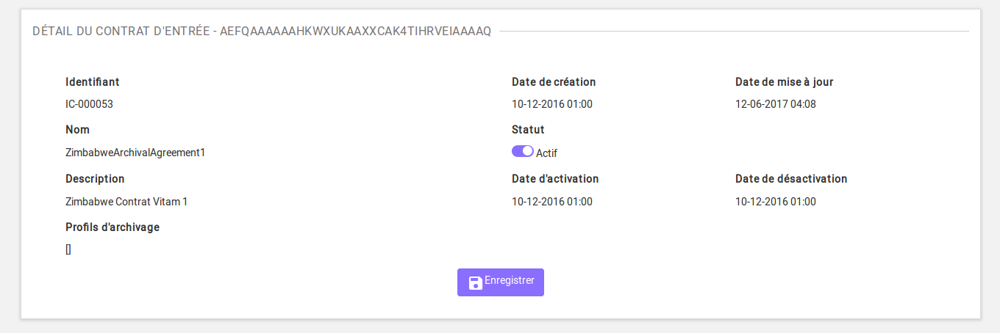

** Utilisation des contrats d'entrée **

Chaque SIP peut être relié à un contrat d'entrée permettant de définir des conditions de versement entre le service versant et la solution logicielle Vitam.

*Activation / désactivation d'un contrat*
L'administrateur a la possibilité d'activer / désactiver un contrat. Dans l'onglet recherche de contrat, choisir le contrat sélectionné. Activer / désactiver le bouton Actif / Inactif.

Contexte
========

**Importer un contexte**

L'import du contexte est une fonctionnalité réservée à un utilisateur ayant des droits d'administration. La structure et les valeurs des contextes sont décrites dans la documentation du modèle de données.
Pour importer un contexte, l'utilisateur clique sur le menu "Administration" puis sur le sous-menu "import des contextes".

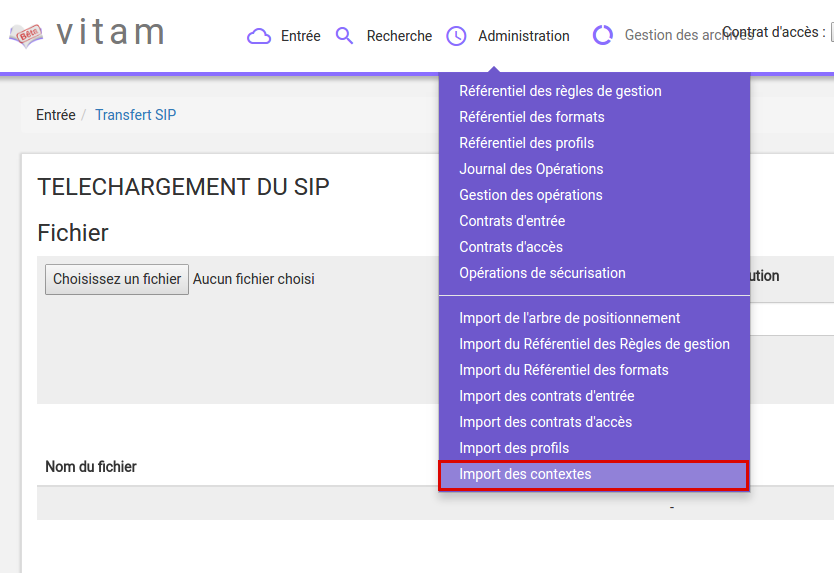

Il sélectionne ensuite le fichier à  importer en cliquant sur "parcourir", puis clique sur "importer" pour lancer l'opération.

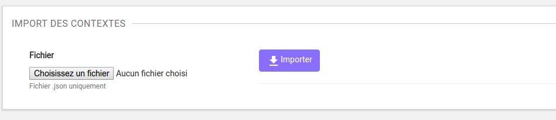

Une fenêtre modale s'ouvre alors pour indiquer soit :

* Que les contextes ont bien été importés
* Un échec de l'import du fichier. Ceci peut être causé par :
	* Le fait que le contexte existe déjà dans le système
	* Le fait que le fichier est invalide
  * Le fait que le contexte déclare des contrats d'entrées ou des contrats d'accès qui n'existent pas dans les référentiels des contrats de leurs tenants

Cette opération est journalisée et disponible dans le Journal des Opérations.

Profils d'archivage
===================

Accès aux menus de gestion des profils d'archivage
---------------------------------------------------

Les sous-menus permettant d’accéder aux interfaces de recherche et d’import de profils d'archivage sont disponibles dans le menu “Administration”.

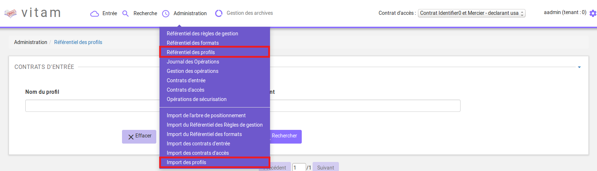

Importer un profil d'archivage
--------------------------------

Pour importer un profil d'archivage, l'utilisateur clique sur le menu "Administration" puis sur le sous-menu "importer des profils".

Les profils d'archivage sont des fichiers JSON constitués des champs suivants :

* Name : nom du profil d'archivage (obligatoire)
* Description : description du profil d'archivage (obligatoire)
* Status : statut du profil d'archivage. ACTIVE ou INACTIVE
* Format : format attendu pour le fichier de règle. XSD ou RNG

Pour importer un profil d'archivage, l'utilisateur sélectionne ensuite le fichier à importer en cliquant sur “parcourir”, puis clique sur “importer” pour lancer l’opération.

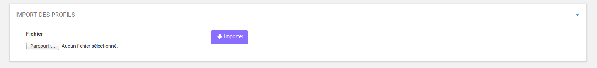

Une fenêtre modale indique alors soit :

* Les contrats ont bien été importés
* Échec de l’import du fichier. Ceci peut être causé par :
	* le fait que le(s) profil(s) d'archivage mentionnés existent déjà pour le tenant
	* le fait que le fichier JSON est invalide

Cette opération est journalisée et disponible dans le Journal des Opérations.

Rechercher un profil d'archivage
---------------------------------

Pour accéder à la recherche de profils d'archivage, l’utilisateur clique sur le menu “Administration”, puis sur le sous-menu “Référentiel des profils”.

La page affiche un formulaire de recherche composé des champs suivants :

* Nom du profil : permet d’effectuer une recherche approchante sur les noms des profils d'archivage disponibles dans la solution logicielle Vitam.
* Identifiant : permet d’effectuer une recherche exacte sur les identifiants des profils d'archivage.

Par défaut, la solution logicielle Vitam affiche tous les profils d'archivage disponibles dans la liste de résultats et l’affine en fonction de la recherche effectuée. La liste des résultats est composée des colonnes suivantes :

* Identifiant
* Nom
* Description
* Etat
* Profil

En cliquant sur une ligne, l’utilisateur ouvre le détail du profil d'archivage dans un nouvel onglet.

Lorsqu'un fichier de règle a été associé au profil, une flèche indiquant la possibilité de le télecharger apparaît. L'utilisateur peut lancer le télechargement en cliquant dessus.

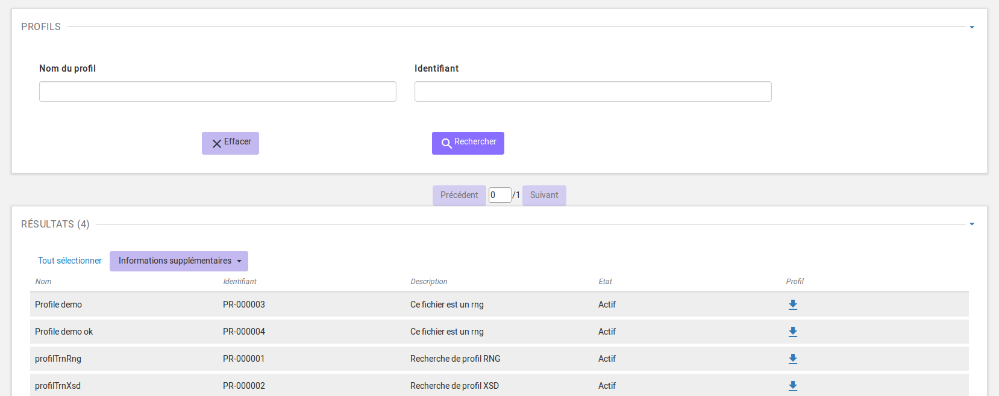

Consulter le détail d'un profil d'archivage
--------------------------------------------

La page "Détail d'un profil d'archivage" contient les informations suivantes :

* ID
* Nom
* Description
* Fichier
* Format
* Date de création
* Statut
* Date de mise à jour
* Tenant(s)
* Date de désactivation

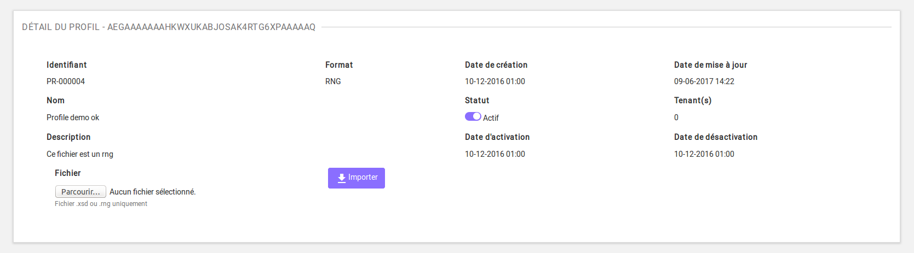

Associer un fichier de règles à un profil d'archivage
-------------------------------------------------------

Pour importer un fichier de règles à associer à un profil d'archivage, l'utilisateur clique sur le bouton "parcourir" à coté du champ "fichier" puis clique sur "importer". Le format du fichier doit correspondre au format attendu, indiqué dans le champ format.

la fin de l'opération d'import, une fenêtre modale indique un des deux messages suivants :

* Le profil a bien été importé
* Echec de l'import du fichier

L'opération est journalisée et disponible depuis l'écran de consultation des journaux d'opérations.

En cas de succès de l'import de fichier de règle, la date de mise à jour du profil est ajustée en conséquence. Si l'utilisateur importe un fichier de règle alors qu'un autre fichier de règles a déjà été importé, alors le nouveau fichier remplace l'ancien.

Import d'un arbre de positionnement
====================================

L'import d'un arbre de positionnement dans Vitam s'effectue depuis l'écran "Import de l'arbre de positionnement", accessible depuis le menu "Administration" puis en cliquant sur le sous-menu du même nom.

.. image:: images/menu_import_arbre.png

Pour débuter l'import, l’utilisateur doit sélectionner l'arbre sous le format demandé. Pour cela, il clique sur le bouton « Parcourir », une nouvelle fenêtre s'ouvre dans laquelle il a la possibilité de sélectionner l'arbre.

Une fois celui-ci sélectionné, il apparaît sur l'écran "Import de l'arbre de positionnement". Le nom du fichier s'affiche à droite du bouton "choisissez un fichier" et une nouvelle ligne apparaît en dessous avec le nom du fichier, sa taille ainsi qu'un champ statut pour l'instant vide.

Deux listes déroulantes sont présentes sur l'écran :

- Mode d'exécution : l'utilisateur a le choix entre le mode d'exécution "pas à pas" permettant de passer d'une étape à une autre dans le processus d'entrée, et le mode d'exécution "continu" permettant de lancer le processus d'entrée dans sa globalité en une seule fois. Dans la grande majorité des cas, le mode d'exécution "continu" sera le choix adopté.

- Destination : l'utilisateur peut indiquer la destination de l'arbre. Actuellement, seule l'option "production", pour importer directement l'arbre, est disponible.

Le mode d'exécution et la destination sont obligatoires.

Pour lancer le transfert de l'arbre, l’utilisateur clique sur le bouton « Importer ».

Les informations visibles à l'écran sont :

- Un tableau comportant les champs suivants :

  - Nom du fichier,
  - Taille : Affiche la taille de l'arbre en Ko, Mo ou Go en fonction de la taille arrondie au dixième près,
  - Statut (succès, erreur ou avertissement)

- Une barre de progression affiche l’avancement du téléchargement de l'arbre dans Vitam (une barre de progression complète signifie que le téléchargement est achevé).

NB : Suite au téléchargement de l'arbre, un temps d'attente est nécessairen correspondant au traitement de l'arbre par le système avant affichage du statut final. Dans ce cas, une roue de chargement est affichée au niveau du statut.

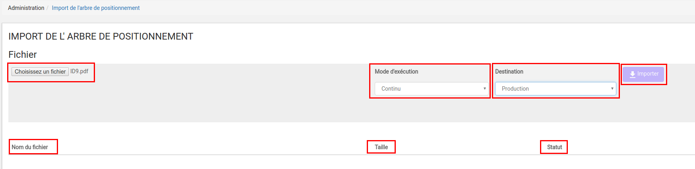

Si l'utilisateur tente d'importer un arbre au format non conforme (s'il ne s'agit pas des formats ZIP, TAR, TAR.GZ, TAR.BZ2) alors le système empêche le téléchargement.
Une fenêtre pop-up s'ouvre indiquant les formats autorisés.

Toute opération d'entrée (succès, avertissement et échec) fait l'objet d'une écriture dans le journal des opérations et génére une notification qui est proposée en téléchargement à l'utilisateur.

Cette notification ou ArchiveTransferReply (ATR) est au format XML conforme au schéma SEDA 2.0.
Lors d'une entrée en succès dans VITAM, l'ATR comprend les informations suivantes :

- Date : date d'émission de l'ATR
- MessageIdentifier : identifiant de l'ATR. Cet identifiant correspond à l'identification attribué à la demande de transfert par la solution logicielle Vitam
- ArchivalAgreement : contrat d'entrée
- CodeListVesion : la liste des référentiels utilisés
- La liste des Unités Archivistiques avec l'identifiant fourni dans la demande de transfert et l'identifiant généré par la solution logicielle VITAM (SystemId)
- ReplyCode : statut final de l'entrée
- GrantDate : date de prise en charge de l'arbre
- MessageIdentifierRequest : identifiant de la demande de transfert

Lors d'une entrée en avertissement, l'ATR contient les mêmes informations que l'ATR en succès et le ReplyCode est "WARNING". Actuellement, il n'est pas possible de connaître la cause de l'avertissement.

En cas de rejet de l'entrée, l'ATR contient les mêmes informations que l'ATR en succès ainsi que la liste des problèmes rencontrés :

- Outcome : statut de l'étape ou de la tâche ayant rencontré au moins une erreur
- OutcomeDetail : code interne à VITAM correspondant à l'erreur rencontrée
- OutcomeDetailMessage : message d'erreur

La notification comprend ensuite la liste des erreurs rencontrées (échecs ou avertissement), au niveau des unités archivistiques sous la forme de blocs <event>.

Gestion des versements
======================

Cette partie décrit les fonctionnalités de la page “Gestion des versements”. Elle permet de suivre l’évolution des
opérations d’entrée, d’utiliser le mode pas à pas.

Affichage des versements
------------------------

Pour accéder à la page de “Gestion des versements”, l’utilisateur clique sur le menu “Administration”, puis sur le
sous-menu “Gestion des versements”.

La page affiche la liste de toutes les opérations d’entrée en cours d’éxécution et déjà réalisées.
La liste est composée des colonnes suivantes :

* Identifiant de l’opération - identifiant unique de l’opération d’entrée
* Catégorie de l’opération - indique le type d’opération d’entrée :
	* INGEST - indique une opération d’entrée normale
	* INGEST_TEST - indique une opération d’entrée en test à blanc
* Date de l’entrée - date à laquelle l’entrée à été soumise à la solution logicielle Vitam
* Mode d’exécution - indique le mode d’exécution choisi. Celui-ci peut-être
	* Continu
	* Pas à pas
* Précédente étape du workflow / étape en cours
* Prochaine étape du workflow
* Statut - indique si l’opération est :
	* En attente
	* En cours
	* Terminée
* Actions : Contient des boutons d’action permettant d’interagir avec l'entrée réalisée en mode d’exécution pas à pas

Les opérations d’entrée sont classées par ordre antéchronologique selon leur date d'entrée.

Seules les opérations en cours de traitement sont affichées sur cet écran.

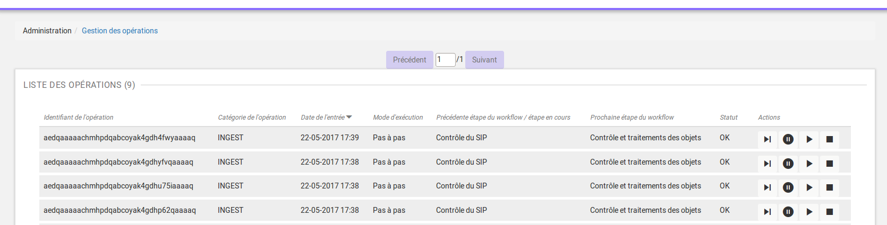

Utilisation du mode pas à pas
-----------------------------

Lorsque l’entrée est ralisée en mode d’éxécution pas à pas, l’utilisateur doit alors utiliser les boutons d’actions dispo-
nibles afin de faire avancer son traitement.
Les boutons disponibles sont :

* Suivant : permet de passer à l’étape suivante du workflow - lorsqu’une étape est terminée, il faut cliquer sur “suivant” pour continuer l’entrée
* Pause : permet de mettre l’opération d’entrée en pause
* Reprise : permet de reprendre une entrée en pause
* Arrêt : permet d’arrêter complètement une opération d’entrée. Elle passera alors en statut “terminée” et il sera impossible de la redémarrer

Recherche et vérification des opérations de sécurisation
=========================================================

La sécurisation des journaux permet de garantir la valeur probante des archives prises en charge dans la solution logicielle VITAM.

Le fichier produit par une opération de sécurisation des journaux est appelé un "journal sécurisé".

Les adminsitrateurs ont la possibilité d'accéder aux fonctionnalités suivantes :

* Recherche de journaux sécurisés
* Consultation du détail d'un journal sécurisé
* Vérification de l'intégrité d'un journal sécurisé

Rechercher des journaux sécurisés
---------------------------------

L’interface de consultation des journaux sécurisés est accessible par le menu : Menu > Rechercher un journal sécurisé

L’interface est constituée de trois éléments :

* Un formulaire
* Un paginateur
* Une zone d’affichage des résultats

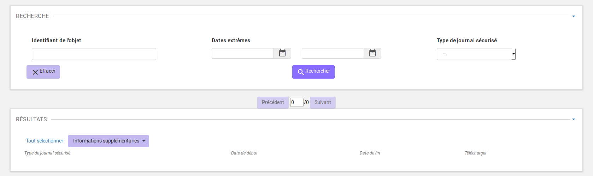

**Utilisation du formulaire**

Le formulaire est composé des champs suivants :

* Identifiant de l’objet : nom du fichier recherché
* Dates extrêmes : intervalle de dates permettant de rechercher sur les dates du premier et du dernier journal pris en compte dans l'opération de sécurisation
* Type de journal sécurisé : liste déroulante permettant de sélectionner le type de journal sécurisé à afficher.

**Lancer une recherche**

Par défaut, aucun résultat n'est affiché. Il faut lancer une recherche pour faire apparaître des résultats.

Pour lancer une recherche en prenant en compte un intervalle de dates, cliquer sur le bouton "Rechercher" après l'avoir renseigné dans les champs dates.

Si l'utilisateur clique sur le bouton "Rechercher" sans sélectionner de date, alors tous les journaux disponibles s'affichent.

**Zone de résultats**

La zone de résultats est composée des colonnes suivantes :

* Type de journal sécurisé : affiche le type de journal sécurisé
* Date de début : indique la date de début de l’opération de sécurisation
* Date de fin : indique la date de fin de l’opération de sécurisation
* Télécharger : icône permettant de télécharger l’opération

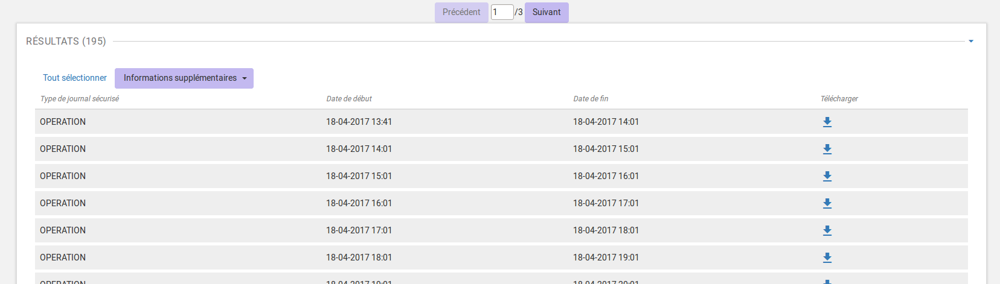

**Téléchargement d'un journal**

Chaque ligne représentant un journal comporte un symbole de téléchargement. En cliquant sur ce symbole, le journal est téléchargé sous forme de zip. Le nom de ce fichier correspond à la valeur du champ FileName du dernier event du journal de l'opération.

.. image:: images/securisation_telecharger_journal_traceability.png

Détail d'un journal sécurisé
----------------------------

En cliquant sur une ligne de la liste de résultats, l'interface de la solution logicielle VITAM affiche le détail du journal concerné dans une nouvelle fenêtre.

Le détail est composé des élements suivants :

* Détail sur le journal sécurisé, contient les 6 informations
	* Date de début - date du premier journal pris en compte dans l'opération de sécurisation
	* Date de fin - date du dernier journal pris en compte dans l'opération de sécurisation
	* Nombre d'opérations - il s'agit du nombre de journaux pris en compte dans l'opération de sécurisation
	* Algorithme de hashage - indique l'algorithme utilisé
	* Nom du fichier - nom du journal sécurisé
	* Taille du fichier - taille du journal sécurisé
* Hash de l'arbre de Merkle
* Tampon d'horodatage

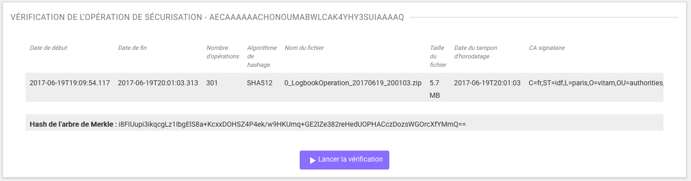

Vérification d'un journal sécurisé
----------------------------------

En cliquant sur le bouton "Lancer la vérification", la solution logicielle VITAM vérifie que les informations de l'arbre de hashage sont à la fois conformes au contenu du journal sécurisé et aux journaux disponibles dans la solution logicielle VITAM.

Une fois l'opération terminée, son détail est affiché. Il est également disponible dans le Journal des opérations.

.. image:: images/securisation_verification_detail.png

Le bouton télecharger permet d'obtenir le journal sécurisé.
