Administration
##############

Cette partie décrit les fonctionnalités d'administration proposées à l'utilisateur, elle est découpée en 3 sections, Référentiels, Imports et Opérations, qui permettent :

- Import d'un arbre de positionnement
- Import et consultation du référentiel des contrats d'entrée
- Import et consultation du référentiel des contrats d'accès
- Import et consultation du référentiel des contextes applicatifs
- Import et consultation du référentiel des formats
- Import et consultation du référentiel des profils d'archivage
- Import et consultation du référentiel des règles de gestion
- Import et consultation du référentiel des services agents
- Consultation et recherche du journal des opérations
- Gestion des opérations
- Opérations de sécurisation

Journal des opérations
======================

Pour consulter le journal des opérations, l'utilisateur survole le menu "Administration", puis le sous-menu "Opérations" et sélectionne "Journal des opérations".

.. image:: images/menu_jdo.png

Il permet à l'utilisateur d'accéder à toutes les opérations effectuées dans la solution logicielle Vitam, par type d'opération.

Ces opérations sont :

- Audit
- Données de base
- Elimination (non encore développée)
- Entrée
- Export DIP
- Mise à jour des métadonnées de description
- Préservation (non encore développée)
- Sécurisation
- Vérification (non encore développée)

Par défaut, l'ensemble des opérations s'affiche de la date d'opération la plus récente à la plus ancienne à la plus récente.

Formulaire de recherche
-----------------------

Pour effectuer une recherche précise, on utilise les champs "Identifiant" ou "Catégorie d'opération" :

- L'identifiant correspond à l'identifiant de l'opération donné par le système.
- Les catégories d'opération sont présentées sous forme de liste triée alphabétiquement, permettant à l'utilisateur de sélectionner une catégorie d'opération en particulier.

NB : Il est impossible d'effectuer une recherche croisée par identifiant et catégorie d'opération.

Pour initier la recherche, l'utilisateur saisit son critère de recherche et clique sur le bouton "Rechercher".

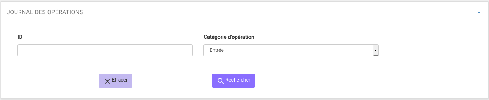

La recherche met à jour le tableau, affichant le résultat de la requête, trié par date de fin d'opération, de la plus récente à la plus ancienne.
Les opérations en cours sont affichées en haut de la liste et sont triées chronologiquement par ordre d'opération, de la plus récente à la plus ancienne.

Lors d'une recherche infructueuse, le message "Aucun résultat" s'affiche sous le formulaire.

Consultation des résultats
--------------------------

Suite à la recherche, le résultat est affiché sous forme de tableau, comportant les colonnes suivantes :

- la catégorie de l'opération
- l'opération, son type
- la date de début d'opération
- le statut de l'opération (en cours, erreur, succès, avertissement)
- Le message de l'opération (avec l'identifiant de l'opération)

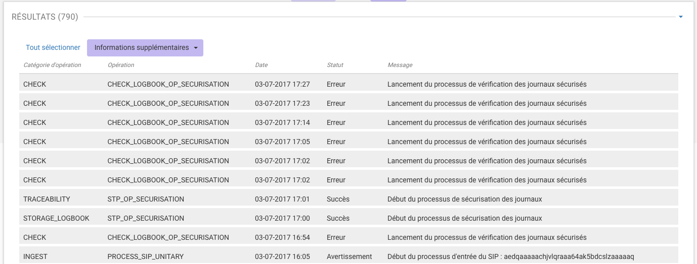

L'utilisateur a la possibilité d'afficher des colonnes supplémentaires afin de visualiser les autres informations contenues dans le journal des opérations.

Pour cela, il clique sur le bouton "Informations supplémentaires" et coche dans la liste les informations qu'il souhaite afficher.

Celles-ci sont :

- Identifiant de l'opération
- Code d'erreur technique
- Identifiant de l'agent interne
- Identifiant interne de l'objet
- Informations sur le résultat
- Règles utilisées
- Identifiant de la requête
- Identifiant des agents externes
- Identifiant externe du lot d'objet
- Identifiant du tenant
- Identifiant application
- Identifiant transaction
- Rapport

L'utilisateur a la possibilité d'afficher toutes les colonnes supplémentaires en cliquant sur la coche située tout en haut de la liste. Un clic sur le bouton "Informations supplémentaires" referme la liste.

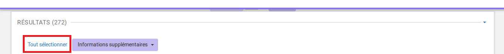

Une fois l'ensemble des colonnes affichées, l'utilisateur peut cliquer à nouveau sur la première coche afin de revenir à l'affichage d'origine.

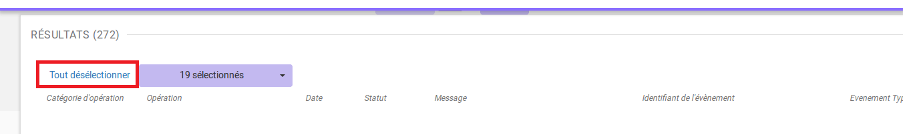

Consultation du détail d'une opération
--------------------------------------

Suite à la recherche d'une opération, l'utilisateur peut consulter le détail des événements intervenus durant l'opération.
Pour accéder au détail d'une opération, l'utilisateur clique sur la ligne souhaitée.

Le détail est composé de deux parties, le descriptif de l'opération qui récapitule les informations de l'opérations avec la possibilité d'afficher les informations supplémentaires, puis, les détails de l'opération qui sont présentés sous forme de liste comportant, pour chaque événement, les éléments suivants :

- le nom de l'étape
- la date à laquelle l'étape a été effectuée
- le message expliquant le statut de cette étape
- le statut présenté sous forme de pictogramme

Un clique sur la flèche située à côté du message permet d'afficher plus de détail concernant cette étape. Un clic sur un signe "+" situé à côté d'un message affiche les détails des données de l'évènement.

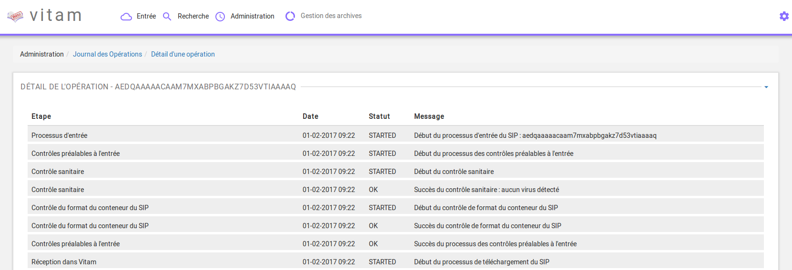

Référentiel des formats
=======================

Cette partie décrit les fonctionnalités d'import du référentiel des formats, basé sur une version récente du référentiel des formats PRONOM mis à disposition par les Archives nationales britanniques, pour ensuite le consulter et rechercher des formats spécifiques.

Import du référentiel des formats
---------------------------------

L'import du référentiel des formats s'effectue depuis l'écran "Import du référentiel des formats".
Pour y accéder, l'utilisateur survole le menu "Administration", puis le sous-menu "Import des référentiels" et sélectionne "Import des formats".

.. image:: images/menu_imports.png

L'import du référentiel ne peut être effectué sans le fichier PRONOM.
Pour cela, l'utilisateur peut récupérer ce fichier dans sa version la plus récente sur le site des Archives nationales britanniques :

- http://www.nationalarchives.gov.uk/
- Section "PRONOM" > "DROID signature files"

Le processus d'import du référentiel se décrit comme ceci :

- L'utilisateur accède à l'écran d'import du référentiel des formats et clique sur le bouton "Choisissez un fichier" pour sélectionner un fichier
- Le fichier à sélectionner est le fichier XML PRONOM récupéré précédemment
- L'utilisateur valide son choix
- La solution logicielle Vitam vérifie l'intégrité et la cohérence du fichier

.. image:: images/import_formats.png

A l'issue du contrôle de cohérence et d'intégrité du fichier, plusieurs cas sont possibles :

- En cas d'erreur de fichier : la solution logicielle Vitam détecte des erreurs contenues dans le fichier, l'import de ce dernier n'est pas possible, un message d'erreur s'affiche. L'utilisateur doit corriger ces erreurs et soumettre à nouveau le fichier s'il souhaite toujours effectuer son import.

- En cas d'erreur : pour cause de référentiel déjà existant détecté par la solution logicielle Vitam. Un message d'erreur indiquant "Référentiel des formats déjà existant" est affiché. L'import devient impossible.

.. image:: images/import_ko.png

- En cas de succès : La solution logicielle Vitam indique à l'utilisateur que son fichier est valide et lui propose d'importer définitivement le fichier. L'utilisateur peut ainsi accepter l'import définitif et le référentiel des formats est créé à partir des informations contenues dans le fichier XML soumis.

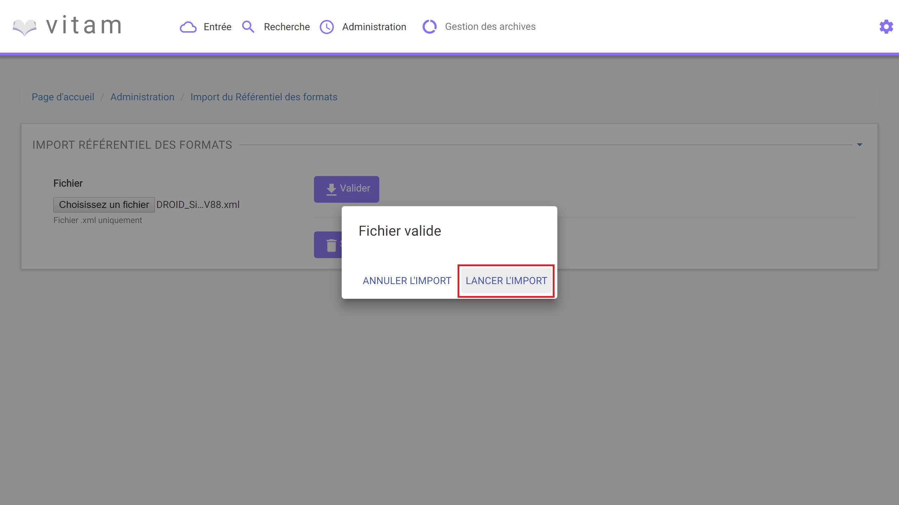

Recherche d'un format
---------------------

La recherche d'un format dans le référentiel des formats s'effectue depuis l'écran "Formats". Pour y accéder, l'utilisateur survole le menu "Administration", puis le sous-menu "Référentiels" et sélectionne "Formats".

.. image:: images/menu_formats.png

Par défaut, les formats sont affichés sous le formulaire de recherche et sont classés par ordre alphabétique de leur intitulé.

Pour effectuer une recherche précise, on utilise le champ "Intitulé" ou le champ "PUID" (Le PUID étant l'identifiant unique du format dans PRONOM).

NB : La recherche n'a pas besoin d'être exacte. L'utilisateur peut saisir une chaîne de caractères avec ou sans accent, des mots au singulier comme au pluriel, voire avec une légère tolérance de faute.

Pour initier la recherche, l'utilisateur saisit ses critères de recherche et clique sur le bouton "Rechercher" ou appuie sur la touche "Entrée" si son curseur est positionné dans le champ de recherche.

.. image:: images/rechch_formats.png

Consultation du résultat
------------------------

Suite à la recherche, les résultats sont affichés dans un tableau comportant les informations suivantes :

- PUID : identifiant unique du format
- Intitulé
- Version : version du format
- MIME : Identifiant de format de données (Type MIME)
- Extension(s)

.. image:: images/res_formats.png

Affichage du détail du format
-------------------------------

Pour accéder au détail d'un format, l'utilisateur clique sur la ligne souhaitée.

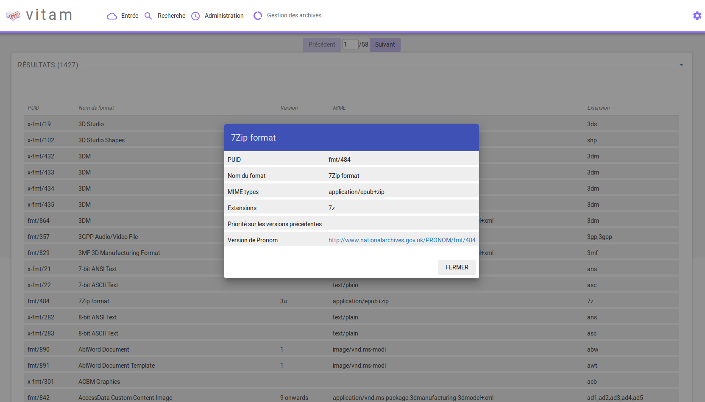

Le détail d'un format est composé des informations suivantes :

- PUID
- Intitulé
- Type MIME
- Priorité sur les versions précédentes
- Extension(s)
- Date de création
- Version de PRONOM : contient un lien renvoyant vers la fiche correspondante au format dans le référentiel des formats PRONOM sur le site des Archives nationales britanniques.

Référentiel des règles de gestion
=================================

Cette partie décrit les fonctionnalités d'import du référentiel des règles de gestion, matérialisé par un fichier CSV, permettant de le consulter et de rechercher des règles de gestion spécifiques.

Import du référentiel des règles de gestion
-------------------------------------------

Pour y accéder, l'utilisateur survole le menu "Administration", puis le sous-menu "Import des référentiels" et sélectionne "Import des règles de gestion".

.. image:: images/menu_imports.png

L'utilisateur doit au préalable créer le référentiel des règles de gestion au format CSV afin de l'importer dans Vitam.

Plusieurs critères doivent être respectés pour s'assurer de la bonne construction des règles de gestion :

- Identifiants de la règle (obligatoire et unique)
- Types de règle (Obligatoire) :

  - Durée d'utilité administrative (DUA) : AppraisalRule
  - Délai de communicabilité (DCOMM) : AccessRule
  - Durée d'utilité courante (DUC) : StorageRule
  - Délai de diffusion (DDIFF) : DisseminationRule
  - Durée de réutilisation (DREUT) : ReuseRule
  - Durée de classification (DCLASS) : ClassificationRule

- Intitulé de la règle (obligatoire)
- Durée associée à la règle (obligatoire)
- Unité de valeur associée: jours, mois, année (obligatoire)
- Description (facultatif)

Un fichier valide est un fichier respectant toutes les conditions suivantes :

- Il s'agit d'un format CSV dont la structure est bien formée
- Il possède des valeurs dont le format est correct
- Il comporte des valeurs dans tous les champs obligatoires
- Il possède des valeurs cohérentes avec les besoins métier

Le processus d'import du référentiel se décrit comme ceci :

- L'utilisateur accède à l'interface d'import du référentiel des règles de gestion et clique sur le bouton "Choisissez un fichier" pour sélectionner un fichier
- Le fichier à sélectionner est le fichier CSV précédemment décrit
- L'utilisateur valide son choix
- Le système vérifie l'intégrité et la cohérence du fichier

.. image:: images/import_rg.png

A l'issue du contrôle de cohérence et d'intégrité du fichier, deux cas sont possibles :

- En cas d'erreur : La solution logicielle Vitam détecte des erreurs contenues dans le fichier, l'import de ce dernier n'est pas possible. Un message d'erreur est alors affiché. L'utilisateur doit corriger ses erreurs et procéder à nouveau à l'import du fichier.

.. image:: images/import_ko.png

- En cas de succès : La solution logicielle Vitam indique à l'utilisateur que son fichier est valide et lui propose l'import définitif ou son annulation. Si l'utilisateur lance l'import définitif, le référentiel des règles de gestion est créé à partir des informations contenues dans le fichier CSV soumis.

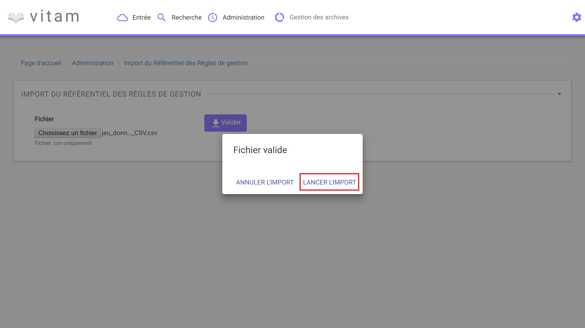

Recherche d'une règle de gestion
--------------------------------

Pour consulter et rechercher les règles de gestion, l'utilisateur survole le menu "Administration", puis le sous-menu "Référentiels" et sélectionne "Règles de gestion".

.. image:: images/menu_rg.png

Par défaut, les règles de gestion sont affichées sous le formulaire de recherche et sont classées par ordre alphabétique de leur intitulé.

Pour effectuer une recherche précise, on utilise le champ "Intitulé" et/ou le champ "Type".

NB : La recherche n'a pas besoin d'être exacte. L'utilisateur peut saisir une chaîne de caractères avec ou sans accent, des mots au singulier comme au pluriel, voir même avec une légère tolérance de faute.

Pour initier la recherche, l'utilisateur saisit ses critères de recherche et clique sur le bouton "Rechercher".
La liste du référentiel est alors actualisée avec les résultats correspondants à la recherche souhaitée.

.. image:: images/rechch_rg.png

Consultation du résultat
------------------------

Suite à la recherche, les résultats sont affichés dans un tableau comportant les informations suivantes :

- Intitulé
- Type
- Durée de la règle
- Description
- Identifiant

Les résultats sont triés par défaut par ordre alphabétique des intitulés des règles de gestion.

.. image:: images/res_rg.png

Affichage du détail d'une règle de gestion
------------------------------------------

Pour accéder au détail de chaque règle de gestion, l'utilisateur clique sur la ligne souhaitée.

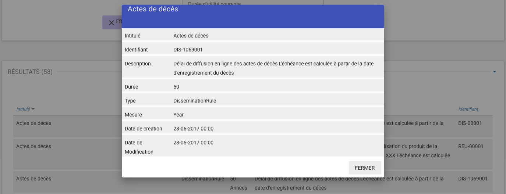

Le détail d'une règle de gestion est composé des informations suivantes :

- Intitulé
- Identifiant
- Description
- Durée
- Type
- Mesure
- Date de création de la règle, correspond à la date d'import du référentiel de règle de gestion
- Date de dernière modification

Contrats
========

Les contrats permettent de gérer les droits donnés aux utilisateurs et applications. Deux types de contrats sont disponibles dans la solution logicielle Vitam :

- Contrats d'accès
- Contrats d'entrée

Contrats d'entrée
-----------------

**Importer un contrat d'entrée**

L'import du contrat est une fonctionnalité réservée à un utilisateur ayant des droits d'administration. La structure et les valeurs des contrats sont décrites dans la documentation du modèle de données.
Pour importer un contrat d'entrée, l'utilisateur survole le menu "Administration", puis le sous-menu "Import des référentiels" et sélectionne "Import des contrats d'entrée".

.. image:: images/menu_imports.png

Il sélectionne ensuite le fichier (.json) à importer en cliquant sur "Parcourir", puis clique sur "Importer" pour lancer l'opération.

.. image:: images/import_ce.png

Une fenêtre modale s'ouvre alors pour indiquer soit :

* Que les contrats ont bien été importés
* Un échec de l'import du fichier, pouvant être causé par :
	* Le fait que les contrats mentionnés existent déjà pour le tenant
	* Le fait que le fichier est invalide (mauvais format)

Cette opération est journalisée et disponible dans le Journal des opérations.

**Rechercher un contrat d'entrée**

Pour accéder à la recherche de contrats d'entrées, l'utilisateur clique sur le menu "Administration", puis sur le sous-menu "Contrat d'entrée".

La page affiche un formulaire de recherche composé des champs suivants :

* Intitulé du contrat : permet d'effectuer une recherche approchante sur les intitulés des contrats d'entrées, disponibles dans la solution logicielle.
* Identifiant : permet d'effectuer une recherche exacte sur les identifiants des contrats.

Par défaut, la solution logicielle Vitam affiche par ordre alphabétique tous les contrats disponibles dans la liste de résultats et l'affine en fonction de la recherche effectuée. La liste des résultats est composée des colonnes suivantes :

- Intitulé
- Identifiant
- Description
- Tenant
- Statut
- Date de création
- Date de d'activation
- Date de désactivation
- Date de dernière modification

En cliquant sur une ligne, l'utilisateur ouvre le détail du contrat d'entrée dans un nouvel onglet.

.. image:: images/res_ce.png

**Détail d'un contrat d'entrée**

La page "Détail d'un contrat d'accès" contient les informations suivantes :

- Identifiant
- Intitulé
- Description
- Statut
- Date de création
- Date d'activation
- Date de mise à jour
- Date de désactivation
- Profils d'archivage
- Nœud de rattachement

.. image:: images/res_ce.png

**Modifier un contrat d'entrée**

Il est possible de modifier un contrat d'entrée en cliquant sur le bouton "Modifier" sur l'écran de détail du contrat. L'interface permet la modification d'une partie des champs du contrat, ainsi que de changer son statut (actif/inactif)
Il est possible d'ajouter ou supprimer des profils d'archivage au travers un système de tag : pour ajouter un nouveau profil, il suffit de saisir son identifiant et de valider en appuyant la touche entrée, un tag sera alors créé pour ce profil. Pour supprimer un profil, il est possible de sélectionner le tag en cliquant dessus, puis d'appuyer sur la touche supprimer du clavier. Il est également possible de cliquer directement sur la croix de suppression contenue dans le tag.

Une fois les modifications saisies, un clic sur le bouton "Sauvegarder" permet de les sauvegarder. A l'inverse, le bouton annuler permet de retourner à l'écran du détail du contrat sans appliquer les modifications.

Activation / désactivation d'un contrat

L'administrateur a la possibilité d'activer / désactiver un contrat. Un bouton permet de sélectionner le statut actif ou inactif. Un clic sur ce bouton change la valeur du statut.

Nœud de rattachement

Il est possible d'ajouter dans ce champ l'défiant (GUID) d'une unité archivistique de plan de classement ou d'arbre de positionnement. Une fois validé avec le bouton sauvegarder, les SIP qui utiliseront ce contrat d'entrée seront automatiquement rattaché à l'unité archivistique déclarée dans le nœud de rattachement.

** Utilisation des contrats d'entrée **

Chaque SIP doit être relié à un contrat d'entrée permettant de définir des conditions de versement entre le service versant et la solution logicielle Vitam.

Activation / désactivation d'un contrat

L'administrateur a la possibilité d'activer / désactiver un contrat. Un bouton permet de sélectionner le statut actif ou inactif. Un clic sur ce bouton change la valeur du statut.

Contrats d'accès
----------------

**Importer un contrat d'accès**

L'import du contrat est une fonctionnalité réservée à un utilisateur ayant des droits d'administration. La structure et les valeurs des contrats sont décrites dans la documentation du modèle de données.
Pour importer un contrat d'accès, l'utilisateur survole le menu "Administration", puis le sous-menu "Import des référentiels" et sélectionne "Import des contrats d'accès".

.. image:: images/menu_imports.png

Il sélectionne ensuite le fichier (.json) à importer en cliquant sur "Parcourir", puis clique sur "Importer" pour lancer l'opération.

.. image:: images/import_ca.png

Une fenêtre modale s'ouvre alors pour indiquer soit :

* Que les contrats ont bien été importés
* Un échec de l'import du fichier, pouvant être causé par :
	* Le fait que les contrats mentionnés existent déjà pour le tenant
	* Le fait que le fichier est invalide (mauvais format)

Cette opération est journalisée et disponible dans le Journal des Opérations.

**Rechercher un contrat d'accès**

Pour accéder à la recherche de contrats d'accès, l'utilisateur clique sur le menu "Administration", puis sur le sous-menu "Contrat d'accès".

La page affiche un formulaire de recherche composé des champs suivants :

* Intitulé du contrat : permet d'effectuer une recherche approchante sur les intitulés des contrats d'accès disponibles dans la solution logicielle Vitam.
* Identifiant : permet d'effectuer une recherche exacte sur les identifiants des contrats.

Par défaut, la solution logicielle Vitam affiche tous les contrats disponibles par ordre alphabétique dans la liste de résultats et l'affine en fonction de la recherche effectuée. La liste des résultats est composée des colonnes suivantes :

- Intitulé
- Identifiant
- Description
- Tenant
- Statut
- Date de création

En cliquant sur une ligne, l'utilisateur ouvre le détail du contrat d'accès dans un nouvel onglet.

.. image:: images/rechch_ca.png

**Détail d'un contrat d'accès**

La page "Détail d'un contrat d'accès" contient les informations suivantes :

- Identifiant
- Nom
- Description
- Statut
- Service producteur
- Date de création
- Date d'activation
- Date de mise à jour
- Date de désactivation
- Droit d'écriture
- Usage
- Nœuds de consultation

.. image:: images/detail_ca.png

**Modifier un contrat d'accès**

Il est possible de modifier un contrat d'accès en cliquant sur le bouton "Modifier" sur l'écran de détail d'un contrat d'accès. L'interface permet la modification d'une partie des champs du contrat, ainsi que de changer ses différents statuts (actif/inactif, droit d'écriture, listes blanches...).
Il est possible d'ajouter ou supprimer des services producteurs au travers un système de tag : pour ajouter un nouveau producteur, il suffit de saisir son intitulé et de valider en appuyant la touche entrée, un tag sera alors créé pour ce nom. Pour supprimer un producteur, il est possible de sélectionner le tag en cliquant dessus, puis d'appuyer sur la touche supprimer du clavier. Il est également possible de cliquer directement sur la croix de suppression contenue dans le tag.

Une fois les modifications saisies, un clic sur le bouton "Sauvegarder" permet de les sauvegarder. A l'inverse, le bouton annuler permet de retourner à l'écran du détail du contrat sans appliquer les modifications.

** Utilisation des contrats d'accès **

Chaque profil utilisateur peut être relié à un ou plusieurs contrats, qui restreignent totalement, de manière partielle ou autorisent pleinement l'accès et/ou la modification d'une archive.

Sélection d'un contrat

Pour accéder à un contrat spécifique, l'utilisateur peut choisir dans le menu déroulant en haut à droite le contrat concerné.
Une fois sélectionné, il peut opérer sa recherche d'archive. NB : les contrats du menu déroulant sont les contrats actifs pour l'utilisateur, les contrats inactifs ne sont pas listés.

Autorisation d'écriture au sein d'une archive

L'utilisateur peut écrire et modifier les métadonnées d'une unité archivistique si le contrat activé l'autorise.

Activation / désactivation d'un contrat

L'administrateur a la possibilité d'activer / désactiver un contrat. Un bouton permet de sélectionner le statut actif ou inactif. Un clic sur ce bouton change la valeur du statut.

Restriction d'accès par service producteur

Un contrat peut interdire l'accès à tous ou certains services producteurs d'objets inclus dans une liste blanche. . Deux options sont disponibles :

 - accès à tous les services producteurs en cliquant sur le bouton "Tous les services producteurs"
 - accès à une sélection de services producteurs en cliquant sur le bouton "Liste blanche uniquement"

Restriction d'accès par usage de l'objet

Un contrat peut autoriser l'accès à tous ou certains usages d'objets inclus dans une liste blanche. (Ex. : l'utilisateur peut accéder aux usages de diffusion mais pas à la source de l'objet). Deux options sont disponibles:

 - accès à tous les services producteurs en cliquant sur le bouton "Tous les usages"
 - accès à une sélection de services producteurs en cliquant sur le bouton "Liste blanche uniquement"

 .. image:: images/CONTRACTS_acces_contract_update.png

Restriction par nœud de consultation

Un contrat peut restreindre l'accès aux unités archivistiques listées en tant que nœuds de consultation ainsi qu'à leurs enfants. Chaque unités archivistiques renseignée est identifiée par son identifiant. Si aucune unité archivistique n'y est renseignée, alors l'accès du détenteur du contrat n'est pas restreint à des nœuds de consultation.

Contexte
========

Import d'un contexte
--------------------

L'import du contexte est une fonctionnalité réservée à un utilisateur ayant des droits d'administration. La structure et les valeurs des contextes sont décrites dans la documentation du modèle de données.

Pour importer un contexte, l'utilisateur clique sur le menu "Administration"  puis le sous-menu "Import de référentiels" et sélectionne "Import des contextes applicatifs".

.. image:: images/menu_imports.png

Il sélectionne ensuite le fichier (.json) à importer en cliquant sur "Parcourir", puis clique sur "Importer" pour lancer l'opération.

.. image:: images/import_contextes.png

Une fenêtre modale s'ouvre alors pour indiquer soit :

* Que les contextes ont bien été importés
* Un échec de l'import du fichier, pouvant être causé par :
	* Le fait que le contexte existe déjà dans le système
	* Le fait que le fichier est invalide (mauvais format)
    * Le fait que le contexte déclare des contrats d'entrée ou des contrats d'accès qui n'existent pas dans les référentiels des contrats de leur tenant.

Cette opération est journalisée et disponible dans le Journal des Opérations.

Contextes applicatifs
----------------------

Pour consulter et rechercher les contextes applicatifs, l'utilisateur survole le menu "Administration", puis le sous-menu "Référentiels" et sélectionne "Contextes applicatifs".

La page affiche un formulaire de recherche composé des champs suivants :

- Intitulé du contexte : permet d’effectuer une recherche approchante sur les noms des contextes applicatifs disponibles dans la solution logicielle Vitam.
- Identifiant : permet d’effectuer une recherche exacte sur les identifiants des contextes applicatifs.

Par défaut, la solution logicielle Vitam affiche tous les contextes disponibles dans la liste de résultats et l’affine en fonction de la recherche effectuée. La liste des résultats est composée des colonnes suivantes :

- Intitulé
- Identifiant
- Statut
- Contrat d'accès
- Contrat d'entrée
- Date de création
- Dernière modification

Il est possible d'afficher également des colonnes additionnelles :

* GUID

En cliquant sur une ligne, l’utilisateur affiche le détail du contexte applicatif.

.. image:: images/rechch_contextes.png

Consulter le détail d'un contexte
---------------------------------

La page "Détail du contexte applicatif" contient les informations suivantes :

- Identifiant
- Intitulé
- Description
- Statut
- Date de création
- Dernière modification
- Date de d'activation
- Date de désactivation
- Permissions

Puis, un bloc par tenant. Chaque bloc contenant :

* L'intitulé du tenant
* La liste des contrats d'accès associés à ce tenant
* La liste des contrats d'entrée associés à ce tenant

.. image:: images/detail_contexte.png

Modifier un contexte applicatif
--------------------------------

Il est possible de modifier un contexte applicatif depuis son l'écran de son détail en cliquant sur le bouton "Modifier" sur l'écran de détail d'un contexte. L'interface permet la modification d'une partie des champs du contexte, ainsi que de changer son statut (actif/inactif).
Il est possible d'ajouter ou supprimer des tenants concernés par le contexte en sélectionnant un identifiant de tenant en haut à droite et en cliquant sur "Ajouter". Il est impossible d'ajouter un tenant qui se trouve déjà dans la liste des tenants de ce contexte.
Pour supprimer un tenant, il suffit de cliquer sur le bouton supprimer correspondant au tenant à retirer, et de valider cette suppression en utilisant le bouton "enregistrer".
Au sein de chacun de ces tenant, il est possible d'ajouter ou supprimer des contrats d'accès ou d'entrée au travers un système de tag : pour ajouter un nouveau contrat, il suffit de saisir son identifiant et de valider avec la touche entrée, un tag sera alors créé pour ce contrat. Pour supprimer un contrat, il est possible de sélectionner le tag en cliquant dessus, puis d'appuyer sur la touche supprimer du clavier. Il est également possible de cliquer directement sur la croix de suppression contenue dans le tag.

Pour valider les modifications du contexte, il est nécessaire de cliquer sur le bouton "Enregistrer". A l'inverse, le bouton annuler permet de retourner à l'écran du détail du contrat sans appliquer les modifications.

Profils d'archivage
===================

Accès aux menus de gestion des profils d'archivage
--------------------------------------------------

Pour consulter les profils d'archivage, l'utilisateur survole le menu "Administration", puis le sous-menu "Référentiels" et sélectionne "Profils d'archivage".

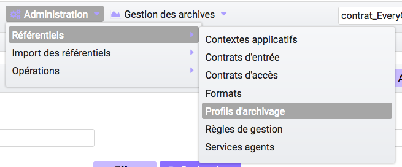

Importer un profil d'archivage
------------------------------

Pour importer un profil d'archivage, l'utilisateur survole le menu "Administration", puis le sous-menu "Import de référentiels" et sélectionne "Import des profils d'archivage".

Les profils d'archivage sont des fichiers JSON constitués des champs suivants :

- Name : intitulé du profil d'archivage (obligatoire)
- Description : description du profil d'archivage (obligatoire)
- Statut : statut du profil d'archivage (ACTIVE ou INACTIVE)
- Format : format attendu pour le profil SEDA (XSD ou RNG)
- Date de de création
- Date de d'activation
- Date de désactivation
- Dernière modification

Pour importer un profil d'archivage, l'utilisateur sélectionne ensuite le fichier à importer en cliquant sur “Parcourir”, puis clique sur “Importer” pour lancer l’opération.

.. image:: images/import_profils.png

Une fenêtre modale indique alors soit :

* Les contrats ont bien été importés
* Échec de l’import du fichier, pouvant être causé par :
	* le fait que le(s) profil(s) d'archivage mentionné(s) existe(nt) déjà pour le tenant
	* le fait que le fichier est invalide (mauvais format)

Cette opération est journalisée et disponible dans le Journal des opérations.

Rechercher un profil d'archivage
--------------------------------

Pour accéder à la recherche de profils d'archivage, l'utilisateur survole le menu "Administration", puis le sous-menu "Référentiels" et sélectionne "Profils d'archivage".

La page affiche un formulaire de recherche composé des champs suivants :

- Intitulé du profil : permet d’effectuer une recherche approchante sur les noms des profils d'archivage disponibles dans la solution logicielle Vitam.
- Identifiant : permet d’effectuer une recherche exacte sur les identifiants des profils d'archivage.

Par défaut, la solution logicielle Vitam affiche tous les profils d'archivage disponibles dans la liste de résultats et l’affine en fonction de la recherche effectuée. La liste des résultats est composée des colonnes suivantes :

- Intitulé
- Identifiant
- Statut
- Date de de création
- Dernière modification
- Profil

En cliquant sur une ligne, l’utilisateur affiche le détail du profil d'archivage.

Lorsqu'un profil SEDA de règle a été associé au profil, une flèche indiquant la possibilité de le télécharger apparaît. L'utilisateur peut lancer le téléchargement en cliquant dessus.

.. image:: images/rechch_profil.png

Consulter le détail d'un profil d'archivage
-------------------------------------------

La page "Détail d'un profil d'archivage" contient les informations suivantes :

- Identifiant
- Intitulé
- Description
- Fichier
- Format
- Statut
- Date de création
- Dernière modification
- Tenant(s)
- Date de d'activation
- Date de désactivation

.. image:: images/detail_profil.png

Associer un fichier de règles à un profil d'archivage
-----------------------------------------------------

Pour importer un profil SEDA de règles à associer à un profil d'archivage, l'utilisateur clique sur le bouton "Parcourir" à côté du champ "Fichier" puis clique sur "Importer". Le format du fichier doit correspondre au format attendu, indiqué dans le champ format.

A la fin de l'opération d'import, une fenêtre modale indique un des deux messages suivants :

- Le profil a bien été importé
- Echec de l'import du fichier

L'opération est journalisée et disponible depuis l'écran de consultation du journal des opérations.

En cas de succès de l'import du profil SEDA de règle, la date de mise à jour du profil est ajustée en conséquence. Si l'utilisateur importe un profil SEDA alors qu'un autre profil SEDA a déjà été importé, alors le nouveau fichier remplace l'ancien.

Import d'un arbre de positionnement
===================================

Pour importer un arbre de positionnement, l'utilisateur survole le menu "Administration", puis le sous-menu "Import de référentiels" et sélectionne "Arbre de positionnement".

.. image:: images/menu_import_arbre.png

Une fois celui-ci sélectionné, il apparaît sur l'écran "Import de l'arbre de positionnement". Le nom du fichier s'affiche à droite du bouton "choisissez un fichier" et une nouvelle ligne apparaît en dessous avec le nom du fichier, sa taille ainsi qu'un champ statut pour l'instant vide.

Deux listes déroulantes sont présentes sur l'écran :

- Mode d'exécution : l'utilisateur a le choix entre le mode d'exécution "pas à pas" permettant de passer d'une étape à une autre dans le processus d'entrée, et le mode d'exécution "continu" permettant de lancer le processus d'entrée dans sa globalité en une seule fois. Dans la grande majorité des cas, le mode d'exécution "continu" sera le choix adopté.

- Destination : l'utilisateur peut indiquer la destination de l'arbre. Actuellement, seule l'option "production", pour importer directement l'arbre, est disponible.

Le mode d'exécution et la destination sont obligatoires.

Pour lancer le transfert de l'arbre, l’utilisateur clique sur le bouton « Parcourir ».

Les informations visibles à l'écran sont :

- Un tableau comportant les champs suivants :

  - Nom du fichier,
  - Taille : Affiche la taille de l'arbre en Ko, Mo ou Go en fonction de la taille arrondie au dixième près,
  - Statut (succès, erreur ou avertissement)

- Une barre de progression affiche l’avancement du téléchargement de l'arbre dans Vitam (une barre de progression complète signifie que le téléchargement est achevé).

NB : Suite au téléchargement de l'arbre, un temps d'attente est nécessaire, correspondant au traitement de l'arbre par le système avant affichage du statut final. Dans ce cas, une roue de chargement est affichée au niveau du statut.

.. image:: images/import_arbre.png

Si l'utilisateur tente d'importer un arbre au format non conforme (s'il ne s'agit pas des formats ZIP, TAR, TAR.GZ, TAR.BZ2) alors le système empêche le téléchargement.
Une fenêtre pop-up s'ouvre indiquant les formats autorisés.

Toute opération d'entrée (succès, avertissement et échec) fait l'objet d'une écriture dans le journal des opérations et génère une notification qui est proposée en téléchargement à l'utilisateur.

Cette notification ou ArchiveTransferReply (ATR) est au format XML conforme au schéma SEDA 2.0.
Lors d'une entrée en succès dans la solution logicielle Vitam, l'ATR comprend les informations suivantes :

- Date : date d'émission de l'ATR
- MessageIdentifier : identifiant de l'ATR. Cet identifiant correspond à l'identification attribué à la demande de transfert par la solution logicielle Vitam
- ArchivalAgreement : contrat d'entrée
- CodeListVesion : la liste des référentiels utilisés
- La liste des Unités Archivistiques avec l'identifiant fourni dans la demande de transfert et l'identifiant généré par la solution logicielle Vitam (SystemId)
- ReplyCode : statut final de l'entrée
- GrantDate : date de prise en charge de l'arbre
- MessageIdentifierRequest : identifiant de la demande de transfert
- ArchivalAgency : service d'archives
- TransferingAgency: service producteur

Lors d'une entrée en avertissement, l'ATR contient les mêmes informations que l'ATR en succès et le ReplyCode est "WARNING". Actuellement, il n'est pas possible de connaître la cause de l'avertissement.

En cas de rejet de l'entrée, l'ATR contient les mêmes informations que l'ATR en succès ainsi que la liste des problèmes rencontrés :

- Outcome : statut de l'étape ou de la tâche ayant rencontré au moins une erreur
- OutcomeDetail : code interne à la solution logicielle Vitam correspondant à l'erreur rencontrée
- OutcomeDetailMessage : message d'erreur

La notification comprend ensuite la liste des erreurs rencontrées (échecs ou avertissement), au niveau des unités archivistiques sous la forme de blocs <event>.

Gestion des opérations
======================

Cette partie décrit les fonctionnalités de la page “Gestion des opérations”. Elle permet de suivre l’évolution des opérations d’entrée et d’utiliser le mode pas à pas.

Recherche d'une opération
-------------------------

Pour accéder à la page de recherche d'une opération, l'utilisateur survole le menu "Administration", puis le sous-menu "Opérations" et sélectionne "Gestion des opérations".

La page affiche un formulaire de recherche composé des champs suivants :

- Identifiant : identifiant unique de l’opération d’entrée
- Catégorie : indique le type d’opération d’entrée
- Statut : statut actuel de l'opération
- Etats : état actuel de l'opération
- Dernière étape : dernière étape à laquelle le workflow s'est arrêté
- Dates extrêmes : date de début et date de fin de l'opération

NB : Il est impossible d'effectuer une recherche croisée par Identifiant et tout autre champ.

Pour initier la recherche, l'utilisateur saisit ses critères de recherche et clique sur le bouton "Rechercher".

.. image:: images/rechch_gestion.png

Affichage des résultats
-----------------------

Par défaut, la solution logicielle Vitam affiche toutes les opérations non terminées dans la liste de résultats et l’affine en fonction de la recherche effectuée. La liste des résultats est composée des colonnes suivantes :

* Identifiant de l’opération : identifiant unique de l’opération d’entrée
* Catégorie de l’opération : indique le type d’opération d’entrée :
	* INGEST : indique une opération d’entrée normale
	* INGEST_TEST : indique une opération d’entrée en test à blanc
* Date de l’entrée : date à laquelle l’entrée a été soumise à la solution logicielle Vitam
* Mode d’exécution : indique le mode d’exécution choisi. Celui-ci peut-être
	* Continu
	* Pas à pas
* Etat : indique l'état actuel de l'opération
    * Pause
    * En cours
    * Terminé
* Statut : indique le statut actuel de l'opération
    * Succès
    * Echec
    * Avertissement
    * Erreur
* Précédente étape du workflow / étape en cours
* Prochaine étape du workflow
* Actions : Contient des boutons d’action permettant d’interagir avec l'entrée réalisée en mode d’exécution pas à pas.

Les opérations d’entrée sont classées par ordre ante chronologique selon leur date d'entrée.

Seules les opérations en cours de traitement sont affichées sur cet écran.

.. image:: images/res_gestion.png

Utilisation du mode pas à pas
-----------------------------

Lorsque l’entrée est réalisée en mode d’exécution pas à pas, l’utilisateur doit alors utiliser les boutons d’actions disponibles afin de faire avancer son traitement.
Les boutons disponibles sont :

- Suivant : permet de passer à l’étape suivante du workflow - lorsqu’une étape est terminée, il faut cliquer sur “suivant” pour continuer l’entrée
- Pause : permet de mettre l’opération d’entrée en pause
- Relay : permet de rejouer l'étape dernièrement exécutée du workflow - lorsque cette étape est terminée, il faut cliquer sur “suivant” pour continuer l’entrée
- Reprise : permet de reprendre une entrée en pause
- Arrêt : permet d’arrêter complètement une opération d’entrée. Elle passera alors en statut “terminée” et il sera impossible de la redémarrer

Recherche et vérification des opérations de sécurisation
========================================================

La sécurisation des journaux permet de garantir la valeur probante des archives prises en charge dans la solution logicielle Vitam.

Le fichier produit par une opération de sécurisation des journaux est appelé un "journal sécurisé".

Les administrateurs ont la possibilité d'accéder aux fonctionnalités suivantes :

- Recherche de journaux sécurisés
- Consultation du détail d'un journal sécurisé
- Vérification de l'intégrité d'un journal sécurisé

Rechercher des journaux sécurisés
---------------------------------

Pour accéder à la page de “Opérations de sécurisation”, l'utilisateur survole le menu "Administration", puis le sous-menu "Opérations" et sélectionne "Journaux sécurisés".

L’interface est constituée de trois éléments :

- Un formulaire
- Une pagination
- Une zone d’affichage des résultats

**Utilisation du formulaire**

Le formulaire est composé des champs suivants :

* Identifiant de l’objet : identifiant du fichier recherché
* Dates extrêmes : intervalle de dates permettant de rechercher sur les dates du premier et du dernier journal pris en compte dans l'opération de sécurisation
* Type de journal sécurisé : liste déroulante permettant de sélectionner le type de journal sécurisé à afficher.

Les types de journaux sont :

- Journal des opérations
- Cycle de Vie des unités archivistiques
- Cycle de Vie des groupes d'objets
- Journal des écritures

.. image:: images/rechch_secu.png

**Lancer une recherche**

Par défaut, aucun résultat n'est affiché. Il faut lancer une recherche pour faire apparaître des résultats.

Pour lancer une recherche en prenant en compte un intervalle de dates, cliquer sur le bouton "Rechercher" après l'avoir renseigné dans les champs Dates extrêmes.

Si l'utilisateur clique sur le bouton "Rechercher" sans sélectionner de date, alors tous les journaux disponibles s'affichent.

**Affichage des résultats**

La zone de résultats est composée des colonnes suivantes :

- Type de journal sécurisé : affiche le type de journal sécurisé
- Date de début : indique la date de début de l’opération de sécurisation
- Date de fin : indique la date de fin de l’opération de sécurisation
- Télécharger : icône permettant de télécharger le journal sécurisé

.. image:: images/res_secu.png

**Téléchargement d'un journal**

Chaque ligne représentant un journal comporte un symbole de téléchargement. En cliquant sur ce symbole, le journal est téléchargé sous forme de zip. Le nom de ce fichier correspond à la valeur du champ FileName du dernier event du journal de l'opération.

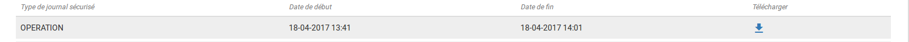

Détail d'un journal sécurisé
----------------------------

En cliquant sur une ligne de la liste de résultats, l'interface de la solution logicielle VITAM affiche le détail du journal concerné.

Le détail est composé des éléments suivants :

* Détail sur le journal sécurisé, contient les 6 informations
	* Date de début : date du premier journal pris en compte dans l'opération de sécurisation
	* Date de fin : date du dernier journal pris en compte dans l'opération de sécurisation
	* Nombre d'opérations : il s'agit du nombre de journaux pris en compte dans l'opération de sécurisation
	* Algorithme de hashage : indique l'algorithme utilisé
	* Nom du fichier : nom du journal sécurisé
	* Taille du fichier : taille du journal sécurisé
    * Date du tampon d'horodatage
    * CA signataire : l'autorité de certification
    * Hash de l'arbre de Merkle

Vérification d'un journal sécurisé
----------------------------------

En cliquant sur le bouton "Lancer la vérification", la solution logicielle Vitam vérifie que les informations de l'arbre de hashage sont à la fois conformes au contenu du journal sécurisé et aux journaux disponibles dans la solution logicielle Vitam.

Une fois l'opération terminée, son détail est affiché. Il est également disponible dans le Journal des opérations.

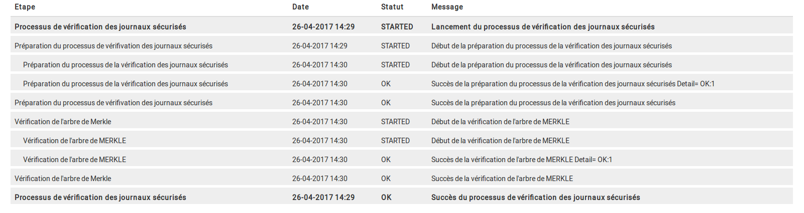

Le bouton "Télécharger" permet d'obtenir le journal sécurisé.

