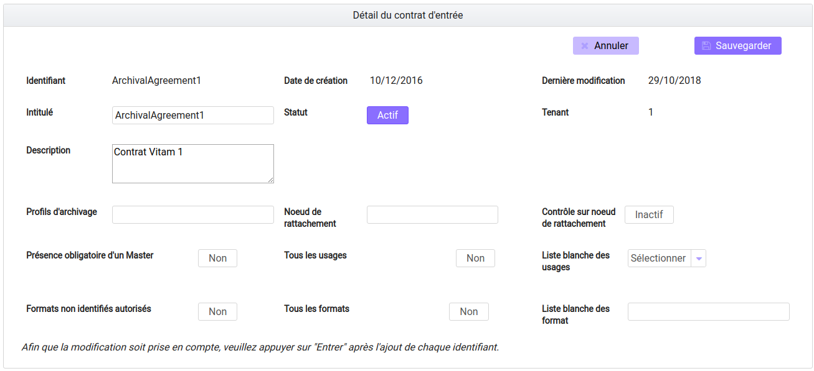
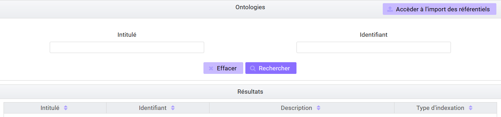
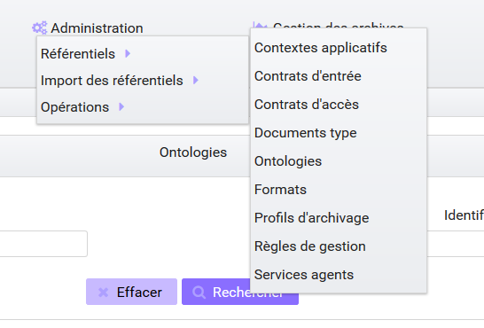
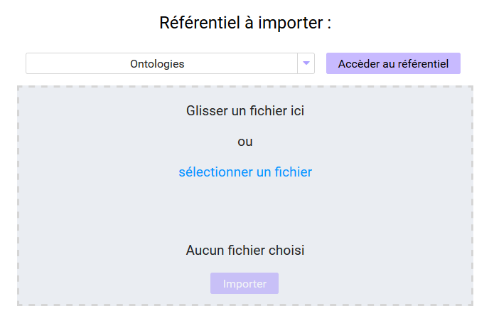

Administration
##############

Cette partie décrit les fonctionnalités d'administration proposées à l'utilisateur ayant un rôle d'administrateur :

- Consultation des référentiels (contextes applicatifs, contrats d'entrée, contrats d'accès, formats, profils d'archivage, règles de gestion et services agents, documents types et ontologie)
- Import des référentiels (arbre de positionnement, contrats d'entrée, contrats d'accès, profils d'archivage, règles de gestion, services agents et profil d'unités archivistiques)
- Consultation et suivi des opérations et des opérations de sécurisation

La plupart des fonctionnalités d'administration sont accessibles avec un compte d'administrateur sur tous les tenants. Les référentiels trans-tenants font exceptions à cette règle et ne peuvent être gérés que depuis le tenant d'administration (référentiel des formats par exemple).

Fonctionnalités présentes sur tous les tenants
++++++++++++++++++++++++++++++++++++++++++++++

Référentiel des formats
=======================

Cette partie décrit les fonctionnalités de consultation du référentiel recensant les  formats des archives pouvant être transférées à la solution logicielle Vitam (basé sur une version récente du référentiel des formats PRONOM mis à disposition par les Archives nationales britanniques).

Import du référentiel des formats
---------------------------------

Ce référentiel étant trans-tenant, cette fonctionnalité n'est présente que pour le tenant d'administration. Voir paragraphe : "Fonctionnalités présentes sur le tenant d'administration uniquement"

Recherche d'un format
---------------------

La recherche d'un format dans le référentiel des formats s'effectue depuis l'écran "Formats". Pour y accéder, l'utilisateur clique le menu "Administration", puis le sous-menu "Référentiels" et sélectionne "Formats".

.. image:: images/menu_formats.png

Par défaut, les formats sont affichés sous le formulaire de recherche.

La page affiche un formulaire de recherche composé des champs suivants :

-Intitulé  : permet d'effectuer une recherche approchante sur les intitulés des formats disponibles dans la solution logicielle Vitam
La recherche par intitulé peut être approximative : chaîne de caractères avec ou sans accent, mots au singulier comme au pluriel, voire une légère tolérance de faute.

-PUID (identifiant unique du format dans PRONOM) : permet d'effectuer une recherche exacte sur l'identifiant d'un format

.. note:: Il est impossible d'effectuer une recherche croisée par PUID et intitulé

.. image:: images/rechch_formats.png

Pour initier la recherche, l'utilisateur saisit ses critères de recherche et clique sur le bouton "Rechercher". La liste du référentiel est alors actualisée avec les résultats correspondants à la recherche souhaitée. Suite à la recherche, les résultats sont affichés dans un tableau comportant les informations suivantes :

- PUID : identifiant unique du format
- Intitulé du format
- Version : version du format
- MIME : Identifiant de format de données (Type MIME)
- Extension(s)

|

.. image:: images/res_formats.png

Détail d'un format
--------------------

Pour accéder au détail d'un format, l'utilisateur clique sur la ligne souhaitée.

|

    .. image:: images/detail_format.png

Le détail d'un format est composé des informations suivantes :

- PUID
- Intitulé
- Type MIME
- Priorité sur les versions précédentes
- Extension(s)
- Date de création
- Version de PRONOM : contient un lien renvoyant vers la fiche correspondante au format dans le référentiel des formats PRONOM sur le site des Archives nationales britanniques.

Référentiel des règles de gestion
=================================

Cette partie décrit les fonctionnalités d'import et de recherche du référentiel des règles de gestion. Ce référentiel recense les règles utilisables dans la solution logicielle Vitam pour gérer le cycle de vie des archives. L'import de ce référentiel n'est valable que pour le tenant sélectionné.
Pour plus de détails se référer à la documentation "Règles de gestion".

Import du référentiel des règles de gestion
-------------------------------------------

L'import des règles de gestion est une fonctionnalité réservée à un utilisateur ayant des droits d'administration. La structure et les valeurs des règles de gestion sont décrites dans la documentation du modèle de données.

Pour accéder à la page d'import, l'utilisateur clique sur le menu "Administration", puis le sous-menu "Import des référentiels" et sélectionne "Import des règles de gestion".

.. image:: images/menu_imports.png

L'utilisateur doit au préalable créer le référentiel des règles de gestion au format CSV afin de l'importer dans Vitam. Plusieurs critères doivent être respectés pour s'assurer de la bonne construction du référentiel des règles de gestion :

- Identifiants de la règle (obligatoire et unique)
- Types de règle (obligatoire)
- Intitulé de la règle (obligatoire)
- Durée associée à la règle (obligatoire)
- Unité de valeur associée: jours, mois, année (obligatoire)

Un fichier valide est un fichier respectant toutes les conditions suivantes :

- Format CSV
- Valeurs dont le format est correct
- Tous les champs obligatoires ont des valeurs
- Valeurs cohérentes avec les besoins métier

Pour importer un référentiel de règles de gestion, l'administrateur :

- Sélectionne le fichier CSV précédemment décrit
- Accède à l'interface d'import du référentiel des règles de gestion et clique sur le bouton "sélectionner un fichier" ou fait glisser le fichier sur l'espace de téléchargement
- Clique sur le bouton "Importer"

|

.. image:: images/import_rg.png
   :scale: 50

Une fenêtre modale s'ouvre alors pour indiquer soit :

- Que le référentiel a bien été importé
- Que l'import du fichier est en échec (fichier au mauvais format, valeurs obligatoires non renseignées, etc)

Cette opération est journalisée et disponible dans le Journal des opérations.

Recherche d'une règle de gestion
--------------------------------

Pour rechercher et consulter les règles de gestion, l'utilisateur clique sur le menu "Administration", puis le sous-menu "Référentiels" et sélectionne "Règles de gestion".

|

.. image:: images/menu_rg.png

Par défaut, les règles de gestion sont affichées sous le formulaire de recherche et sont classées par ordre alphabétique de leur intitulé.

Pour effectuer une recherche précise, on utilise le champ "Intitulé" ou le champ "Type".

.. note::  La recherche par intitulé peut être approximative : chaîne de caractères avec ou sans accent, mots au singulier comme au pluriel, voire une légère tolérance de faute.

|

.. image:: images/rechch_rg.png

Pour initier la recherche, l'utilisateur saisit ses critères de recherche et clique sur le bouton "Rechercher". La liste du référentiel est alors actualisée avec les résultats correspondant à la recherche souhaitée. Suite à la recherche, les résultats sont affichés dans un tableau comportant les informations suivantes :

- Intitulé
- Type
- Durée de la règle
- Description
- Identifiant

.. image:: images/res_rg.png

Détail d'une règle de gestion
-------------------------------

Pour accéder au détail de chaque règle de gestion, l'utilisateur clique sur la ligne souhaitée.

.. image:: images/detail_rg.png

Le détail d'une règle de gestion est composé des informations suivantes :

- Identifiant
- Type
- Intitulé
- Description
- Durée
- Mesure
- Date de création de la règle (correspond à la date d'import du référentiel de règle de gestion)
- Date de dernière modification

Modification d'une règle de gestion
-----------------------------------

Il est ensuite possible de modifier ou mettre à jour ce référentiel, en important un nouveau référentiel complet. Les cas suivants sont possibles :

• échec de la mise à jour si celle-ci a demandé la suppression d’une règle déjà utilisée ;
• succès avec avertissement de la mise à jour si celle-ci a demandé la modification d’une règle déjà utilisée.

NOTE: le dernier fichier enregistré est disponible à l'export en format CSV via le bouton "Exporter le référentiel"

.. image:: images/reglesgestion_export.png

Référentiel des services agents
===============================

Cette partie décrit les fonctionnalités d’import et de consultation du référentiel des services agents.
Ce référentiel interne à la solution logicielle Vitam, décrit les services (services producteurs ou services versants), déclarés par les administrateurs de la solution logicielle Vitam, pouvant mener des actions en entrée et en accès.

Import du référentiel des services agents
-----------------------------------------

L’import des services agents est une fonctionnalité réservée à un utilisateur ayant des droits d’administration.
Pour accéder à la page d'import, l’utilisateur clique sur le menu « Administration », puis le sous-menu « Import des référentiels » et sélectionne « Import des services agents ».

.. image:: images/menu_services_agents.png

L’utilisateur doit au préalable créer le référentiel des services agents au format CSV afin de l’importer dans Vitam.

Le référentiel doit comporter les champs suivants :

* Identifier : Identifiant du service (Cet identifiant ne doit pas comprendre d’espace ou de caractère accentué)
* Name : Nom du service
* Description : Description du service

Le processus d’import du référentiel se déroule comme ceci :

* Accéder à l’interface d’import du référentiel des services agents
* Cliquer sur le bouton « sélectionner un fichier » ou faire glisser le fichier sur l’espace de téléchargement
* Sélectionner le fichier CSV
* Cliquer sur le bouton «Importer»

Une fenêtre modale s'ouvre alors pour indiquer soit :

- Que le référentiel a bien été importé
- Que l'import du fichier est en échec (fichier au mauvais format, valeurs obligatoires non renseignées, etc)

Cette opération est journalisée et disponible dans le Journal des opérations.

Recherche d’un service agents
-----------------------------

Pour consulter et rechercher les services agents, l’utilisateur clique sur le menu « Administration », puis le sous-menu « Référentiels » et sélectionne « Services agents ».

.. image:: images/menu_services_agents_3.png

Par défaut, les  services agents sont affichés sous le formulaire de recherche et sont classées par ordre alphabétique de leur intitulé.
Pour effectuer une recherche précise, on utilise les champs « Intitulé », « Identifiant » et/ou « Description »

.. note:: La recherche par intitulé peut être approximative : chaîne de caractères avec ou sans accent, mots au singulier comme au pluriel, voire une légère tolérance de faute.

.. image:: images/menu_services_agents_4.png

Pour initier la recherche, l’utilisateur saisit ses critères de recherche et clique sur le bouton « Rechercher ». La liste du référentiel est alors actualisée avec les résultats correspondants à la recherche souhaitée. Suite à la recherche, les résultats sont affichés dans un tableau comportant les informations suivantes :
« Intitulé », « Description », « Identifiant »

.. image:: images/menu_services_agents_5.png

Détail d’un service agent
--------------------------

Pour accéder au détail de chaque service agent, l’utilisateur clique sur la ligne souhaitée.

.. image:: images/menu_services_agents_6.png

Le détail d’un service agent est composé des informations suivantes : « Identifiant », « Intitulé », « Description »

Cette page de détail permet également d’accéder le cas échéant au registre des fonds de ce service agent, si ce dernier a déjà effectué un versement

Pour plus de détail sur le registre des fonds, se référer à la parte "Consultation du registre des fonds"

NOTE: la dernière version du référentiel est disponible à l'export au format CSV via le bouton "Exporter le référentiel"

.. image:: images/serviceagent_export.png

Modification d'un service agent
-----------------------------------

Il est possible de modifier ou mettre à jour le référentiel des services agent, en important un nouveau référentiel complet. Les cas suivants sont possibles :

• échec de la mise à jour si celle-ci a demandé la suppression d'un service agent déjà utilisé
• succès lorsqu'il n'y a aucun conflit

Contrats d'entrée
==================

Les contrats d'entrée permettent de gérer les droits donnés aux utilisateurs et applications de réaliser des transferts d'archives dans la solution logicielle Vitam. Le contrat est matérialisé par un fichier JSON.
Pour plus de détail se référer à la documentation "Gestion des habilitations".

Import de contrats d'entrée
---------------------------

L'import d'un contrat est une fonctionnalité réservée à un utilisateur ayant des droits d'administration. Cette opération n'est valable que pour le tenant sélectionné. L'utilisateur construit au préalable son contrat d'entrée au format JSON. La structure et les valeurs des contrats sont décrites dans la documentation du "Modèle de données".

Pour importer un contrat d'entrée, l'utilisateur clique sur le menu "Administration", puis le sous-menu "Import des référentiels" et sélectionne "Import des contrats d'entrée".

.. image:: images/menu_import_entree.png
   :scale: 40

Plusieurs critères doivent être respectés pour s'assurer de la bonne construction du fichier :

- Nom (obligatoire)
- Description (obligatoire)
- Statut (facultatif) : si aucun statut n'est défini, le contrat sera inactif par défaut

L'utilisateur sélectionne le fichier (.json) à importer en cliquant sur "sélectionner un fichier" ou en le faisant glisser sur l'espace de téléchargement, puis clique sur "Importer" pour lancer l'opération.

.. image:: images/import_ce.png
   :scale: 40

Une fenêtre modale s'ouvre alors pour indiquer soit :

    - Que le référentiel a bien été importé
    - Que l'import du fichier est en échec (fichier au mauvais format, identifiant du contrat déjà existant, etc)

Cette opération est journalisée et disponible dans le Journal des opérations.

Recherche d'un contrat d'entrée
-------------------------------

Pour consulter et rechercher les contrats d'entrée, l'utilisateur clique sur le menu "Administration", puis le sous-menu "Référentiels" et sélectionne "Contrats d'entrée".

.. image:: images/menu_ce.png

Par défaut, les contrats d'entrée sont affichés sous le formulaire de recherche et sont classés par ordre alphabétique de leur intitulé.

La page affiche un formulaire de recherche composé des champs suivants :

- Intitulé : permet d'effectuer une recherche approchante sur les intitulés des contrats d'entrée disponibles dans la solution logicielle
- Identifiant : permet d'effectuer une recherche exacte sur l'identifiant d'un contrat

.. note:: Il est impossible d'effectuer une recherche croisée entre identifiant et intitulé. La recherche par intitulé peut être approximative : chaîne de caractères avec ou sans accent, mots au singulier comme au pluriel, voire une légère tolérance de faute.

.. image:: images/rechch_ce.png

Pour initier la recherche, l'utilisateur saisit ses critères de recherche et clique sur le bouton "Rechercher". La liste du référentiel est alors actualisée avec les résultats correspondants à la recherche souhaitée. Suite à la recherche, le résultat est affiché sous forme de tableau, comportant les informations suivantes :

- Intitulé
- Identifiant
- Tenant
- Statut
- Date de création
- Dernière modification

.. image:: images/res_ce.png

Détail d'un contrat d'entrée
-----------------------------

Pour accéder au détail d'un contrat, l'utilisateur clique sur la ligne souhaitée. La page "Détail d'un contrat d'entrée" contient les informations suivantes :

    * Identifiant
    * Intitulé
    * Description
    * Statut
    * Date de création
    * Date de dernière modification
    * Profils d'archivage
    * Nœud de rattachement
    * Contrôle sur noeud de rattachement
    * Tenant
    * Présence Obligatoire d'un master
    * Tous les usages (pour les rattachement des objets)
    * Liste blanche des usages
    * Formats non identifiés autorisés
    * Tous les formats
    * Liste blanche des format

|

.. image:: images/detail_ce.png

Modifier un contrat d'entrée
-----------------------------

Il est possible de modifier un contrat d'entrée en cliquant sur le bouton "Modifier" sur l'écran de détail du contrat. L'interface permet la modification de plusieurs champs du contrat: l'intitulé, la description, le statut, le profil d'archivage, les contrôles sur les noeuds de rattachement, etc.

|

* Statut

L'administrateur a la possibilité d'activer / désactiver un contrat en cliquant sur le bouton du statut pour le rendre actif ou inactif.

* Restriction d'entrée par Profil d'archivage:

Il est possible d'ajouter des contrôles à l'entrée grâce au profil. L'utilisateur ajoute dans ce champ un ou plusieurs identifiants de profils d'archivage, appuie sur la touche entrée avant de valider.
Les SIP qui utiliseront ce contrat d'entrée devront obligatoirement comporter la référence d'un de leurs profils d'archivage autorisés dans leur bordereau de versement.

* Nœud de rattachement

Il est possible de rattacher une entrée à une unité archivistique existant déjà dans le système.
Pour cela, l'utilisateur ajoute dans le champ l'identifiant (GUID) d'une unité archivistique de plan de classement ou d'arbre de positionnement,  et appuie sur la touche entrée avant de valider l'ajout. Les SIP qui utiliseront ce contrat d'entrée seront automatiquement rattachés à l'unité archivistique déclarée dans le nœud de rattachement.

* Contrôle sur noeud de rattachement

En activant cette option un contrôle est effectué sur la cohérence du rattachement parent / enfant déclaré dans le SIP. Il n'y a pas de rattachement automatique.

* Contrôle sur les usages déclarés dans le SIP

Il est possible de réaliser un contrôle sur le type d'usages lié aux objets lors du rattachement, ainsi que de rendre obligatoire la présence d'un objet de type Master lors d'une entrée.

Pour cela, l'utilisateur active / désactive le contrôle sur une liste d'usages via les options dans le détail des contrats d'entrée : "Tous les usages" permet d'autoriser la présence de tous les usages ou bien de n'en sélectionner que certains via la "Liste blanche des usages".

* Formats non identifiés autorisés

Ce paramètre permet d'autoriser ou non la solution logicielle Vitam à accepter les versements comportant des objets dont le système n'arrive pas à identifier. Si la valeur de ce paramètre est à "Non", les entrées de ces archives avec objets non identifiés seront rejetés. Si il est à "Oui", elles pourront être acceptées.

* Tous les formats

Un contrat d'entrée peut limiter les formats acceptés par la solution logicielle Vitam au moment du versement. Lorsque ce paramètre est à "Oui", tous les formats sont acceptés. Quand il est à "Non", seuls les formats déclarés dans la "Liste des formats" (voir ci-dessous) seront autorisés.

* Liste des formats

Cette option n'est disponible que lorsque le paramètre "Tous les formats" est à "Non". Dans ce cas seuls les versements d'archives comportant des objets dont le format est déclaré dans cette liste seront acceptés. Si une archive possède au moins un objet dont le format n'est pas dans la liste, son versement sera rejeté.

Cette liste de format est une liste de PUID, c'est à dire d'identifiants de format déjà enregistrés dans la solution logicelle Vitam dans le référentiel des formats. (Par exemple, si l'on se base sur le référentiel des formats PRONOM, l'identifiant "fmt/17" correspond au format PDF version 1.3).

Pour enregistrer un nouvel identifiant dans la liste des formats, il est nécessaire de l'écrire sur l'écran de modification des formats et de valider avec la touche entrée. Le format se transforme alors en "tag". Une fois terminée la saisie d'un ou plusieurs identifiants de formats, le bouton "Sauvegarder" permet d'enregistrer les changements.

Si dans cette liste l'utilisateur ne saisit pas un identifiant de format valide, c'est à dire un identifiant qui est un PUID du référentiel des formats de la solution logicielle Vitam, alors les modifications seront rejetées au moment de cliquer sur "Sauvegarder".

Une fois les modifications saisies, un clic sur le bouton "Sauvegarder" permet de les enregistrer. A l'inverse, le bouton "Annuler" permet de retourner à l'état initial de l'écran du détail du contrat.

Contrats d'accès
=================

Les contrats d'accès permettent de gérer les droits donnés aux utilisateurs et applications de rechercher et consulter les archives transférées dans la solution logicielle Vitam.
Pour plus de détail se référer à la documentation "Gestion des habilitations".

Import de contrats d'accès
---------------------------

L'import de contrats d'accès est une fonctionnalité réservée à un utilisateur ayant des droits d'administration, cette opération n'est valable que pour le tenant sélectionné.

L'utilisateur construit au préalable son contrat d'accès au format JSON. Plusieurs critères doivent en effet être respectés pour s'assurer de la bonne construction du fichier, par exemple le nom du contrat et sa description sont obligatoires. La structure et les valeurs précises des contrats JSON sont décrites dans la documentation "Gestion des habilitations" et leurs enregistrements en base de données dans la documentation "Modèle de données".

Pour importer un contrat d'accès, l'utilisateur clique sur le menu "Administration", puis le sous-menu "Import des référentiels" et sélectionne "Import des contrats d'accès".

.. image:: images/menu_import_acces.png

L'utilisateur sélectionne ensuite le fichier (.json) à importer en cliquant sur "sélectionner un fichier" ou en le faisant glisser sur l'espace de téléchargement, puis clique sur "Importer" pour lancer l'opération.

.. image:: images/import_ca.png
   :scale: 50

Une fenêtre modale s'ouvre alors pour indiquer soit :

- Que le contrat a bien été importé
- Un échec de l'import du fichier, pouvant être causé par :
	- Le fait que le fichier est invalide (mauvais format ou champ obligatoire absent)

Cette opération est journalisée et disponible dans le Journal des opérations.

Recherche d'un contrat d'accès
------------------------------

Pour consulter et rechercher les contrats d'accès, l'utilisateur clique sur sur le menu "Administration", puis le sous-menu "Référentiels" et sélectionne "Contrats d'accès".

.. image:: images/menu_ca.png

Par défaut, les contrats d'accès sont affichés sous le formulaire de recherche et sont classés par ordre alphabétique de leur intitulé.

La page affiche un formulaire de recherche composé des champs suivants :

- Intitulé : permet d'effectuer une recherche approchante sur les intitulés des contrats d'accès disponibles dans la solution logicielle Vitam
- Identifiant : permet d'effectuer une recherche exacte sur l'identifiant d'un contrat

.. note:: Il est impossible d'effectuer une recherche croisée entre identifiant et intitulé. La recherche par intitulé peut être approximative : chaîne de caractères avec ou sans accent, mots au singulier comme au pluriel, voire une légère tolérance de faute.

|

.. image:: images/rechch_ca.png

Pour initier la recherche, l'utilisateur saisit ses critères de recherche et clique sur le bouton "Rechercher". La liste du référentiel est alors actualisée avec les résultats correspondants à la recherche souhaitée. Suite à la recherche, le résultat est affiché sous forme de tableau, comportant les informations suivantes :

- Intitulé
- Identifiant
- Tenant
- Statut
- Date de création
- Dernière modification

|

.. image:: images/res_ca.png

Détail d'un contrat d'accès
---------------------------

Pour accéder au détail d'un contrat, l'utilisateur clique sur la ligne souhaitée. La page "Détail d'un contrat d'accès" contient les informations suivantes :

    * Identifiant
    * Intitulé
    * Description
    * Statut
    * Tous les services producteurs
    * Liste blanche des services producteurs (permet de restreindre l'accès à certains producteurs)
    * Date de création
    * Dernière modification
    * Droit d'écriture
    * Tous les usages
    * Liste blanche des usages (permet de restreindre l'accès à certains usages)
    * Nœuds de consultation
    * Tenant, Noeuds inaccessibles
    * Log des accès
    * Restriction d'écriture aux métadonnées de description

.. image:: images/detail_ca.png

Modifier un contrat d'accès
---------------------------

Il est possible de modifier un contrat d'accès en cliquant sur le bouton "Modifier" sur l'écran de détail du contrat. L'interface permet de:

 * Modifier plusieurs champs du contrat
 * Changer son statut (actif/inactif).
 * Ajouter ou supprimer des services producteurs (identifiant)
 * Autoriser ou non l'accès à certains usages uniquement
 * Permettre la modification des métadonnées des unités archivistiques et des groupes d'objets
 * Ajouter des noeuds de consultation (identifiant) pour ne permettre l'accès qu'à une partie de l'arborescence des unités archivistiques
 * Ajouter des noeuds d'exclusion (identifiant) pour interdire l'accès à une partie de l'arborescence des unités archivistiques

 .. image:: images/ca_update.png

* Activation / désactivation

L'administrateur a la possibilité d'activer / désactiver un contrat en cliquant sur le bouton " Statut"

* Restriction d'accès par service producteur

Un contrat d'accès peut autoriser l'accès à tous les services producteurs ou uniquement à certains inclus dans une liste blanche. Deux options sont disponibles :

 - Accès à "Tous les services producteurs" en cliquant afin de changer la valeur à "oui"
 - Accès à une partie des services producteurs, listés dans une liste blanche. Cette liste s'obtient en cliquant sur le bouton "Tous les services producteurs" afin de changer sa valeur à "non" et est peut être complétée en saisissant les identifiants des services producteurs souhaités (système de tag, appuyer sur entrée)

* Restriction d'accès par usage de l'objet

Un contrat d'accès peut autoriser l'accès à tous ou certains usages d'objets inclus dans une liste blanche. (Ex. : l'utilisateur peut accéder aux usages de diffusion mais pas à l'original). Deux options sont disponibles:

 - Accès à "Tous les usages" en cliquant afin de changer la valeur à "oui"
 - Accès à une sélection d'usages, listés dans une liste blanche. Cette liste s'obtient en cliquant sur le bouton "Tous les usages" afin de changer sa valeur à "non" puis en sélectionnant les usages autorisés dans la liste.

* Restriction par nœud de consultation

Un contrat d'accès peut restreindre l'accès à une partie de l'arborescence des unités archivistiques. Chaque identifiant d'unité listée dans ce champ (système de tag) représente le point le plus haut d'une arborescence auquel l'utilisateur peut accéder. Les unités archivistiques en dehors de cette arborescence sont alors inaccessible. Si aucune unité archivistique n'est renseignée, alors l'accès du détenteur du contrat n'est pas restreint par ce champ.

* Restriction par nœud inaccessible

Un contrat peut interdire l'accès à la consultation à partir de certains noeuds grâce à l'option "Noeud inaccessible". Déclarer l'identifiant de l'unité archivistique dans le champs (système de tag) interdira la consultation de celle-ici ainsi que toutes les unités archivistiques de sa descendance dans l'arborescence.

* Log des accès

Si le log des accès est activé, alors à chaque fois qu'un utilisateur télécharge avec succès un objet ou procède à un export DIP contenant des objets depuis la solution logicielle Vitam, une trace de cette action est enregistrée dans un journal des accès (le "log des accès") renseignant des informations sur cette action.

* Restriction d'écriture aux métadonnées de description

Si cette option est activée, alors seulement les métadonnées descriptives peuvent être modifiées, les métadonnées liées aux règles de gestion et aux profils d'unité archivistique ne pourront pas être modifiées. Si cette option n'est pas activée, toutes les catégories de métadonnées (descriptives et de gestion) peuvent être modifiées.

Une fois les modifications saisies, un clic sur le bouton "Sauvegarder" permet de les enregistrer. A l'inverse, le bouton "Annuler" permet de retourner à l'état initial de l'écran du détail du contrat.

Contextes applicatifs
=======================

Le contexte permet de définir les droits des applications utilisatrices en fonction de leurs certificats.

Import de contextes applicatifs
--------------------------------

Le contexte applicatif étant trans-tenant, cette fonctionnalité n'est présente que sur le tenant d'administration. Voir paragraphe "Fonctionnalités présentes sur le tenant d'administration uniquement".

Rechercher un contexte applicatif
-----------------------------------

Pour consulter et rechercher les contextes applicatifs, l'utilisateur clique sur le menu "Administration", puis le sous-menu "Référentiels" et sélectionne "Contextes applicatifs".

.. image:: images/menu_contextes.png

Par défaut, les contextes applicatifs sont affichés sous le formulaire de recherche et sont classés par ordre alphabétique de leur intitulé.

La page affiche un formulaire de recherche composé des champs suivants :

    - Intitulé : permet d’effectuer une recherche approchante sur les noms des contextes applicatifs disponibles dans la solution logicielle Vitam.
    - Identifiant : permet d’effectuer une recherche exacte sur l'identifiant d'un contexte applicatif

Note: la recherche croisée intitulé et identifiant n'est pas possible, lorsque l'utilisateur écrit dans le champ réservé, le champ de l'intitulé est grisé.

.. image:: images/rechch_contextes.png

Pour initier la recherche, l'utilisateur saisit ses critères de recherche et clique sur le bouton "Rechercher". La liste des contextes applicatifs est alors actualisée avec les résultats correspondant à la recherche souhaitée. Suite à la recherche, le résultat est affiché sous forme de tableau, comportant les informations suivantes :

    - Intitulé
    - Identifiant
    - Statut
    - Contrat d'accès
    - Contrat d'entrée
    - Date de création
    - Dernière modification

.. note:: une coche indique la présence d'au moins un contrat lié à ce contexte, une croix indique qu'aucun contrat n'est lié à ce contexte.

Le bouton "Informations supplémentaires" permet d'afficher des informations supplémentaires sur les contextes applicatifs. Il suffit de cocher dans la liste les informations voulues.

.. image:: images/res_contextes.png

Détail d'un contexte
---------------------

Pour accéder au détail d'un contexte applicatif, l'utilisateur clique sur la ligne souhaitée. La page "Détail du contexte applicatif" contient les informations suivantes :

    * Identifiant
    * Intitulé
    * Date de création
    * Dernière modification
    * Statut (Actif ou Inactif)
    * Profil de sécurité (permet de définir les accès d'une application)
    * Permissions
    * Activation des permissions accordées dans le profil de sécurité (Actif ou Inactif)

Les tenants sont affichés par bloc. Chaque bloc contenant les informations suivantes :

- L'identifiant du tenant
- La liste des contrats d'accès associés à ce tenant
- La liste des contrats d'entrée associés à ce tenant

|

    .. image:: images/detail_contexte.png

Point d'attention : la modification des contextes applicatifs est une opération d'administration délicate qui peut bloquer le fonctionnement de la solution logicielle. Elle doit être évitée ou réalisée avec précaution. Tout comme l'import, elle ne peut être effectuée que sur le tenant d'administration.

Profils d'archivage
===================

Un profil d’archivage (Archive Profile) est un fichier XSD ou RNG qui permet de définir précisément la manière dont les archives destinées à être transférées à la solution logicielle Vitam doivent être structurées et décrites.

Il constitue une déclinaison du modèle de description propre au Standard d’échanges de données pour l’archivage (SEDA).

Il s'accompagne dans la solution logicielle Vitam d'une notice descriptive au format JSON.

Pour plus d'information se référer à la documentation "Profil d'archivage"

Import de notice descriptive de profil d'archivage
-----------------------------------------------------

L'import de notice détaillant les profils d'archivage est une fonctionnalité réservée à un utilisateur ayant des droits d'administration.

L'utilisateur construit au prélable la notice descriptive du profil d'archivage au format JSON. Plusieurs critères doivent être respectés pour s'assurer de la bonne construction du fichier :

    - Nom : intitulé du profil d'archivage (obligatoire)
    - Description : description du profil d'archivage (obligatoire)
    - Format : format attendu pour le profil SEDA (XSD ou RNG) (obligatoire)
    - Statut (facultatif) : si aucun statut n'est défini, le profil sera inactif par défaut

La structure et les valeurs des notices descriptives de profils d'archivages sont décrites dans la documentation "Profil d'archivage".

Pour importer une notice descriptive de profil d'archivage, l'utilisateur clique sur le menu "Administration", puis le sous-menu "Import de référentiels" et sélectionne "Import des profils d'archivage".

.. image:: images/menu_import_profil.png

L'utilisateur sélectionne ensuite le fichier (.json) à importer en cliquant sur "sélectionner un fichier" ou en le faisant glisser sur l'espace de téléchargement, puis clique sur "Importer" pour lancer l'opération.

.. image:: images/import_profils.png
   :scale: 50

Une fenêtre modale s'ouvre alors pour indiquer soit :

    - Que le référentiel a bien été importé
    - Que l'import du fichier est en échec (fichier au mauvais format, identifiant du contrat déjà existant ou invalide...)

Cette opération est journalisée et disponible dans le Journal des opérations.

Point d'attention : l'import du profil d'archivage SEDA à lier à cette notice s'effectue via l'opération décrite dans la partie "modifier un profil d'archivage"

Recherche d'une notice de profil d'archivage
--------------------------------------------

Pour consulter et rechercher les notices de profils d'archivage, l'utilisateur clique sur le menu "Administration", puis le sous-menu "Référentiels" et sélectionne "Profils d'archivage".

.. image:: images/menu_profil.png

Par défaut, les notices descriptives de profils d'archivage sont affichées sous le formulaire de recherche et sont classées par ordre alphabétique de leur intitulé.

La page affiche un formulaire de recherche composé des champs suivants :

- Intitulé : permet d’effectuer une recherche approchante sur les noms des notices descriptives de profils d'archivage disponibles dans la solution logicielle Vitam.
- Identifiant : permet d’effectuer une recherche exacte sur les identifiants des notices descriptives de profils d'archivage.

.. note:: Il est impossible d'effectuer une recherche croisée entre identifiant et intitulé. La recherche par intitulé peut être approximative : chaîne de caractères avec ou sans accent, mots au singulier comme au pluriel, voire une légère tolérance de faute.

.. image:: images/rechch_profil.png

Pour initier la recherche, l'utilisateur saisit ses critères de recherche et clique sur le bouton "Rechercher". La liste des notices est alors actualisée avec les résultats correspondant à la recherche souhaitée. Suite à la recherche, le résultat est affiché sous forme de tableau, comportant les informations suivantes :

- Intitulé
- Identifiant
- Statut (Actif / Inactif)
- Date de de création
- Dernière modification
- Profil

Lorsqu'un profil SEDA a été associé à la notice du profil, une flèche indiquant la possibilité de le télécharger apparaît dans la colonne "Profil". L'utilisateur peut lancer le téléchargement en cliquant dessus. La notice de profil est donc consultable via l'IHM tandis que le profil ne l'est que par téléchargement.

.. image:: images/res_profil.png

Détail d'une notice descriptive d'un profil d'archivage
-------------------------------------------------------

Pour accéder au détail d'une notice de profil d'archivage, l'utilisateur clique sur la ligne souhaitée. La page "Détail du profil" contient les informations suivantes :

    * Identifiant
    * Intitulé
    * Description
    * Statut
    * Tenant
    * Date de création
    * Dernière modification
    * Format
    * Fichier.

|

.. image:: images/detail_profil.png

**Modifier une notice descriptive de profil d'archivage**

Il est possible de modifier la notice descriptive du profil d'archivage en cliquant sur le bouton "Modifier" sur l'écran "Détail du profil". L'interface permet la modification des champs intitulé, description et statut.

Une fois les modifications saisies, un clic sur le bouton "Sauvegarder" permet de les enregistrer. A l'inverse, le bouton "Annuler" permet de retourner à l'état initial de l'écran du détail du contrat.

**Associer un fichier XSD ou RNG à un profil d'archivage**

Pour importer un profil SEDA au format XSD ou RNG à associer à une notice descriptive de profil d'archivage, l'utilisateur clique sur le bouton "Parcourir" à côté du champ "Fichier" puis clique sur "Sauvegarder". Le format du fichier doit correspondre au format attendu, indiqué dans le champ format (XSD, RNG) .

A la fin de l'opération d'import, une fenêtre modale indique l'un des deux messages suivants :

- Les modifications ont bien été enregistrée
- Echec de l'import du fichier (par exemple pour cause de mauvais format de fichier)

L'opération est journalisée et disponible depuis l'écran de consultation du journal des opérations.

En cas de succès de l'import du profil XSD ou RNG, la date de mise à jour de la notice descriptive de profil est ajustée en conséquence. Si l'utilisateur importe un nouveau profil SEDA au format XSD ou RNG alors qu'un autre profil SEDA a déjà été importé, alors le nouveau fichier remplace l'ancien.

Profils d'unités archivistiques
===============================

Un profil d'unité archivistique est un fichier JSON qui permet de définir précisément et d'effectuer des contrôles sur la structure des métadonnées attendues des archives destinées à être transférées à la solution logicielle Vitam.

Il s'accompagne dans la solution logicielle Vitam d'une notice descriptive en JSON.

Pour plus d'information se référer à la documentation "Document Type"

Importer une notice de profil d'unité archivistique (document type)
-------------------------------------------------------------------

L'import de notice détaillant les profils d'unité archivistiques est une fonctionnalité réservée à un utilisateur ayant des droits d'administration.

L'utilisateur construit au prélable la notice descriptive du profil d'unité archivistique au format JSON. Plusieurs critères doivent être respectés pour s'assurer de la bonne construction du fichier :

    - Nom : intitulé (obligatoire)
    - Description : description (facultative)
    - Date de Création (facultative)
    - Date d'Activation: date au format JJ/MM/AA (facultative)
    - Date de désactivation: date au format JJ/MM/AA (facultative)
    - Statut : Date au format JJ/MM/AA (facultatif)
    - Schéma de contrôle: bloc au format JSON (obligatoire , même vide)

      NOTE : si aucun statut n'est défini, le profil sera inactif par défaut

Pour importer une notice descriptive, l'utilisateur survole le menu "Administration", puis le sous-menu "Import de référentiels" et sélectionne "Import des documents type".

.. image:: images/menu_import_doctype.png

L'utilisateur sélectionne ensuite le fichier (.json) à importer en cliquant sur "sélectionner un fichier" ou en le faisant glisser sur l'espace de téléchargement, puis clique sur "Importer" pour lancer l'opération.

.. image:: images/import_doctype.png

A la fin de l'opération d'import, une fenêtre modale indique l'un des deux messages suivants :

- Le profil d'unité archivistique a bien été importé
- Echec de l'import du fichier (mauvais format, champ obligatoire absent...)

L'opération est journalisée et disponible depuis l'écran de consultation du journal des opérations.

Ajout d'un schéma de contrôle
-----------------------------

- L'utilisateur peut ajouter des schémas de contrôles de deux façons:

	- Soit dans le fichier JSON du profil d'unité archivistique directement, en rajoutant le bloc de métadonnées à contrôler à l'entrée dans le champ "Controlschema"
	- Soit via l'IHM, dans le détail de la notice du profil d'unité archivistique importé précédemment.

.. image:: images/ref_json.png

Note: Pour que le contrôle supplémentaire sur les données soit pris en compte, l'intitulé du référentiel devra être présent dans le bordereau de versement.

Recherche d'un profil d'unité archivistique
--------------------------------------------

Pour consulter et rechercher les profils d'unités archivistique, l'utilisateur clique sur le menu "Administration", puis le sous-menu "Référentiels" et sélectionne "Documents type".

Par défaut, les documents types sont affichés sous le formulaire de recherche et sont classés par ordre alphabétique de leur intitulé.

La page affiche un formulaire de recherche composé des champs suivants :

- Intitulé : permet d’effectuer une recherche approchante sur les noms des notices descriptives de profils d'archivage disponibles dans la solution logicielle Vitam.
- Identifiant : permet d’effectuer une recherche exacte sur les identifiants des notices descriptives de profils d'archivage.

.. note:: Il est impossible d'effectuer une recherche croisée entre identifiant et intitulé. La recherche par intitulé peut être approximative : chaîne de caractères avec ou sans accent, mots au singulier comme au pluriel, voire une légère tolérance de faute.

.. image:: images/recherche_doctype.png

Pour initier la recherche, l'utilisateur saisit ses critères de recherche et clique sur le bouton "Rechercher". La liste des notices est alors actualisée avec les résultats correspondant à la recherche souhaitée. Suite à la recherche, le résultat est affiché sous forme de tableau, comportant les informations suivantes :

- Intitulé
- Identifiant
- Statut (Actif / Inactif)
- Date de de création
- Dernière modification
- Document

Détail d'un profil d'unité archivistique
----------------------------------------

Pour accéder au détail d'un profil d'unité archivistique, l'utilisateur clique sur la ligne souhaitée. La page "Détail du document type" contient les informations suivantes :

- Identifiant
- Intitulé
- Description
- Statut
- Tenant
- Date de création
- Dernière modification
- Schéma de contrôle

**Modifier un profil d'unité archivistique**

Il est possible de modifier le profil d'unité archivistique en cliquant sur le bouton "Modifier" sur l'écran "Détail du document type". L'interface permet la modification de plusieurs champs.

Une fois les modifications saisies, un clic sur le bouton "Sauvegarder" permet de les enregistrer. A l'inverse, le bouton "Annuler" permet de retourner à l'état initial de l'écran du détail du contrat.

L'opération est journalisée et disponible depuis l'écran de consultation du journal des opérations.

Import d'un arbre de positionnement
===================================

Les arbres de positionnement correspondent à des ensembles logiques hiérarchisés les uns par rapport aux autres sous forme arborescente. Ils permettent à un service d’archives d’organiser des fonds. Ils s’apparentent à la notion de cadre de classement.

Pour plus d'informations, consulter la documentation "Arbres et Plans".

Import d'un arbre de positionnement
-----------------------------------

Pour importer un arbre de positionnement, l'utilisateur clique sur le menu "Administration", puis le sous-menu "Import de référentiels" et sélectionne "Arbre de positionnement".

.. image:: images/menu_import_arbre.png

L'utilisateur sélectionne ensuite le dossier à importer en cliquant sur "sélectionner un fichier" ou en le faisant glisser sur l'espace de téléchargement.

Plusieurs options sont présentes sur l'écran :

- Mode d'exécution :
	- le mode d'exécution "En continu" permettant de lancer le processus d'entrée dans sa globalité en une seule fois. Dans la grande majorité des cas, ce mode d'exécution sera le choix adopté.
	- le mode d'exécution "pas à pas" permettant de réaliser progressivement l'entrée en passant d'une étape à une autre. (NB : les actions liées au processus d'entrée en mode "pas à pas" se retrouvent dans la partie Administration du manuel utilisateur).

- Destination : actuellement, seule l'option "En production" est disponible pour verser directement l'arbre de positionnement.

Le mode d'exécution et la destination sont obligatoires.

Pour lancer le transfert de l'arbre, l’utilisateur clique sur le bouton « Importer ».

Les informations visibles à l'écran sont :

- Un tableau comportant les champs suivants :

  - Nom du fichier,
  - Taille : Affiche la taille de l'arbre en Ko, Mo ou Go en fonction de la taille arrondie au dixième près,
  - Statut de l'import (succès, erreur ou avertissement)

Une barre de progression affiche l’avancement du téléchargement de l'arbre dans la solution Vitam (une barre de progression complète signifie que le téléchargement est achevé).

.. note:: Suite au téléchargement de l'arbre, un temps d'attente est nécessaire, correspondant au traitement de l'arbre par le système avant affichage du statut final. Dans ce cas, une roue de chargement est affichée au niveau du statut.

.. image:: images/import_arbre.png

Les formats de SIP attendus sont : ZIP, TAR, TAR.GZ, TAR.BZ2, TAR.GZ2

Si l'utilisateur tente d'importer un arbre dans un format non conforme, alors le système empêche le téléchargement et une fenêtre modale s'ouvre indiquant que le fichier est invalide.

Toute opération d'entrée (succès, avertissement et erreur technique ou métier) fait l'objet d'une écriture dans le journal des opérations et génère une notification qui est proposée en téléchargement à l'utilisateur.

Cette notification ou ArchiveTransferReply (ATR) est au format XML conforme au schéma SEDA 2.1.
Lors d'une entrée en succès dans la solution logicielle Vitam, l'ATR comprend les informations suivantes :

- Date : date d'émission de l'ATR
- MessageIdentifier : identifiant de l'ATR. Cet identifiant correspond à l'identification attribuée à la demande de transfert par la solution logicielle Vitam
- ArchivalAgreement : contrat d'entrée
- CodeListVersion : liste des référentiels utilisés
- La liste des unités archivistiques avec l'identifiant fourni dans la demande de transfert et l'identifiant généré par la solution logicielle Vitam (SystemId)
- MessageRequestIdentifier: identifiant de la demande
- ReplyCode : statut final de l'entrée
- GrantDate : date de prise en charge de l'arbre.
- ArchivalAgency : identifiant du service d'archives
- TransferringAgency : service de transfert d'archives

En cas de rejet de l'entrée, l'ATR contient les mêmes informations que l'ATR en succès ainsi que la liste des problèmes rencontrés :

- Outcome : statut de l'étape ou de la tâche ayant rencontré au moins une erreur
- OutcomeDetail : code interne à la solution logicielle Vitam correspondant à l'erreur rencontrée
- OutcomeDetailMessage : message d'erreur

La notification comprend ensuite la liste des erreurs rencontrées (échec ou avertissement), au niveau des unités archivistiques sous la forme de blocs <event>.

Consulter un arbre de positionnement
------------------------------------

Il est possible de consulter un arbre de positionnement importé dans la solution Vitam, de la même façon que pour les unités archivistiques: via par exemple un identifiant récupéré dans l'ATR lors de l'entrée de l'arbre de positionnement.

Journal des opérations
======================

Pour consulter le journal des opérations, l'utilisateur clique sur le menu "Administration", puis le sous-menu "Opérations" et sélectionne "Journal des opérations".

.. image:: images/menu_jdo.png

Il permet à l'utilisateur d'accéder à toutes les opérations effectuées dans la solution logicielle Vitam, par catégorie d'opération.

Ces catégories d'opérations sont :

- Audit
- Données de base
- Elimination
- Entrée
- Export DIP
- Mise à jour
- Mise à jour de format autorisé (pas encore développé)
- Préservation (pas encore développé)
- Sécurisation
- Vérification (pas encore développé)
- Sauvegarde des écritures
- Reclassification

Par défaut, l'ensemble des opérations effectuées s'affiche, de la date d'opération la plus récente à la plus ancienne.

Recherche d'opérations
-----------------------

Par défaut, les opérations sont affichées sous le formulaire de recherche et sont classées par ordre ante chronologique. Pour effectuer une recherche précise, on utilise les champs "Identifiant" ou "Catégorie d'opération" :

- Identifiant : identifiant de l'opération donné par le système
- Catégories d'opération : liste triée alphabétiquement permettant à l'utilisateur de sélectionner une catégorie d'opération

.. note:: Il est impossible d'effectuer une recherche croisée par identifiant et catégorie d'opération.

Pour initier la recherche, l'utilisateur saisit un critère de recherche et clique sur le bouton "Rechercher". La liste des opérations est alors actualisée avec les résultats correspondant à la recherche.

.. image:: images/rechch_jdo.png

Consultation des résultats
--------------------------

Suite à la recherche, le résultat est affiché sous forme de tableau, comportant les informations suivantes :

- catégorie de l'opération
- opération (le type de l'opération)
- date de début d'opération
- statut de l'opération (en cours, erreur, succès, avertissement)
- message de l'opération indiquant le début de l'opération

.. image:: images/res_jdo.png

Le bouton "Informations supplémentaires" permet d'afficher les autres informations du journal des opérations. Il suffit pour cela de cocher dans la liste les informations voulues.

Liste des informations supplémentaires disponibles :

- Identifiant de l'opération
- Code technique
- Identifiant de l'agent interne
- Identifiant interne de l'objet
- Informations complémentaires sur le résultat
- Règles utilisées
- Identifiant de la requête
- Identifiant des agents externes
- Identifiant externe du lot d'objet
- Identifiant du tenant
- Identifiant de l'application
- Identifiant de la transaction
- Rapport
- Fichier d'origine

L'utilisateur a la possibilité d'afficher toutes les colonnes supplémentaires en cliquant sur la coche située tout en haut de la liste. Un clic hors de ces champs ferme la liste.

Pour afficher moins d'informations, l'utilisateur déselectionne tous les champs en cliquant sur la première coche afin de revenir à l'affichage d'origine.

Détail d'une opération
-----------------------

L'utilisateur peut consulter le détail des événements intervenus durant l'opération en cliquant sur la ligne souhaitée de l'opération ou du processus.

Le détail est composé de deux parties, le descriptif global de l'opération qui récapitule les informations de l'opération avec la possibilité d'afficher les informations supplémentaires.

.. image:: images/desc_jdo.png

Puis le processus constituant le détail de l'opération présenté sous forme de liste comportant, pour chaque événement, les éléments suivants :

- le nom de l'étape
- la date à laquelle l'étape a été effectuée
- le message expliquant le statut de cette étape
- le statut présenté sous forme de pictogramme

Un clic sur la flèche située à côté du message permet d'afficher davantage d'informations concernant cette étape. Un clic sur un signe "+" situé à côté d'un message affiche les détails des données de l'évènement.

.. image:: images/detail_jdo.png

Gestion des opérations
======================

Cette partie décrit les fonctionnalités de la page "Gestion des opérations". Elle permet de suivre l’évolution des opérations et d’utiliser le mode pas à pas.

Recherche d'une opération
-------------------------

Pour consulter et rechercher une opération, l'utilisateur clique sur le menu "Administration", puis le sous-menu "Opérations" et sélectionne "Gestion des opérations".

.. image:: images/menu_gestion.png

Par défaut, les opérations sont affichées sous le formulaire de recherche et sont classées par ordre ante chronologique et seules les opérations en cours de traitement, en pause ou en statut fatal sont affichées sur cet écran.

La page affiche un formulaire de recherche composé des champs suivants :

- Identifiant : identifiant unique de l’opération d’entrée
- Process: indique le type d’opération
- Dates de début : date de début de l'opération
- Statut : statut actuel de l'opération
- États : état actuel de l'opération
- Dates de fin : date de fin de l'opération
- Dernière étape : dernière étape à laquelle le workflow s'est arrêté

.. note:: Il est impossible d'effectuer une recherche croisée par identifiant et tout autre champ.

.. image:: images/rechch_gestion.png

Pour initier la recherche, l'utilisateur saisit ses critères de recherche et clique sur le bouton "Rechercher". La liste des opérations est alors actualisée avec les résultats correspondant à la recherche souhaitée. Suite à la recherche, le résultat est affiché sous forme de tableau, comportant les informations suivantes :

- Identifiant de la demande d'entrée : identifiant unique de l’opération
- Catégorie de l’opération : indique le type d’opération (entrée, export DIP...)
- Date [de l’entrée] : date à laquelle l’entrée a été soumise à la solution logicielle Vitam
- Mode d’exécution : indique le mode d’exécution choisi, celui-ci peut être
	- Continu
	- Pas à pas
- Etat : indique l'état actuel de l'opération
    - Pause
    - En cours
    - Terminé
- Statut : indique le statut actuel de l'opération
    - Succès
    - Avertissement
    - En cours
    - Echec
    - Erreur fatale
- Précédente étape du workflow / étape en cours
- Prochaine étape du workflow
- Action : Contient des boutons d’action permettant d’interagir avec l'opération

|

.. image:: images/res_gestion.png

Utilisation du mode pas à pas pour les entrées
----------------------------------------------

Lorsque l’entrée est réalisée en mode d’exécution pas à pas, l’utilisateur doit alors utiliser les boutons d’action disponibles afin de faire avancer son traitement.
Les boutons disponibles sont :

- Suivant : permet de passer à l’étape suivante du workflow - lorsqu’une étape est terminée, il faut cliquer sur “suivant” pour continuer l’entrée
- Pause : permet de mettre l’opération en pause si cette dernière est en cours d'exécution
- Rejouer : permet de rejouer l'étape dernièrement exécutée du workflow - lorsque cette étape est terminée, il faut cliquer sur “suivant” pour continuer l’entrée
- Reprise : permet de reprendre une opération en pause
- Arrêt : permet d’arrêter complètement une opération d’entrée. Elle passera alors en statut “terminée” et il sera impossible de la redémarrer

Opérations de sécurisation
===========================

La sécurisation des journaux permet de garantir la valeur probante des archives prises en charge dans la solution logicielle Vitam.
Les éléments de valeur probante apportés par la solution Vitam sont détaillés dans la documentation "valeur probante".

Le fichier produit par une opération de sécurisation des journaux est appelé un "journal sécurisé".

Les administrateurs ont la possibilité d'accéder aux fonctionnalités suivantes :

- Recherche de journaux sécurisés
- Consultation du détail d'un journal sécurisé
- Vérification de l'intégrité d'un journal sécurisé

Recherche de journaux sécurisés
--------------------------------

Pour accéder à la page des "Opérations de sécurisation", l'utilisateur clique sur le menu "Administration", puis le sous-menu "Opérations" et sélectionne "Opérations de sécurisation".

.. image:: images/menu_secu.png

Par défaut, les journaux sont affichés sous le formulaire de recherche et sont classés par ordre ante chronologique.
La page affiche un formulaire de recherche composé des champs suivants :

- Identifiant : identifiant de l'opération recherchée sur l'IHM
- Date de début et date de fin : intervalle de dates permettant de rechercher sur les dates du premier et du dernier journal pris en compte dans l'opération de sécurisation
- Type de journal sécurisé : liste déroulante permettant de sélectionner le type de journal sécurisé à afficher.
	* Journal des écritures (correspondant au type : STORAGE)
	* Journal des opérations (correspondant au type : OPERATIONS)
	* Journaux des cycles de vie des unités archivistiques
        * Journaux des cycles de vie des groupes d'objets

|

.. image:: images/rechch_secu.png

Pour initier la recherche, l'utilisateur saisit ses critères de recherche et clique sur le bouton "Rechercher". La liste du référentiel est alors actualisée avec les résultats correspondants à la recherche souhaitée. Suite à la recherche, le résultat est affiché sous forme de tableau, comportant les informations suivantes :

- Type de journal sécurisé : affiche le type de journal sécurisé
- Date de début : indique la date de début de l’opération de sécurisation
- Date de fin : indique la date de fin de l’opération de sécurisation
- Télécharger : icône permettant de télécharger le journal sécurisé. En cliquant sur ce symbole, le journal est téléchargé sous forme de zip. Le nom de ce fichier correspond à la valeur du champ FileName du dernier event du journal de l'opération.

|

    .. image:: images/res_secu.png

Détail d'un journal sécurisé
----------------------------

Pour accéder au détail d'un journal sécurisé, l'utilisateur clique sur la ligne souhaitée. La page "Détail de l'opération" est composée de 3 parties et contient les informations suivantes :

- Opération
    - Date de début : date du premier journal pris en compte dans l'opération de sécurisation
    - Date de fin : date du dernier journal pris en compte dans l'opération de sécurisation
    - Nombre d'opération : il s'agit du nombre de journaux pris en compte dans l'opération de sécurisation
- Fichier
    - Nom du fichier : nom du journal sécurisé
    - Taille du fichier : taille du journal sécurisé
    - Télécharger : icône permettant de télécharger le journal
- Sécurisation
    - Algorithme de hashage : indique l'algorithme utilisé
    - Date du tampon d'horodatage
    - CA signature : l'autorité de certification
- Hash de l'arbre de Merkle

|

.. image:: images/detail_secu.png

Vérification d'un journal sécurisé
----------------------------------

En cliquant sur le bouton "Lancer la vérification", la solution logicielle Vitam vérifie que les informations de l'arbre de hashage sont à la fois conformes au contenu du journal sécurisé et aux journaux disponibles dans la solution logicielle Vitam. Le tableau détaille les étapes du processus de vérification.

Une fois l'opération terminée, son détail est affiché dans une partie "Rapport de vérification". Il est également disponible dans le Journal des opérations.

Ontologie
=========

L’ontologie référence l’ensemble des vocabulaires ou métadonnées acceptés et indexés dans la solution logicielle Vitam. Elle se compose :

	* des vocabulaires conformes au SEDA, inclus par défaut,
	* des vocabulaires propres à la solution logicielle Vitam, inclus par défaut,
	* de vocabulaires non gérés par les deux précédents et ajoutés pour répondre à un besoin particulier.

Pour chacun de ces vocabulaires, elle définit un nom et type d’indexation particulier (par exemple, texte, décimal, entier).
Les vocabulaires utilisés implicitement par des profils d'archivage, des profils d’unité archivistique et des unités archivistiques. Ils permettent :

	* d’identifier et de contrôler les vocabulaires entrant dans la solution logicielle Vitam,
	* d’identifier les vocabulaires qui font l’objet d’une indexation par le moteur de recherche.

Importer ou modifier une ontologie
----------------------------------

Ce référentiel étant trans-tenant, cette fonctionnalité n'est présente que pour le tenant d'administration. Voir paragraphe : "Fonctionnalités présentes sur le tenant d'administration uniquement"

Recherche dans l' ontologie
---------------------------

Pour consulter et rechercher des vocabulaires, l'utilisateur clique sur le menu "Administration", puis le sous-menu "Référentiels" et sélectionne "Ontologies".

Par défaut, les vocabulaires sont affichés sous le formulaire de recherche.

La page affiche un formulaire de recherche composé des champs suivants :

- Intitulé : permet d’effectuer une recherche exacte sur les noms des vocabulaires de l'ontologie disponibles dans la solution logicielle Vitam.
- Identifiant : permet d’effectuer une recherche exacte sur les identifiants des vocabulaires de l'ontologie.

.. note:: Il est impossible d'effectuer une recherche croisée entre identifiant et intitulé.

Pour initier la recherche, l'utilisateur saisit ses critères de recherche et clique sur le bouton "Rechercher". La liste des vocabulaires est alors actualisée avec les résultats correspondant à la recherche souhaitée. Suite à la recherche le résultat est affiché sous forme de tableau, aux colonnes triables, comportant les informations suivantes :

- Intitulé
- Traduction
- Identifiant
- Description
- Collections
- Type d'indexation

Détail d'une ontologie
----------------------

Pour accéder au détail d'une ontologie, l'utilisateur clique sur la ligne souhaitée. La page "Détail de l'ontologie" contient les informations suivantes :

- Identifiant
- Intitulé
- Description
- Traduction
- Tenant
- Type d'indexation dans le moteur d'indexation (champ technique)
- Date de création
- Dernière modification
- Contexte de création, INTERNAL s'il s'agit d'un vocabulaire déjà utilisé par la solution logicielle Vitam, EXTERNAL si c'est un vocabulaire décrivant une métadonnées externe
- Collections de la base de donnée concernées par ce vocabulaire (champ technique)

Fonctionnalités présentes sur le tenant d'administration uniquement
+++++++++++++++++++++++++++++++++++++++++++++++++++++++++++++++++++

Les fonctionnalités suivantes ne sont disponibles que sur le tenant d'administration de la solution logicielle Vitam, qui est configurable et dont le numéro dépend du paramétrage de la plateforme. Les opérations d'import de référentiels trans-tenant ne sont journalisées que sur ce tenant d'administration.

Référentiel des formats
=======================

Import du référentiel des formats
---------------------------------

Ce référentiel étant trans-tenant, cette fonctionnalité n'est présente que pour le tenant d'administration. Voir paragraphe : "Fonctionnalités présentes sur le tenant d'administration uniquement"

Pour accéder à l'écran d'import du référentiel, l'utilisateur clique sur le menu "Administration", puis le sous-menu "Import des référentiels" et sélectionne "Import des formats".

.. image:: images/menu_formats.png

Le référentiel à importer est le fichier PRONOM que l'utilisateur peut récupérer dans sa version la plus récente sur le site des Archives nationales britanniques :

- http://www.nationalarchives.gov.uk
- Section "PRONOM" > "DROID signature files"

Pour importer un référentiel des formats dans la solution logicielle Vitam, l'administrateur:

- Accède à l'écran d'import du référentiel des formats
- Clique sur le bouton "sélectionner un fichier" ou fait glisser le fichier sur l'espace de téléchargement
- Sélectionne le fichier .xml PRONOM récupéré précédemment ou le fait glisser dans la zone spécifique au téléchargement
- Clique sur le bouton "Importer"

|

    .. image:: images/import_formats.png
       :scale: 50

A l'issue du contrôle de cohérence et d'intégrité du fichier, plusieurs cas sont possibles :

- Erreur de fichier: la solution logicielle Vitam détecte des erreurs contenues dans le fichier, l'import de ce dernier n'est pas possible, un message d'erreur s'affiche. L'utilisateur doit corriger ces erreurs et soumettre à nouveau le fichier s'il souhaite toujours effectuer son import.

- En cas d'erreur pour cause de référentiel déjà existant détecté par la solution logicielle Vitam, un message d'erreur s'affiche. L'import devient impossible.

.. image:: images/import_ko.png
   :scale: 50

- En cas de succès : la solution logicielle Vitam indique à l'utilisateur que son fichier est valide et lui propose d'importer définitivement le fichier. L'utilisateur peut ainsi accepter l'import définitif et le référentiel des formats est créé à partir des informations contenues dans le fichier XML soumis.

Modification du référentiel des formats
---------------------------------------

Il n'est pas possible de modifier unitairement un référentiel des formats via l'IHM mais il est possible de re-importer un fichier dans sa globalité afin de modifier des informations.

Recherche d'un format
---------------------

Ce référentiel étant trans-tenant, la fonctionnalité de recherche dans ce référentiel est présente sur tous les tenants. Voir paragraphe : "Fonctionnalités présentes sur tous les tenants"

Contextes applicatifs
=====================

Le contexte permet de définir les droits des applications utilisatrices en fonction de leurs certificats. Pour plus de détails, se référer à la documentation métier "Gestions des habilitations".

Import des contextes applicatifs
---------------------------------

L'import de contextes applicatifs est une fonctionnalité réservée au tenant d'administration et pour un utilisateur ayant des droits d'administration.

L'administrateur devra au préalable construire un contexte applicatif, sous la forme d'un fichier JSON, comportant les champs suivants:

- Identifiant
- Nom du contexte
- Identifiant du profil de sécurité associé au contexte
- Activation des permissions : cette fonctionnalité donnant tous les droits quel que soit le tenant
- Statut « Actif » ou « Inactif »

Les champs suivants sont facultatifs :

- Date de création du contexte
- Dernière date de modification du contexte

Un bloc Permissions détaille le périmètre du contexte, tenant par tenant. Il comprend :

 - Le tenant dans lequel vont s’appliquer un ou plusieurs contrats
 - Le(s) identifiant(s) de(s) contrat(s) d’accès appliqué(s) sur le tenant
 - Le(s) identifiant(s) de(s) contrat(s) d’entrée appliqué(s) sur le tenant

La structure et les valeurs des contextes applicatifs sont décrites dans la documentation "Modèle de données".

Pour importer un contexte, l'utilisateur clique sur  le menu "Administration", puis le sous-menu "Import des référentiels" et sélectionne "Import des contextes applicatifs".

|

.. image:: images/menu_import_contexte.png

L'utilisateur sélectionne ensuite le fichier (.json) à importer en cliquant sur "sélectionner un fichier" ou en le faisant glisser sur l'espace de téléchargement, puis clique sur "Importer" pour lancer l'opération.

.. image:: images/import_contextes.png
   :scale: 50

Une fenêtre modale s'ouvre alors pour indiquer soit :

- Que les contextes ont bien été importés
- Un échec de l'import du fichier, pouvant être causé par :

    - Le fait que le contexte existe déjà dans le système
    - Le fait que le fichier est invalide (mauvais format ou champ obligatoire absent)
    - Le fait que le contexte déclare des contrats d'entrée ou des contrats d'accès qui n'existent pas dans les référentiels des contrats de leur tenant.

Cette opération est journalisée et disponible dans le Journal des opérations du tenant d'administration.

Modifier un contexte applicatif
-------------------------------

**Point d'attention : la modification des contextes applicatifs est une opération d'administration délicate qui peut bloquer le fonctionnement de la solution logicielle. Elle doit être évitée ou réalisée avec précaution.**

Il est possible de modifier un contexte applicatif depuis l'écran du détail en cliquant sur le bouton "Modifier". L'interface permet la modification de plusieurs champs du contexte, ainsi que de changer ses permissions (Actif/Inactif).

**Activation / désactivation du contexte applicatif**

L'administrateur a la possibilité d'activer / désactiver un contexte en cliquant sur le bouton " Statut".

**Activation / désactivation du contrôle des permissions**

L'administrateur a la possibilité d'activer / désactiver le contrôle du contexte en cliquant sur le bouton "Actif" ou "Inactif".

**Tenants**

Il est possible d'ajouter ou supprimer des tenants concernés par le contexte en sélectionnant un identifiant de tenant en haut à droite et en cliquant sur "Ajouter". Il est impossible d'ajouter un tenant qui se trouve déjà dans la liste des tenants de ce contexte.
Pour supprimer un tenant, il suffit de cliquer sur le bouton supprimer correspondant au tenant à retirer, et de valider cette suppression en utilisant le bouton "Enregistrer".
Au sein de chacun de ces tenant, il est possible d'ajouter ou supprimer des contrats d'accès et des contrats d'entrée par un système de tag.

|

.. image:: images/contexte_update.png

Une fois les modifications saisies, un clic sur le bouton "Sauvegarder" permet de les enregistrer. A l'inverse, le bouton "Annuler" permet de retourner à l'état initial de l'écran du détail du contexte.

Cette opération est journalisée et disponible dans le Journal des opérations du tenant d'administration.

Rechercher un contexte applicatif
---------------------------------

Ce référentiel étant trans-tenant, la fonctionnalité de recherche dans ce référentiel est présente sur tous les tenants. Voir paragraphe : "Fonctionnalités présentes sur tous les tenants"

Ontologie
=========

Importer une ontologie
----------------------

L'import d'une ontologie est une fonctionnalité réservée à un utilisateur ayant des droits d'administration.

L'utilisateur construit au prélable le fichier au format JSON. Pour plus de détails sur la structure des fichiers d'import de l'ontologie, se référer aux documentations "ontologie" et "modèle de données"

Pour importer un fichier JSON, l'utilisateur clique sur le menu "Administration", puis le sous-menu "Import de référentiels" et sélectionne "Import des ontologies" dans le tenant d'administration.

L'utilisateur sélectionne ensuite le fichier (.json) à importer en cliquant sur "sélectionner un fichier" ou en le faisant glisser sur l'espace de téléchargement, puis clique sur "Importer" pour lancer l'opération.

Une fenêtre modale s'ouvre alors pour indiquer soit :

- Que le référentiel a bien été importé
- Que l'import du fichier est en échec (identifiants déjà existant, type d'indexation invalide, origine déclaré comme INTERNAL pour une métadonnées externe...)

Cette opération est journalisée et disponible dans le Journal des opérations.

Modifier une ontologie
----------------------

**Point d'attention : la modification de l'ontologie est une opération d'administration délicate qui peut bloquer le fonctionnement de la solution logicielle. Elle doit être évitée ou réalisée avec précaution.**

Il est possible de modifier les ontologies en ré-important un fichier, contenant l'ensemble du référentiel. Le nouveau référentiel remplace alors le précédent.

Recherche dans l'ontologie
---------------------------

Ce référentiel étant trans-tenant, la fonctionnalité de recherche de ce référentiel est présente sur tous les tenants. Voir paragraphe : "Fonctionnalités présentes sur tous les tenants"
