Administration
##############

Cette partie décrit les fonctionnalités d'administration proposées à l'utilisateur ayant un rôle d'administrateur :

- Consultation des référentiels (contextes applicatifs, contrats d'entrée, contrats d'accès, formats, profils d'archivage, règles de gestion et services agents)
- Import des référentiels (arbre de positionnement, contextes applicatifs, contrats d'entrée, contrats d'accès, formats, profils d'archivage, règles de gestion et services agents)
- Consultation et suivi des opérations et des opérations de sécurisation

La plupart des fonctionnalités d'administration sont accessibles avec un compte d'administrateur sur tous les tenants. Les référentiels trans-tenants font exceptions à cette règle et ne peuvent être gérés que depuis le tenant d'administration( référentiel des formats par exemple ).

Fonctionnalités présentes sur tous les tenants
++++++++++++++++++++++++++++++++++++++++++++++

Référentiel des formats
=======================

Cette partie décrit les fonctionnalités de consultation du référentiel recensant les  formats des archives pouvant être transférées à la solution logicielle Vitam (basé sur une version récente du référentiel des formats PRONOM mis à disposition par les Archives nationales britanniques).

Import du référentiel des formats
---------------------------------

Ce référentiel étant trans-tenant, cette fonctionnalité n'est présente que pour le tenant d'administration. Voir paragraphe : "Fonctionnalités présentes sur le tenant d'administration uniquement"

Recherche d'un format
---------------------

La recherche d'un format dans le référentiel des formats s'effectue depuis l'écran "Formats". Pour y accéder, l'utilisateur survole le menu "Administration", puis le sous-menu "Référentiels" et sélectionne "Formats".

.. image:: images/menu_formats.png

Par défaut, les formats sont affichés sous le formulaire de recherche et sont classés par ordre alphabétique de leur intitulé.

La page affiche un formulaire de recherche composé des champs suivants :

* Intitulé  : permet d'effectuer une recherche approchante sur les intitulés des formats disponibles dans la solution logicielle Vitam.

  La recherche par intitulé peut être approximative : chaîne de caractères avec ou sans accent, mots au singulier comme au pluriel, voire une légère tolérance de faute.

* PUID (identifiant unique du format dans PRONOM) : permet d'effectuer une recherche exacte sur l'identifiant d'un format

.. note:: Il est impossible d'effectuer une recherche croisée par PUID et intitulé. 

.. image:: images/rechch_formats.png

Pour initier la recherche, l'utilisateur saisit ses critères de recherche et clique sur le bouton "Rechercher". La liste du référentiel est alors actualisée avec les résultats correspondants à la recherche souhaitée. Suite à la recherche, les résultats sont affichés dans un tableau comportant les informations suivantes :

- PUID : identifiant unique du format
- Intitulé du format
- Version : version du format
- MIME : Identifiant de format de données (Type MIME)
- Extension(s)

|

.. image:: images/res_formats.png

Détail d'un format
--------------------

Pour accéder au détail d'un format, l'utilisateur clique sur la ligne souhaitée.

|

    .. image:: images/detail_format.png

Le détail d'un format est composé des informations suivantes :

- PUID
- Intitulé
- Type MIME
- Priorité sur les versions précédentes
- Extension(s)
- Date de création
- Version de PRONOM : contient un lien renvoyant vers la fiche correspondante au format dans le référentiel des formats PRONOM sur le site des Archives nationales britanniques.

Référentiel des règles de gestion
=================================

Cette partie décrit les fonctionnalités d'import et de recherche du référentiel des règles de gestion, matérialisé par un fichier CSV. Ce référentiel recense les règles utilisables dans la solution logicielle Vitam pour gérer le cycle de vie des archives. L'import de ce référentiel n'est valable que pour le tenant sélectionné.
Pour plus de détails se référer à la documentation "Règles de gestion".

Import du référentiel des règles de gestion
-------------------------------------------

L'import des règles de gestion est une fonctionnalité réservée à un utilisateur ayant des droits d'administration. La structure et les valeurs des règles de gestion sont décrites dans la documentation du modèle de données.

Pour accéder à la page d'import, l'utilisateur survole le menu "Administration", puis le sous-menu "Import des référentiels" et sélectionne "Import des règles de gestion".

.. image:: images/menu_imports.png

L'utilisateur doit au préalable créer le référentiel des règles de gestion au format CSV afin de l'importer dans Vitam. Plusieurs critères doivent être respectés pour s'assurer de la bonne construction du référentiel des règles de gestion :

- Identifiants de la règle (obligatoire et unique)
- Types de règle (obligatoire)
- Intitulé de la règle (obligatoire)
- Durée associée à la règle (obligatoire)
- Unité de valeur associée: jours, mois, année (obligatoire)

Un fichier valide est un fichier respectant toutes les conditions suivantes :

- Format CSV 
- Valeurs dont le format est correct
- Tous les champs obligatoires ont des valeurs
- Valeurs cohérentes avec les besoins métier

Pour importer une règle de gestion, l'administration : 

- Accède à l'interface d'import du référentiel des règles de gestion et clique sur le bouton "sélectionner un fichier" ou fait glisser le fichier sur l'espace de téléchargement
- Sélectionne le fichier CSV précédemment décrit
- Clique sur le bouton "Importer"

|

.. image:: images/import_rg.png
   :scale: 50

Une fenêtre modale s'ouvre alors pour indiquer soit :

- Que le référentiel a bien été importé
- Un échec de l'import du fichier, pouvant être causé par :
	- Le fait que le fichier est invalide (mauvais format)

Cette opération est journalisée et disponible dans le Journal des opérations.

Recherche d'une règle de gestion
--------------------------------

Pour rechercher et consulter les règles de gestion, l'utilisateur survole le menu "Administration", puis le sous-menu "Référentiels" et sélectionne "Règles de gestion".

|

.. image:: images/menu_rg.png

Par défaut, les règles de gestion sont affichées sous le formulaire de recherche et sont classées par ordre alphabétique de leur intitulé.

Pour effectuer une recherche précise, on utilise le champ "Intitulé" ou le champ "Type".

NB : La recherche par intitulé peut être approximative : chaîne de caractères avec ou sans accent, mots au singulier comme au pluriel, voire une légère tolérance de faute.

|

.. image:: images/rechch_rg.png

Pour initier la recherche, l'utilisateur saisit ses critères de recherche et clique sur le bouton "Rechercher". La liste du référentiel est alors actualisée avec les résultats correspondants à la recherche souhaitée. Suite à la recherche, les résultats sont affichés dans un tableau comportant les informations suivantes :

- Intitulé
- Type
- Durée de la règle
- Description
- Identifiant

.. image:: images/res_rg.png

Détail d'une règle de gestion
-------------------------------

Pour accéder au détail de chaque règle de gestion, l'utilisateur clique sur la ligne souhaitée.

.. image:: images/detail_rg.png

Le détail d'une règle de gestion est composé des informations suivantes :

- Identifiant
- Type
- Intitulé
- Description
- Durée
- Mesure
- Date de création de la règle (correspond à la date d'import du référentiel de règle de gestion)
- Date de dernière modification

Modification d'une règle de gestion
-----------------------------------

Il est ensuite possible de modifier ou mettre à jour ce référentiel, en important un nouveau csv. Les cas suivants sont possibles :

• échec de la mise à jour si celle-ci a demandé la suppression d’une règle déjà utilisée ;
• succès avec avertissement de la mise à jour si celle-ci a demandé la modification d’une règle déjà utilisée.

NOTE: le dernier fichier enregistré est disponible à l'export via le bouton " Exporter le référentiel " 

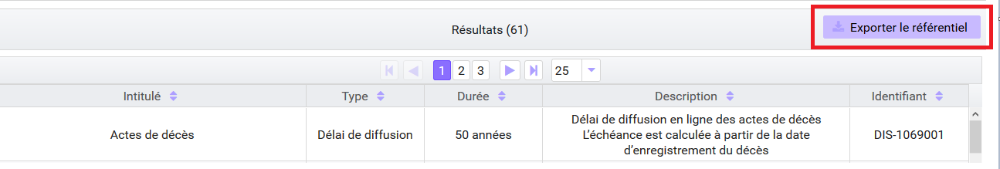

Référentiel des services agents
===============================

Cette partie décrit les fonctionnalités d’import et de consultation du référentiel des services agents.
Ce référentiel interne à la solution logicielle Vitam, décrit les services (services producteurs ou services versants), déclarés par les administrateurs de la solution logicielle Vitam, pouvant mener des actions en entrée et en accès. Il est matérialisé par un fichier CSV.

Import du référentiel des services agents
-----------------------------------------

L’import des services agents est une fonctionnalité réservée à un utilisateur ayant des droits d’administration. 
Pour accéder à la page d'import, l’utilisateur survole le menu « Administration », puis le sous-menu « Import des référentiels » et sélectionne « Import des services agents ».

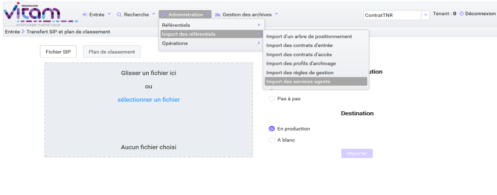

L’utilisateur doit au préalable créer le référentiel des services agents au format CSV afin de l’importer dans Vitam.

Plusieurs critères doivent être respectés pour s’assurer de la bonne construction du référentiel des services agents :

* Identifier : Identifiant du service (Cet identifiant ne doit pas comprendre d’espace ou de caractère accentué)
* Name : Nom du service
* Description : Description du service

Le processus d’import du référentiel se déroule comme ceci :

* Accéder à l’interface d’import du référentiel des services agents et cliquer sur le bouton « sélectionner un fichier » ou faire glisser le fichier sur l’espace de téléchargement
* Sélectionner le fichier CSV
* Cliquer sur le bouton «Importer»

Une fenêtre modale s’ouvre alors pour indiquer soit :
* Que le référentiel a bien été importé soit un échec de l’import du fichier, pouvant être causé par :

* Le fait que le fichier est invalide (mauvais format)

Cette opération est journalisée et disponible dans le Journal des opérations.

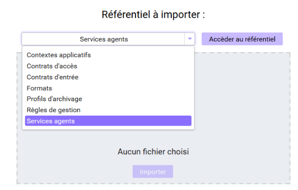

Recherche d’un service agents
-----------------------------

Pour consulter et rechercher les services agents, l’utilisateur survole le menu « Administration », puis le sous-menu « Référentiels » et sélectionne « Services agents ».

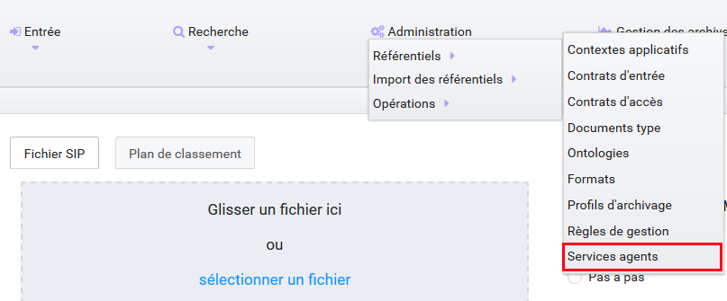

Par défaut, les  services agents sont affichés sous le formulaire de recherche et sont classées par ordre alphabétique de leur intitulé.
Pour effectuer une recherche précise, on utilise les champs « Intitulé », « Identifiant » et/ou « Description »
NB : La recherche par intitulé peut être approximative : chaîne de caractères avec ou sans accent, mots au singulier comme au pluriel, voire une légère tolérance de faute.

.. image:: images/menu_services_agents_4.png

Pour initier la recherche, l’utilisateur saisit ses critères de recherche et clique sur le bouton « Rechercher ». La liste du référentiel est alors actualisée avec les résultats correspondants à la recherche souhaitée. Suite à la recherche, les résultats sont affichés dans un tableau comportant les informations suivantes :
« Intitulé », « Description », « Identifiant »

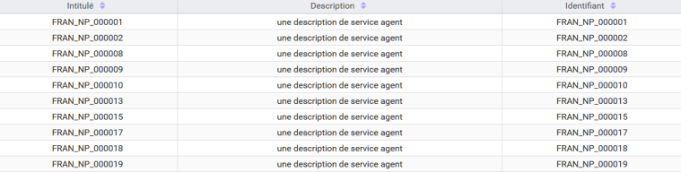

Détail d’un service agent
--------------------------

Pour accéder au détail de chaque service agents, l’utilisateur clique sur la ligne souhaitée.

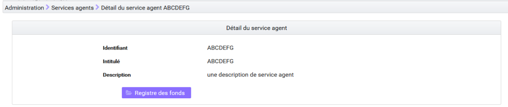

Le détail d’un service agent est composé des informations suivantes :
« Intitulé », « Description »,« Identifiant ».

Cette page de détail permet également d’accéder le cas échéant au registre des fonds transféré par cet agent.

Pour plus de détail sur le registre des fonds, se référer à la partie 5.4.4  Consultation du registre des fonds

NOTE: le dernier fichier enregistré est disponible à l'export via le bouton " Exporter le référentiel " 

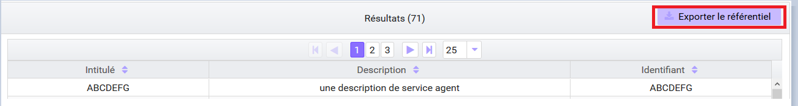

Contrats d'entrée
==================

Les contrats d'entrée permettent de gérer les droits donnés aux utilisateurs et applications de réaliser des transferts d'archives dans la solution logicielle Vitam. Le cotnrat est matérialisé par un fichier JSON.
Pour plus de détail se référer à la documentation "Gestion des habilitations".

Import de contrats d'entrée
-----------------------------

L'import d'un contrat est une fonctionnalité réservée à un utilisateur ayant des droits d'administration. L'utilisateur construit au préalable son contrat d'entrée au format JSON. La structure et les valeurs des contrats sont décrites dans la documentation du modèle de données.

Pour importer un contrat d'entrée, l'utilisateur survole le menu "Administration", puis le sous-menu "Import des référentiels" et sélectionne "Import des contrats d'entrée".

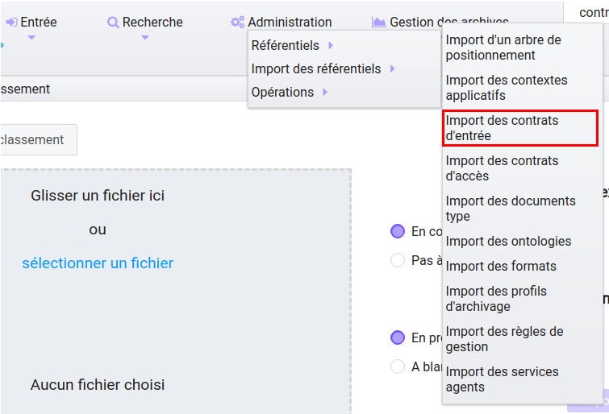

Plusieurs critères doivent être respectés pour s'assurer de la bonne construction du fichier :

- Nom (obligatoire)
- Description (obligatoire)
- Statut (facultatif) : si aucun statut n'est défini, le contrat sera inactif par défaut

L'utilisateur sélectionne le fichier (.json) à importer en cliquant sur "sélectionner un fichier" ou en le faisant glisser sur l'espace de téléchargement, puis clique sur "Importer" pour lancer l'opération.

.. image:: images/import_ce.png
   :scale: 40

Une fenêtre modale s'ouvre alors pour indiquer soit :

- Que les contrats ont bien été importés
- Un échec de l'import du fichier, pouvant être causé par :
	- Le fait que les contrats mentionnés existent déjà pour le tenant 
	- Le fait que le fichier est invalide (mauvais format ou champ obligatoire absent)

Cette opération est journalisée et disponible dans le Journal des opérations.

Recherche d'un contrat d'entrée
--------------------------------

Pour consulter et rechercher les contrats d'entrée, l'utilisateur survole sur le menu "Administration", puis le sous-menu "Référentiels" et sélectionne "Contrats d'entrée".

.. image:: images/menu_ce.png

Par défaut, les contrats d'entrée sont affichés sous le formulaire de recherche et sont classés par ordre alphabétique de leur intitulé.

La page affiche un formulaire de recherche composé des champs suivants :

- Intitulé : permet d'effectuer une recherche approchante sur les intitulés des contrats d'entrée disponibles dans la solution logicielle
- Identifiant : permet d'effectuer une recherche exacte sur l'identifiant d'un contrat

NB : Il est impossible d'effectuer une recherche croisée entre identifiant et intitulé. La recherche par intitulé peut être approximative : chaîne de caractères avec ou sans accent, mots au singulier comme au pluriel, voire une légère tolérance de faute.

.. image:: images/rechch_ce.png

Pour initier la recherche, l'utilisateur saisit ses critères de recherche et clique sur le bouton "Rechercher". La liste du référentiel est alors actualisée avec les résultats correspondants à la recherche souhaitée. Suite à la recherche, le résultat est affiché sous forme de tableau, comportant les informations suivantes :

- Intitulé
- Identifiant
- Tenant
- Statut
- Date de création
- Dernière modification

.. image:: images/res_ce.png

Détail d'un contrat d'entrée
-----------------------------

Pour accéder au détail d'un contrat, l'utilisateur clique sur la ligne souhaitée. La page "Détail d'un contrat d'entrée" contient les informations suivantes :

- Identifiant
- Intitulé
- Description
- Statut
- Date de création
- Date de dernière modification
- Profils d'archivage
- Nœud de rattachement
- Tenant

|

    .. image:: images/detail_ce.png

Modifier un contrat d'entrée
-----------------------------

Il est possible de modifier un contrat d'entrée en cliquant sur le bouton "Modifier" sur l'écran de détail du contrat. L'interface permet la modification de plusieurs champs du contrat, l'ajout d'un noeud de rattachement, ainsi que la modification du statut (actif/inactif). Il est également possible d'ajouter ou de supprimer des profils d'archivage (identifiant).

|

    .. image:: images/ce_update.png

* Statut

L'administrateur a la possibilité d'activer / désactiver un contrat en cliquant sur le bouton du statut pour le rendre actif ou inactif. 

* Restriction d'entrée par Profil d'archivage

Il est possible d'ajouter dans ce champ un ou plusieurs identifiants de profils d'archivage dans le champs réservé, puis ensuite appuyer sur entrée après l'ajout de l'identifiant. Les SIP qui utiliseront ce contrat d'entrée devront obligatoirement compléter la référence d'un de leurs profils d'archivage autorisés dans leur bordereau de versement.

* Nœud de rattachement

Il est possible d'ajouter dans ce champ l'identifiant (GUID) d'une unité archivistique de plan de classement ou d'arbre de positionnement ans le champs réservé, puis ensuite appuyer sur entrée après l'ajout de l'identifiant. Les SIP qui utiliseront ce contrat d'entrée seront automatiquement rattachés à l'unité archivistique déclarée dans le nœud de rattachement.

Une fois les modifications saisies, un clic sur le bouton "Sauvegarder" permet de les enregistrer. A l'inverse, le bouton "Annuler" permet de retourner à l'état initial de l'écran du détail du contrat.

Contrats d'accès
=================

Les contrats d'accès permettent de gérer les droits donnés aux utilisateurs et applications de rechercher et consulter les archives transférés dans la solution logicielle Vitam. Le contrat est matérialisé par un fichier JSON.
Pour plus de détail se référer à la documentation "Gestion des habilitations".

Import de contrats d'accès
---------------------------

L'import de contrats est une fonctionnalité réservée à un utilisateur ayant des droits d'administration, cette opération n'est valable que pour le tenant sélectionné.

L'administrateur devra au préalable construire son contrat plusieurs critères doivent en effet être respectés :

- Nom (obligatoire)
- Description (obligatoire)
- Statut (facultatif) : si aucun statut n'est défini, le contrat sera inactif par défaut.

La structure et les valeurs des contrats sont décrites dans la documentation "Gestion des habilitations".

Pour importer un contrat d'accès, l'utilisateur survole le menu "Administration", puis le sous-menu "Import des référentiels" et sélectionne "Import des contrats d'accès".

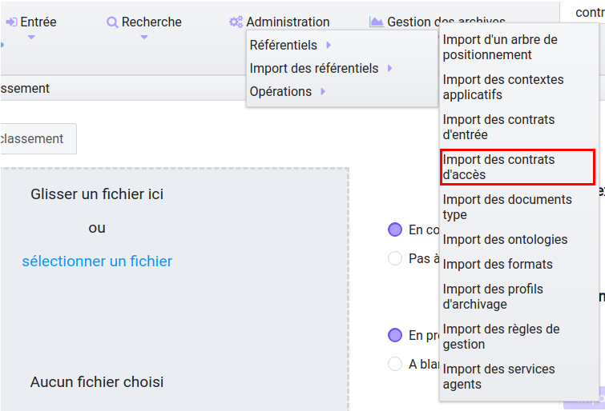

L'utilisateur sélectionne ensuite le fichier (.json) à importer en cliquant sur "sélectionner un fichier" ou en le faisant glisser sur l'espace de téléchargement, puis clique sur "Importer" pour lancer l'opération.

.. image:: images/import_ca.png
   :scale: 50

Une fenêtre modale s'ouvre alors pour indiquer soit :

- Que les contrats ont bien été importés
- Un échec de l'import du fichier, pouvant être causé par :
	- Le fait que le fichier est invalide (mauvais format ou champ obligatoire absent)

Cette opération est journalisée et disponible dans le Journal des opérations.

Recherche d'un contrat d'accès
------------------------------

Pour consulter et rechercher les contrats d'accès, l'utilisateur survole sur le menu "Administration", puis le sous-menu "Référentiels" et sélectionne "Contrats d'accès".

.. image:: images/menu_ca.png

Par défaut, les contrats d'accès sont affichés sous le formulaire de recherche et sont classés par ordre alphabétique de leur intitulé.

La page affiche un formulaire de recherche composé des champs suivants :

- Intitulé : permet d'effectuer une recherche approchante sur les intitulés des contrats d'accès disponibles dans la solution logicielle Vitam
- Identifiant : permet d'effectuer une recherche exacte sur l'identifiant d'un contrat

NB : Il est impossible d'effectuer une recherche croisée entre identifiant et intitulé. La recherche par intitulé peut être approximative : chaîne de caractères avec ou sans accent, mots au singulier comme au pluriel, voire une légère tolérance de faute.

|

.. image:: images/rechch_ca.png

Pour initier la recherche, l'utilisateur saisit ses critères de recherche et clique sur le bouton "Rechercher". La liste du référentiel est alors actualisée avec les résultats correspondants à la recherche souhaitée. Suite à la recherche, le résultat est affiché sous forme de tableau, comportant les informations suivantes :

- Intitulé
- Identifiant
- Tenant
- Statut
- Date de création
- Dernière modification

|

.. image:: images/res_ca.png

Détail d'un contrat d'accès
---------------------------

Pour accéder au détail d'un contrat, l'utilisateur clique sur la ligne souhaitée. La page "Détail d'un contrat d'accès" contient les informations suivantes :

- Identifiant
- Intitulé
- Description
- Statut
- Tous les services producteurs
- Liste blanche des services producteurs (permet de restreindre l'accès à certains producteurs)
- Date de création
- Dernière modification
- Droit d'écriture
- Tous les usages
- Liste blanche des usages (permet de restreindre à certains usages)
- Nœuds de consultation
- Tenant

.. image:: images/detail_ca.png

Modifier un contrat d'accès
---------------------------

Il est possible de modifier un contrat d'accès en cliquant sur le bouton "Modifier" sur l'écran de détail du contrat. L'interface permet de:

 * Modifier plusieurs champs du contrat

 * Changer son statut (actif/inactif).

 * Ajouter ou de supprimer des services producteurs (identifiant) 

 * Ajouter des noeuds de consultation (identifiant) ainsi que des usages à sélectionner via une liste.

 .. image:: images/ca_update.png

* Activation / désactivation

L'administrateur a la possibilité d'activer / désactiver un contraten cliquant sur le bouton " Statut"

* Restriction d'accès par service producteur

Un contrat peut autoriser l'accès à tous ou certains services producteurs inclus dans une liste blanche. Deux options sont disponibles :

 - accès à "Tous les services producteurs" en cliquant afin de changer sa valeur à "oui"
 - accès à une sélection de services producteurs en cliquant sur le bouton "Tous les services producteurs" afin de changer sa valeur à "non", puis en saisissant l'identifiant du producteur souhaité dans la liste blanche des services producteurs ( système de tag, appuyer sur entrée ) 

* Restriction d'accès par usage de l'objet

Un contrat peut autoriser l'accès à tous ou certains usages d'objets inclus dans une liste blanche. (Ex. : l'utilisateur peut accéder aux usages de diffusion mais pas à l'original). Deux options sont disponibles:

 - accès à "Tous les usages" en cliquant afin de changer sa valeur à "oui"
 - accès à une sélection d'usages en cliquant sur le bouton "Tous les usages" afin de porter sa valeur à "non" puis en sélectionnant les usages voulus dans la liste blanche des usages. 

*Restriction par nœud de consultation*

Un contrat peut restreindre l'accès aux unités archivistiques listées en tant que nœuds de consultation ainsi qu'à leurs enfants. Chaque unité archivistique renseignée est identifiée par son identifiant. Si aucune unité archivistique n'est renseignée, alors l'accès du détenteur du contrat n'est pas restreint à des nœuds de consultation ( sytème de tag ) .

Une fois les modifications saisies, un clic sur le bouton "Sauvegarder" permet de les enregistrer. A l'inverse, le bouton "Annuler" permet de retourner à l'état initial de l'écran du détail du contrat.

Contextes applicatifs
=======================

Le contexte permet de définir les droits des applications utilisatrices en fonction de leurs certificats.

Import de contextes applicatifs
--------------------------------

Le contexte applicatif étant trans-tenant, cette fonctionnalité n'est présente que sur le tenant d'administration. Voir paragraphe "Fonctionnalités présentes sur le tenant d'administration uniquement".

Rechercher un contexte applicatif
-----------------------------------

Pour consulter et rechercher les contextes applicatifs, l'utilisateur survole le menu "Administration", puis le sous-menu "Référentiels" et sélectionne "Contextes applicatifs".

.. image:: images/menu_contextes.png

Par défaut, les contextes applicatifs sont affichés sous le formulaire de recherche et sont classés par ordre alphabétique de leur intitulé.

La page affiche un formulaire de recherche composé des champs suivants :

    - Intitulé : permet d’effectuer une recherche approchante sur les noms des contextes applicatifs disponibles dans la solution logicielle Vitam.
    - Identifiant : permet d’effectuer une recherche exacte sur l'identifiant d'un contexte applicatif

.. image:: images/rechch_contextes.png

Pour initier la recherche, l'utilisateur saisit ses critères de recherche et clique sur le bouton "Rechercher". La liste des contextes applicatifs est alors actualisée avec les résultats correspondants à la recherche souhaitée. Suite à la recherche, le résultat est affiché sous forme de tableau, comportant les informations suivantes :

    - Intitulé
    - Identifiant
    - Statut
    - Contrat d'accès
    - Contrat d'entrée
    - Date de création
    - Dernière modification

NB : une coche indique la présence d'au moins un contrat, une croix indique qu'aucun contrat n'est présent

Le bouton "Informations supplémentaires" permet d'afficher des informations supplémentaires sur les contextes applicatifs. Il suffit de cocher dans la liste les informations voulues.

.. image:: images/res_contextes.png

Détail d'un contexte
---------------------

Pour accéder au détail d'un contexte applicatif, l'utilisateur clique sur la ligne souhaitée. La page "Détail du contexte applicatif" contient les informations suivantes :

- Identifiant
- Intitulé
- Date de création
- Dernière modification
- Statut (Actif ou Inactif) 
- Profil de sécurité (permet de définir les accès d'une application) 
- Activation des permissions accordées dans le profil de sécurité (Actif ou Inactif) 

Les tenants sont affichés par bloc. Chaque bloc contenant les informations suivantes :

- L'identifiant du tenant
- La liste des contrats d'accès associés à ce tenant
- La liste des contrats d'entrée associés à ce tenant

|

    .. image:: images/detail_contexte.png

Point d'attention : la modification des contextes applicatifs est une opération d'administration délicate qui peut bloquer le fonctionnement de la solution logicielle. Elle doit être évitée ou réalisée avec précaution.

Profils d'archivage
===================

Un profil d’archivage est un fichier XSD ou RNG qui permet de définir précisément la manière dont les archives destinées à être transférées à la solution logicielle Vitam doivent être structurées et décrites. 

Il constitue une déclinaison du modèle de description propre au Standard d’échanges de données pour l’archivage (SEDA).

Il s'accompagne dans la solution logicielle Vitam d'une notice descriptive en JSON.

Pour plus d'information se référer à la documentation "Profil d'archivage"

Importer une notice descriptive de profil d'archivage
-----------------------------------------------------

L'import de notice détaillant les profils d'archivage est une fonctionnalité réservée à un utilisateur ayant des droits d'administration. 

L'utilisateur construit au prélable la notice descriptive du profil d'archivage au format JSON. Plusieurs critères doivent être respectés pour s'assurer de la bonne construction du fichier :

    - Nom : intitulé du profil d'archivage (obligatoire)
    - Description : description du profil d'archivage (obligatoire)
    - Format : format attendu pour le profil SEDA (XSD ou RNG) (obligatoire)
    - Statut (facultatif) : si aucun statut n'est défini, le profil sera inactif par défaut

La structure et les valeurs des notices descriptives de profils d'archivages sont décrites dans la documentation "Profil d'archivage".

Pour importer une notice descriptive de profil d'archivage, l'utilisateur survole le menu "Administration", puis le sous-menu "Import de référentiels" et sélectionne "Import des profils d'archivage".

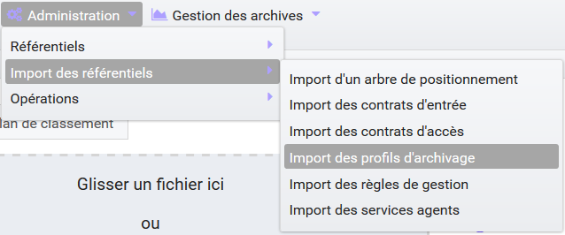

L'utilisateur sélectionne ensuite le fichier (.json) à importer en cliquant sur "sélectionner un fichier" ou en le faisant glisser sur l'espace de téléchargement, puis clique sur "Importer" pour lancer l'opération.

.. image:: images/import_profils.png
   :scale: 50

Une fenêtre modale indique alors soit :

- Les profils ont bien été importés
- Échec de l’import du fichier, pouvant être causé par :
	- le fait que le(s) profil(s) d'archivage mentionné(s) existe(nt) déjà pour le tenant
	- le fait que le fichier est invalide (mauvais format ou champ obligatoire absent)

Cette opération est journalisée et disponible dans le Journal des opérations.

Point d'attention : l'import du profil d'archivage SEDA à lier à cette notice s'effectue via l'opération décrite dans la partie "modifier un profil d'archivage"

Recherche d'une notice de profil d'archivage
--------------------------------------------

Pour consulter et rechercher les profils d'archivage, l'utilisateur survole le menu "Administration", puis le sous-menu "Référentiels" et sélectionne "Profils d'archivage".

.. image:: images/menu_profil.png

Par défaut, les notices descriptives de profils d'archivage sont affichées sous le formulaire de recherche et sont classées par ordre alphabétique de leur intitulé.

La page affiche un formulaire de recherche composé des champs suivants :

- Intitulé : permet d’effectuer une recherche approchante sur les noms des notices descriptives de profils d'archivage disponibles dans la solution logicielle Vitam.
- Identifiant : permet d’effectuer une recherche exacte sur les identifiants des notices descriptives de profils d'archivage.

NB : Il est impossible d'effectuer une recherche croisée entre identifiant et intitulé. La recherche par intitulé peut être approximative : chaîne de caractères avec ou sans accent, mots au singulier comme au pluriel, voire une légère tolérance de faute.

.. image:: images/rechch_profil.png

Pour initier la recherche, l'utilisateur saisit ses critères de recherche et clique sur le bouton "Rechercher". La liste des notices est alors actualisée avec les résultats correspondant à la recherche souhaitée. Suite à la recherche, le résultat est affiché sous forme de tableau, comportant les informations suivantes :

- Intitulé
- Identifiant
- Statut (Actif / Inactif) 
- Date de de création
- Dernière modification
- Profil : bouton d'import d'un profil d'archivage SEDA au format XSD ou RNG à lier à cette notice

Lorsqu'un profil SEDA de règle a été associé à la notice du profil, une flèche indiquant la possibilité de le télécharger apparaît dans la colonne "Profil". L'utilisateur peut lancer le téléchargement en cliquant dessus.

.. image:: images/res_profil.png

Détail d'une notice descriptive d'un profil d'archivage
-------------------------------------------------------

Pour accéder au détail d'une notice de profil d'archivage, l'utilisateur clique sur la ligne souhaitée. La page "Détail du profil" contient les informations suivantes :

- Identifiant
- Intitulé
- Description
- Statut
- Tenant
- Date de création
- Dernière modification
- Format
- Fichier

|

.. image:: images/detail_profil.png

**Modifier un profil d'archivage**

Il est possible de modifier la notice descriptive du profil d'archivage en cliquant sur le bouton "Modifier" sur l'écran "Détail du profil". L'interface permet la modification de plusieurs champs.

Une fois les modifications saisies, un clic sur le bouton "Sauvegarder" permet de les enregistrer. A l'inverse, le bouton "Annuler" permet de retourner à l'état initial de l'écran du détail du contrat.

*Associer un fichier XSD ou RNG à un profil d'archivage*

Pour importer un profil SEDA au format XSD ou RNG à associer à une notice descriptive de profil d'archivage, l'utilisateur clique sur le bouton "Parcourir" à côté du champ "Fichier" puis clique sur "Importer". Le format du fichier doit correspondre au format attendu, indiqué dans le champ format (XSD, RNG) .

A la fin de l'opération d'import, une fenêtre modale indique l'un des deux messages suivants :

- Le profil a bien été importé
- Echec de l'import du fichier

L'opération est journalisée et disponible depuis l'écran de consultation du journal des opérations.

En cas de succès de l'import du profil XSD ou RNG, la date de mise à jour de la notice descriptive de profil est ajustée en conséquence. Si l'utilisateur importe un nouveau profil SEDA au format XSD ou RNG alors qu'un autre profil SEDA a déjà été importé, alors le nouveau fichier remplace l'ancien.

Documents types 
===============

Un document type est un fichier JSON schéma qui permet de définir précisément et d'effectuer des contrôles sur la structure des métadonnées attendues des archives destinées à être transférées à la solution logicielle Vitam.

Il s'accompagne dans la solution logicielle Vitam d'une notice descriptive en JSON.

Pour plus d'information se référer à la documentation "Document Type"

Importer une notice de document type
------------------------------------

L'import de notice détaillant les documents types est une fonctionnalité réservée à un utilisateur ayant des droits d'administration. 

L'utilisateur construit au prélable la notice descriptive du document type au format JSON. Plusieurs critères doivent être respectés pour s'assurer de la bonne construction du fichier :

    - Nom : intitulé du document type (obligatoire)
    - Description : description du document type (Facultative)
    - Date de Création ( Facultative ) 
    - Date d'Activation: Date au format JJ/MM/AA ( Facultative ) 
    - Date de désactivation: Date au format JJ/MM/AA ( Facultative ) 
    - Statut : Date au format JJ/MM/AA (Facultatif) 
    - ControlSchema: bloc au format JSON ( obligatoire , même vide ) 

      NOTE : si aucun statut n'est défini, le profil sera inactif par défaut

La structure et les valeurs des notices descriptives de documents types sont décrites dans la documentation "Documents types".

Pour importer une notice descriptive de documents types, l'utilisateur survole le menu "Administration", puis le sous-menu "Import de référentiels" et sélectionne "Import des documents type".

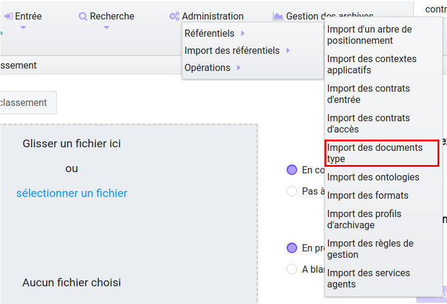

L'utilisateur sélectionne ensuite le fichier (.json) à importer en cliquant sur "sélectionner un fichier" ou en le faisant glisser sur l'espace de téléchargement, puis clique sur "Importer" pour lancer l'opération.

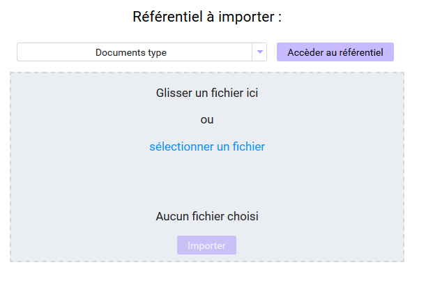
 

Une fenêtre modale indique alors soit :

- Les documents types ont bien été importés
- Échec de l’import du fichier, pouvant être causé par :
	- le fait que le document type existe déjà pour le tenant
	- le fait que le fichier est invalide (mauvais format ou champ obligatoire absent)

Cette opération est journalisée et disponible dans le Journal des opérations.

Ajout d'un Schéma de contrôle
-----------------------------

- L'utilisateur peut ajouter des schémas de contrôles de 2 façons: 

	- Soit via le référentiel JSON directement, en rajoutant le bloc de métadonnées à contrôler à l'INGEST des fichiers directement dans le détail du Champ " Controlschema " 

	- Soit via l' IHM, dans le détail de la notice de document type importée précédemment. 

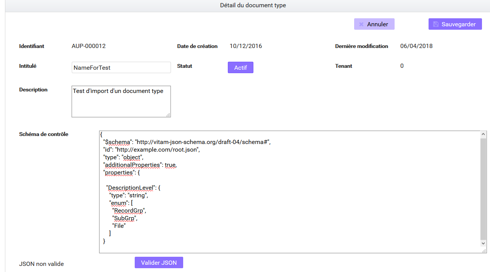

Note: Pour que le contrôle supplémentaire sur les données soit pris en compte, l' intitulé du référentiel devra être présent dans le bordeau d'envoi. 

Recherche d' un document type
------------------------------

Pour consulter et rechercher les documents types, l'utilisateur survole le menu "Administration", puis le sous-menu "Référentiels" et sélectionne "Documents type".

Par défaut, les documents types sont affichées sous le formulaire de recherche et sont classées par ordre alphabétique de leur intitulé.

La page affiche un formulaire de recherche composé des champs suivants :

- Intitulé : permet d’effectuer une recherche approchante sur les noms des notices descriptives de profils d'archivage disponibles dans la solution logicielle Vitam.
- Identifiant : permet d’effectuer une recherche exacte sur les identifiants des notices descriptives de profils d'archivage.

NB : Il est impossible d'effectuer une recherche croisée entre identifiant et intitulé. La recherche par intitulé peut être approximative : chaîne de caractères avec ou sans accent, mots au singulier comme au pluriel, voire une légère tolérance de faute.

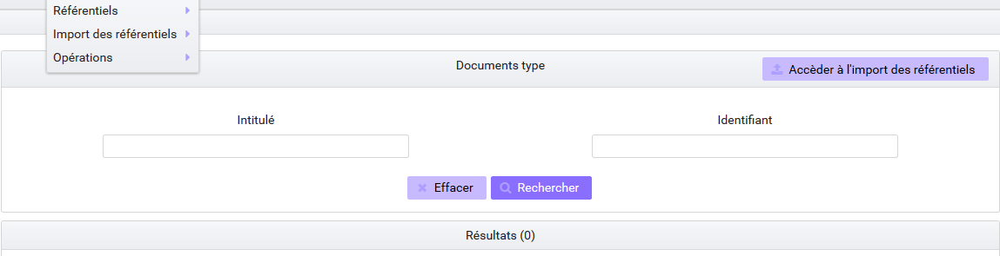

Pour initier la recherche, l'utilisateur saisit ses critères de recherche et clique sur le bouton "Rechercher". La liste des notices est alors actualisée avec les résultats correspondant à la recherche souhaitée. Suite à la recherche, le résultat est affiché sous forme de tableau, comportant les informations suivantes :

- Intitulé
- Identifiant
- Statut (Actif / Inactif) 
- Date de de création
- Dernière modification
- Document

Détail d'un document type
--------------------------

Pour accéder au détail d'une notice de profil d'archivage, l'utilisateur clique sur la ligne souhaitée. La page "Détail du profil" contient les informations suivantes :

- Identifiant
- Intitulé
- Description
- Statut
- Tenant
- Date de création
- Dernière modification
- Schéma de contrôle

**Modifier un document type**

Il est possible de modifier le document type en cliquant sur le bouton "Modifier" sur l'écran "Détail du document type". L'interface permet la modification de plusieurs champs.

Une fois les modifications saisies, un clic sur le bouton "Sauvegarder" permet de les enregistrer. A l'inverse, le bouton "Annuler" permet de retourner à l'état initial de l'écran du détail du contrat.

Import d'un arbre de positionnement
===================================

Les arbres de positionnement correspondent à des ensembles logiques hiérarchisés les uns par rapport aux autres sous forme arborescente. Ils permettent à un service d’archives d’organiser des fonds. Ils s’apparentent à la notion de cadre de classement qu’ils utilisent.

Import d'un arbre de positionnement
-----------------------------------

L'administrateur aura préalablement constitué son fichier d'arbre de positionnement au format CSV comportant les informations suivantes :  

- id : numéro de l’enregistrement ;
- nom : intitulés présents dans l'arbre de positionnement, tous niveaux confondus
- observ : informations complémentaires (facultatif)
- cote et série rang : ordre attribué à chaque niveau.

Pour importer un arbre de positionnement, l'utilisateur survole le menu "Administration", puis le sous-menu "Import de référentiels" et sélectionne "Arbre de positionnement".

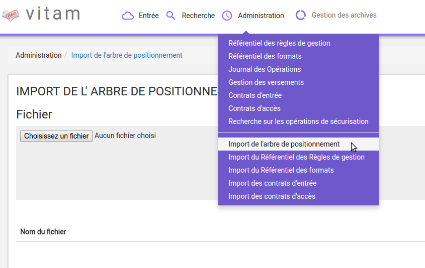

L'utilisateur sélectionne ensuite le dossier à importer en cliquant sur "sélectionner un fichier" ou en le faisant glisser sur l'espace de téléchargement.

Plusieurs options sont présentes sur l'écran :

- Mode d'exécution :
	- le mode d'exécution "en continu" permettant de lancer le processus d'entrée dans sa globalité en une seule fois. Dans la grande majorité des cas, ce mode d'exécution sera le choix adopté.
	- le mode d'exécution "pas à pas" permettant de réaliser progressivement l'entrée en passant d'une étape à une autre. (NB : Les actions liées au processus d'entrée en mode "pas à pas" se retrouvent dans la partie Administration du manuel utilisateur).

- Destination : actuellement, seule l'option "production" est disponible pour verser directement l'arbre de positionnement.

Le mode d'exécution et la destination sont obligatoires.

Pour lancer le transfert de l'arbre, l’utilisateur clique sur le bouton « Importer ».

Les informations visibles à l'écran sont :

- Un tableau comportant les champs suivants :

  - Nom du fichier,
  - Taille : Affiche la taille de l'arbre en Ko, Mo ou Go en fonction de la taille arrondie au dixième près,
  - Statut (succès, erreur ou avertissement)

Une barre de progression affiche l’avancement du téléchargement de l'arbre dans la solution Vitam (une barre de progression complète signifie que le téléchargement est achevé).

NB : Suite au téléchargement de l'arbre, un temps d'attente est nécessaire, correspondant au traitement de l'arbre par le système avant affichage du statut final. Dans ce cas, une roue de chargement est affichée au niveau du statut.

.. image:: images/import_arbre.png

Les formats de SIP attendus sont : ZIP, TAR, TAR.GZ, TAR.BZ2, TAR.GZ2

Si l'utilisateur tente d'importer un arbre dans un format non conforme, alors le système empêche le téléchargement et une fenêtre modale s'ouvre indiquant que le fichier est invalide.

Toute opération d'entrée (succès, avertissement et erreur technique ou métier) fait l'objet d'une écriture dans le journal des opérations et génère une notification qui est proposée en téléchargement à l'utilisateur.

Cette notification ou ArchiveTransferReply (ATR) est au format XML conforme au schéma SEDA 2.0.
Lors d'une entrée en succès dans la solution logicielle Vitam, l'ATR comprend les informations suivantes :

- Date : date d'émission de l'ATR
- MessageIdentifier : identifiant de l'ATR. Cet identifiant correspond à l'identification attribuées à la demande de transfert par la solution logicielle Vitam
- ArchivalAgreement : contrat d'entrée
- CodeListVersion : la liste des référentiels utilisés
- La liste des unités archivistiques avec l'identifiant fourni dans la demande de transfert et l'identifiant généré par la solution logicielle Vitam (SystemId)
- ReplyCode : statut final de l'entrée
- GrantDate : date de prise en charge de l'arbre.
- ArchivalAgency : service d'archives
- TransferringAgency : service de transfert d'archives

En cas de rejet de l'entrée, l'ATR contient les mêmes informations que l'ATR en succès ainsi que la liste des problèmes rencontrés :

- Outcome : statut de l'étape ou de la tâche ayant rencontré au moins une erreur
- OutcomeDetail : code interne à la solution logicielle Vitam correspondant à l'erreur rencontrée
- OutcomeDetailMessage : message d'erreur

La notification comprend ensuite la liste des erreurs rencontrées (échec ou avertissement), au niveau des unités archivistiques sous la forme de blocs <event>.

Journal des opérations
======================

Pour consulter le journal des opérations, l'utilisateur survole le menu "Administration", puis le sous-menu "Opérations" et sélectionne "Journal des opérations".

.. image:: images/menu_jdo.png

Il permet à l'utilisateur d'accéder à toutes les opérations effectuées dans la solution logicielle Vitam, par catégorie d'opération.

Ces catégories d'opérations sont :

- Audit
- Données de base
- Elimination (pas encore développé)
- Entrée
- Export DIP
- Mise à jour des métadonnées de description
- Préservation (pas encore développé)
- Sécurisation
- Vérification (pas encore développé)

Par défaut, l'ensemble des opérations s'affiche, de la date d'opération la plus récente à la plus ancienne.

Recherche d'opérations
-----------------------

Par défaut, les opérations sont affichées sous le formulaire de recherche et sont classées par ordre ante chronologique. Pour effectuer une recherche précise, on utilise les champs "Identifiant" ou "Catégorie d'opération" :

- Identifiant : identifiant de l'opération donné par le système
- Catégories d'opération : présentées sous forme de liste triée alphabétiquement, elles permettent à l'utilisateur de sélectionner une catégorie d'opération

NB : Il est impossible d'effectuer une recherche croisée par identifiant et catégorie d'opération.

Pour initier la recherche, l'utilisateur saisit un critère de recherche et clique sur le bouton "Rechercher". La liste des opérations est alors actualisée avec les résultats correspondants à la recherche.

.. image:: images/rechch_jdo.png

Consultation des résultats
--------------------------

Suite à la recherche, le résultat est affiché sous forme de tableau, comportant les informations suivantes :

- la catégorie de l'opération
- l'opération (le type de l'opération)
- la date de début d'opération
- le statut de l'opération (en cours, erreur, succès, avertissement)
- Le message de l'opération

.. image:: images/res_jdo.png

Le bouton "Informations supplémentaires" permet d'afficher les autres informations du journal des opérations. Il suffit pour cela de cocher dans la liste les informations voulues.

Liste des informations supplémentaires disponibles :

- Identifiant de l'opération
- Code technique
- Identifiant de l'agent interne
- Identifiant interne de l'objet
- Informations complémentaires sur le résultat
- Règles utilisées
- Identifiant de la requête
- Identifiant des agents externes
- Identifiant externe du lot d'objet
- Identifiant du tenant
- Identifiant de l'application
- Identifiant de la transaction
- Rapport

L'utilisateur a la possibilité d'afficher toutes les colonnes supplémentaires en cliquant sur la coche située tout en haut de la liste. Un clic hors de ces champs ferme la liste.

Pour afficher moins d'informations, l'utilisateur déselectionne tous les champs en cliquant sur la première coche afin de revenir à l'affichage d'origine.

Détail d'une opération
-----------------------

L'utilisateur peut consulter le détail des événements intervenus durant l'opération en cliquant sur la ligne souhaitée de l'opération ou du processus.

Le détail est composé de deux parties, le descriptif global de l'opération qui récapitule les informations de l'opération avec la possibilité d'afficher les informations supplémentaires.

.. image:: images/desc_jdo.png

Puis, les processus constituant le détail de l'opération qui sont présentés sous forme de liste comportant, pour chaque événement, les éléments suivants :

- le nom de l'étape
- la date à laquelle l'étape a été effectuée
- le message expliquant le statut de cette étape
- le statut présenté sous forme de pictogramme

Un clic sur la flèche située à côté du message permet d'afficher davantage d'informations concernant cette étape. Un clic sur un signe "+" situé à côté d'un message affiche les détails des données de l'évènement.

.. image:: images/detail_jdo.png

Gestion des opérations
======================

Cette partie décrit les fonctionnalités de la page “Gestion des opérations”. Elle permet de suivre l’évolution des opérations et d’utiliser le mode pas à pas.

Recherche d'une opération
-------------------------

Pour consulter et rechercher une opération, l'utilisateur survole le menu "Administration", puis le sous-menu "Opérations" et sélectionne "Gestion des opérations".

.. image:: images/menu_gestion.png

Par défaut, les opérations d’entrée sont classées par ordre ante chronologique selon leur date d'entrée et seules les opérations en cours de traitement sont affichées sur cet écran.

La page affiche un formulaire de recherche composé des champs suivants :

- Identifiant : identifiant unique de l’opération d’entrée
- Catégorie : indique le type d’opération ( process ) 
- Statut : statut actuel de l'opération
- Etats : état actuel de l'opération
- Dernière étape : dernière étape à laquelle le workflow s'est arrêté
- Dates de début : date de début de l'opération
- Dates de fin : date de fin de l'opération

NB : Il est impossible d'effectuer une recherche croisée par identifiant et tout autre champ.

.. image:: images/rechch_gestion.png

Pour initier la recherche, l'utilisateur saisit ses critères de recherche et clique sur le bouton "Rechercher". La liste des opérations est alors actualisée avec les résultats correspondants à la recherche souhaitée. Suite à la recherche, le résultat est affiché sous forme de tableau, comportant les informations suivantes :

- Identifiant de la demande d'entrée : identifiant unique de l’opération
- Catégorie de l’opération : indique le type d’opération
	- Entrée : indique une opération d’entrée normale
	- Entrée test : indique une opération d’entrée en test à blanc
- Date de l’entrée : date à laquelle l’entrée a été soumise à la solution logicielle Vitam
- Mode d’exécution : indique le mode d’exécution choisi, celui-ci peut être
	- Continu
	- Pas à pas
- Etat : indique l'état actuel de l'opération
    - Pause
    - En cours
    - Terminé
- Statut : indique le statut actuel de l'opération
    - Succès
    - Avertissement
    - En cours
    - Echec
    - Erreur technique
- Précédente étape du workflow / étape en cours
- Prochaine étape du workflow
- Action : Contient des boutons d’action permettant d’interagir avec l'entrée réalisée en mode d’exécution pas à pas

|

.. image:: images/res_gestion.png

Utilisation du mode pas à pas
-----------------------------

Lorsque l’entrée est réalisée en mode d’exécution pas à pas, l’utilisateur doit alors utiliser les boutons d’actions disponibles afin de faire avancer son traitement.
Les boutons disponibles sont :

- Suivant : permet de passer à l’étape suivante du workflow - lorsqu’une étape est terminée, il faut cliquer sur “suivant” pour continuer l’entrée
- Pause : permet de mettre l’opération d’entrée en pause
- Rejouer : permet de rejouer l'étape dernièrement exécutée du workflow - lorsque cette étape est terminée, il faut cliquer sur “suivant” pour continuer l’entrée
- Reprise : permet de reprendre une entrée en pause
- Arrêt : permet d’arrêter complètement une opération d’entrée. Elle passera alors en statut “terminée” et il sera impossible de la redémarrer

Opérations de sécurisation
===========================

La sécurisation des journaux permet de garantir la valeur probante des archives prises en charge dans la solution logicielle Vitam.
Les éléments de valeur probante apportés par la solution Vitam sont détaillés dans la documentation liée à la valeur probante. 

Le fichier produit par une opération de sécurisation des journaux est appelé un "journal sécurisé".

Les administrateurs ont la possibilité d'accéder aux fonctionnalités suivantes :

- Recherche de journaux sécurisés
- Consultation du détail d'un journal sécurisé
- Vérification de l'intégrité d'un journal sécurisé

Recherche de journaux sécurisés
--------------------------------

Pour accéder à la page de “Opérations de sécurisation”, l'utilisateur survole le menu "Administration", puis le sous-menu "Opérations" et sélectionne "Opérations de sécurisation".

.. image:: images/menu_secu.png

Par défaut, les journaux sont affichés sous le formulaire de recherche et sont classés par ordre ante chronologique.
La page affiche un formulaire de recherche composé des champs suivants :

- Identifiant : identifiant de l'opération recherchée sur l'IHM
- Date de début et date de fin : intervalle de dates permettant de rechercher sur les dates du premier et du dernier journal pris en compte dans l'opération de sécurisation
- Type de journal sécurisé : liste déroulante permettant de sélectionner le type de journal sécurisé à afficher.
	* Journal des écritures
	* Journal des opérations
	* Journaux des cycles de vie

|

.. image:: images/rechch_secu.png

Pour initier la recherche, l'utilisateur saisit ses critères de recherche et clique sur le bouton "Rechercher". La liste du référentiel est alors actualisée avec les résultats correspondants à la recherche souhaitée. Suite à la recherche, le résultat est affiché sous forme de tableau, comportant les informations suivantes :

- Type de journal sécurisé : affiche le type de journal sécurisé
- Date de début : indique la date de début de l’opération de sécurisation
- Date de fin : indique la date de fin de l’opération de sécurisation
- Télécharger : icône permettant de télécharger le journal sécurisé. En cliquant sur ce symbole, le journal est téléchargé sous forme de zip. Le nom de ce fichier correspond à la valeur du champ FileName du dernier event du journal de l'opération.

|

    .. image:: images/res_secu.png

Détail d'un journal sécurisé
----------------------------

Pour accéder au détail d'un journal sécurisé, l'utilisateur clique sur la ligne souhaitée. La page "Détail de l'opération" est composée de 3 parties et contient les informations suivantes :

- Opération
    - Date de début : date du premier journal pris en compte dans l'opération de sécurisation
    - Date de fin : date du dernier journal pris en compte dans l'opération de sécurisation
    - Nombre d'opération : il s'agit du nombre de journaux pris en compte dans l'opération de sécurisation
- Fichier
    - Nom du fichier : nom du journal sécurisé
    - Taille du fichier : taille du journal sécurisé
    - Le fichier peut être téléchargé
- Sécurisation
    - Algorithme de hashage : indique l'algorithme utilisé
    - Date du tampon d'horodatage
    - CA signataire : l'autorité de certification
- Hash de l'arbre de Merkle

|

.. image:: images/detail_secu.png

Vérification d'un journal sécurisé
----------------------------------

En cliquant sur le bouton "Lancer la vérification", la solution logicielle Vitam vérifie que les informations de l'arbre de hashage sont à la fois conformes au contenu du journal sécurisé et aux journaux disponibles dans la solution logicielle Vitam.

Une fois l'opération terminée, son détail est affiché. Il est également disponible dans le Journal des opérations.
Le téléchargement du fichier lié à la sécurisation peut être realisé via le détail de l'opération.
 

Fonctionnalités présentes sur le tenant d'administration uniquement
+++++++++++++++++++++++++++++++++++++++++++++++++++++++++++++++++++

Les fonctionnalités suivantes ne sont disponibles que sur le tenant d'administration de la solution logicielle Vitam, qui est configurable et dont le numéro dépend du paramétrage de la plateforme. Les opérations d'import de référentiels trans-tenant ne sont journalisées que sur ce tenant d'administration.

Import du référentiel des formats
=================================

Pour accéder à l'écran d'import du référentiel, l'utilisateur survole le menu "Administration", puis le sous-menu "Import des référentiels" et sélectionne "Import des formats".

.. image:: images/menu_formats.png

L'import du référentiel ne peut être effectué sans le fichier PRONOM. Pour cela, l'utilisateur peut récupérer ce fichier dans sa version la plus récente sur le site des Archives nationales britanniques :

- http://www.nationalarchives.gov.uk
- Section "PRONOM" > "DROID signature files"

Pour importer un référentiel des formats, l'administration:

- Accède à l'écran d'import du référentiel des formats 
- Clique sur le bouton "sélectionner un fichier" ou fait glisser le fichier sur l'espace de téléchargement
- Sélectionne le fichier .xml PRONOM récupéré précédemment
- Clique sur le bouton "Importer"

|

    .. image:: images/import_formats.png
       :scale: 50

A l'issue du contrôle de cohérence et d'intégrité du fichier, plusieurs cas sont possibles :

- Erreur de fichier: la solution logicielle Vitam détecte des erreurs contenues dans le fichier, l'import de ce dernier n'est pas possible, un message d'erreur s'affiche. L'utilisateur doit corriger ces erreurs et soumettre à nouveau le fichier s'il souhaite toujours effectuer son import.

- En cas d'erreur pour cause de référentiel déjà existant détecté par la solution logicielle Vitam, un message d'erreur s'affiche. L'import devient impossible.

.. image:: images/import_ko.png
   :scale: 50

- En cas de succès : la solution logicielle Vitam indique à l'utilisateur que son fichier est valide et lui propose d'importer définitivement le fichier. L'utilisateur peut ainsi accepter l'import définitif et le référentiel des formats est créé à partir des informations contenues dans le fichier XML soumis.

Import de contextes applicatifs
===============================

L'import de contextes applicatifs est une fonctionnalité réservée au tenant d'administration et pour un utilisateur ayant des droits d'administration. La structure et les valeurs des contextes sont décrites dans la documentation du modèle de données.

L'administrateur devra au préalable construire son contexte applicatif, prenant la fomre d'un fichier CSV, plusieurs critères doivent être respectés :

- identifiant
- nom du contexte
- identifiant unique donné au contexte
- version du contexte
- identifiant du profil de sécurité associé au contexte
- contrôle sur les tenants
- statut « Actif » ou « Inactif »
- date de création du contexte
- dernière date de modification du contexte

Un bloc Permissions détaille le périmètre du contexte, tenant par tenant. Il comprend :

 - le tenant dans lequel vont s’appliquer un ou plusieurs contrats
 - le(s) identifiant(s) de(s) contrat(s) d’accès appliqué(s) sur le tenant
 - le(s) identifiant(s) de(s) contrat(s) d’entrée appliqué(s) sur le tenant

La structure et les valeurs des contextes applicatifs sont décrites dans la documentation "Gestion des habilitations".

Pour importer un contexte, l'utilisateur survole le menu "Administration", puis le sous-menu "Import des référentiels" et sélectionne "Import des contextes applicatifs".

|

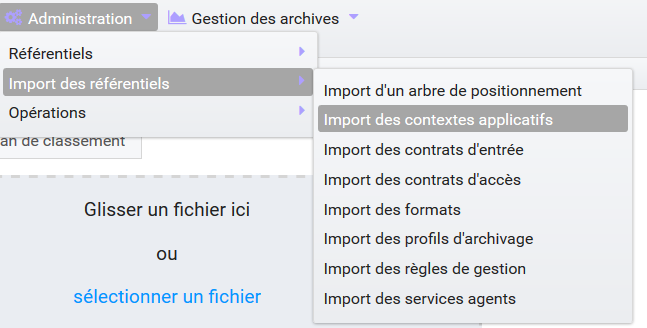

L'utilisateur sélectionne ensuite le fichier (.json) à importer en cliquant sur "sélectionner un fichier" ou en le faisant glisser sur l'espace de téléchargement, puis clique sur "Importer" pour lancer l'opération.

.. image:: images/import_contextes.png
   :scale: 50

Une fenêtre modale s'ouvre alors pour indiquer soit :

- Que les contextes ont bien été importés
- Un échec de l'import du fichier, pouvant être causé par :

    - Le fait que le contexte existe déjà dans le système
    - Le fait que le fichier est invalide (mauvais format ou champ obligatoire absent)
    - Le fait que le contexte déclare des contrats d'entrée ou des contrats d'accès qui n'existent pas dans les référentiels des contrats de leur tenant.

Cette opération est journalisée et disponible dans le Journal des opérations.

**Modifier un contexte applicatif**

Il est possible de modifier un contexte applicatif depuis l'écran du détail en cliquant sur le bouton "Modifier". L'interface permet la modification de plusieurs champs du contexte, ainsi que de changer ses permissions (actif/inactif).

*Activation / désactivation du contexte applicatif*

L'administrateur a la possibilité d'activer / désactiver un contexte en cliquant sur le bouton " Statut".

*Activation / désactivation du contrôle des permissions*

L'administrateur a la possibilité d'activer / désactiver le contrôle du contexte en cliquant sur le bouton 'Actif" ou " Inactif". 

*Tenants*

Il est possible d'ajouter ou supprimer des tenants concernés par le contexte en sélectionnant un identifiant de tenant en haut à droite et en cliquant sur "Ajouter". Il est impossible d'ajouter un tenant qui se trouve déjà dans la liste des tenants de ce contexte.
Pour supprimer un tenant, il suffit de cliquer sur le bouton supprimer correspondant au tenant à retirer, et de valider cette suppression en utilisant le bouton "enregistrer".
Au sein de chacun de ces tenant, il est possible d'ajouter ou supprimer des contrats d'accès et des contrats d'entrée par un système de tag.

|

.. image:: images/contexte_update.png

Une fois les modifications saisies, un clic sur le bouton "Sauvegarder" permet de les enregistrer. A l'inverse, le bouton "Annuler" permet de retourner à l'état initial de l'écran du détail du contexte.

Point d'attention : la modification des contextes applicatifs est une opération d'administration délicate qui peut bloquer le fonctionnement de la solution logicielle. Elle doit être évitée ou réalisée avec précaution.
