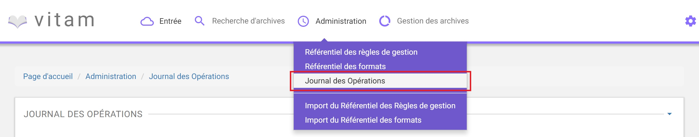
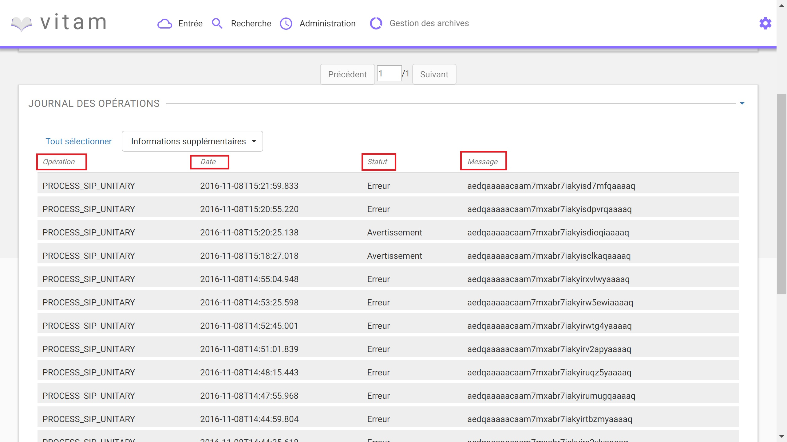
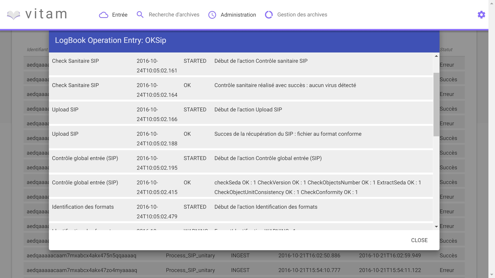
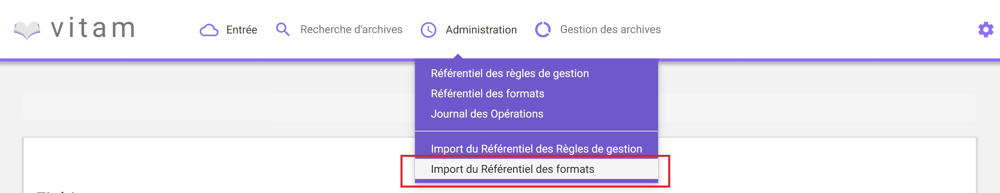
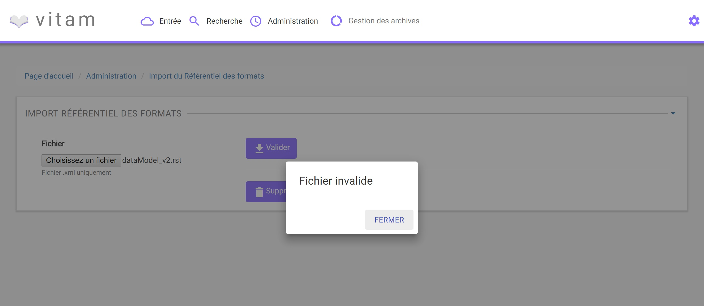
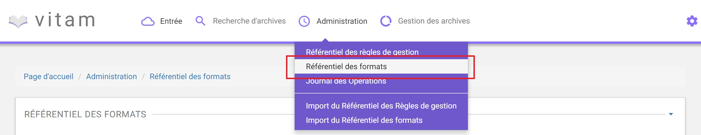
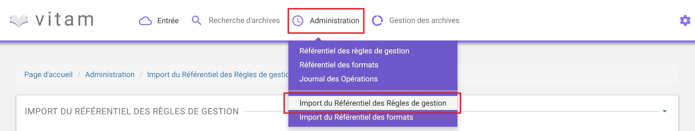
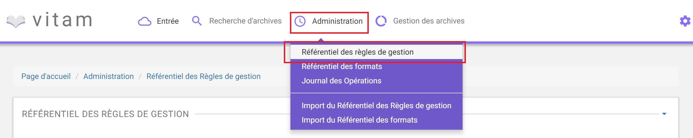

Administration
##############

Cette partie décrit les fonctionnalités d'administration suivantes proposées à l'utilisateur :

- Consultation du journal des opérations
- Import et consultation du référentiel des formats
- Import et consultation du référentiel des règles de gestion

NB : Cette partie est disponible via l'IHM de démonstration.

Journal des opérations
======================

Le journal des opérations permet à l'utilisateur d'accéder à toutes les opérations effectuées dans Vitam, par type d'opération.

Ces opérations sont :

- Entrée (développée en bêta)
- Mise à jour  des métadonnées de description (développée en bêta)
- Données de base (développée en bêta)
- Audit (non encore développée)
- Elimination (non encore développée)
- Préservation (non encore développée)
- Vérification (non encore développée)

Pour consulter le journal des opérations, l'utilisateur clique sur le menu "Administration", puis sur le sous-menu "Journal des opérations".

Formulaire de recherche
-----------------------

Pour effectuer une recherche précise, on utilise les champs "ID" ou "Type d'opération" :

- L'ID est un champ libre, correspondant à l'ID de l'opération donné par le système.
- Les types d'opérations sont présentés sous forme de liste, permettant à l'utilisateur de sélectionner un type d'opération en particulier.

NB : Il est impossible d'effectuer une recherche croisée par ID et type d'opération.

Pour initier la recherche, l'utilisateur saisit son critère de recherche et clique sur le bouton "Rechercher".

.. image:: images/op_recherche.jpg

La recherche met à jour le tableau, affichant le résultat de la requête, trié par date de fin d'opération de la plus récente à la plus ancienne.
Les opérations en cours sont affichées en haut de la liste et sont triées par date de début par ordre d'opération des plus récentes au plus anciennes.

Si aucun résultat n'est trouvé par le système, alors un message explicite indique à l'utilisateur qu'aucun résultat n'est disponible pour sa recherche.

.. image:: images/op_recherche_KO.jpg

Affichage des résultats
-----------------------
Suite à la recherche, le résultat de la recherche est affiché sous forme de tableau, comportant les colonnes suivantes :

- le type d'opération
- la date de fin d'opération
- le statut de l'opération (en cours, échec, succès, avertissement)
- Le message de l'opération (Identifiant de l'opération)

Consultation du détail d'une opération
--------------------------------------

Suite à la recherche d'une opération, l'utilisateur peut choisir de consulter le détail des événements intervenus durant l'opération.
Pour cela, il clique sur la ligne voulue.
Un nouvel onglet s'ouvre, pour présenter le détail de l'opération, sans perdre le focus sur la liste globale des résultats.

Le détail est affiché sous forme de tableau comportant pour chaque événement les éléments suivants :

- Etape : nom de l'étape correspondante
- Date : date à laquelle l'étape a été effectuée
- Statut : statut final de l'étape
- Message : message expliquant le statut de cette étape

Référentiel des formats
=======================

Cette partie décrit les fonctionnalités d'import du référentiel des formats, basé sur une version récente du référentiel PRONOM, pour
ensuite le consulter et rechercher des formats spécifiques.

Import du référentiel des formats
---------------------------------

L'import du référentiel des formats s'effectue depuis l'écran "Import du référentiel des formats".
Pour cela, l'utilisateur clique sur le menu "Administration", puis sur le sous-menu "Import du référentiel des formats". (Administration/Import du référentiel des formats)

L'import du référentiel ne peut être effectué sans le fichier PRONOM.
Pour cela, l'utilisateur peut récuperer le fichier PRONOM sur le site des Archives nationales britanniques :

- http://www.nationalarchives.gov.uk/
- Section "PRONOM" > "DROID signature files"

Le processus d'import du référentiel se décrit comme ceci :

- L'utilisateur accède à l'écran d'import du référentiel des formats et clique sur le bouton "Choisissez un fichier" pour sélectionner un fichier
- Le fichier à selectionner est le fichier XML PRONOM récupéré précédemment
- L'utilisateur valide son choix
- Le système vérifie l'intégrité et la cohérence du fichier

.. image:: images/import_rf_format.jpg

A l'issue du contrôle de cohérence et d'intégrité du fichier, deux cas sont possibles :

- En cas d'erreur : Le système détecte des erreurs contenues dans le fichier, l'import de ce dernier n'est pas possible. L'utilisateur doit corriger ces erreurs et soumettre à nouveau le fichier s'il souhaite toujours effectuer son import.

- En cas de succès : Le système indique à l'utilisateur que son fichier est admissibile et lui propose l'import définitif du fichier. L'utilisateur accepte l'import définitif, le référentiel des formats est créé à partir des informations contenues dans le fichier XML soumis.

.. image:: images/import_rf_format_OK.jpg

Recherche d'un format
---------------------

La recherche d'un format dans le référentiel des formats s'effectue depuis l'écran "Référentiel des formats" (Administration/Référentiel des formats)
Pour cela, l'utilisateur clique sur le menu "Administration", puis sur le sous-menu "Référentiel des formats".

Par défaut, les formats sont affichés sous le formulaire de recherche et sont classés par ordre alphabétique.

Pour effectuer une recherche précise, on utilise le champ "Nom de format" ou le champ "PUID" (Le PUID étant l'ID unique du format dans PRONOM). L'utilisation des deux champs de façon simultanée fait un ET entre les 2 critères. La recherche alliera donc le nom du format avec le PUID et donnera ainsi un résultat plus précis.

NB : la recherche est de type exacte.

Pour initier la recherche, l'utilisateur saisit ses critères de recherche et clique sur le bouton "Rechercher" ou appuie sur la touche "Entrée" si son curseur est encore positionné dans le champs de recherche.

.. image:: images/rf_format.png

Il est possible de vider le contenu des champs "Nom du format" et "PUID" en cliquant sur la croix située à droite. 

.. image:: images/FORMATS_champs_recherche.png

Affichage du résultat
---------------------

Suite à la recherche, les résultats sont affichés dans un tableau comportant les informations suivantes :

- PUID : ID unique du format
- Nom de format
- Version : version du format
- MIME : Identifiant de format de données (Type MIME)
- Extensions

.. image:: images/rf_format_resultat.png

Le nombre indiqué entre parenthèses à droite de la mention "RESULTATS" indique le nombre d'occurences du résultat de la recherche effectuée.

A l'ouverture de la page, tous les formats disponibles étant affichés, le nombre indique l'ensemble des formats présents dans le référentiel.

Affichage d'un détail du format
-------------------------------

Pour accéder au détail de chaque format, l'utilisateur clique sur la ligne du format désiré.

Une fenêtre de type "modale" s'ouvre, pour présenter le détail du format, tout en conservant la liste des résultats.

.. image:: images/rf_format_detail.jpg

Le détail d'un format est composé des informations suivantes :

- PUID
- Nom du format
- Type MIME
- Extensions
- Priorité sur les versions précédentes
- Version de PRONOM : contient un lien renvoyant vers la fiche correspondante au format dans le référentiel des formats PRONOM sur le site des Archives nationale britanniques

Un clic sur le bouton "Fermer" ou hors de la fenêtre "modale" referme celle-ci.

Référentiel des règles de gestion
=================================

Cette partie décrit les fonctionnalités d'import du référentiel des règles de gestion, basé sur une version du référentiel matérialisé dans un fichier CSV, pour
ensuite le consulter et rechercher des règles de gestion spécifiques.

Import du référentiel des règles de gestion
-------------------------------------------

L'import du référentiel des règles de gestion s'effectue depuis le menu "Administration", puis en cliquant sur le sous-menu "Import du référentiel des règles de gestion" (Administration/Import du référentiel des règles de gestion)

L'utilisateur doit au préalable créer le référentiel des règles de gestion au format CSV, puis l'importer dans Vitam.

Plusieurs critères doivent être respectés pour s'assurer de la bonne construction des règles de gestion :

- Identifiants de la règle externe ou métier (obligatoire et unique)
- Types de règle (Obligatoire)

  - Durée d'utilité Administrative (DUA) : AppraisalRule
  - Délai de Communicabilité (DCOMM) : AccessRule
  - Durée d'utilité courante (DUC) : StorageRule
  - Délai de diffusion (DDIFF) : DisseminationRule
  - Durée de réutilisation (DREUT) : ReuseRule
  - Durée de classification (DCLASS) : ClassificationRule

- Intitulé de la règle (Obligatoire)
- Durée associée à la règle (Obligatoire)
- Unité de valeur associée: jours, mois, année (Obligatoire)
- Description (Optionnel)

Un fichier valide est un fichier respectant toutes les conditions suivantes :

- Il s'agit d'un format CSV dont la structure est bien formée
- Il possède des valeurs dont le format est correct (pas de texte dans un champ numérique, la valeur soumise pour une énumération doit être égale à une des valeurs de cette énumération)
- Il comporte des valeurs dans tous les champs obligatoires
- Il possède des valeurs cohérentes avec les besoins métier

Le processus d'import du référentiel se décrit comme ceci :

- L'utilisateur accède à l'interface d'import du référentiel des règles de gestion et clique sur le bouton "Choisissez un fichier" pour sélectionner un fichier
- Le fichier à selectionner est le fichier CSV récupéré précédemment
- L'utilisateur valide son choix
- Le système vérifie l'intégrité et la cohérence du fichier

.. image:: images/Import_rf_gestion.jpg

A l'issue du contrôle de cohérence et d'intégrité du fichier, deux cas sont possibles :

- En cas d'erreur : Le système détecte des erreurs contenues dans le fichier, l'import de ce dernier n'est pas possible. L'utilisateur doit corriger ces erreurs et soumettre à nouveau le fichier s'il souhaite toujours effectuer son import.

.. image:: images/Import_rf_gestion_KO.jpg

- En cas de succès : Le système indique à l'utilisateur que son fichier est admissibile et lui propose l'import définitif du fichier. L'utilisateur accepte l'import définitif, le référentiel des règles de gestion est créé à partir des informations contenues dans le fichier CSV soumis.

.. image:: images/Import_rf_gestion_OK.jpg

Recherche d'une règle de gestion
--------------------------------

La recherche d'une règle de gestion dans le référentiel des règles de gestion s'effectue depuis l'écran "Référentiel des règles de gestion".
Pour cela, l'utilisateur clique sur le menu "Administration", puis sur le sous-menu "Référentiel des règles de gestion" (Administration/Référentiel des règles de gestion)

Par défaut, les règles de gestion sont affichées sous le formulaire de recherche et sont classées par ordre alphabétique.

Pour effectuer une recherche précise, on utilise le champ "Intitulé" et/ou le champ "Type".

NB : La recherche est de type exacte.

Pour initier la recherche, l'utilisateur saisit ses critères de recherche et clique sur le bouton "Rechercher".
La liste du référentiel est alors actualisée avec les résultats correspondants à la recherche souhaitée.

.. image:: images/rg_recherche.jpg

Affichage du résultat
---------------------

Suite à la recherche, les résultats sont affichés dans un tableau comportant les informations suivantes :

- Intitulé de la règle
- Type de règle
- Durée de la règle
- Description de la règle
- Identifiant de la règle

Les résultats sont triés par ordre alphabétique sur l'identifiant de la règle de gestion.

.. image:: images/rg_resultat.jpg

Affichage du détail d'une règle de gestion
------------------------------------------

Pour accéder au détail de chaque règle de gestion, l'utilisateur clique sur la ligne de la règle désirée.

Une fenêtre de type "modale" s'ouvre, pour présenter le détail de la règle de gestion, tout en conservant la liste des résultats.

.. image:: images/rf_gestion_detail.jpg

Le détail d'une règle de gestion est composé des informations suivantes :

- Intitulé de la règle
- Identifiant de la règle
- Description de la règle
- Durée de la règle
- Type de règle
- Mesure
- Date de création de la règle, correspond à la date d'import du référentiel de règle de gestion
- Date de dernière modification

Un clic sur le bouton "Close" ou hors de la fenêtre "modale" referme celle-ci.
