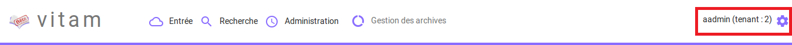
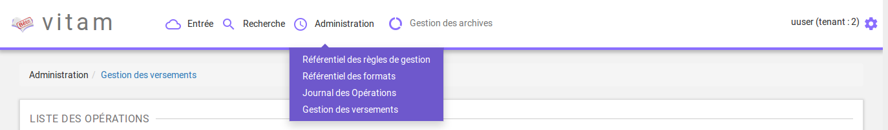
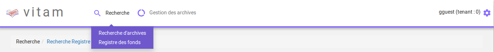

Authentification
################

Cette partie est destinée à expliquer les fonctionnalités du système d'authentification qui s'affiche dès qu'un utilisateur souhaite se connecter à l'IHM minimale et du processus de déconnexion.

Le système comporte actuellement trois niveaux d'authentification :

- Administrateur
- Utilisateur
- Invité

Le portail d'authentification de l'IHM de démonstration est similaire à celle de l'IHM de recette.

Connexion
=========

Pour s'identifier à l'IHM minimale Vitam, l'utilisateur doit saisir son identifiant et son mot de passe dans les champs du même nom.
Pour des mesures de sécurité, le mot de passe saisi ne s'affichera pas en toutes lettres.

L'utilisateur doit également choisir le tenant sur lequel il souhaite se connecter, en utilisant le sélecteur à la droite des champs identifiant et mot de passe.

Un clic sur le bouton "Se connecter" lance l'authentification.

.. image:: images/authentification_OK.png

Lorsque le couple Identifiant/Mot de passe n'est pas cohérent, c'est à dire :

- L'identifiant n'existe pas,
- Le mot de passe ne correspond pas à l'identifiant associé

Alors, un message d'erreur s'affiche à l'écran, demandant à l'utilisateur de vérifier son identifiant et son mot de passe. Aucune autre information n'est donnée pour des mesures de sécurité.

.. image:: images/authentification_KO.png

Par défaut, après connexion, la page "Transfert" d'un SIP est affichée.

Le nom de l'utilisateur est indiqué en haut à droite de l'écran. Le tenant est indiqué entre parenthèses.

Si l'utilisateur souhaite accéder à la plate-forme en saisissant une URL vers une page de Vitam, une fois l'authentification effectuée, il sera redirigé vers la page demandée.
Si la session de l'utilisateur est expirée (la durée de la session en cas d'inactivité est d'une heure, non paramétrable par le métier), il devra s'authentifier de nouveau et accédera directement à la dernière page consultée.

Rôles
=====

Trois niveaux de permissions sont gérés au travers des rôles suivants :

	* Admin
	* User
	* Guest

**Admin** : rôle accordant des droits étendus. Permet d'accéder à l'ensemble des fonctionnalités, aux fonctionnalités d'administration fonctionnelle et à l'IHM de recette.

**User** : permet d'accéder au fonctionnalités suivantes :
	
	* Transfert d'archives
	* Suivi des opérations d'entrée
	* Recherche et consultation d'archives
	* Consultation du registre des fonds
	* Détail des unités archivistiques
	* Consultation des référentiels
	* Consultation des journaux d'opération
	* Accès au gestionnaire des versements
	  
Menu d'administration en vue user :

**Guest** : permet d'accéder aux fonctionnalités suivantes :

	* Recherche et consultation d'archives
	* Consultation du registre des fonds
	* Détail des unités archivistiques
	  
Menus disponibles en vue guest :

Déconnexion
===========

Déconnexion manuelle
--------------------

Depuis n'importe quelle page de Vitam, l'utilisateur a la possibilité de se déconnecter de l'application.
Pour cela, il clique sur le bouton symbolisant une roue située en haut à droite de la page en cours, puis sur le sous menu "Déconnexion". Le système clos la session de l'utilisateur, et la page d'authentification s'affiche de nouveau.

.. image:: images/menu_deconnexion.png

Déconnexion automatique
-----------------------

L'utilisateur est automatiquement déconnecté et redirigé vers la page d'authentification après 30 minutes d’inactivité.