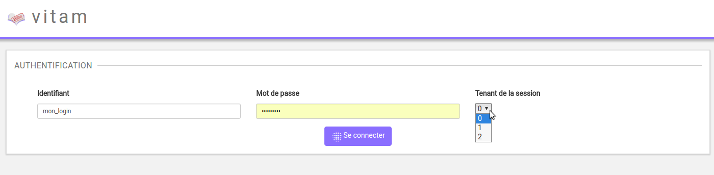
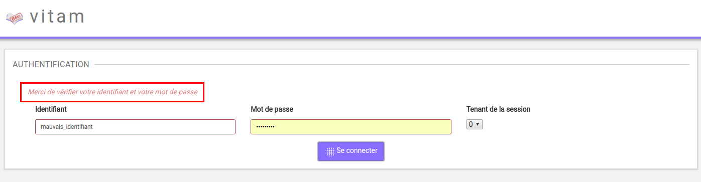
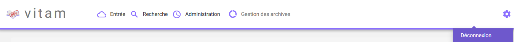

Authentification
################

Cette partie est destinée à expliquer les fonctionnalités du système d'authentification, qui s'affiche dès qu'un utilisateur souhaite se connecter à l'IHM minimale et du processus de déconnexion.

Le système comporte actuellement trois niveaux d'authentification, pour l'instant sans conséquence sur l'accès aux différentes fonctionnalités de la solution Vitam :

- Administrateur (admin)
- Utilisateur (user)
- Invité (guest)

Connexion
=========

Pour s'identifier à l'IHM minimale de la solution logicielle Vitam, l'utilisateur doit saisir son identifiant et son mot de passe dans les champs du même nom.
Pour des mesures de sécurité, le mot de passe saisi ne s'affichera pas en toutes lettres.

L'utilisateur doit également choisir le tenant sur lequel il souhaite se connecter, en utilisant le sélecteur à la droite des champs "Identifiant" et "Mot de passe". Le tenant correspond à un espace réservé à une entité utilisatrice. Par exemple, un lot d'archives versé dans le tenant numéro deux ne sera pas consultable depuis les autres tenants.

Cliquer sur le bouton "Se connecter" permet de lancer l'authentification.

Lorsque le couple Identifiant/Mot de passe n'est pas cohérent, c'est à dire :

- L'identifiant n'existe pas
- Le mot de passe ne correspond pas à l'identifiant associé

Alors, un message d'erreur s'affiche à l'écran, demandant à l'utilisateur de vérifier son identifiant et son mot de passe. Aucune autre information n'est donnée par mesure de sécurité.

Par défaut, après connexion, la page "Transfert" d'un SIP est affichée.

Si l'utilisateur souhaite accéder à la plate-forme en saisissant une URL vers une page de la solution logicielle Vitam, une fois l'authentification effectuée, il sera redirigé vers la page demandée.
Si la session de l'utilisateur est expirée (la durée de la session en cas d'inactivité est d'une heure, non paramétrable par le métier), il devra s'authentifier de nouveau et accédera directement à la derniere page consultée.

Déconnexion
===========

Depuis n'importe quelle page de la solution logicielle Vitam, l'utilisateur a la possibilité de se déconnecter de l'application.
Pour cela, il clique sur le bouton symbolisant une roue située en haut à droite de la page en cours, puis sur le sous-menu "Déconnexion". Le système clos la session de l'utilisateur, et la page d'authentification s'affiche de nouveau.

