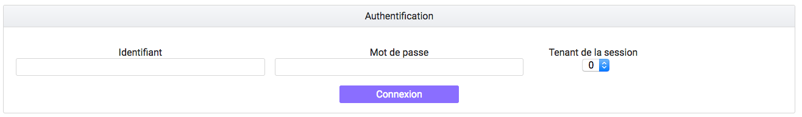
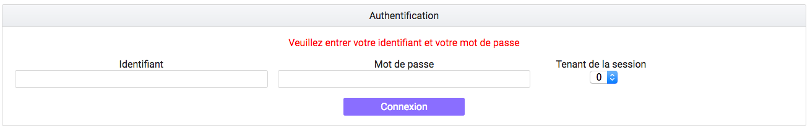
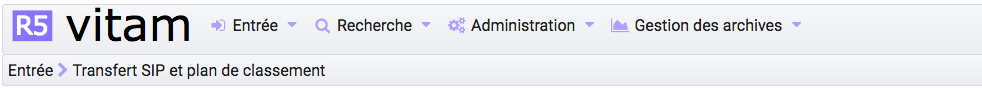
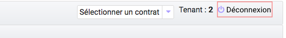

Authentification
################

Cette partie est destinée à expliquer les fonctionnalités du système d'authentification, qui s'affiche dès qu'un utilisateur souhaite se connecter à l'IHM minimale et, également du processus de déconnexion.

Le système comporte actuellement deux niveaux d'authentification :

- Administrateur (admin)
- Utilisateur (user)

Connexion
=========

L'utilisateur de la solution logicielle Vitam peut s'authentifier de deux façons différentes, selon le paramétrage qui a été effectué. Il est possible de se connecter en utilisant un login et un mot de passe, ou de se connecter en utilisant un certificat.

Dans les deux cas, l'utilisateur doit choisir le tenant sur lequel il souhaite se connecter.Pour cela, il utilise le sélecteur "Tenant de la session". 

|

Par défaut, après connexion, la page "Transfert de SIP et plan de classement" est affichée.

Authentification par identifiant
--------------------------------

Pour s'identifier à l'IHM de la solution logicielle Vitam dans ce mode d'authentification, l'utilisateur doit saisir son identifiant et son mot de passe dans les champs du même nom.
Pour des mesures de sécurité, le mot de passe saisi ne s'affichera pas en toutes lettres.

Cliquer sur le bouton "Connexion" permet de lancer l'authentification.

Lorsque le couple Identifiant/Mot de passe n'est pas cohérent, c'est-à-dire :

- L'identifiant n'existe pas
- Le mot de passe ne correspond pas à l'identifiant associé

Alors, un message d'erreur s'affiche à l'écran, demandant à l'utilisateur de vérifier son identifiant et son mot de passe. Aucune autre information n'est donnée par mesure de sécurité.

|

Authentification par certificat
-------------------------------------

Pour utiliser ce mode d'authentification, l'utilisateur doit détenir un certificat délivré par son service informatique. En cliquant simplement sur le bouton de connexion, il sera alors authentifié. Si l'utilisateur utilise un mauvais certificat ou n'utilise pas de certificat, un message d'erreur est affiché pour notifier de cette erreur.

Si la session de l'utilisateur est expirée (la durée de la session en cas d'inactivité est de 30 minutes, non paramétrable par le métier, mais paramétrable par le gestionnaire de plateforme), il devra s'authentifier de nouveau et accédera directement à la dernière page consultée.

Rôles
=====

Deux niveaux de permissions sont gérés au travers des rôles suivants :

	- Admin
	- User

**Admin** : rôle accordant des droits étendus, permet d'accéder à l'ensemble des fonctionnalités, y compris d'administration fonctionnelle.

Fonctionnalités spécifiques au mode Administrateur : 
-Import des référentiels
-Transfert d'un SIP en mode "Pas à pas".

Les fonctionnalités disponibles sont présentes dans le menu:  

**User** : permet d'accéder aux fonctionnalités suivantes :

- Transfert d'archives (en production seulement)
- Transfert de plan de classement
- Suivi des opérations d'entrée
- Recherche et consultation d'archives
- Détail des unités archivistiques
- Recherche et consultation des services producteurs
- Consultation des référentiels
- Consultation des journaux d'opération

Mais n'a pas l'accès aux fonctionnalités du rôle Administrateur et du mode "Pas à Pas", qui n'apparaissent pas dans le menu. 

.. image:: images/menu_users.png

Déconnexion
===========

Déconnexion manuelle
--------------------

Depuis n'importe quelle page de la solution logicielle Vitam, l'utilisateur a la possibilité de se déconnecter de l'application.
Pour cela, il clique sur le bouton "Déconnexion en haut à droite de la page en cours. Le système clos la session de l'utilisateur, et la page d'authentification s'affiche de nouveau.

Déconnexion automatique
-----------------------

L'utilisateur est automatiquement déconnecté et redirigé vers la page d'authentification après un demi-heure d’inactivité.
