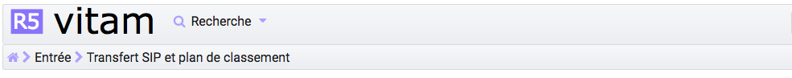

Authentification
################

Cette partie est destinée à expliquer les fonctionnalités du système d'authentification, qui s'affiche dès qu'un utilisateur souhaite se connecter à l'IHM minimale, et, également du processus de déconnexion.

Le système comporte actuellement deux niveaux d'authentification :

- Administrateur (admin)
- Utilisateur (user)

Connexion
=========

Pour s'identifier à l'IHM de la solution logicielle Vitam, l'utilisateur doit saisir son identifiant et son mot de passe dans les champs du même nom.
Pour des mesures de sécurité, le mot de passe saisi ne s'affichera pas en toutes lettres.

L'utilisateur doit également choisir le tenant sur lequel il souhaite se connecter, en utilisant le sélecteur à la droite des champs "Identifiant" et "Mot de passe". Le tenant correspond à un espace réservé à une entité utilisatrice. Par exemple, un lot d'archives versé dans le tenant numéro deux ne sera pas consultable depuis les autres tenants.

Cliquer sur le bouton "Connexion" permet de lancer l'authentification.

|
.. image:: images/form_login.png

Lorsque le couple Identifiant/Mot de passe n'est pas cohérent, c'est-à-dire :

- L'identifiant n'existe pas
- Le mot de passe ne correspond pas à l'identifiant associé

Alors, un message d'erreur s'affiche à l'écran, demandant à l'utilisateur de vérifier son identifiant et son mot de passe. Aucune autre information n'est donnée par mesure de sécurité.

|
.. image:: images/form_login_ko.png

Par défaut, après connexion, la page "Transfert de SIP et plan de classement" est affichée.

Si l'utilisateur souhaite accéder à la plate-forme en saisissant une URL menant à une page de la solution logicielle Vitam, une fois l'authentification effectuée, il sera redirigé vers la page demandée.
Si la session de l'utilisateur est expirée (la durée de la session en cas d'inactivité est de 30 minutes, non paramétrable par le métier), il devra s'authentifier de nouveau et accédera directement à la dernière page consultée.

Le tenant est indiqué à droite du menu.

.. image:: images/tenant.png

Rôles
=====

Deux niveaux de permissions sont gérés au travers des rôles suivants :

	- Admin
	- User

**Admin** : rôle accordant des droits étendus. Permet d'accéder à l'ensemble des fonctionnalités, aux fonctionnalités d'administration fonctionnelle et à l'IHM de recette.

|
.. image:: images/menu_admin.png

**User** : permet d'accéder aux fonctionnalités suivantes :
	
- Transfert d'archives (en prodcution seulement)
- Transfert de plan de classement
- Suivi des opérations d'entrée
- Recherche et consultation d'archives
- Détail des unités archivistiques
- Consultation des services producteurs
- Consultation des référentiels
- Consultation des journaux d'opération

Mais n'a pas la possibilité de transférer un SIP en mode "Pas à pas".
	  
|

Déconnexion
===========

Déconnexion manuelle
--------------------

Depuis n'importe quelle page de la solution logicielle Vitam, l'utilisateur a la possibilité de se déconnecter de l'application.
Pour cela, il clique sur le bouton "Déconnexion en haut à droite de la page en cours. Le système clos la session de l'utilisateur, et la page d'authentification s'affiche de nouveau.

|
.. image:: images/tenant.png
   :scale: 50

Déconnexion automatique
-----------------------

L'utilisateur est automatiquement déconnecté et redirigé vers la page d'authentification après un demi-heure d’inactivité.
