Recherche et Consultation
###########################

Cette partie décrit les fonctionnalités de recherche et de consultation d'une unité archivistique ou d'un fonds d'archives dans la solution logicielle Vitam.

Recherche d'une unité archivistique
===================================

Pour consulter la recherche d'une unité archivistique, l'utilisateur survole le menu "Recherche", puis sélectionne "Recherche d'archives".

|

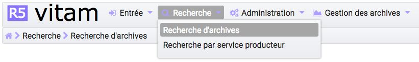

L'accès à deux modes de recherche est proposé sur la page "Recherche d'archives" :

- l'un simple, de type recherche libre, dite "recherche globale"
- l'autre, complexe ciblant certains types de métadonnées, dite "recherche avancée"

Chacun de ces modes est accessible par un onglet spécifique. Par défaut, le mode recherche globale est affiché. Un clic sur l'onglet "Recherche avancée" affiche le formulaire de recherche avancée.

Recherche globale
-------------------

Pour effectuer une recherche globale, l'utilisateur saisit un ou plusieurs mots dans le champ "Intitulé ou description" puis presse la touche "Entrée" de son clavier ou clique sur le bouton "Rechercher".
Le ou les mots saisis vont être recherchés dans les métadonnées "Titre" et "Description" des unités archivistiques. La recherche simple s'effectue sur chacun des mots entrés de manière indépendante (réalisé avec un opérateur "OU") et permet de trouver les mots appartenant à l'un, à l'autre, ou aux deux ensembles de métadonnées visés. Il n’est pas possible de la paramétrer.
Par exemple, une recherche "département gironde" retournera des résultats comprenant le mot "département" ou le mot  "gironde".

Lorsqu'une recherche libre est effectuée, tous les résultats comprenant la chaîne de caractères demandée seront remontés. Exemple : pour une recherche du mot "acte" sera remonté "acte de naissance" ou "Divers actes de mariage".

Les caractéristiques du mode de recherche sont les suivantes :

- La recherche n'est pas sensible à la casse
- Les résultats ne tiennent pas compte des accents ou graphèmes divers (ç, ß, etc.)
- Les résultats ignorent les caractères spéciaux

|

.. image:: images/au_rechchs.png

Recherche avancée
-----------------

La recherche avancée permet à l'utilisateur d'effectuer sa requête dans un ou plusieurs champs précis de l'unité archivistique.

Le ou les mots saisis vont être recherchés dans les métadonnées suivantes :

- Intitulé de l'unité archivistique
- Description de l'unité archivistique
- Identifiant de l'unité archivistique (attribué par le système)
- Dates extrêmes (Date de début et date de fin)
- Service producteur de l'entrée

Pour initier la recherche avancée, l'utilisateur saisit ses éléments dans les champs disponibles, puis clique sur le bouton "Rechercher".

|

.. image:: images/au_rechcha.png

*Recherche par dates extrêmes*

Lorsqu'un utilisateur souhaite faire une recherche par dates extrêmes, un contrôle sur ces dates est effectué :

- la date de début doit être antérieure à la date de fin
- les deux champs dates doivent être renseignés

Dans le cas contraire, un message d'erreur est affiché.

|

*Recherche par identifiant* 

La recherche par identifiant est spécifique. L'identifiant étant unique, il n'est pas possible d'effectuer une recherche croisée par identifiant et tout autre champ. L'identifiant est l'identifiant système attribué par VITAM (SystemId) et peut être retrouvé via la notification de la demande de transfert (ATR).

Résultats de recherche
----------------------

Suite à la recherche, les résultats sont affichés sous forme de tableau, comportant les informations suivantes : :

- Identifiant
- Intitulé
- Type
- Service producteur
- Date de début
- Date de fin
- Objet(s) disponible(s) (une coche est affichée si l'unité archivistique dispose d'un ou de plusieurs objets, dans le cas contraire, une croix est affichée)
- Cycle de vie

| 

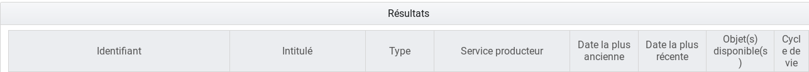

En cas de recherche infructueuse, le message "Aucun résultat" s'affiche sous le formulaire.

.. image:: images/au_res_ko.png

Consultation du détail d'une unité archivistique
================================================

Depuis la liste des résultats, l'utilisateur peut consulter le détail d'une unité archivistique en cliquant sur la ligne correspondant à l'unité archivistique souhaitée.

Détail de l'unité archivistique
-------------------------------

La page affiche les informations concernant l'unité archivistique et le groupe d'objets associé, informations contenues dans le bordereau SEDA et récupérées lors de l'entrée de l'unité archivistique dans la solution logicielle Vitam.

La page est divisée en plusieurs sections :

- certaines sont affichées par défaut
- d'autres, masquées, peuvent être visualisée en cliquant sur le "+" situé à droite de leur titre

**Contexte de l'unité archivistique**

Affichée par défaut, cette section permet de visualiser et naviguer dans l'arborescence montante et descendante de l'unité archivistique.

L'unité archivistique sur le détail de laquelle on se trouve est signalée par e un pictogramme de maison situé à gauche. Les niveaux supérieurs ou parents sont indiqués par des chevrons, les niveaux inférieurs ou enfants, par des plus. Un clic sur un chevron ou un "+" déploie l'arborescence, un clic sur l'intitulé redirige sur la page de l'unité archivistique sélectionnée.

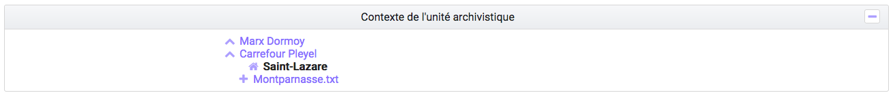

Par défaut, l'unité archivistique affiche cinq niceaux parents et enfants directs. Dans le cas où il existe plus de cinq enfants, un lien plus d'enfants" est affiché.

Un  clic sur ce lien ouvre une fenêtre modale composée d'un formulaire de recherche et sa liste de résultats.

Le formulaire permet d'effectuer une recherche par titre ou description et dates extrêmes sur les niveaux enfants de l'unité archivistique.

|

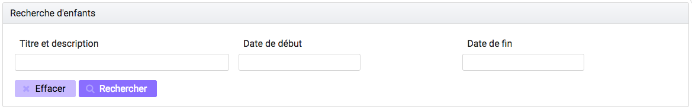

Les résultats sont affichés avec les informations suivantes :

- Sélectionné
- Identifiant
- Intitulé
- Type
- Service producteur
- Date de début
- Date de fin

|

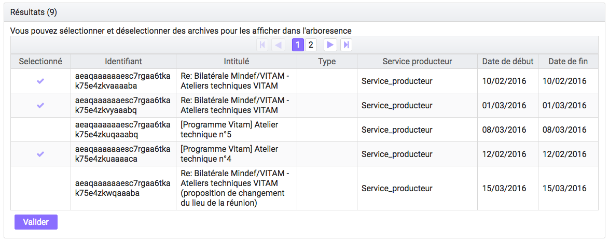

La colonne "Sélectionné" permet de visualiser les unités archivistiques visibles dans l'arborescence, les 5 unités archivistiques affichées par défaut, sont déjà sélectionnées. Un clic sur une ligne permet de sélectionner ou désélectionner l'unité archivistique correspondante.
Un fois les choix effectués, un clic sur le bouton "valider" enregistre les sélections et ferme la fenêtre automatiquement.

Un pictogramme de croix, placé en haut à droite de la fenêtre permet également de la refermer.

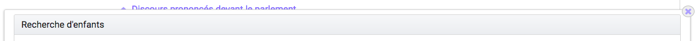

**Description principale**

Affichée par défaut, cette section contient les principales métadonnées descriptives et de gestion relatives à l'unité archivistique.

Concernant les services producteurs, il faut différencier :

 - Identifiant service producteur, le service producteur de l'unité archivistique, repris du bloc <Content> du bordereau de transfert
 - Service producteur de l'entrée, correspondant à la valeur de l'OriginatingAgencyIdentifier déclarée dans le du bordereau de transfert
 - Services ayant des droits sur l'entrée, correspondant aux services producteurs de l'entrée et à ceux des entrées des parents auxquels des unités archivistiques ont été rattachées

|
 .. image:: images/au_desc.png
 
 La plupart des métadonnées descriptives peuvent être modifiées en cliquant sur le bouton "Modifier".

.. image:: images/au_modif.png

Chaque ligne devient alors éditable, excepté les champs identifiant et type.

Une fois les modifications saisies, un clic sur le bouton "Sauvegarder" permet de les sauvegarder et met à jour les métadonnées.
Cette action est enregistrée dans le Journal du cycle de vie. Les anciennes valeurs sont sauvegardées à titre informatif dans la colonne détails sur l'événement située au niveau de l'étape de "mise à jour des métadonnées de l'unité archivistique.

**Description complémentaire**

Cette partie permet d'afficher l'ensemble des champs issus du bloc <Content>

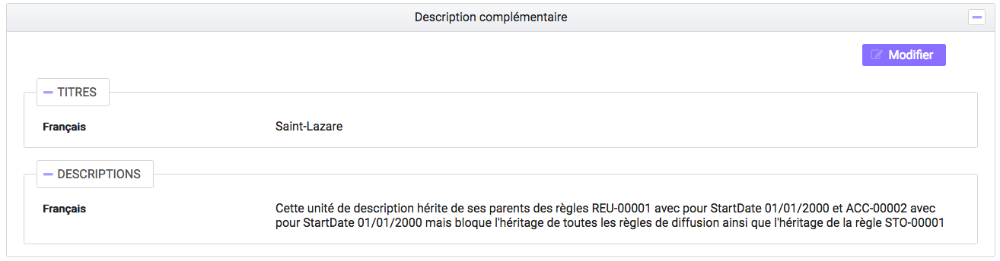

**Règles de gestion**

Si des règles de gestion s'appliquent à l'unité archivistique, alors celles-ci sont listées parmi les catégories suivantes :

- Règle de durée d'utilité administrative
- Règle de communicabilité
- Règle de durée d'utilité courante
- Règle de diffusion
- Règle de réutilisation
- Règle de classification

Ces règles ont les attributs suivants :

- Identifiant : le code affecté à la règle appliquée à cette unité. Par exemple ACC-00010.
- Date de début : date du début d'application de la règle
- Date de fin : date de fin d'application de la règle
- Sort final : optionnel, dans le cas où la règle possède un sort final
- Héritage
- Détail : indique l'origine de la règle, suite à un clic sur le chevron situé à droite de la règle

Le fait qu'une ou plusieurs règles soient bloquées est affiché au travers deux mentions possibles :
 
- "Règle désactivée" liste l'identifiant des règles, provenant d'unités archivistisques parentes et qui ne sont plus appliquées à partir de cette unité archivistique.

- "Cette unité archivistique n'hérite d'aucune règle" indique que toutes les règles de cette catégorie (DUA, DUC, Règle de communicabilité, etc.) provenant des parents ne sont plus appliquées à partir de cette unité archivistique.

Chaque règle possède un détail qu'il est possible de consulter en cliquant sur la ligne de la règle en question. Ce détail reprend l'ensemble affiche le champ "Hérit." qui permet de visualiser le nom de l'unité archivistique d'origine de la règle.
La ligne "hérité de" indique quelle unité archivistique est à l'origine de l'application de la règle sur l'unité consultée. Cette unité archivistique d'origine est cliquable et mène sur le détail de l'unité mentionnée.

|

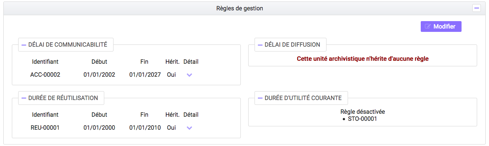

Les règles de gestion non héritées peuvent être modifiées ou supprimées en cliquant sur le bouton "Modifier".

|

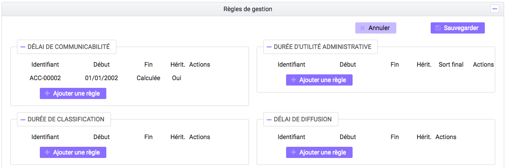

Il est possible d'ajouter une ou plusieurs règles de gestion à toutes les catégories disponibles.

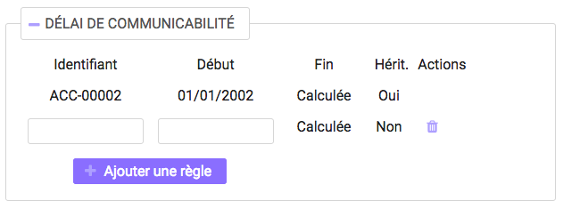

Dans cet exemple, une règle est héritée et donc non modifiable, tandis que la seconde est modifiable.

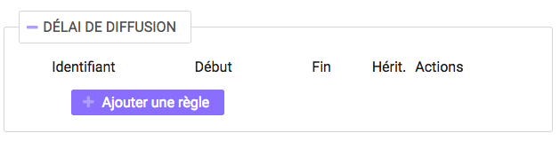

Un clic sur le bouton "Ajouter une règle" crée une nouvelle ligne permettant la création d'une règle de gestion.

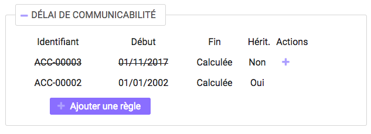

La suppression d'une règle s'effectue en cliquant sur la corbeille. Il est possible d'annuler l'action de suppression avant la validation des modifications en cliquant sur le pictogramme "+" situé à droite.

Une fois les modifications saisies, un clic sur le bouton "Sauvegarder" ouvre une fenêtre modale afin de vérifier vos modifications. Un clic sur le bouton "Modifier" met à jour et sauvegarde les règles de gestion.

|

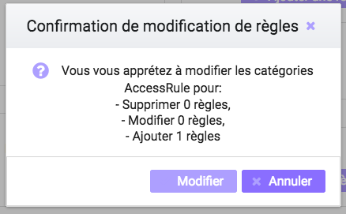

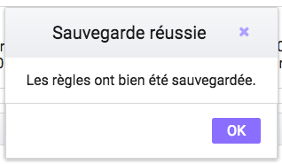

**Groupe d'objets techniques**

Si des objets sont disponibles, cette section est visible et affichée par défaut. Le ou les objets présents dans le groupe d'objets ainsi que les métadonnées associées pour cette unité archivistique y sont affichés.

Chaque objet est listé dans une ligne du tableau, Les colonnes affichent les informations suivantes :

- Usage, correspondant aux utilisations de l'objet (consultation, conservation, etc.)
- Taille, exprimée en bytes
- Format, correspondant à l'extension du format de l'objet
- Date, correspondant à la date de dernière modification
- Téléchargement, un clic sur icône de téléchargement permet de consulter l'objet.

|

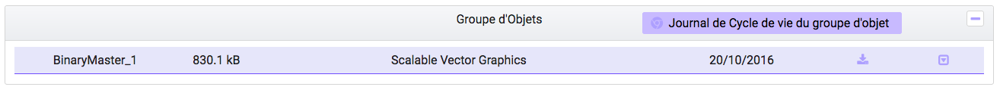

Un clic sur le pictogramme situé à droite de l'objet permet de consulter l'ensemble ses métadonnées.

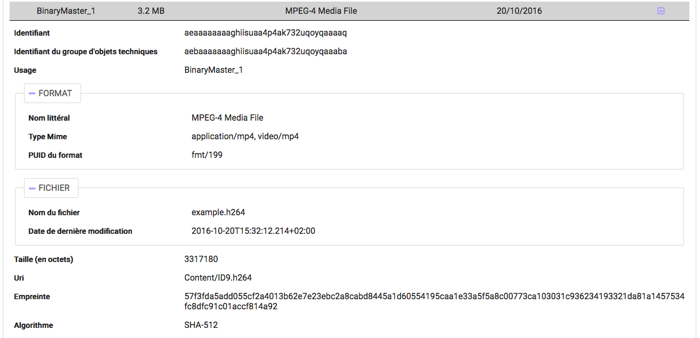

En ce qui concerne les objets physiques, les colonnes n'affichent que l'information suivante :

- Usage

Les unités disponibles sont celles répertoriées par l'UNECE.

**Export DIP**

Il est possible d'exporter l'unité archivistique sous forme de DIP. Trois choix d'exports sont disponibles :

- Unité archivistique
- Unité archivistique et sa descendance
- Ensemble de l'entrée

|

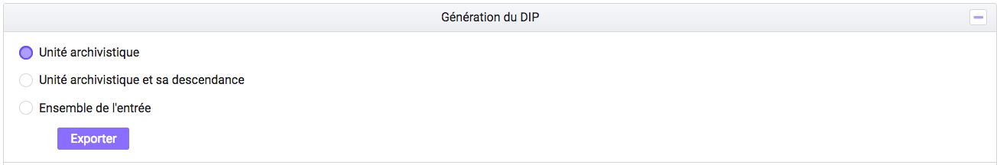

Suite au clic sur le bouton "Exporter" une fenêtre modale s'ouvre et indique que le DIP est en cours de création et qu'il sera téléchargeable dans le journal des opérations. Un bouton "OK" ferme la fenêtre.

Journaux du cycle de vie
========================

Une fois le processus d'entrée d'un SIP terminé avec succès, pour chaque nouvelle unité archivistique et groupe d'objets créés, un journal du cycle de vie est généré.
Il trace tous les événements qui impactent l'unité archivistique et les objets, dès leur prise en charge dans la solution logicielle Vitam.

Journal du cycle de vie d'une unité archivistique
-------------------------------------------------

Le journal du cycle de vie de l'unité archivistique est disponible depuis son détail en cliquant sur l'icône "Journal du cycle de vie" ou depuis la liste du résultat de la recherche d'archives.

|

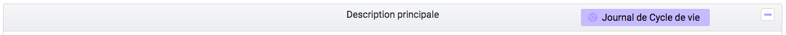

Un clic sur ce bouton affiche le détail du journal du cycle de vie.

Par défaut, l'écran du journal du cycle de vie de l'unité archivistique affiche les informations suivantes :

- Intitulé de l'événement
- Date de fin de l'événement
- Statut de l'événement
- Message de l'événement

|

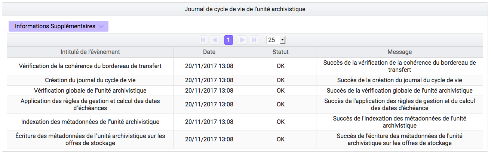

S'il le souhaite, l'utilisateur peut sélectionner des informations disponibles du journal du cycle de vie de l'unité archivistique en cliquant sur le bouton "Informations supplémentaires" et en choisissant les options souhaitées dans la liste déroulante.

La liste déroulante contient les champs suivants :

- Identifiant de l'évènement
- Identifiant de l'opération
- Catégorie de l'opération
- Code d'erreur technique
- Détails sur l'événement
- Identifiant de l'agent (réalisant l'opération)
- Identifiant interne de l'objet
- Identifiant du tenant (technique)

Journal du cycle de vie du groupe d'objet
-----------------------------------------

Le journal du cycle de vie du groupe d'objets est disponible depuis le détail de l'unité archivistique, dans la partie groupe d'objets.

|

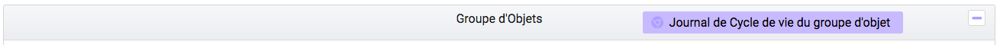

Un clic sur ce bouton affiche le journal du cycle de vie du groupe d'objets.

Par défaut, l'écran du journal du cycle de vie du groupe d'objets affiche les informations suivantes :

- Intitulé de l'événement
- Date de fin de l'événement
- Statut de l'événement
- Message de l'événement

|

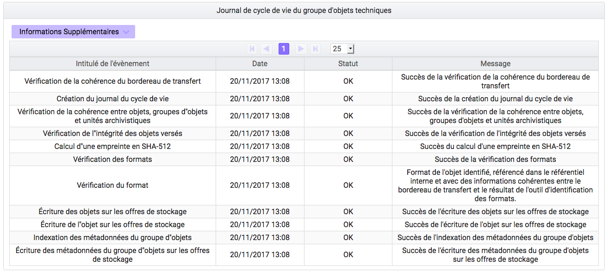

S'il le souhaite, l'utilisateur peut sélectionner des informations disponibles du journal du cycle de vie du groupe d'objet en cliquant sur le bouton "Informations supplémentaires" et en choisissant les options souhaitées dans la liste déroulante.

La liste déroulante contient les champs suivants :

- Identifiant de l'évènement
- Identifiant de l'opération
- Catégorie de l'opération
- Code d'erreur technique
- Détails sur l'événement
- Identifiant de l'agent (réalisant l'opération)
- Identifiant interne de l'objet
- Identifiant du tenant (technique)

Recherche par service producteur
================================

Le registre des fonds a pour but de :

- fournir une vue globale et dynamique de l'ensemble des archives, placées sous la responsabilité du service d'archives
- permettre d'effectuer des recherches dans les archives en prenant pour critère l'origine de celles-ci, le service producteur

Recherche
----------

Pour y accéder, l'utilisateur survole le menu "Recherche", puis sélectionne "Recherche par service producteur".

|

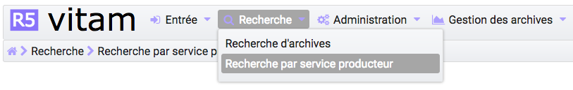

Par défaut, les services producteurs sont affichés sous le formulaire de recherche et sont classées par ordre alphabétique de leur intitulé.

Pour effectuer une recherche précise, on utilise le champ "Identifiant" en utilisant l'identifiant exact recherché. Il est également possible de rechercher par Intitulé et Description.

NB : La recherche n'a alors pas besoin d'être exacte. L'utilisateur peut saisir une chaîne de caractères avec ou sans accent, des mots au singulier comme au pluriel, voir même avec une légère tolérance de faute.

Pour initier la recherche, l'utilisateur saisit ses critères de recherche et clique sur le bouton "Rechercher".
La liste du référentiel est alors actualisée avec les résultats correspondants à la recherche souhaitée.

|

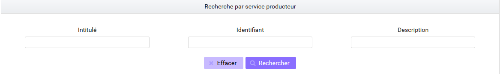

Affichage de la liste des résultats
-----------------------------------

Suite à une recherche, les résultats se présentent sous forme de tableau affichant les informations suivantes :

- Intitulé
- Identifiant
- Description

|

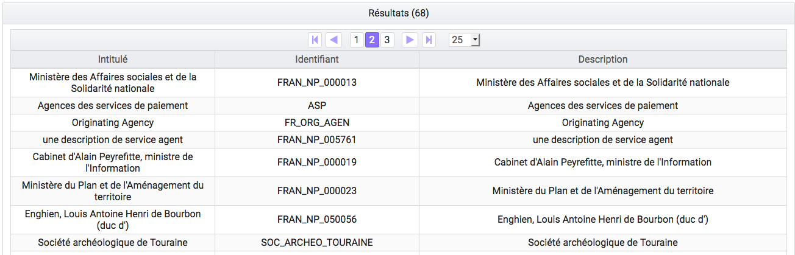

Consultation du détail
----------------------

Depuis la liste des résultats, l'utilisateur peut consulter le détail d'un fonds pour un service producteur en cliquant sur la ligne voulue. Puis il clique sur le bouton "Registre des fonds" afin d'afficher le détail complet du fonds. Il accède alors à la matrice descriptive du service agent.

|

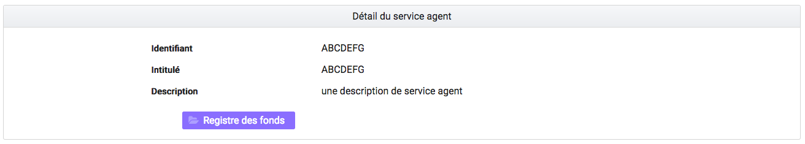

Consultation du registre des fonds
----------------------------------

Depuis le détail du service agent, l'utilisateur peut consulter le registre des fonds de ce service.

Deux blocs d'informations sont disponibles depuis le détail du registre des fonds :

- Une vue regroupant toutes les unités archivistiques, groupes d'objets et objets ainsi que leurs volumétries, pour un service producteur par fond propres et rattachés
- Une vue listant toutes les opérations d'entrée effectuées pour ce service producteur

Le premier bloc distingue fonds propres, c'est-à-dire les archives provenant directement du service producteur et fonds symboliques c'est-à-dire les archives déclarées par ce service producteur par voie de rattachement.

|

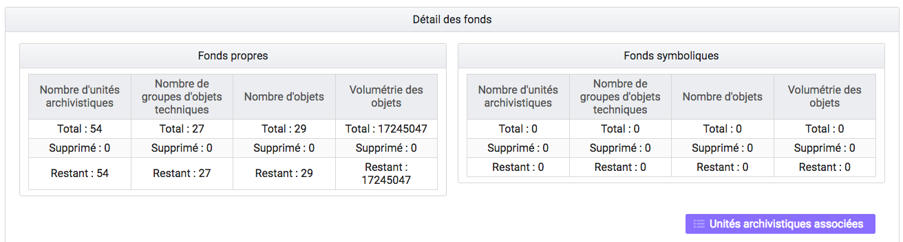

Cette vue affiche, sous forme de tableau, les informations consolidées suivantes pour ce service producteur et par type de fonds:

- nombre d'unités archivistiques

  - Total : Nombre d'unités archivistiques entrées dans la solution logicielle Vitam
  - Supprimé : Nombre d'unités archivistiques supprimées de la solution logicielle Vitam
  - Restant : Nombre d'unités archivistiques restantes dans la solution logicielle Vitam

- nombre de groupes d'objets

  - Total : Nombre de groupes d'objets entrés dans la solution logicielle Vitam
  - Supprimé : Nombre de groupes d'objets supprimés de la solution logicielle Vitam
  - Restant : Nombre de groupes d'objets restant dans la solution logicielle Vitam

- nombre d'objets

  - Total : Nombre d'objets entrés dans la solution logicielle Vitam
  - Supprimé : Nombre d'objets supprimés de la solution logicielle Vitam
  - Restant : Nombre d'objets restant dans la solution logicielle Vitam

- volumétrie des objets

  - Total : Volume total des objets entrés dans la solution logicielle Vitam
  - Supprimé : Volume total des objets supprimés de la solution logicielle Vitam
  - Restant : Volume total des objets restant dans la solution logicielle Vitam

Sous cette partie, la liste des entrées effectuées pour ce service producteur est affichée sous forme de tableau.

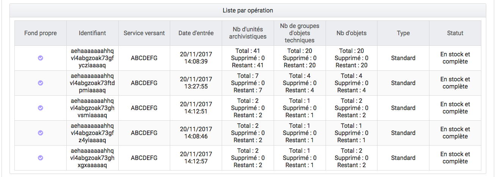

Pour chaque entrée, les informations suivantes sont affichées :

- Fond propre : une coche indique de l'entrée provient du fond propre, une croix indique qu'elle provient d'un fond rattaché
- Identifiant de l'opération attribué par la solution logicielle Vitam (cet identifiant correspond au contenu du champ MessageIdentifier de la notification d'entrée)
- Service versant
- Date d'entrée
- Nombre d'unités archivistiques

  - Total : Nombre d'unités archivistiques entrées dans la solution logicielle Vitam
  - Supprimé : Nombre d'unités archivistiques supprimées de la solution logicielle Vitam
  - Restant : Nombre d'unités archivistiques restantes dans la solution logicielle Vitam

- nombre de groupes d'objets

  - Total : Nombre de groupes d'objets entrés dans la solution logicielle Vitam
  - Supprimé : Nombre de groupes d'objets supprimés de la solution logicielle Vitam
  - Restant : Nombre de groupe d'objets restant dans la solution logicielle Vitam

- nombre d'objets

  - Total : Nombre d'objets entrés dans la solution logicielle Vitam
  - Supprimé : Nombre d'objets supprimés de la solution logicielle Vitam
  - Restant : Nombre d'objets restant dans la solution logicielle Vitam

- Type (standard, plan de classement, arbre de positionnement)
- statut (En stock et complète, En stock et mise à jour, Sortie du stock)

Un bouton "Unités archivistiques associées" permet d'accéder directement à la liste des unités archivistiques liées à ce service producteur.

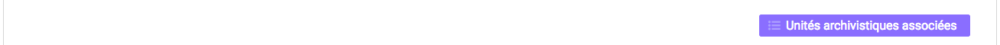