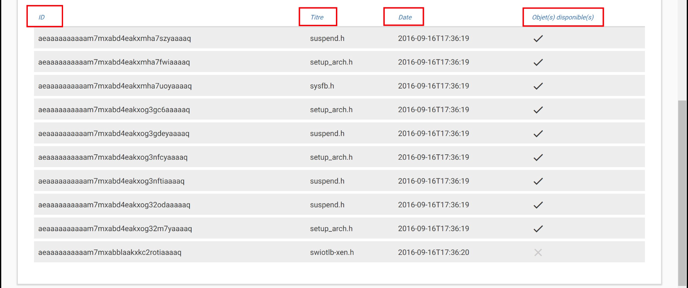
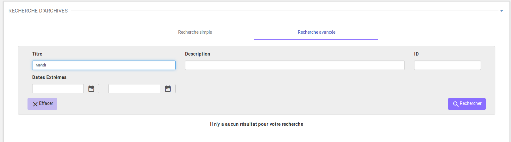
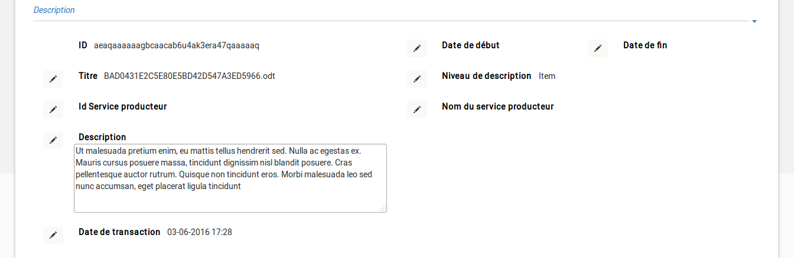
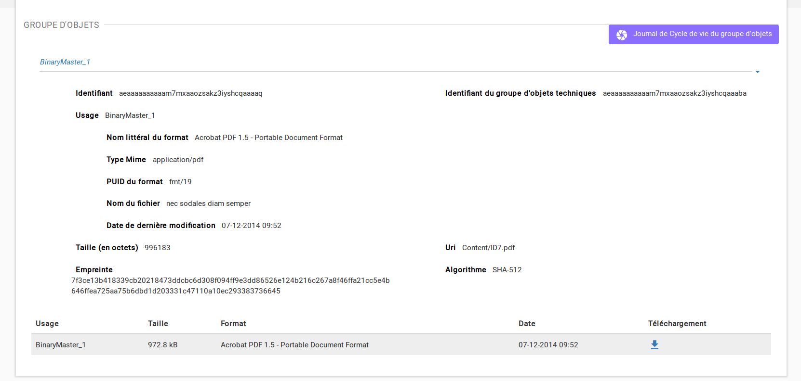
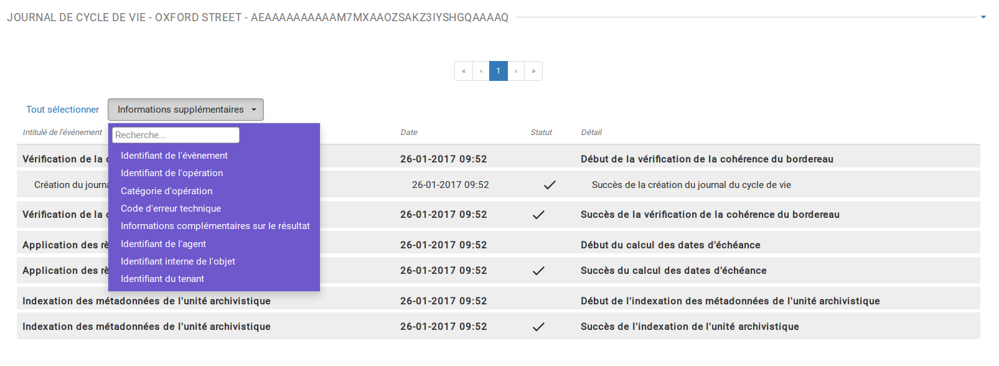
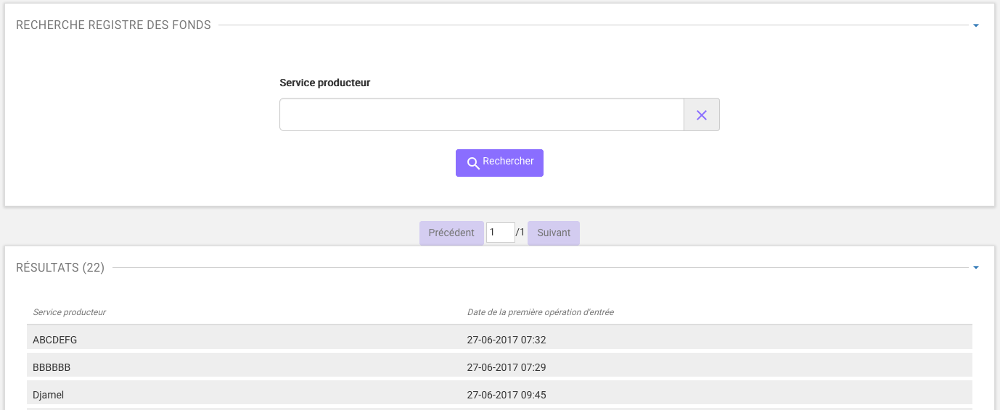
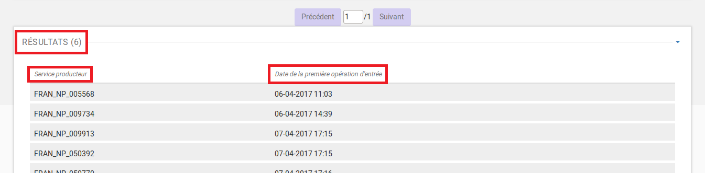
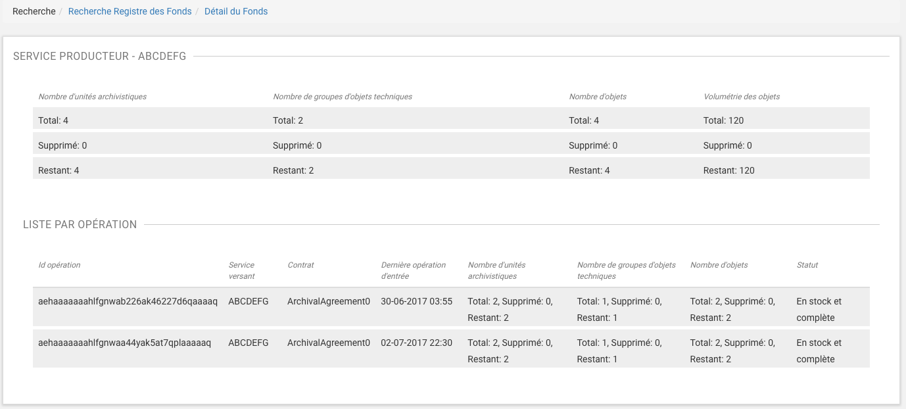
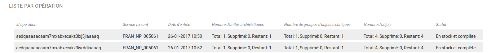

Recherche et consultation
#########################

Cette partie décrit les fonctionnalités de recherche et de consultation d'une unité archivistique dans la solution logicielle Vitam.

Recherche d'une unité archivistique
===================================

La recherche d'une unité archivistique s'effectue depuis le menu "Recherche d'archives". 

.. image:: images/menu_recherche.jpg

L'accès à deux modes de recherche est proposé sur la page "Recherche d'archives" : 

- l'un simple, de type recherche libre
- l'autre, complexe ciblant certains types de métadonnées. 
  
Chacun de ces modes est accessible par un onglet spécifique.

Par défaut, le mode recherche simple est affiché.

.. image:: images/recherche_simple.png

En cliquant sur l'onglet "Recherche avancée", la page affiche le formulaire de recherche avancée.

.. image:: images/recherche_avancee.png

Recherche simple
----------------

Pour effectuer une recherche simple, l'utilisateur saisit un ou plusieurs mots dans le champ de recherche puis presse la touche "Entrée" de son clavier ou clique sur le bouton "Rechercher". 
Le ou les mots saisis vont être recherchés dans les métadonnées "Titre" et "Description" des unités archivistiques. La recherche simple s'effectue sur chacun des mots entrés de manière indépendante et permet de trouver les mots appartenant à l'un, à l'autre, ou aux deux ensembles de métadonnées visés. Il n’est pas possible de la paramétrer.

.. image:: images/search_v1.png

Lorsqu'une recherche libre est effectuée, tous les résultats comprenant la chaîne de caractères demandée seront remontés. Exemple : pour une recheche du mot "acte" sera remonté "acte de naissance" ou "Divers actes de mariage".

Les caractéristiques du mode de recherche sont les suivantes :

- La recherche n'est pas sensible à la casse
- Les résultats ne tiennent pas compte des accents / c cédilles (ç)
- Les résultats ignorent les caractères spéciaux

Recherche avancée
-----------------

La recherche avancée permet à l'utilisateur d'effectuer sa requête dans un ou plusieurs champs précis de l'unité archivistique.

Le ou les mots saisis vont être recherchés dans les métadonnées suivantes :

- Titre de l'unité archivistique
- Description de l'unité archivistique
- Idetifiant de l'unité archivistiques (attribué par le système)
- Dates extrêmes (Date de début et date de fin)

Pour initier la recherche avancée, l'utilisateur saisit ses éléments dans les champs disponibles, puis clique sur le bouton "Rechercher".

.. image:: images/search_v2.png

NB 1 : lorsqu'un utilisateur souhaite faire une recherche par dates extrêmes, un contrôle sur ces dates est effectué :

- la date de début doit être antérieure à la date de fin
- les deux champs dates doivent être renseignés

Dans le cas contraire, un message d'erreur est affiché.

.. image:: images/date_KO.png

NB 2 : La recherche par ID est particulière. L'identifiant étant unique, il n'est pas possible d'effectuer une recherche croisée par ID et tout autre champ. L'ID est l'identifiant système attribué par VITAM (SystemId) et peut être retrouvé via la notification (ATR).

Résultats de recherche
----------------------

Suite à une recherche, les résultats se présentent sous forme de tableau affichant les informations suivantes :

- ID
- Titre
- Date
- Objet(s) disponible(s) (une coche est affichée si l'unité archivistique dispose d'un ou de plusieurs objets (dans le cas contraire, une croix est affichée).

Dans le cas où la recherche ne donne pas de résultat, un message informatif est remonté à l'utilisateur.

Consultation du détail d'une unité archivistique
================================================

Depuis la liste des résultats, l'utilisateur peut consulter le détail d'une unité archivistique en cliquant sur la ligne voulue.

Ce détail s'affiche dans un nouvel onglet, afin de préserver la liste des résultats de recherche.

Détail de l'unité archivistique
-------------------------------

Cet écran affiche les informations concernant l'unité archivistique et le groupe d'objets associé, informations contenues dans le bordereau SEDA et récupérées lors de l'entrée de l'unité archivitique dans la solution logicielle Vitam.

En premier, s'affiche la ou les arborescences de l'unité archivistique.
Il est possible de cliquer sur les noeuds de l'arborecsence pour naviguer entre les unités archivistiques pères.

Les blocs "Description" et "Gestion" affichent les métadonnées descriptives et de gestion relatives à l'unité archivistique.

Les métadonnées descriptives, excepté l'ID, peuvent être modifiées en cliquant sur le bouton "Modifier".

Chaque ligne pouvant ainsi être éditée.

.. image:: images/detail_v1.jpg

Une fois les modifications saisies, en cliquant sur le bouton "Sauvegarder" permet de les sauvegarder celles-ci et met à jour les métadonnées.
Une fois les modification des métadonnées effectuées, les anciennes valeurs sont enregistrées  à titre informatif dans le Journal du cycle de vie correspondant.

.. image:: images/detail_v2.jpg

Si des règles de gestion s'appliquent à l'unité archivistique, alors celles-ci sont listées parmi les catégorie suivantes :

- Règle de durée d'utilité administrative
- Règle de délais de communicabilité
- Règle de durée d'utilité courante
- Règle de délais de diffusion
- Règle de durée de réutilisation
- Règle de durée de classification

Ces règles ont les attributs suivants :

- Intitulé : le code affecté à la règle appliquée à cette unité. Par exemple ACC-00010 pour la règle de communicabilité des informations portant atteinte au secret médical (date de décès de l’intéressé)
- Date de début : date d'application de la règle
- Date de fin : date d'application de la règle
- Sort final : optionnel, dans le cas où la règle possède un sort final

Si des objets sont disponibles, le bloc "Groupe d'objets" affiche le ou les objets présents dans le groupe d'objets ainsi que les métadonnées associées pour cette unité archivistique.

Chaque objet est listé dans une ligne du tableau, Les colonnes affichent les informations suivantes :

- l'usage de l'objet, correspond aux utilisations de l'objet (consultation, conservation, etc.)
- la taille de l'objet
- l'extension du format de l'objet
- la date de dernière modification
- une icône téléchargement : une icône, flèche bleue pointant vers le bas, permet de consulter l'objet.

Journaux du cycle de vie
========================

Une fois le processus d'entrée d'un SIP terminé avec succès, pour chaque nouvelle unité archivistique et groupe d'objets créés, un journal du cycle de vie est généré.
Il trace tous les événements qui impactent l'unité archivistique et les objets, dès leur prise en charge dans la solution logicielle Vitam.

Journal du cycle du vie d'une unité archivistique
-------------------------------------------------

Le journal du cycle du vie de l'unité archivistique est disponible depuis son détail en cliquant sur l'icône "Journal du cycle de vie".

.. image:: images/JCV_AU_bouton.jpg

Après avoir cliqué, un nouvel onglet s'ouvre avec le détail du journal du cycle de vie. Le titre de la page est constitué de l'identifiant de l'unité archivistique.

Par défaut, l'écran du journal du cycle de vie de l'unité archivistique affiche les informations suivantes :

- Intitulé de l'événement
- Date de fin de l'événement
- Statut de l'événement
- Détail de l'événement

.. image:: images/JCV_AU.png

S'il le souhaite, l'utilisateur peut sélectionner la totalité des informations disponibles du journal du cycle de vie de l'unité archivistique en cliquant sur le bouton "Tout sélectionner" ou en choisissant les options souhaitées dans la liste déroulante.

La liste déroulante contient les champs suivants :

- Identifiant de l'évènement
- Identifiant de l'opération
- Catégorie d'opération
- Code d'erreur technique
- Informations complémentaires sur le résultat
- Identifiant de l'agent (réalisant l'opération)
- Identifiant interne de l'unité archivistique
- Identifiant du tenant (technique)

Journal du cycle de vie du groupe d'objet
-----------------------------------------

Le journal du cycle de vie du groupe d'objets est disponible depuis le détail de l'unité archivistique, dans la partie groupe d"objets.

.. image:: images/JCV_GO_bouton.jpg

Pour y accéder, l'utilisateur clique sur le bouton "Journal du cycle de vie du groupe d'objets".

Par défaut, l'écran du journal du cycle de vie du groupe d'objets affiche les informations suivantes :

- Intitulé de l'événement
- Date de fin de l'événement
- Statut de l'événement
- Détail de l'événement

.. image:: images/JCV_GO.jpg

S'il le souhaite, l'utilisateur peut sélectionner la totalité des informations disponibles dans le journal du cycle de vie de l'unité archivistique en cliquant sur le bouton "Tout sélectionner" ou en choisissant les options souhaitées dans la liste déroulante.

La liste déroulante contient les champs suivants :

- Identifiant de l'évènement
- Identifiant de l'opération
- Catégorie d'opération
- Code d'erreur technique
- Informations complémentaires sur le résultat
- Identifiant de l'agent réalisant l'opération
- Identifiant interne de l'objet
- Identifiant du tenant (technique)

Registre des fonds
==================

Le registre des fonds a pour but de :

- fournir une vue globale et dynamique de l'ensemble des archives, placées sous la responsabilité du service d'archives
- permettre d'effectuer des recherches dans les archives en prenant pour critère l'origine de celles-ci, le service producteur

Recherche dans le registre des fonds
------------------------------------

Pour y accéder, l'utilisateur clique sur "Recherche" dans le barre de menu puis sur "Registre des fonds" dans le sous-menu associé.

.. image:: images/menu_registre.jpg

La recherche dans le registre des fonds s'effectue en utilisant le champ principal de façon stricte. Le mot saisi (service producteur) va rechercher le service producteur associé.

Pour initier la recherche, l'utilisateur presse la touche "Entrée" de son clavier ou clique sur le bouton "Rechercher".

Affichage de la liste des résultats
-----------------------------------

Suite à une recherche, les résultats se présentent sous forme de tableau affichant les informations suivantes :

- Service producteur
- Date de la première opération d'entrée

Consultation du détail
----------------------

Depuis la liste des résultats, l'utilisateur peut consulter le détail du registre des fonds pour un service producteur en cliquant sur la ligne voulue.

La consultation de ce détail s'affiche dans un nouvel onglet, afin de préserver la liste des résultats de recherche.

Deux blocs d'informations sont disponibles depuis le détail du registre des fonds :

- Une vue regroupant toutes les unités archivistiques, groupes d'objets et objets pour un service producteur
- Une vue listant toutes les opérations d'entrée effectuées pour ce service producteur

Cette vue affiche, sous forme de tableau, les informations consolidées suivantes pour ce service producteur :

- nombre d'unités archivistiques

  - Total : Nombre d'unités archivistiques entrées dans la solution logicielle Vitam
  - Supprimé : Nombre d'unités archivistiques supprimées de la solution logicielle Vitam
  - Restant : Nombre d'unités archivistiques restantes dans la solution logicielle Vitam

.. image:: images/registre_detail_service.jpg

- nombre de groupes d'objets

  - Total : Nombre de groupes d'objets entrés dans la solution logicielle Vitam
  - Supprimé : Nombre de groupes d'objets supprimés de la solution logicielle Vitam
  - Restant : Nombre de groupes d'objets restant dans la solution logicielle Vitam

- nombre d'objets

  - Total : Nombre d'objets entrés dans la solution logicielle Vitam
  - Supprimé : Nombre d'objets supprimés de la solution logicielle Vitam
  - Restant : Nombre d'objets restant dans la solution logicielle Vitam

- volumétrie des objets

  - Total : Volume total des objets entrés dans la solution logicielle Vitam
  - Supprimé : Volume total des objets supprimés de la solution logicielle Vitam
  - Restant : Volume total des objets restant dans la solution logicielle Vitam

Cette vue affiche sous forme de tableau, les entrées effectuées pour ce service producteur.

Pour chaque entrée, les informations suivantes sont affichées :

- Identifiant de l'opération attribué par la solution logicielle Vitam (cet identifiant correspond au contenu du champ MessageIdentifier de la notification d'entrée)
- Service versant
- Contrat correspondant au contrat d'entrée appliqué lors du versement du SIP
- Date d'entrée
- Nombre d'unités archivistiques

  - Total : Nombre d'unités archivistiques entrées dans la solution logicielle Vitam
  - Supprimé : Nombre d'unités archivistiques supprimées de la solution logicielle Vitam
  - Restant : Nombre d'unités archivistiques restant dans la solution logicielle Vitam

- nombre de groupes d'objets

  - Total : Nombre de groupes d'objets entrés dans la solution logicielle Vitam
  - Supprimé : Nombre de groupes d'objets supprimés de la solution logicielle Vitam
  - Restant : Nombre de groupe d'objets restant dans la solution logicielle Vitam

- nombre d'objets

  - Total : Nombre d'objets entrés dans la solution logicielle Vitam
  - Supprimé : Nombre d'objets supprimés de la solution logicielle Vitam
  - Restant : Nombre d'objets restant dans la solution logicielle Vitam

- volumétrie des objets

  - Total : Volume total des objets entrés dans la solution logicielle Vitam
  - Supprimé : Volume total des objets supprimés de la solution logicielle Vitam
  - Restant : Volume total des objets restant dans la solution logicielle Vitam
