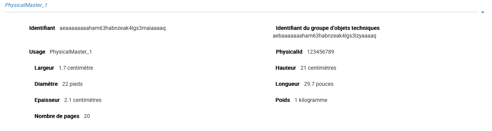

Par défaut, les services producteurs sont affichés sous le formulaire de recherche et sont classées par ordre alphabétique de leur intitulé.
#########################

Cette partie décrit les fonctionnalités de recherche et de consultation d'une unité archivistique dans la solution logicielle Vitam.

Recherche d'une unité archivistique
===================================

Pour consulter la recherche d'une unité archivistique, l'utilisateur survole le menu "Recherche", puis sélectionne "Recherche d'archives".

.. image:: images/menu_au.png

L'accès à deux modes de recherche est proposé sur la page "Recherche d'archives" :

- l'un simple, de type recherche libre
- l'autre, complexe ciblant certains types de métadonnées.

Chacun de ces modes est accessible par un onglet spécifique.

Par défaut, le mode recherche simple est affiché.

.. image:: images/au_rechchs.png

En cliquant sur l'onglet "Recherche avancée", la page affiche le formulaire de recherche avancée.

.. image:: images/au_rechcha.png

Recherche simple
----------------

Pour effectuer une recherche simple, l'utilisateur saisit un ou plusieurs mots dans le champ de recherche puis presse la touche "Entrée" de son clavier ou clique sur le bouton "Rechercher".
Le ou les mots saisis vont être recherchés dans les métadonnées "Titre" et "Description" des unités archivistiques. La recherche simple s'effectue sur chacun des mots entrés de manière indépendante (réalisé avec un opérateur "OU") et permet de trouver les mots appartenant à l'un, à l'autre, ou aux deux ensembles de métadonnées visés. Il n’est pas possible de la paramétrer.
Par exemple, une recherche "département gironde" retournera des résultats comprenant le mot "département" ou le mot  "gironde".

Lorsqu'une recherche libre est effectuée, tous les résultats comprenant la chaîne de caractères demandée seront remontés. Exemple : pour une recherche du mot "acte" sera remonté "acte de naissance" ou "Divers actes de mariage".

Les caractéristiques du mode de recherche sont les suivantes :

- La recherche n'est pas sensible à la casse
- Les résultats ne tiennent pas compte des accents ou graphèmes divers (ç, ß, etc.)
- Les résultats ignorent les caractères spéciaux

Recherche avancée
-----------------

La recherche avancée permet à l'utilisateur d'effectuer sa requête dans un ou plusieurs champs précis de l'unité archivistique.

Le ou les mots saisis vont être recherchés dans les métadonnées suivantes :

- Intitulé de l'unité archivistique
- Description de l'unité archivistique
- Identifiant de l'unité archivistique (attribué par le système)
- Dates extrêmes (Date de début et date de fin)

Pour initier la recherche avancée, l'utilisateur saisit ses éléments dans les champs disponibles, puis clique sur le bouton "Rechercher".

NB 1 : lorsqu'un utilisateur souhaite faire une recherche par dates extrêmes, un contrôle sur ces dates est effectué :

- la date de début doit être antérieure à la date de fin
- les deux champs dates doivent être renseignés

Dans le cas contraire, un message d'erreur est affiché.

.. image:: images/au_date_ko.png

NB 2 : La recherche par identifiant est particulière. L'identifiant étant unique, il n'est pas possible d'effectuer une recherche croisée par identifiant et tout autre champ. L'identifiant est l'identifiant système attribué par VITAM (SystemId) et peut être retrouvé via la notification (ATR).

Résultats de recherche
----------------------

Suite à une recherche, les résultats se présentent sous forme de tableau et affichent les informations suivantes :

- Identifiant
- Intitulé
- Type
- Service producteur
- Date de début
- Date de fin
- Objet(s) disponible(s) (une coche est affichée si l'unité archivistique dispose d'un ou de plusieurs objets, dans le cas contraire, une croix est affichée)
- Cycle de vie

.. image:: images/res_au.png

Lors d'une recherche infructueuse, le message "Aucun résultat" s'affiche sous le formulaire.

.. image:: images/au_res_ko.png

Consultation du détail d'une unité archivistique
================================================

Depuis la liste des résultats, l'utilisateur peut consulter le détail d'une unité archivistique en cliquant sur la ligne voulue.

La page se recharge et le détail s'affiche.

Détail de l'unité archivistique
-------------------------------

Cet écran affiche les informations concernant l'unité archivistique et le groupe d'objets associé, informations contenues dans le bordereau SEDA et récupérées lors de l'entrée de l'unité archivistique dans la solution logicielle Vitam.

La page est divisée en plusieurs parties :

**Contexte de l'unité archivistique**

Elle affiche l'arborescence montante et descendante de l'unité archivistique.
Il est possible de cliquer sur les nœuds de l'arborescence pour naviguer entre les unités archivistiques.
L'unité archivistique dont le détail affichée affiche un pictogramme de maison à gauche.

.. image:: images/au_arbo.png

**Description principale**

Elle affiche les métadonnées descriptives et de gestion relatives à l'unité archivistique.

Concernant les services producteurs, il faut différencier :

 - Identifiant service producteur, le service producteur de l'unité archivistique, repris du bloc <content> du bordereau
 - Service producteur de l'entrée, l'information correspondant à la valeur de l'OriginatingAgencyIdentifier déclarée dans le SIP
 - Services producteurs ayant des droits sur l'entrée, correspondants aux services producteur de l'entrée et à ceux des entrées des parents auxquels des unités archivistiques ont été rattachées
 
 .. image:: images/au_desc.png

**Description complémentaire**

Elle affiche le titre et la description de l'unité archivistique.

La plupart des métadonnées descriptives peuvent être modifiées en cliquant sur le bouton "Modifier".

.. image:: images/detail_modification.png

Chaque ligne devient alors éditable.

.. image:: images/au_desc_c.png

Une fois les modifications saisies, un clic sur le bouton "Enregistrer" permet de les sauvegarder et met à jour les métadonnées.
Une fois les modifications des métadonnées effectuées, les anciennes valeurs sont enregistrées  à titre informatif dans le Journal du cycle de vie correspondant.

**Règles de gestion**

.. image:: images/au_rg.png

Si des règles de gestion s'appliquent à l'unité archivistique, alors celles-ci sont listées parmi les catégories suivantes :

- Règle de durée d'utilité administrative
- Règle de délais de communicabilité
- Règle de durée d'utilité courante
- Règle de délais de diffusion
- Règle de durée de réutilisation
- Règle de durée de classification

Ces règles ont les attributs suivants :

- Intitulé : le code affecté à la règle appliquée à cette unité. Par exemple ACC-00010 pour la règle de communicabilité des informations portant atteinte au secret médical (date de décès de l’intéressé)
- Date de début : date du début d'application de la règle
- Date de fin : date de fin d'application de la règle
- Sort final : optionnel, dans le cas où la règle possède un sort final

Le fait qu'une ou plusieurs règles soient bloquées est affiché au travers deux mentions :

- "Règle désactivée" liste les identifiants des règles, provenant des parents, et qui ne sont plus appliquées à partir de cette unité archivistique.

- "Cette unité archivistique n'hérite d'aucune règle" indique que toutes les règles de cette catégorie (DUA, DUC, Règle de communicabilité, etc.) provenant des parents ne sont plus appliquées à partir de cette unité archivistique.

Chaque règle possède un détail qu'il est possible de consulter en cliquant sur la ligne de la règle en question. Ce détail reprend l'ensemble des valeurs déclarées pour la règle.
La ligne "hérité de" indique quelle unité archivistique est à l'origine de l'application de la règle sur l'unité consultée. Cette origine est cliquable et mène sur le détail de l'unité mentionnée.

Les règles de gestion non héritées peuvent être modifiées ou supprimées en cliquant sur le bouton "Modifier".

.. image:: images/au_rg_modif.png

Il est possible d'ajouter une ou plusieurs règles de gestion à toutes les catégories disponibles.

.. image:: images/au_rg_ajout.png

Dans cet exemple, une règle est héritée et donc non modifiable, tandis que la seconde est modifiable.

.. image:: images/au_rg_nv.png

Un clic sur le bouton "ajouter règle" crée une nouvelle ligne permettant la création d'une règle de gestion.

.. image:: images/au_rg_supp.png

La suppressiond'une règle s'effectue en cliquant sur la corbeille. Il est possible d'annuler l'action de suppression avant la validation des modifications en cliquant sur le pictogramme "+" situé à droite.

Une fois les modifications saisies, un clic sur le bouton "Sauvegarder" ouvre une fenêtre modale afin de vérifier vos modifcations. Une fois le bouton "Modifier" sélectionné les règles de gestion sont mises à jour et sauvegardées.

.. image:: images/au_rg_pop.png

.. image:: images/au_rg_ok.png

**Groupe d'objets techniques**

Si des objets sont disponibles, le bloc "Groupe d'objets" affiche le ou les objets présents dans le groupe d'objets ainsi que les métadonnées associées pour cette unité archivistique.

Chaque objet est listé dans une ligne du tableau, Les colonnes affichent les informations suivantes :

- Usage, l'usage de l'objet, correspond aux utilisations de l'objet (consultation, conservation, etc.)
- Taille, la taille de l'objet en bytes
- Format, l'extension du format de l'objet
- Date, la date de dernière modification
- Téléchargement, un clic sur icône de téléchargement permet de consulter l'objet.

.. image:: images/au_got.png

En ce qui concerne les objets physiques, les colonnes n'affichent que l'information suivante :

- Usage

Les unités disponibles sont celles répertoriées par l'UNECE.

**Export DIP**

Il est possible d'exporter l'unité archivistique sous forme de DIP. Trois choix d'exports sont disponibles :

- Unité archivistique
- Unité archivistique et sa descendance
- Ensemble de l'entrée

.. image:: images/au_dip.png

Journaux du cycle de vie
========================

Une fois le processus d'entrée d'un SIP terminé avec succès, pour chaque nouvelle unité archivistique et groupe d'objets créés, un journal du cycle de vie est généré.
Il trace tous les événements qui impactent l'unité archivistique et les objets, dès leur prise en charge dans la solution logicielle Vitam.

Journal du cycle de vie d'une unité archivistique
-------------------------------------------------

Le journal du cycle de vie de l'unité archivistique est disponible depuis son détail en cliquant sur l'icône "Journal du cycle de vie".

.. image:: images/au_bt_lfca.png

Après avoir cliqué, un nouvel onglet s'ouvre avec le détail du journal du cycle de vie. Le titre de la page est constitué du titre de l'unité archivistique ainsi que de son identifiant.

Par défaut, l'écran du journal du cycle de vie de l'unité archivistique affiche les informations suivantes :

- Intitulé de l'événement
- Date de fin de l'événement
- Statut de l'événement
- Message de l'événement

.. image:: images/lfc_au.png

S'il le souhaite, l'utilisateur peut sélectionner des informations disponibles du journal du cycle de vie de l'unité archivistique en cliquant sur le bouton "Informations supplémentaires" et en choisissant les options souhaitées dans la liste déroulante.

La liste déroulante contient les champs suivants :

- Identifiant de l'évènement
- Identifiant de l'opération
- Catégorie d'opération
- Code d'erreur technique
- Détails de l'événement
- Identifiant de l'agent (réalisant l'opération)
- Identifiant interne de l'objet
- Identifiant du tenant (technique)

Journal du cycle de vie du groupe d'objet
-----------------------------------------

Le journal du cycle de vie du groupe d'objets est disponible depuis le détail de l'unité archivistique, dans la partie groupe d'objets.

.. image:: images/au_bt_lfcg.png

Pour y accéder, l'utilisateur clique sur le bouton "Journal du cycle de vie du groupe d'objets".

Par défaut, l'écran du journal du cycle de vie du groupe d'objets affiche les informations suivantes :

- Intitulé de l'événement
- Date de fin de l'événement
- Statut de l'événement
- Message de l'événement

.. image:: images/lfc_au.png

S'il le souhaite, l'utilisateur peut sélectionner des informations disponibles du journal du cycle de vie du groupe d'objet en cliquant sur le bouton "Informations supplémentaires" et en choisissant les options souhaitées dans la liste déroulante.

La liste déroulante contient les champs suivants :

- Identifiant de l'évènement
- Identifiant de l'opération
- Catégorie d'opération
- Code d'erreur technique
- Détails de l'événement
- Identifiant de l'agent réalisant l'opération
- Identifiant interne de l'objet
- Identifiant du tenant (technique)

Recherche par service producteur
================================

Le registre des fonds a pour but de :

- fournir une vue globale et dynamique de l'ensemble des archives, placées sous la responsabilité du service d'archives
- permettre d'effectuer des recherches dans les archives en prenant pour critère l'origine de celles-ci, le service producteur

Recherche
----------

Pour y accéder, l'utilisateur survole le menu "Recherche", puis sélectionne "Recherche par service producteur".

.. image:: images/menu_sp.png

Par défaut, les services producteurs sont affichés sous le formulaire de recherche et sont classées par ordre alphabétique de leur intitulé.

Pour effectuer une recherche précise, on utilise le champ "Identifiant".

NB : La recherche n'a pas besoin d'être exacte. L'utilisateur peut saisir une chaîne de caractères avec ou sans accent, des mots au singulier comme au pluriel, voir même avec une légère tolérance de faute.

Pour initier la recherche, l'utilisateur saisit ses critères de recherche et clique sur le bouton "Rechercher".
La liste du référentiel est alors actualisée avec les résultats correspondants à la recherche souhaitée.

.. image:: images/registre_recherche.png

Affichage de la liste des résultats
-----------------------------------

Suite à une recherche, les résultats se présentent sous forme de tableau affichant les informations suivantes :

- Intitulé
- Identifiant
- Description

.. image:: images/registre_resultats.png

Consultation du détail
----------------------

Depuis la liste des résultats, l'utilisateur peut consulter le détail du service producteur des fonds pour un service producteur en cliquant sur la ligne voulue. Puis il clique sur le bouton "Registre des fonds" afin d'affichre le détail complet.

.. image:: images/detail_sp.png

Consultation du registre des fonds
----------------------------------

Depuis le détail du service agent, l'utilisateur peut consulter le registre des fonds de ce service.

Deux blocs d'informations sont disponibles depuis le détail du registre des fonds :

- Une vue regroupant toutes les unités archivistiques, groupes d'objets et objets pour un service producteur
- Une vue listant toutes les opérations d'entrée effectuées pour ce service producteur

.. image:: images/fonds_detail.png

Cette vue affiche, sous forme de tableau, les informations consolidées suivantes pour ce service producteur :

- nombre d'unités archivistiques

  - Total : Nombre d'unités archivistiques entrées dans la solution logicielle Vitam
  - Supprimé : Nombre d'unités archivistiques supprimées de la solution logicielle Vitam
  - Restant : Nombre d'unités archivistiques restantes dans la solution logicielle Vitam

- nombre de groupes d'objets

  - Total : Nombre de groupes d'objets entrés dans la solution logicielle Vitam
  - Supprimé : Nombre de groupes d'objets supprimés de la solution logicielle Vitam
  - Restant : Nombre de groupes d'objets restant dans la solution logicielle Vitam

- nombre d'objets

  - Total : Nombre d'objets entrés dans la solution logicielle Vitam
  - Supprimé : Nombre d'objets supprimés de la solution logicielle Vitam
  - Restant : Nombre d'objets restant dans la solution logicielle Vitam

- volumétrie des objets

  - Total : Volume total des objets entrés dans la solution logicielle Vitam
  - Supprimé : Volume total des objets supprimés de la solution logicielle Vitam
  - Restant : Volume total des objets restant dans la solution logicielle Vitam

.. image:: images/fonds_operation.png

Cette vue affiche sous forme de tableau, les entrées effectuées pour ce service producteur.

Pour chaque entrée, les informations suivantes sont affichées :

- Identifiant de l'opération attribué par la solution logicielle Vitam (cet identifiant correspond au contenu du champ MessageIdentifier de la notification d'entrée)
- Service versant
- Contrat correspondant au contrat d'entrée appliqué lors du versement du SIP
- Dernière opération d'entrée, date de la dernière opération d'entrée
- Nombre d'unités archivistiques

  - Total : Nombre d'unités archivistiques entrées dans la solution logicielle Vitam
  - Supprimé : Nombre d'unités archivistiques supprimées de la solution logicielle Vitam
  - Restant : Nombre d'unités archivistiques restantes dans la solution logicielle Vitam

- nombre de groupes d'objets

  - Total : Nombre de groupes d'objets entrés dans la solution logicielle Vitam
  - Supprimé : Nombre de groupes d'objets supprimés de la solution logicielle Vitam
  - Restant : Nombre de groupe d'objets restant dans la solution logicielle Vitam

- nombre d'objets

  - Total : Nombre d'objets entrés dans la solution logicielle Vitam
  - Supprimé : Nombre d'objets supprimés de la solution logicielle Vitam
  - Restant : Nombre d'objets restant dans la solution logicielle Vitam

- statut (En stock et complète, En stock et mise à jour, Sortie du stock)

