Recherche et consultation
#########################

Cette partie décrit les fonctionnalités de recherche et de consultation d'une unité archivistique dans Vitam.

NB : cette partie est disponible via l'IHM de démonstration.

Recherche d'une unité archivistique
===================================

La recherche d'une unité archivistique s'effectue depuis l'écran "Recherche d'archives". L'utilisateur clique sur "Recherche d'archives" dans la barre de menu.

L'accès à deux modes de recherche est proposé sur la page "Recherche d'archives" : l'un simple, de type recherche libre, l'autre, complexe ciblant certains types de métadonnées. Chacun de ces modes est accessible par un onglet spécifique.

Par défaut, le mode recherche simple est affiché.

Au clic sur l'onglet "Recherche avancée", la page affiche le formulaire de recherche complexe.

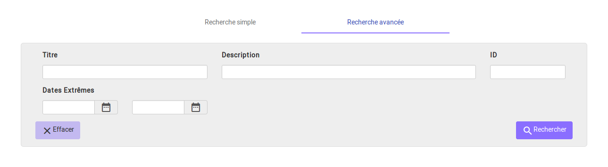

Recherche simple
----------------

La recherche simple s'effectue en utilisant le champ principal. Le ou les mots saisis vont être recherchés dans les métadonnées "Titre" et "Description" des unités archivistiques.
La recherche simple s'effectue sur chacun des mots entrés de manière indépendante.
La recherche permet de trouver les mots clés cherchés appartenant aux deux ensembles visés, titre et description, ou bien à l’un ou à l’autre. Il n’est pas possible de la paramétrer.

Pour initier la recherche simple, l'utilisateur presse la touche "Entrée" de son clavier ou clique sur le pictogramme de loupe. Un pictogramme en forme de croix permet de supprimer le texte saisi dans le champ de recherche.

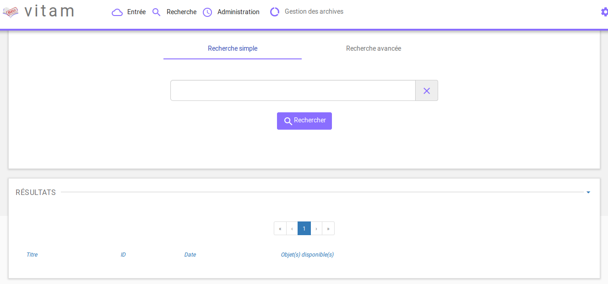

Lorsqu'une recherche libre est effectuée, tous les résultats comprenant la chaîne de caractères demandée sont remontés. Exemple : pour une recheche du mot "acte" sera remonté "acte de naissance" ou "Divers actes de mariage".

Les caractéristiques du mode de recherche sont les suivantes :

- La recherche n'est pas sensible à la casse
- Les résultats ne tiennent pas compte des accents / c cédilles (ç)
- Les résultats ignorent les caractères spéciaux

Recherche avancée
-----------------

La recherche avancée permet à l'utilisateur d'effectuer sa requête dans un ou plusieurs champs précis de l'unité archivistique.

Le ou les mots saisis vont être recherchés dans les métadonnées suivantes :

- Titre de l'unité archivistique
- Description de l'archive
- ID de l'archive (attribué par le système)
- Dates Extrêmes (Date de début et date de fin)

Pour initier la recherche avancée, l'utilisateur saisit ses éléments de recherche, puis clique sur le bouton "Rechercher".

Au clic sur le champ "Effacer", tous les champs dans lesquels des informations ont été saisies sont vidés de leurs contenus.

NB 1 : lorsqu'un utilisateur souhaite faire une recherche par dates extrêmes, un contrôle sur ces dates est effectué :

- la date de début doit être antérieure à la date de fin
- les deux champs dates doivent être renseignés

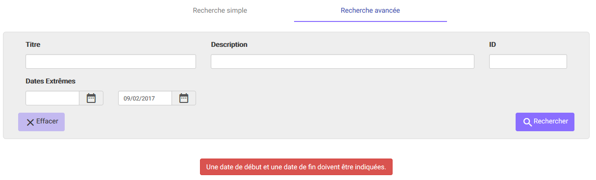

NB 2 : la recherche par ID est particulière. Ce dernier étant unique, il n'est pas possible d'effectuer une recherche croisée par ID et tout autre champ.

.. image:: images/search_v2.png

Résultats de recherche
----------------------

Suite à une recherche, les résultats se présentent sous forme de tableau affichant les informations suivantes :

- ID
- Titre
- Date de l'unité
- Objet disponible (une coche est affichée si l'unité archivistique dispose d'un ou des objets, dans le cas contraire, une croix est affichée)

L'îcone "Résultat (X)" indique le nombre de résultats trouvé lorsque l'utilisateur effectue une recherche.

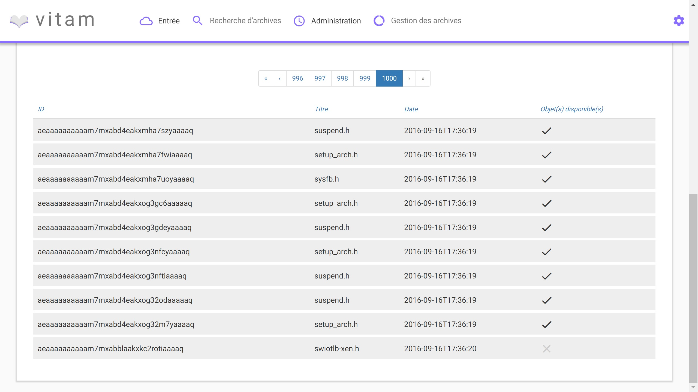

Dans le cas où la recherche ne donne pas de résultats, un message informatif est remonté à l'utilisateur.

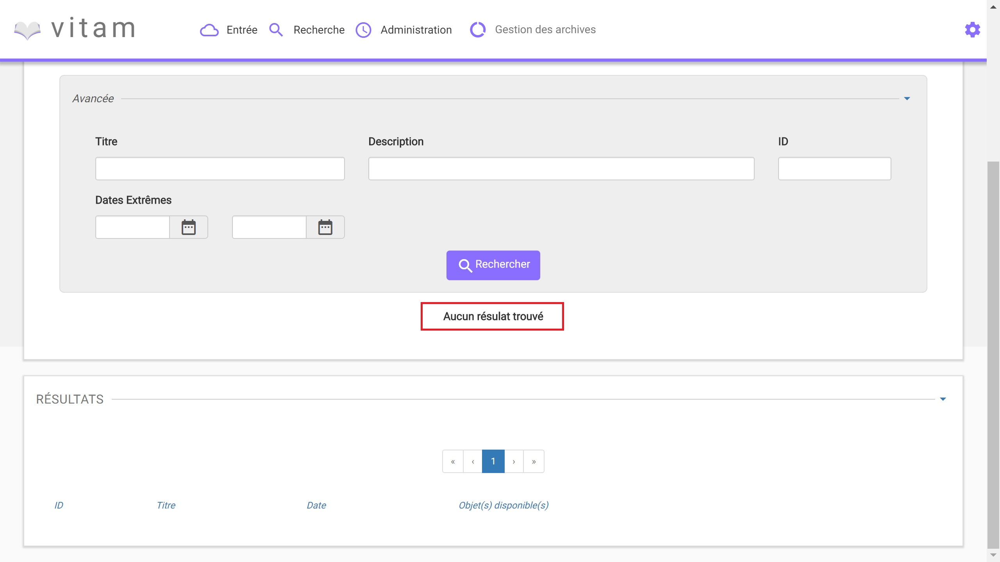

Consultation du détail d'une unité archivistique
================================================

Depuis la liste des résultats, l'utilisateur peut consulter le détail d'une unité archivistique en cliquant sur la ligne voulue.

La consultation de ce détail s'affiche dans un nouvel onglet, afin de préserver la liste des résultats de recherche.

Détail de l'Unité Archivistique
-------------------------------

Cet écran affiche les informations concernant l'unité archivistique et le groupe d'objets associé, informations contenues dans le bordereau SEDA et récupérées lors de l'entrée de l'unité dans Vitam.

En premier, s'affiche la ou les arborescences de l'unité archivistique.
Il est possible de cliquer sur les noeuds de l'arborecsence pour naviguer entre les unités archivistiques pères.

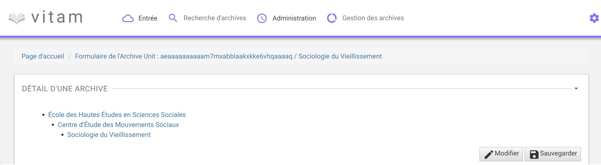

Les blocs "Description" et "Gestion" affichent les métadonnées descriptives et de gestion relatives à l'unité archivistique.

Les métadonnées (excepté l'ID) peuvent être modifiées en cliquant sur le bouton "Modifier", chaque ligne pouvant ainsi être éditée.
Une fois les modifications saisies, un clic sur le bouton "Enregistrer" sauvegarde celles-ci et met à jour les métadonnées.

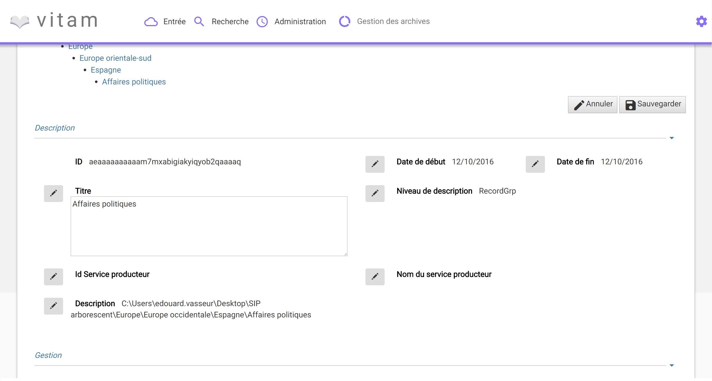

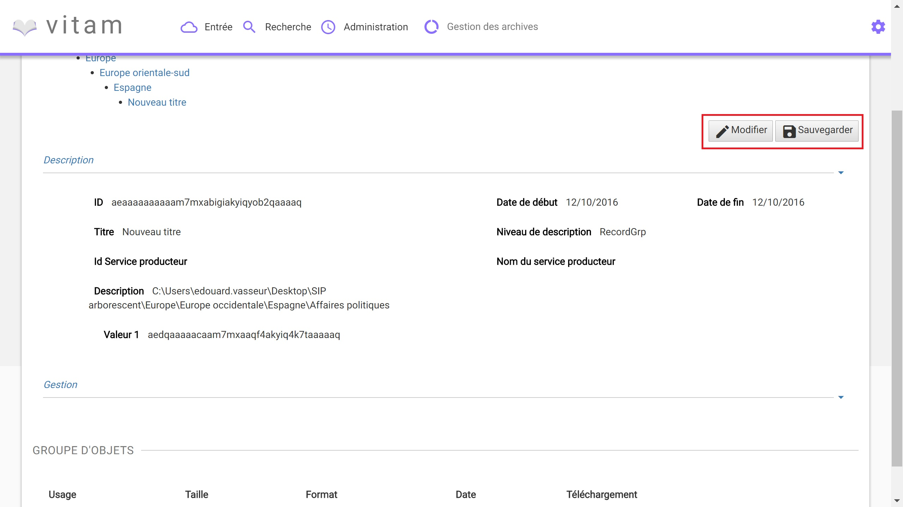

Si des objets sont disponibles, le bloc "Groupe d'Objets" affiche le ou les objets présents dans le groupe d'objets ainsi que les métadonnées associées.

Chaque objet est listé dans un tableau, une ligne du tableau correspondant à un objet. Les colonnes affichent les informations suivantes :

- l'usage de l'objet, correspond aux utilisations de l'objet (Consultation, conservation, etc.)
- la taille de l'objet
- l'extention du format de l'objet
- la date de dernière modification
- le téléchargement : une îcone ("flèche bleue pointant vers le bas") pour télécharger l'objet

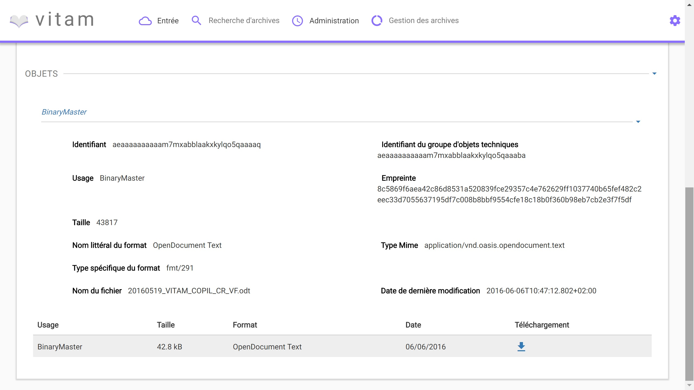

Journaux du Cycle de Vie
========================

Au moment de l'entrée, une fois le processus d'entrée terminé avec succès, pour chaque nouvelle unité archivistique et groupe d'objets créés, un journal du cycle de vie leur est généré.
Il trace tous les événements qui impactent l'unité archivistique et les objets, dès leur prise en charge dans le système.

Journal du cycle du vie d'une unité archivistique
-------------------------------------------------

Le journal du cycle du vie de l'unité archivistique est disponible depuis le détail de l'unité archivistique.

Pour y accéder, l'utilisateur clique sur le bouton "Journal du cycle de vie". Un nouvel onglet s'ouvre avec le journal du cycle de vie, le titre de la page reprenant l'ID de l'unité archivistique.

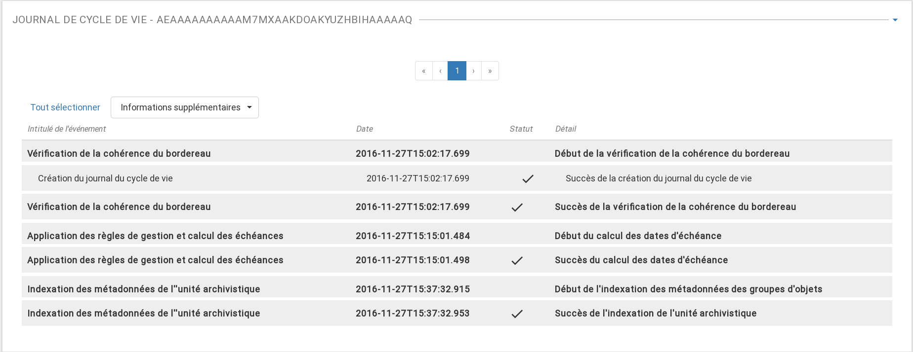

Par défaut, l'écran du journal du cycle de vie de l'unité archivistique affiche les informations suivantes :

- Intitulé de l'événement
- Date de fin de l'événement
- Statut de l'événement
- Détail de l'événement

L'utilisateur peut décider d'afficher plus d'informations en sélectionnant les colonnes qu'il veut voir apparaitre à l'écran.
Une liste déroulante ("Informations supplémentaires") est proposée afin de sélectionner les champs suivants :

- Identifiant de l'évènement
- Identifiant de l'opération
- Catégorie d'opération
- Code d'erreur technique
- Informations complémentaires sur le résultat
- Identifiant de l'agent réalisant l'opération
- Identifiant interne de l'unité archivistique
- Identifiant du tenant (technique)

NB : S'il le souhaite, l'utilisateur peut sélectionner la totalité des informations disponible du journal du cycle de vie de l'unité archivistique en cliquant sur le bouton "Tout sélectionner".

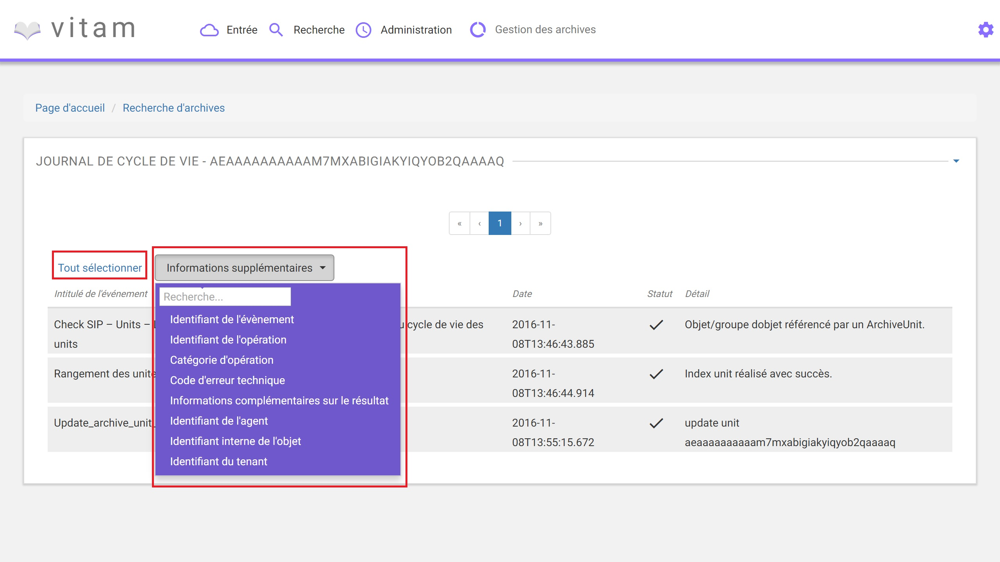

Journal du cycle de vie du groupe d'objet
-----------------------------------------

Le journal du cycle de vie du groupe d'objets est disponible depuis le détail de l'unité archivistique.

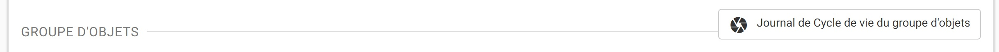

Pour y accéder, l'utilisateur clique sur le bouton "Journal du cycle de vie du groupe d'objets".

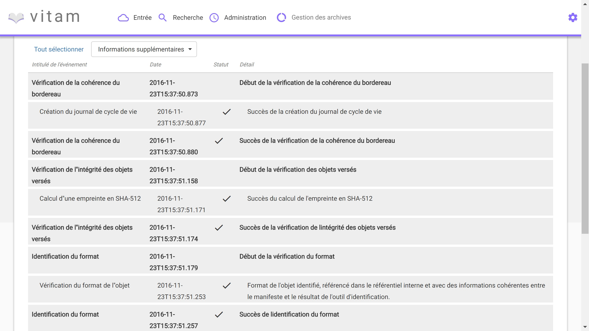

Par défaut, l'écran du journal du cycle de vie du groupe d'objets affiche les informations suivantes :

- Intitulé de l'événement
- Date de fin de l'événement
- Statut de l'événement
- Détail de l'événement

L'utilisateur peut décider d'afficher plus d'informations en sélectionnant les colonnes qu'il veut voir apparaitre à l'écran.
Une liste déroulante ("Informations supplémentaires") est proposée afin de sélectionner les champs suivants :

- Identifiant de l'évènement
- Identifiant de l'opération
- Catégorie d'opération
- Code d'erreur technique
- Informations complémentaires sur le résultat
- Identifiant de l'agent réalisant l'opération
- Identifiant interne de l'objet
- Identifiant du tenant (technique)

NB : S'il le souhaite, l'utilisateur peut sélectionner la totalité des informations disponibles du journal du cycle de vie du groupe d'objet en cliquant sur le bouton "Tout sélectionner".

Registre des fonds
==================

Le registre des fonds a pour but de :

- fournir une vue globale et dynamique de l'ensemble des archives, placées sous la responsabilité du service d'archives
- permettre d'effectuer des recherches dans les archives en prenant pour critère l'origine de celles-ci (service producteur)

Recherche dans le registre des fonds
------------------------------------

La recherche dans le registre des fonds s'effectue depuis l'écran "Recherche registre des fonds". Pour y accéder, l'utilisateur clique sur "Recherche" dans le barre de menu puis sur "Registre des fonds" dans le sous-menu associé.

La recherche dans le registre des fonds s'effectue en utilisant le champ principal de façon stricte. Le mot saisi (service producteur) va rechercher le service producteur associé.

Pour initier la recherche, l'utilisateur presse la touche "Entrée" de son clavier ou clique sur le pictogramme de loupe. Un pictogramme en forme de croix permet de supprimer le texte saisi dans le champ de recherche.

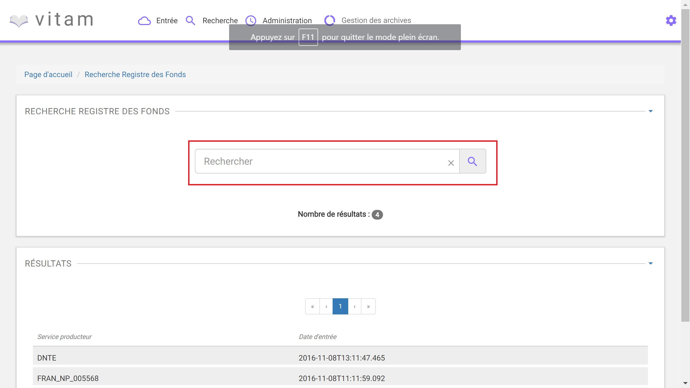

Affichage de la liste des résultats
-----------------------------------

Suite à une recherche, les résultats se présentent sous forme de tableau affichant les informations suivantes :

- Service producteur
- Date d'entrée

L'îcone "Nombre de résultats : (X)" indique le nombre de résultats trouvé lorsque l'utilisateur effectue une recherche.

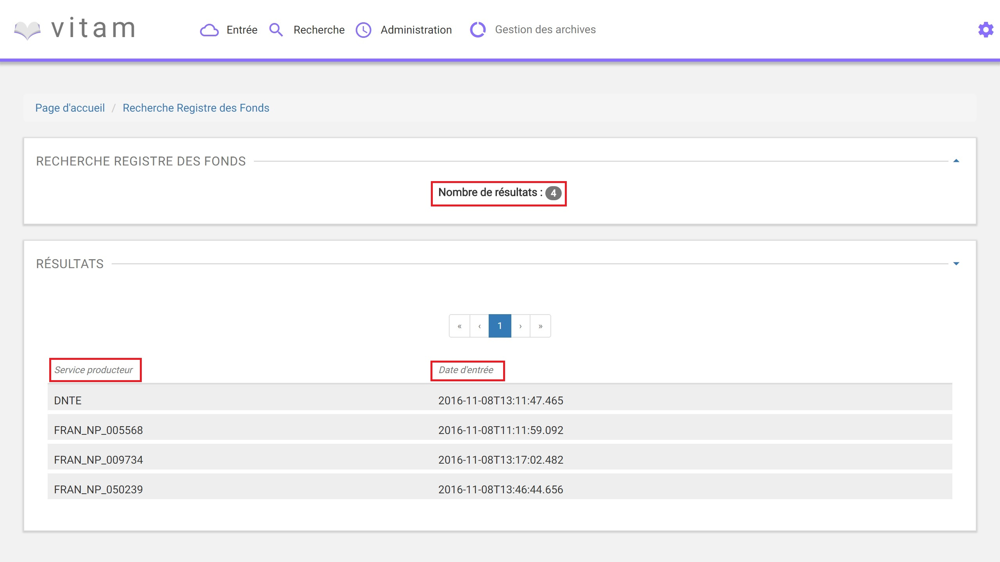

Consultation du détail
----------------------

Depuis la liste des résultats, l'utilisateur peut consulter le détail du registre des fonds par service producteur en cliquant sur la ligne voulue.

La consultation de ce détail s'affiche dans un nouvel onglet, afin de préserver la liste des résultats de recherche.

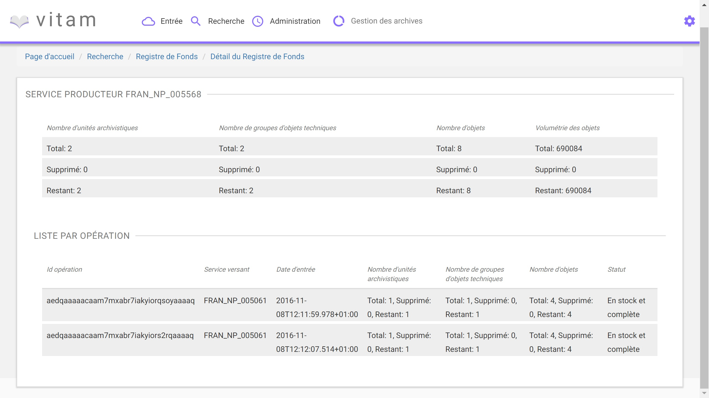

Deux blocs d'informations sont disponibles depuis le détail du registre des fonds :

- Une vue regroupant toutes les unités archivistiques, groupes d'objets et objets pour un service producteur
- Une vue listant toutes les opérations d'entrées effectuées pour ce service producteur

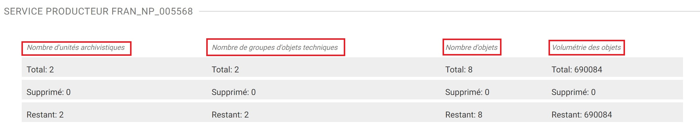

Cette vue affiche sous forme de tableau, les informations consolidées suivantes pour ce service producteur :

- nombre d'unités archivistiques

  - Total : Nombre d'unités archivistiques entrées dans le système
  - Supprimé : Nombre d'unités archivistiques supprimées du système
  - Restants : Nombre d'unités archivistiques restantes dans le système

- nombre de groupes d'objets

  - Total : Nombre de groupes d'objets entrés dans le système
  - Supprimé : Nombre de groupes d'objets supprimés du système
  - Restants : Nombre de groupe d'objets restants dans le système

- nombre d'objets

  - Total : Nombre d'objets entrés dans le système
  - Supprimé : Nombre d'objets supprimés du système
  - Restants : Nombre d'objets restants dans le système

- volumétrie des objets

  - Total : Volume total des objets entrés dans le système
  - Supprimé : Volume total des objets supprimés du système
  - Restants : Volume total des objets restants dans le système

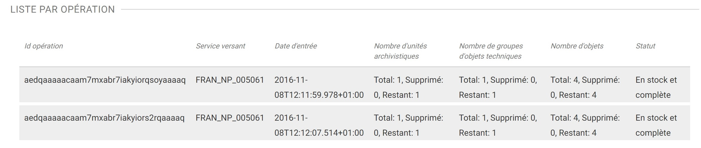

Cette vue affiche sous forme de tableau, les entrées effectuées pour ce service producteur.

Pour chaque entrée, les informations suivantes sont affichées :

- Identifiant de l'opération
- Service versant
- Date d'entrée
- nombre d'unités archivistiques

  - Total : Nombre d'unités archivistiques entrées dans le système
  - Supprimé : Nombre d'unités archivistiques supprimées du système
  - Restants : Nombre d'unités archivistiques restantes dans le système

- nombre de groupes d'objets

  - Total : Nombre de groupes d'objets entrés dans le système
  - Supprimé : Nombre de groupes d'objets supprimés du système
  - Restants : Nombre de groupe d'objets restants dans le système

- nombre d'objets

  - Total : Nombre d'objets entrés dans le système
  - Supprimé : Nombre d'objets supprimés du système
  - Restants : Nombre d'objets restants dans le système

- volumétrie des objets

  - Total : Volume total des objets entrés dans le système
  - Supprimé : Volume total des objets supprimés du système
  - Restants : Volume total des objets restants dans le système
