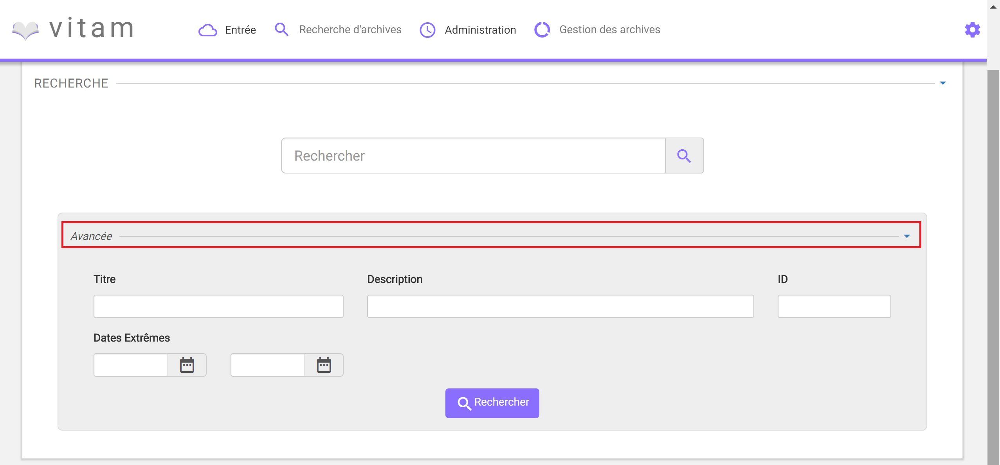
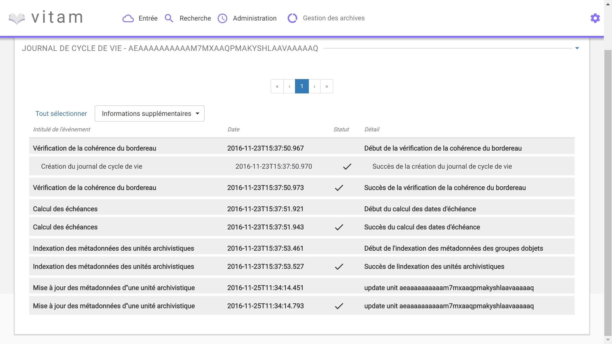

Recherche et consultation
#########################

Cette partie décrit les fonctionnalités de recherche et de consultation d'une unité archivistique dans Vitam.

Recherche d'une unité archivistique
===================================

La recherche d'une unité archivistique s'effectue depuis l'écran "Recherche d'archives"

.. image:: images/menu_recherche.jpg

Deux modes de recherche sont proposés sur la page "Recherche d'archives", l'un simple de type recherche libre (partie haute de la page), l'autre complexe ciblant certains types de métadonnées.

Par défaut, les deux modes de recherche sont affichés, il est possible de masquer la partie recherche complexe en cliquant sur la ligne "Avancée"

Recherche simple
----------------

La recherche simple s'effectue en utilisant le champ principal. Le ou les mots saisis vont être recherchés dans les métadonnées "Titre" et "Description" des unités archivistiques.

Pour initier la recherche simple, l'utilisateur presse la touche "Entrée" de son clavier ou clique sur le pictogramme de loupe. Un pictogramme en forme de croix permet de supprimer le texte entré dans le champ de recherche.

.. image:: images/search_v1.jpg

Une recherche libre est effectuée, toutes les résultats comprenant la chaine de caractère demandée seront remontés. Exemple : pour une recheche du mot "acte" sera remonté "acte de naissance" ou "Divers actes de mariage".

 Les caractéristiques du mode de recherche sont les suivantes :

- La recherche n'est pas sensible à la casse
- Les résultats ne tiennent pas compte des accents / c cédilles
- Les résultats ignorent les caractères spéciaux

Recherche avancée
-----------------

La recherche avancée permet à l'utilisateur d'effectuer sa requête dans un ou plusieurs champs précis de l'unité archivistique.

Le ou les mots saisis vont être recherchés dans les métadonnées suivantes :

- Titre de l'archive
- Description de l'archive
- ID de l'archive (attribué par le système)
- Dates Extrêmes (Date de début et date de fin)

Pour initier la recherche avancée, l'utilisateur clique sur le bouton "Rechercher".

NB : La recherche par ID est particulière. Ce dernier étant unique, il n'est pas possible d'effectuer une recherche croisée par ID et tout autre champs.

.. image:: images/search_v2.jpg

Résultats de recherche
----------------------

Suite à une recherche, les résultats se présentent sous forme de tableau affichant les informations suivantes :

- ID
- Titre
- Date de transaction
- Objet disponible (une coche est affichée si l'unité archivistique dispose un ou des objets, dans le cas contraire, une croix est affichée)

L'îcone "Résultat (X)" indique le nombre de résultat trouvé lorsque l'utilisateur effectue une recherche.

.. image:: images/liste_resultats.jpg

Consultation du détail
======================

Depuis la liste des résultats, l'utilisateur peut consulter le détail d'une unité archivistique en cliquant sur la ligne voulue.

La consultation de ce détail s'affiche dans un nouvel onglet, afin de préserver la liste des résultats de recherche.

Détail de l'Unité Archivistique
-------------------------------

Cet écran affiche les informations concernant l'archive et le groupe d'objet associé, informations contenues dans le bordereau SEDA et récupérées lors de l'entrée de l'archive dans Vitam.

En premier, s'affiche la ou les arborescences de l'unité archivistique.
Il est possible de cliquer sur les noeuds de l'arborecsence pour naviguer entre les unités archivistiques pères.

.. image:: images/detail_v1.jpg

Le bloc "Description" et "Gestion" affichent les métadonnées descriptives et de gestion relatives à l'archive.

Les métadonnées (excepté l'ID) peuvent être modifidiées en cliquant sur le bouton "Modifier", chaque ligne peut ainsi être éditée.
Une fois les modifications faites, un clic sur le bouton "Enregistrer" sauvegarde et met à jour les métadonnées.

.. image:: images/detail_v2.jpg

Si des objets sont disponibles, le bloc "Groupe d'Objet" affiche le ou les objets présent dans le groupe d'objet ainsi que les métadonnées associées.

Chaque objet est listé, et chaque colonne affiche :
Les objets disponibles sont affichés dans un talbeau, comportant les informations suivantes :

- l'usage de l'objet
- la taille de l'objet
- l'extention du format de l'objet
- la date de dernière modification
- téléchargement : une îcone ("flèche verte") pour télécharger l'objet

.. image:: images/detail_v3.jpg

Journaux de Cycle de Vie
========================

Au moment de l'entrée, une fois le processus d'entrée terminé avec succès, pour chaque nouvelle unité archivistique et groupe d'objet créés, un journal de cycle de vie leur ai associé.
Il trace tous les événements qui impacte l'archive et les objets dès leur prise en charge dans le système.

Journal de cycle de vie d'une unité archivistique
-------------------------------------------------

Le journal de cycle de vie de l'unité archivistique est disponible depuis le détail de l'archive.

.. image:: images/JCV_AU_bouton.jpg

Pour y accéder, l'utilisateur clique sur le bouton "Journal de cycle de vie".

Par défaut, l'écran du journal de cycle de vie de l'archive affiche les informations suivantes :

- Intitulé de l'événement
- Date de fin de l'événement
- Statut de l'événement
- Détail de l'événement

L'utilisateur peut décider d'afficher plus d'informations en sélectionnant les colonnes qu'il veut voir apparaitre à l'écran.
Une liste déroulante est proposée afin de sélectionner les champs suivants :

- Identifiant de l'évènement
- Identifiant de l'opération
- Catégorie d'opération
- Code d'erreur technique
- Informations complémentaires sur le résultat
- Identifiant de l'agent réalisant l'opération
- Identifiant interne
- Identifiant du tenant (technique)

NB : S'il le souhaite, l'utilisateur peut sélectionner la totalité des informations disponible du journal de cycle de vie de l'archive en cliquant sur le bouton "Tout sélectionner".

Journal de cycle de vie du groupe d'objet
-----------------------------------------

Le journal de cycle de vie du groupe d'objet est disponible depuis le détail de l'archive.

.. image:: images/JCV_GO_bouton.jpg

Pour y accéder, l'utilisateur clique sur le bouton "Journal de cycle de vie du groupe d'objets".

.. image:: images/JCV_GO.jpg

Par défaut, l'écran du journal de cycle de vie du groupe d'objet affiche les informations suivantes :

- Intitulé de l'événement
- Date de fin de l'événement
- Statut de l'événement
- Détail de l'événement

L'utilisateur peut décider d'afficher plus d'informations en sélectionnant les colonnes qu'il veut voir apparaitre à l'écran.
Une liste déroulante est proposée afin de sélectionner les champs suivants :

- Identifiant de l'évènement
- Identifiant de l'opération
- Catégorie d'opération
- Code d'erreur technique
- Informations complémentaires sur le résultat
- Identifiant de l'agent réalisant l'opération
- Identifiant interne
- Identifiant du tenant (technique)

NB : S'il le souhaite, l'utilisateur peut sélectionner la totalité des informations disponible du journal de cycle de vie du groupe d'objet en cliquant sur le bouton "Tout sélectionner".

Registre des fonds
==================

Le registre des fonds a pour but de :

- fournir une vue globale et dynamique des archives sous la responsabilité du service d'archives
- permettre d'effectuer des recherches dans les archives en prenant pour critère l'origine de celles-ci (service producteur)

Recherche dans le registre des fonds
------------------------------------

Affichage de la liste des résultats
-----------------------------------

Consultation du détail
----------------------
