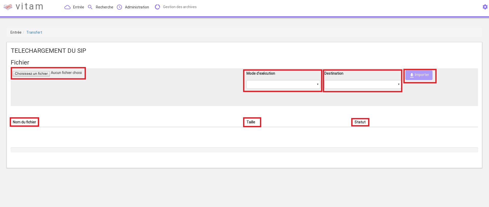
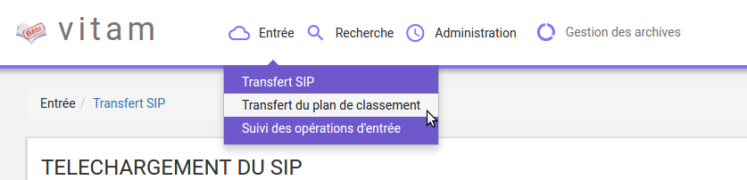
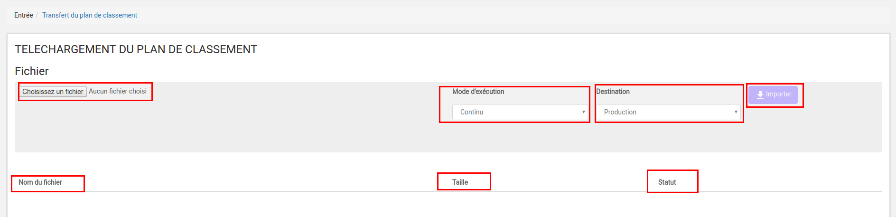
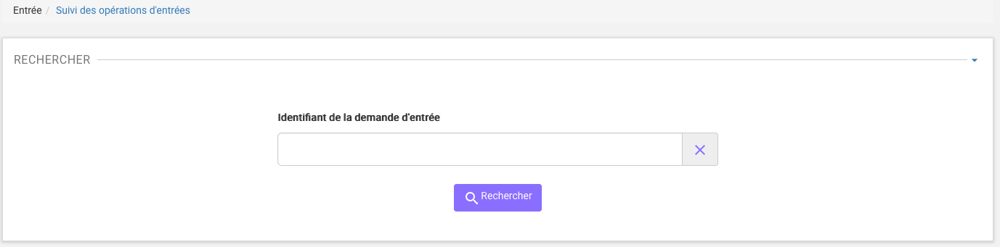
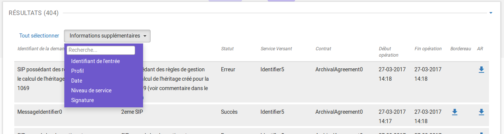

Entrée d'un SIP
###############

Cette partie décrit l'entrée manuelle d'archives dans la solution logicielle Vitam, c'est-à-dire, le processus de transfert du SIP via l'IHM standard, ainsi que le suivi de l'ensemble des transferts via le journal des opérations d'entrées.

Dans l’univers numérique, peuvent être transférées à un service d’archives des archives nativement numériques, des versions numérisées d’archives papier, mais aussi des références à des archives physiques, chacune d’elles accompagnée de ses métadonnées.

Le SIP est un fichier compressé comportant le bordereau de versement SEDA au format XML et les objets à archiver (pour la formalisation des SIP, se référer au livrable "Structuration des submissions information Package (SIP)").

Transfert d'un SIP dans la solution logicielle Vitam
====================================================

Le transfert d'un SIP dans la solution logicielle Vitam s'effectue depuis l'écran "Transfert SIP". Par défaut, lors de sa connexion, l'utilisateur est dirigé vers cette page. Il peut également y accéder en cliquant sur le menu "Entrée" puis le sous-menu "Transfert SIP".

.. image:: images/menu_entree.png

Pour débuter une entrée, l’utilisateur doit sélectionner le lot d’archives (SIP) à transférer dans la solution logicielle Vitam. Pour cela, il clique sur le bouton « Parcourir », une nouvelle fenêtre s'ouvre dans laquelle il a la possibilité de sélectionner le SIP.

Une fois le SIP sélectionné, il apparaît sur l'écran "Téléchargement du SIP" et le nom du fichier s'affiche à droite du bouton "Choisissez un fichier" et une nouvelle ligne apparaît en dessous avec le nom du fichier, sa taille ainsi qu'un champ statut pour l'instant vide.

Deux listes déroulantes sont présentes sur l'écran :

- Mode d'exécution, l'utilisateur a le choix entre :
	- le mode d'exécution "pas à pas" permettant de réaliser progressivement l'entrée en passant d'une étape à une autre. (NB : Les actions liées au processus d'entrée en mode "pas à pas" se retrouvent dans la partie Administration du manuel utilisateur).
	- le mode d'exécution "continu" permettant de lancer le processus d'entrée dans sa globalité en une seule fois. Dans la grande majorité des cas, ce mode d'exécution sera le choix adopté.

- Destination, l'utilisateur peut indiquer la destination de l'entrée d'un SIP
	- "en production", option d'entrée classique, l'entrée est réellement effectuée, les objets et métadonnées sont enregistrés dans la solution logicielle Vitam, l'évènement est journalisé.
	- "à blanc", option permettant de tester une entrée afin de s'assurer de la cohérence du SIP, sans toutefois l'enregistrer et la journaliser. L'utilisateur pourra ainsi corriger les erreurs éventuelles avant de procéder à une nouvelle entrée.

Le mode d'exécution et la destination sont obligatoires. Par défaut le mode d'exécution "continu" et la destination "en production" sont sélectionnés. Lorsque l'utilisateur sélectionne le mode "à blanc", une fenêtre de type "modale" lui demande de confirmer son choix.

Pour lancer le transfert du SIP, l’utilisateur clique sur le bouton « Importer ».

Un fois le SIP importé, les informations visibles à l'écran sont :

- Un tableau comportant les champs suivants :

  - Nom du fichier,
  - Taille : affiche la taille du SIP en Ko, Mo ou Go en fonction de la taille arrondie au dixième près.
  - Statut : succès, erreur ou avertissement

- Une barre de progression affichant l’avancement du téléchargement du SIP dans la solution logicielle Vitam (une barre de progression complète signifie que le téléchargement est achevé).

- Une roue animée symbolisant l'avancement du traitement du SIP par la solution logicielle Vitam.

Les formats de SIP attendus sont : ZIP, TAR, TAR.GZ, TAR.BZ2

Si l'utilisateur tente d'importer un SIP au format non conforme, alors la solution logicielle Vitam empêche le téléchargement et une fenêtre de type "modale" s'ouvre indiquant les formats autorisés.

.. image:: images/upload_sip_KO.jpg

Toute opération d'entrée (succès, avertissement et échec) fait l'objet d'une écriture dans le journal des opérations. Les entrées abouties génèrent un accusé de réception qui est proposé en téléchargement à l'utilisateur.

Cet accusé de réception ou ArchiveTransferReply (ATR) est au format XML conforme au schéma SEDA 2.0.

Lors d'une entrée en succès dans la solution logicielle Vitam, l'ATR comprend les informations suivantes :

- Date : date d'émission de l'ATR
- MessageIdentifier : identifiant de l'ATR. Cet identifiant correspond à l'identification attribuée à la demande de transfert par la solution logicielle Vitam
- ArchivalAgreement : contrat d'entrée
- CodeListVersion : la liste des référentiels utilisés
- La liste des unités archivistiques avec l'identifiant fourni dans la demande de transfert et l'identifiant généré par la solution logicielle Vitam (SystemId) et la liste des groupes d'objets avec l'identifiant fourni dans la demande de transfert et l'identifiant généré par la solution logicielle Vitam (SystemId)
- ReplyCode : statut final de l'entrée
- GrantDate : date de prise en charge du SIP
- MessageIdentifierRequest : identifiant de la demande de transfert

Lors d'une entrée en avertissement, l'ATR contient les mêmes informations que l'ATR d'une entrée en succès et le statut final de l'entrée (ou ReplyCode) est "WARNING". L'ATR indique les unités archivistiques et étapes du processus ayant rencontré une difficulté, en revanche il n'est pas possible de connaître la cause de l'avertissement.

En cas de rejet de l'entrée, l'ATR contient les mêmes informations que l'ATR en succès, mais le ReplyCode est KO. La notification comprend ensuite la liste des erreurs rencontrées sous la forme de blocs <event>, tout d'abord au niveau des blocs <Operation>, puis au niveau des unités archivistiques comme au niveau des groupes d'objets.

Les blocs <event> sont composés des balises suivantes :

- EventTypeCode : code de l'étape ou de la tâche en erreur
- Outcome : statut de l'étape ou de la tâche ayant rencontré au moins une erreur
- OutcomeDetail : code interne à la solution logicielle Vitam correspondant à l'erreur rencontrée
- OutcomeDetailMessage : message d'erreur

La notification comprend ensuite la liste des erreurs rencontrées (échec ou avertissement), au niveau des unités archivistiques comme au niveau des groupes d'objets, sous la forme de blocs <event>.

Transfert d'un SIP de plan de classement
=========================================

Le transfert d'un plan de classement dans Vitam s'effectue depuis l'écran "Transfert du plan de classement", accessible depuis le menu "Entrée" puis en cliquant sur le sous-menu du même nom.

Pour débuter une entrée, l’utilisateur doit sélectionner le plan, sous le format demandé, à transférer dans la solution logicielle Vitam. Pour cela, il clique sur le bouton « Parcourir », une nouvelle fenêtre s'ouvre dans laquelle il a la possibilité de sélectionner le plan.

Une fois celui-ci sélectionné, il apparaît sur l'écran "Téléchargement du plan de classement". Le nom du fichier s'affiche à droite du bouton "choisissez un fichier" et une nouvelle ligne apparaît en dessous avec le nom du fichier, sa taille ainsi qu'un champ statut.

Deux listes déroulantes sont présentes sur l'écran :

- Mode d'exécution : l'utilisateur a le choix entre le mode d'exécution "pas à pas" permettant de passer d'une étape à une autre dans le processus d'entrée, et le mode d'exécution "continu" permettant de lancer le processus d'entrée dans sa globalité en une seule fois. Dans la grande majorité des cas, le mode d'exécution "continu" sera le choix adopté. (NB : Les actions liées au processus d'entrée en mode "pas à pas" se retrouve dans la partie "Administration" du manuel utilisateur)

- Destination : l'utilisateur peut indiquer la destination du plan. Actuellement, seule l'option "production", pour verser directement le plan, est disponible.

Le mode d'exécution et la destination sont obligatoires.

Pour lancer le transfert du plan, l’utilisateur clique sur le bouton « Importer ».

Les informations visibles à l'écran sont :

- Un tableau comportant les champs suivants :

  - Nom du fichier,
  - Taille : Affiche la taille du plan en Ko, Mo ou Go en fonction de la taille arrondie au dixième près,
  - Statut (succès, erreur ou avertissement)

- Une barre de progression affiche l’avancement du téléchargement du plan dans la solution logicielle Vitam (une barre de progression complète signifie que le téléchargement est achevé).

NB : Suite au téléchargement du plan, un temps d'attente est nécessaire, correspondant au traitement du plan par le système avant affichage du statut final. Dans ce cas, une roue de chargement est affichée au niveau du statut.

Si l'utilisateur tente d'importer un plan au format non conforme (s'il ne s'agit pas des formats ZIP, TAR, TAR.GZ, TAR.BZ2) alors le système empêche le téléchargement.
Une fenêtre pop-up s'ouvre indiquant les formats autorisés.

Toute opération d'entrée (succès, avertissement et échec) fait l'objet d'une écriture dans le journal des opérations et génère une notification qui est proposée en téléchargement à l'utilisateur.

Cette notification ou ArchiveTransferReply (ATR) est au format XML conforme au schéma SEDA 2.0.
Lors d'une entrée en succès dans la solution logicielle VITAM, l'ATR comprend les informations suivantes :

- Date : date d'émission de l'ATR
- MessageIdentifier : identifiant de l'ATR. Cet identifiant correspond à l'identification attribuéesss à la demande de transfert par la solution logicielle Vitam
- ArchivalAgreement : contrat d'entrée
- CodeListVersion : la liste des référentiels utilisés
- La liste des unités achivistiques avec l'identifiant fourni dans la demande de transfert et l'identifiant généré par la solution logicielle Vitam (SystemId)
- ReplyCode : statut final de l'entrée
- GrantDate : date de prise en charge du plan
- MessageIdentifierRequest : identifiant de la demande de transfert

Lors d'une entrée en avertissement, l'ATR contient les mêmes informations que l'ATR en succès et le ReplyCode est "WARNING". Actuellement, il n'est pas possible de connaître la cause de l'avertissement.

En cas de rejet de l'entrée, l'ATR contient les mêmes informations que l'ATR en succès ainsi que la liste des problèmes rencontrés :

- Outcome : statut de l'étape ou de la tâche ayant rencontré au moins une erreur
- OutcomeDetail : code interne à la solution logicielle Vitam correspondant à l'erreur rencontrée
- OutcomeDetailMessage : message d'erreur

La notification comprend ensuite la liste des erreurs rencontrées (échecs ou avertissement), au niveau des unités archivistiques, sous la forme de blocs <event>.

Journal des opérations d'entrée
===============================

Le journal des opérations d'entrée est un extrait du journal des opérations global de la solution logicielle Vitam.

Il propose deux visions, une vision globale des transferts effectués dans la solution logicielle Vitam, et une vision plus détaillée de chaque transfert, explicitant toutes les étapes d'un processus d'entrée.
Il permet ainsi à l'utilisateur de savoir si son entrée est valide, c'est-à-dire, si les données et objets contenus dans le SIP sont enregistrés dans la solution logicielle Vitam. Dans le cas contraire, il lui permet d'identifier la ou les erreurs expliquant l'échec du transfert.

Pour consulter le journal des opérations d'entrée, l'utilisateur clique sur le menu "Entrée" dans la barre de menu, puis clique sur le sous-menu "Suivi des opérations d'entrée".

.. image:: images/menu_op_entree.png

Formulaire de recherche d'une entrée
------------------------------------

Par défaut, l'ensemble des opérations d'entrée est affiché sous le formulaire de recherche.

Pour effectuer une recherche précise, on utilise le champ "Identifiant de la demande d'entrée" correspondant à l'identifiant du SIP porté par la balise <MessageIdentifier> dans le bordereau de versement SEDA.

Pour initier la recherche, l'utilisateur saisit le nom du SIP et clique sur le bouton "Rechercher".

La recherche s'effectue de façon stricte, c'est-à-dire que seul le nom exact de l'entrée comprenant strictement la chaîne de caractères saisie sera pris en compte. La recherche porte sur toutes les opérations d'entrée quel que soit leur statut (en cours, succès, avertissement et erreur)

Affichage des résultats
-----------------------

Le résultat de la recherche est affiché sous forme de tableau. Par défaut, les colonnes sont triées par date de versement, du plus récent au plus ancien. Les éléments suivants sont affichés :

- Identifiant de la demande d'entrée : correspond à l'identifiant du SIP porté par la balise <MessageIdentifier> du bordereau de versement SEDA
- Intitulé
- Statut : Succès, Erreur, En cours, Alerte (WARNING)
- Service Versant
- Contrat
- Date de début d'opération d'entrée
- Date de fin d'opération d'entrée
- Bordereau : permet le téléchargement du manifest.xml
- AR : permet le téléchargement de l'accusé de réception (ATR)

.. image:: images/op_entree_liste.png

Il y a également la possibilité d'afficher d'autres informations, soit en les sélectionnant individuellement, soit en les sélectionnant toutes par un clic sur "Tout sélectionner".

Les informations supplémentaires disponibles sont :

- Identifiant de l'entrée
- Profil
- Date
- Niveau de service
- Signature
- Rapport

Consultation du détail
----------------------

Suite à la recherche d'une opération d'entrée ou depuis l'écran d'affichage par défaut, l'utilisateur peut choisir de consulter le détail des événements intervenus durant le processus d'entrée.
Pour cela, il clique sur la ligne de l'entrée voulue.
Le détail du journal d'entrée s'ouvre dans un nouvel onglet. L'utilisateur peut ainsi revenir à la page d'affichage de la liste globale des résultats.

Le processus d'entrée est décrit étape par étape avec des messages correspondant au résultat de chaque étape (avec les informations de début et de fin d'étape) et de chaque tâche (associée à une étape, seule l'information de fin de tâche est affichée).

En haut de la page figure le numéro de l'opération d'entrée, sous la forme "Détail de l'opération - Numéro de l'opération d'entrée"

Le détail est affiché sous forme de tableau comportant pour chaque événement les éléments suivants :

- Etape : nom de l'étape correspondante
- Date : date à laquelle l'étape ou la tâche a été effectuée
- Statut : statut final de l'étape ou de la tâche
- Message : message expliquant le statut de l'étape, tâche ou traitement correspondant

.. image:: images/op_entree_detail.png

L'onglet d'affichage de la page "détail d'une opération d'entrée" peut être fermé à tout moment.
