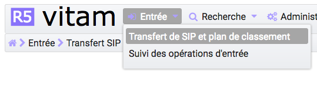
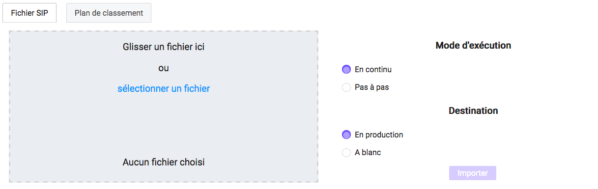
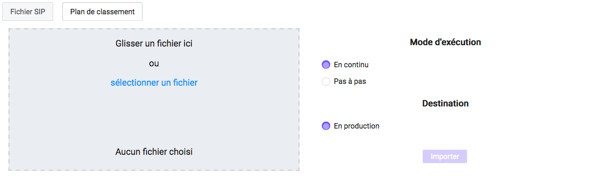
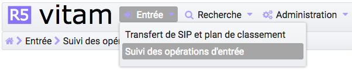
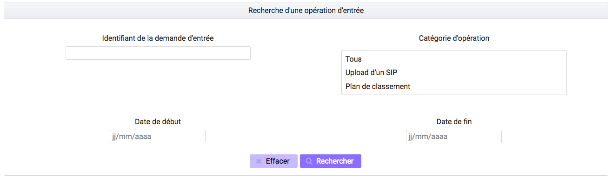
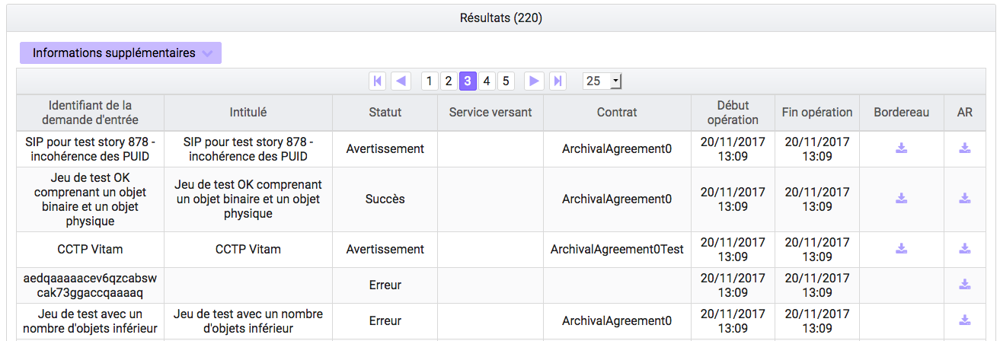
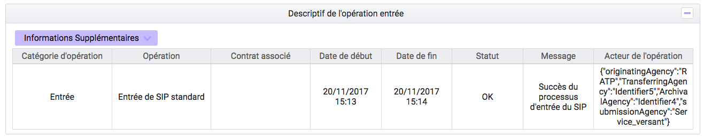

Entrée d'un SIP et plan de classement
#######################################

Cette partie décrit l'entrée manuelle d'archives dans la solution logicielle Vitam, c'est-à-dire, le processus de transfert du SIP ou plan de classement via l'IHM standard vers la solution logicielle Vitam, ainsi que le suivi de l'ensemble des transferts via le journal des opérations d'entrées.

Dans l’univers numérique, peuvent être transférées à un service d’archives des archives nativement numériques, des versions numérisées d’archives papier,chacune d’elles accompagnée de ses métadonnées. mais aussi des références à des archives physiques.

Le SIP est un fichier compressé comportant le bordereau de versement SEDA au format XML et les objets à archiver.

Avertissement : Lebordereau doit être conforme au SEDA et respecter les consignes de formalisation des SIP décrites dans le document "Structuration des submissions information Package (SIP)".

Transfert d'un SIP 
===================

Le transfert d'un SIP dans la solution logicielle Vitam s'effectue depuis l'écran de "Transfert SIP et plan de classement". Par défaut, lors de sa connexion, l'utilisateur est dirigé vers cette page. Il peut également y accéder en survolant le menu "Entrée" puis en sélectionnant le sous-menu "Transfert de SIP et plan de classement".

|

Pour débuter une entrée, l’utilisateur doit sélectionner le lot d’archives (SIP) à transférer dans la solution logicielle Vitam. Pour cela, il est possible de faire glisser le SIP sur l'espace de téléchargement ou de cliquer sur le lien « sélectionner un fichier ».

Une fois le SIP sélectionné, il apparaît sur l'écran "Transfert du SIP et plan de classement" et le nom du fichier s'affiche sous le lien "sélectionner un fichier" ainsi que le nom du fichier, sa taille ainsi qu'un champ statut pour l'instant vide.

Les informations visibles à l'écran sont :

- Un tableau comportant les champs suivants :

  - Nom du fichier,
  - Taille : affiche la taille du SIP en Ko, Mo ou Go en fonction de la taille arrondie au dixième près.
  - Statut : succès, erreur ou avertissement sous forme de pictogramme, respectivement "coche", "triangle", "croix"

- Une barre de progression affichant l’avancement du téléchargement du SIP dans la solution logicielle Vitam (une barre de progression complète signifie que le téléchargement est achevé).

- Une roue animée symbolisant l'avancement du traitement du SIP par la solution logicielle Vitam.

Plusieurs options sont présentes sur l'écran :

- Mode d'exécution :
	- le mode d'exécution "en continu" permettant de lancer le processus d'entrée dans sa globalité en une seule fois. Dans la grande majorité des cas, ce mode d'exécution sera le choix adopté.
	- le mode d'exécution "pas à pas" permettant de réaliser progressivement l'entrée en passant d'une étape à une autre. (NB : Les actions liées au processus d'entrée en mode "pas à pas" se retrouvent dans la partie Administration du manuel utilisateur).

- Destination :
	- "en production", option d'entrée classique, l'entrée est réellement effectuée, les objets et métadonnées sont enregistrés dans la solution logicielle Vitam, l'évènement est journalisé.
	- "à blanc", option permettant de tester une entrée afin de s'assurer de la cohérence du SIP, l'évènement est journalisé. L'utilisateur pourra ainsi corriger les erreurs éventuelles avant de procéder à une nouvelle entrée.

Le mode d'exécution et la destination sont obligatoires. Par défaut le mode d'exécution "continu" et la destination "en production" sont sélectionnés.

Pour lancer le transfert du SIP, l’utilisateur clique sur le bouton « Importer ».

|

Les formats de SIP attendus sont : ZIP, TAR, TAR.GZ, TAR.BZ2, TAR.GZ2

Si l'utilisateur tente d'importer un SIP dans un format non conforme, alors la solution logicielle Vitam empêche le téléchargement et une fenêtre de type "modale" affiche l'erreur "fichier invalide".

.. image:: images/sip_ko_format.png
   :scale: 50

Toute opération d'entrée fait l'objet d'une écriture dans le journal des opérations. Les entrées abouties (succès, avertissement et échec technique ou métier) génèrent un accusé de réception qui est proposé en téléchargement à l'utilisateur.

Cet accusé de réception ou ArchiveTransferReply (ATR) est au format XML conforme au schéma SEDA 2.0.

Lors d'une entrée en succès dans la solution logicielle Vitam, l'ATR comprend les informations suivantes :

- Date : date d'émission de l'ATR
- MessageIdentifier : identifiant de l'ATR. Cet identifiant correspond à l'identification attribuée à la demande de transfert par la solution logicielle Vitam
- ArchivalAgreement : contrat d'entrée
- CodeListVersion : la liste des référentiels utilisés
- La liste des unités archivistiques avec l'identifiant fourni dans la demande de transfert et l'identifiant généré par la solution logicielle Vitam (SystemId) 
- La liste des groupes d'objets avec l'identifiant fourni dans la demande de transfert et l'identifiant généré par la solution logicielle Vitam (SystemId)
- ReplyCode : statut final de l'entrée
- GrantDate : date de prise en charge du SIP
- ArchivalAgency : service d'archives
- TransferringAgency : service producteur

Lors d'une entrée en avertissement, l'ATR contient les mêmes informations que l'ATR d'une entrée en succès et le statut final de l'entrée (ou ReplyCode) est "WARNING". L'ATR indique les unités archivistiques et étapes du processus ayant rencontré une difficulté, en revanche il n'est pas possible de connaître la cause de l'avertissement.

En cas de rejet de l'entrée, l'ATR contient les mêmes informations que l'ATR en succès, mais le ReplyCode est KO. La notification comprend ensuite la liste des erreurs rencontrées sous la forme de blocs <event>, tout d'abord au niveau des blocs <Operation>, puis au niveau des unités archivistiques comme au niveau des groupes d'objets.

Les blocs <event> sont composés des balises suivantes :

- EventType : l'intitulé de l'étape ou de la tâche
- EventTypeCode : code de l'étape ou de la tâche en erreur
- Outcome : statut de l'étape ou de la tâche ayant rencontré au moins une erreur
- OutcomeDetail : code interne à la solution logicielle Vitam correspondant à l'erreur rencontrée
- OutcomeDetailMessage : message d'erreur

La notification comprend ensuite la liste des erreurs rencontrées (échec ou avertissement), au niveau des unités archivistiques comme au niveau des groupes d'objets, sous la forme de blocs <event>.

Transfert d'un SIP de plan de classement
=========================================

Le transfert d'un plan de classement dans la solution logicielle Vitam s'effectue depuis l'écran "Transfert de SIP et plan de classement". Par défaut, lors de sa connexion, l'utilisateur est dirigé vers cette page. Il peut également y accéder en survolant le menu "Entrée" puis sélectionne sous-menu "Transfert de SIP et plan de classement". Il faut ensuite cliquer sur le bouton "Plan de classement".

Pour débuter une entrée, l’utilisateur doit sélectionner le plan, qui prend la forme d'un SIP sans objets, à transférer dans la solution logicielle Vitam. Pour cela, il est possible de faire glisser le plan sur l'espace de téléchargement ou de cliquer sur le lien « sélectionner un fichier ».

Une fois celui-ci sélectionné, il apparaît sur l'écran "Téléchargement du plan de classement". Le nom du fichier s'affiche sous le bouton "choisissez un fichier" ainsi que le nom du fichier, sa taille ainsi qu'un champ statut.

Les informations visibles à l'écran sont :

- Un tableau comportant les champs suivants :

  - Nom du fichier,
  - Taille : Affiche la taille du plan en Ko, Mo ou Go en fonction de la taille arrondie au dixième près,
  - Statut (succès, erreur ou avertissement)

- Une barre de progression affiche l’avancement du téléchargement du plan dans la solution logicielle Vitam (une barre de progression complète signifie que le téléchargement est achevé).

Plusieurs options sont présentes sur l'écran :

- Mode d'exécution :
	- le mode d'exécution "en continu" permettant de lancer le processus d'entrée dans sa globalité en une seule fois. Dans la grande majorité des cas, ce mode d'exécution sera le choix adopté.
	- le mode d'exécution "pas à pas" permettant de réaliser progressivement l'entrée en passant d'une étape à une autre. (NB : Les actions liées au processus d'entrée en mode "pas à pas" se retrouvent dans la partie Administration du manuel utilisateur).

- Destination : actuellement, seule l'option "production" est disponible pour transférer directement le plan.

Le mode d'exécution et la destination sont obligatoires.

Pour lancer le transfert du plan, l’utilisateur clique sur le bouton « Importer ».

NB : Suite au téléchargement du plan, un temps d'attente est nécessaire, correspondant au traitement du plan par le système avant affichage du statut final. Dans ce cas, une roue de chargement est affichée au niveau du statut.

Les formats de SIP attendus sont : ZIP, TAR, TAR.GZ, TAR.BZ2, TAR.GZ2

Si l'utilisateur tente d'importer un plan dans un format non conforme, alors le système empêche le téléchargement et une fenêtre modale s'ouvre indiquant que le fichier est invalide.

Toute opération d'entrée (succès, avertissement et échec) fait l'objet d'une écriture dans le journal des opérations et génère une notification qui est proposée en téléchargement à l'utilisateur.

Cette notification ou ArchiveTransferReply (ATR) est un document au format XML conforme au schéma SEDA 2.0.
Lors d'une entrée en succès dans la solution logicielle VITAM, l'ATR comprend les informations suivantes :

- Date : date d'émission de l'ATR
- MessageIdentifier : identifiant de l'ATR. Correspondant à l'identification attribuée à la demande de transfert par la solution logicielle Vitam
- ArchivalAgreement : contrat d'entrée
- CodeListVersion : la liste des référentiels utilisés
- La liste des unités archivistiques avec l'identifiant fourni dans la demande de transfert et l'identifiant généré par la solution logicielle Vitam (SystemId)
- ReplyCode : statut final de l'entrée
- GrantDate : date de prise en charge du plan
- ArchivalAgency : service d'archives
- TransferringAgency : service de transfert d'archives

Lors d'une entrée en avertissement, l'ATR contient les mêmes informations que l'ATR en succès et le ReplyCode est "WARNING".

En cas de rejet de l'entrée, l'ATR contient les mêmes informations que l'ATR en succès ainsi que la liste des problèmes rencontrés :

- Outcome : statut de l'étape ou de la tâche ayant rencontré au moins une erreur
- OutcomeDetail : code interne à la solution logicielle Vitam correspondant à l'erreur rencontrée
- OutcomeDetailMessage : message d'erreur

La notification comprend ensuite la liste des erreurs rencontrées (échecs ou avertissement), au niveau des unités archivistiques, sous la forme de blocs <event>.

Journal des opérations d'entrée
===============================

Le journal des opérations d'entrée est un extrait du journal des opérations global de la solution logicielle Vitam.

Il propose deux visions, une vision générale des transferts effectués dans la solution logicielle Vitam, et une vision plus détaillée de chaque transfert, explicitant toutes les étapes d'un processus d'entrée.
Il permet ainsi à l'utilisateur de savoir si son entrée est valide, c'est-à-dire, si les données et objets contenus dans le SIP ou le plan de classement sont enregistrés dans la solution logicielle Vitam. Dans le cas contraire, il lui permet d'identifier la ou les erreurs ayant provoquées l'échec du transfert.

Pour consulter le journal des opérations d'entrée, l'utilisateur survole le menu "Entrée" puis sélectionne le sous-menu "Suivi des opérations d'entrée".
|

Formulaire de recherche d'une entrée
------------------------------------

Par défaut, l'ensemble des opérations d'entrée est affiché sous le formulaire de recherche.

Pour effectuer une recherche précise, on utilise le champ "Identifiant de la demande d'entrée" correspondant à l'identifiant du SIP porté par la balise <MessageIdentifier> dans le bordereau de versement SEDA.

Il est également possible d'effectuer une recherche en choisissant une catégorie d'opération et/ou en sélectionnant une date de début et si besoin, une date de fin.

Pour initier la recherche, l'utilisateur clique sur le bouton "Rechercher".

La recherche s'effectue de façon stricte, c'est-à-dire que seul l'identifiant exact sera pris en compte. La recherche porte sur toutes les opérations d'entrée quel que soit leur statut (en cours, succès, avertissement et erreur).

Affichage des résultats
-----------------------

Le résultat de la recherche est affiché sous forme de tableau. Par défaut, les colonnes sont triées par date de versement, du plus récent au plus ancien. Les éléments suivants sont affichés :

- Identifiant de la demande d'entrée : correspond à l'identifiant du SIP porté par la balise <MessageIdentifier> du bordereau de transfert SEDA
- Intitulé
- Statut : Succès, Erreur, En cours, Avertissement (WARNING)
- Service transmetteur
- Service producteur
- Contrat
- Date de début d'opération d'entrée
- Date de fin d'opération d'entrée
- Bordereau : permet le téléchargement du manifest.xml
- AR : permet le téléchargement de l'accusé de réception (ATR)
|

Il est possible d'afficher d'autres informations en cliquant sur le bouton "Informations supplémentaires".

Les informations supplémentaires disponibles sont :

- Identifiant de l'entrée
- Profil d'archivage
- Date
- Niveau de service
- Signature
- Service producteur
- Service versant

Consultation du détail
----------------------

Suite à la recherche d'une opération d'entrée ou depuis la page par défaut du journal des opérations d'entrée, l'utilisateur peut choisir de consulter le détail des événements intervenus durant le processus d'entrée.
Pour accéder au détail d'une opération d'entrée, l'utilisateur clique sur la ligne souhaitée.

Le détail d'une opération d'entrée est composé de deux parties : 

Le descriptif de l'opération qui récapitule les informations de l'opérations avec la possibilité d'afficher les informations supplémentaires.

Le détail de l'opération présenté sous forme de liste comportant, pour chaque événement, les éléments suivants :

- le nom de l'étape
- la date à laquelle l'étape a été effectuée
- le message expliquant le statut de cette étape
- le statut présenté sous forme de pictogramme

Un clic sur la flèche située à côté du message permet d'afficher plus de détail concernant cette étape. Un clic sur un signe "+" situé à côté d'un message affiche le détail des données de l'évènement.

|

.. image:: images/detail_jdoe.png

