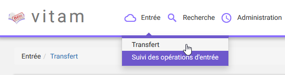
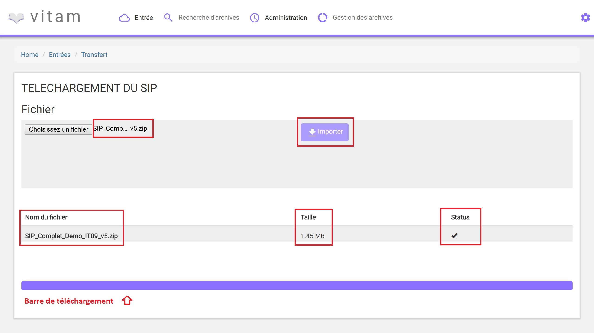
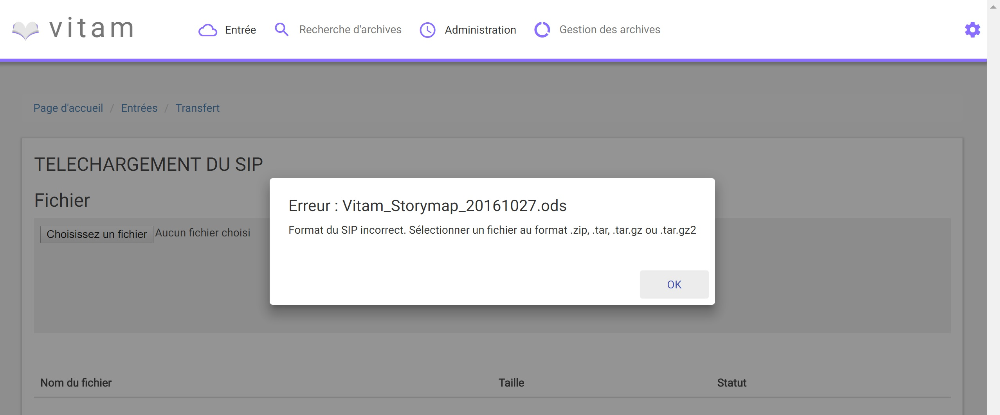
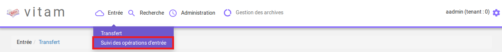
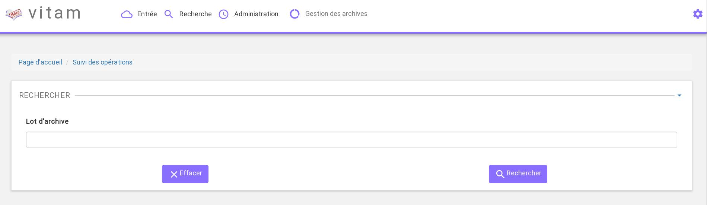
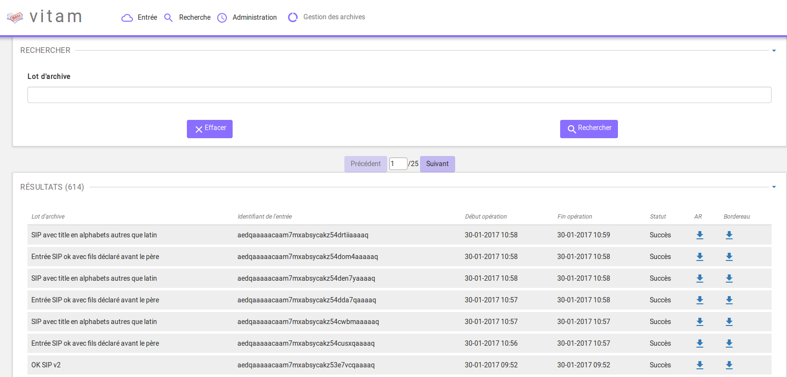
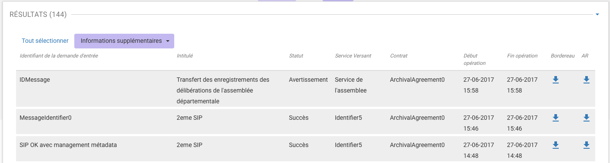

Entrée d'un SIP
###############

Cette partie décrit l'entrée manuelle d'archives dans Vitam, c'est-à-dire, le processus de transfert du SIP via l'IHM minimale, ainsi que le suivi de l'ensemble des transferts via le journal des opérations d'entrées.

Dans l’univers numérique, peuvent être transférés à un service d’archives des archives nativement numériques, des versions numérisées d’archives papier, mais aussi des références à des archives physiques, chacune d’elles accompagnées de leurs métadonnées.

Le SIP est un fichier compressé comportant le bordereau de versement SEDA au format XML et les objets à archiver (se référer au livrable "Design SIP").

NB : Cette partie est disponible via l'IHM de démonstration.

Transfert d'un SIP dans Vitam
=============================

Le transfert d'un SIP dans Vitam s'effectue depuis l'écran "Transfert", accessible depuis le menu "Entrée" puis en cliquant sur le sous-menu "Transfert" (Entrée/Transfert).

Pour débuter une entrée, l’utilisateur doit sélectionner le lot d’archives (SIP) à transférer dans Vitam. Pour cela, il clique sur le bouton « Parcourir », une nouvelle fenêtre s'ouvre dans laquelle il a la possibilité de sélectionner le SIP.

Une fois le SIP sélectionné, il apparaît sur l'écran "Téléchargement du SIP". Une fois le SIP sélectionné, le nom du fichier s'affiche à droite du bouton "choisissez un fichier" et une nouvelle ligne apparait en dessous avec le nom du fichier, sa taille ainsi qu'un champ statut pour l'instant vide.

Pour lancer le transfert du SIP, l’utilisateur clique sur le bouton « Importer ».

Les informations visibles à l'écran sont :

- Un tableau comportant les champs suivants :

  - Nom du fichier,
  - Taille : Affiche la taille du SIP en Ko, Mo ou Go en fonction de la taille arrondie au dixième près,
  - Statut (succès, erreur ou avertissement)

- Une barre de progression affiche l’avancement du téléchargement du SIP dans Vitam (une barre de progression complète signifie que le téléchargement est achevé).

NB : Suite au téléchargement du SIP, un temps d'attente est necessaire pour traitement du SIP par le système avant affichage du statut final. Dans ce cas, une roue de chargement est affichée au niveau du statut.

Si l'utilisateur tente d'importer un SIP au format non conforme (s'il ne s'agit pas des formats ZIP, TAR, TAR.GZ, TAR.BZ2) alors le système empêche le téléchargement.
Une fenêtre pop-up s'ouvre indiquant les formats autorisés.

Toute opération d'entrée (succès, avertissement et échec) fait l'objet d'une écriture dans le journal des opérations et génére une notification qui est proposée en téléchargement à l'utilisateur.

Cette notification ou ArchiveTransferReply (ATR) est au format XML conforme au schéma SEDA 2.0.
Lors d'une entrée en succès dans VITAM, l'ATR comprend les informations suivantes :

- Date : date d'émission de l'ATR
- MessageIdentifier : identifiant de l'ATR. Cet identifiant correspond à l'identification attribué à la demande de transfert par la solution logicielle Vitam
- ArchivalAgreement : contrat d'entrée
- CodeListVesion : la liste des référentiels utilisés
- La liste des Unités Archivistiques avec l'identifiant fourni dans la demande de transfert et l'identifiant généré par la solution logicielle VITAM (SystemId) et la liste des Groupes d'Objets avec l'identifiant fourni dans la demande de transfert et l'identifiant généré par la solution logicielle VITAM (SystemId)
- ReplyCode : statut final de l'entrée
- GrantDate : date de prise en charge du SIP
- MessageIdentifierRequest : identifiant de la demande de transfert

Lors d'une entrée en avertissement, l'ATR contient les mêmes informations que l'ATR en succès et le ReplyCode est "WARNING". Actuellement, il n'est pas posssible de connaître la cause de l'avertissement.

En cas de rejet de l'entrée, l'ATR contient les mêmes informations que l'ATR en succès ainsi que la liste des problèmes rencontrés :

- Outcome : statut de l'étape ou de la tâche ayant rencontré au moins une erreur
- OutcomeDetail : code interne à VITAM correspondant à l'erreur rencontrée
- OutcomeDetailMessage : message d'erreur

La notification comprend ensuite la liste des erreurs rencontrées (échecs ou avertissement), au niveau des unités archivistiques comme au niveau des groupes d'objets, sous la forme de blocs <event>.

Journal des opérations d'entrée
===============================

Le journal des opérations d'entrée est un extrait du journal des opérations global du système.

Il propose deux visions, une vision globale des transferts effectués dans Vitam, et une vision plus détaillée de chaque transfert, explicitant toutes les étapes d'un processus d'entrée.
Il permet ainsi à l'utilisateur de savoir si son entrée est valide, c'est-à-dire, si les données et objets contenus dans le SIP sont enregistrés dans Vitam. Dans le cas contraire, il lui permet d'identifier la ou les erreurs expliquant l'échec du transfert.

Pour consulter le journal des opérations d'entrée, l'utilisateur clique sur le menu "Entrée" dans la barre de menu, puis clique sur le sous-menu "Suivi des opérations d'entrée" (Entrée/Suivi des opérations d'entrée).

Formulaire de recherche d'une entrée
------------------------------------

Par défaut, l'ensemble des opérations d'entrées est affiché sous le formulaire de recherche.

Pour effectuer une recherche précise, on utilise le champ "Lot d'archive" correspondant à l'identifiant du SIP porté par la balise <MessageIdentifier> dans le bordereau de versement SEDA.

Pour initier la recherche, l'utilisateur saisit le nom du SIP et clique sur le bouton "Rechercher".

La recherche s'effectue de façon stricte, c'est-à-dire que seul le nom exact de l'entrée comprenant strictement la chaîne de caractères saisie sera retourné. La recherche porte sur toutes les opérations d'entrées quel que soit leur statut (En cours, succès, avertissement et échec)

Affichage des résultats
-----------------------

Le résultat de la recherche est affiché sous forme de tableau, comprenant les éléments suivants :

- Lot d'archive : correspond à l'identifiant du SIP porté par la balise <MessageIdentifier> du bordereau de versement SEDA
- Identifiant de l'entrée (référence donnée par le système)
- Date de début d'opération d'entrée
- Date de fin d'opération d'entrée
- Statut : Succès, Erreur, En cours, Alerte (Warning)
- Bordereau : permet le téléchargement du manifest.xml
- AR : permet le téléchargement de l'accusé de réception (ATR)

Par défaut, les colonnes sont triées par dates de versement, du plus récent au plus ancien.

Depuis cette liste de résultats, l'utilisateur peut consulter le détail d'une opération d'entrée en cliquant sur la ligne de cette opération.

Consultation du détail
----------------------

Suite à la recherche d'une opération d'entrée, l'utilisateur peut choisir de consulter le détail des événements intervenus durant le processus d'entrée.
Pour cela, il clique sur la ligne de l'entrée voulue.
La page sur laquelle est présenté le détail du journal d'entrée s'ouvre dans un nouvel onglet. L'utilisateur peut ainsi revenir à la page d'affichage de la liste globale des resultats.

Le processus d'entrée est décrit étape par étape avec des messages correspondant au résultat de chaque étape (avec les informations de début et de fin d'étape) et de chaque tâche (associée à une étape, seule l'information de fin de tâche est affichée).

En haut de la page figure le numéro de l'opération d'entrée, sous la forme "Détail de l'opération - Numéro de l'opération d'entrée"

Le détail est affiché sous forme de tableau comportant pour chaque événement les éléments suivants :

- Evénement : nom de l'étape ou de la tâche correspondante
- Date : date à laquelle l'étape ou la tâche a été effectuée
- Statut : statut final de l'étape ou de la tâche
- Message : message expliquant le statut de cette étape ou de la tâche

L'onglet d'affichage de la page détail d'une opération d'entrée peut être fermé à tout moment.
