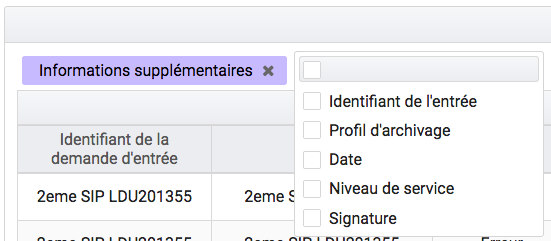
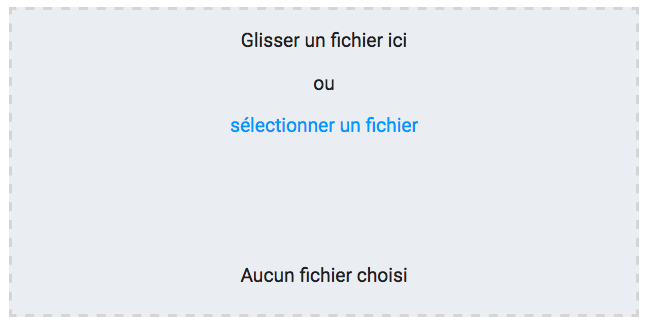
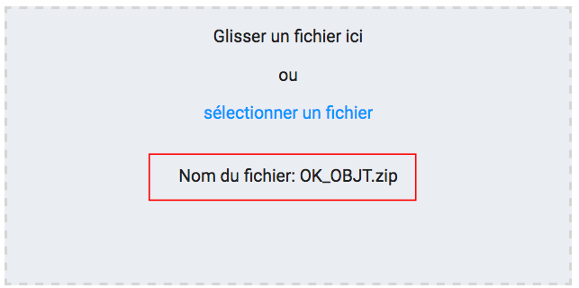

Généralités
###########

Menu
=====

Le menu est situé en haut des pages. Il est présent sur toutes les pages et est découpé en 4 grandes sections :

- Entrée
- Recherche
- Administration
- Gestion des archives

|
.. image:: images/menu_general.png

Chaque section comprend plusieurs sous-menus permettant de naviguer sur les différentes pages.

Fil d'Ariane
============

Le fil d'Ariane est un élément qui permet de visualiser le chemin d'accès à la page affichée. Il est situé sur toutes les pages, en dessous du menu.

La racine est toujours inactive (sans lien), elle correspond au nom du menu où est située la page.

Suite à la racine, les pages parentes sont listées et sont séparées par un chevron et, contrairement à la racine, elles sont toutes cliquables.
Un clic sur un lien redirige sur la page idoine.
|

.. image:: images/ariane.png

Titre des pages
===============

Le titre de la page est visible sur les onglets des navigateurs Internet. Il correspond au dernier noeud du fil d'Ariane, précédé du mot "VITAM". Par exemple :

- Transfert de SIP et plan de classement
- Recherche d'archives
- Journal des opérations

|
.. image:: images/titre_IHM_demo.png

Formulaire de recherche
========================

Deux types de formulaire sont utilisés dans la solution logicielle Vitam :

- Des formulaires de recherche globale
- Des formulaires de recherche avancée

Chaque formulaire est doté d'un bouton "Rechercher" et "Effacer". Le bouton "Rechercher" permet d'effectuer une recherche correspondant aux valeurs que vous avez entrées. Et en cliquant sur le bouton "Effacer", toutes les valeurs saisies dans les champs du formulaire sont effacées et les résultats sont ré-initialisés.

Formulaire de recherche globale
-------------------------------

Les formulaires de recherche globale sont composés d'un seul champ de recherche.

|
.. image:: images/au_rechchs.png

Formulaire de recherche avancée
--------------------------------

Les formulaires de recherche avancée sont composés d'au moins deux champs de recherche .

|
.. image:: images/au_rechcha.png

Affichage des résultats
========================

Le nombre de résultats correspondant au résultat d'une recherche est indiqué sous la forme "Résultats (X)".

|
.. image:: images/gen_nombre_resultats.png

Si aucun résultat n'est trouvé par la solution logicielle Vitam, alors un message indique à l'utilisateur qu'aucun résultat n'est disponible pour sa recherche.

|

.. image:: images/au_res_ko.png

Par défaut, les 25 premiers résultats sont affichés. Une pagination permet de naviguer s'il y a un nombre supérieur de résultats.
Il est également possible d'afficher 5 ou 125 résultats par page en utilisant le sélecteur situé à côté de la pagination. 

|
.. image:: images/pagination.png

Informations supplémentaires
----------------------------

Il est possible d'afficher des colonnes supplémentaires dans certains tableaux. Pour cela, un clic sur le bouton "Informations supplémentaires" ouvre une liste d'options.

.. image:: images/general_info_bt.png

|

   
   
A partir de là, il est possible de choisir les options (colonnes) que l'on souhaite afficher en les cochant. Il est également possible de tout sélectionner par un clic sur la première case, située tout en en haut. 

.. image:: images/general_info_options_all.png
   :scale: 50

Un clic sur cette même case, désélectionne toutes les options préalablement sélectionnées et masque les colonnes associées.

Visualisation des listes des écrans de détail
=============================================

Trois types d'écran de détail comportant des listes sont disponibles :

- Détail d'une opérations
- Détail du journal du cycle de vie d'une l'unité archivistique
- Détail du journal du cycle de vie d'un groupe d'objets

Les couleurs de fonds et des polices ont été adaptées en fonction des statuts KO, FATAL et WARNING.

Pour les cas KO ou FATAL, les lignes s'affichent en rouge et le texte est affiché en noir et un pictogramme en forme croix est présent.

|
.. image:: images/entree_ko.png

Pour les cas WARNING, la ligne ne change pas de couleur mais le texte est affiché en orange et un pictogramme de point d'exclamation est présent.

.. image:: images/entree_warn.png

Modification
-------------

Il est possible de modifier certaines données dans les pages de détail. Un clic sur le bouton "Modifier" permet alors d'éditer les champs dont les valeurs peuvent être changées.

|
.. image:: images/au_modif.png

**Etiquettes (tags)**

Certains champs possèdent un système d'étiquettes ou tags permettant d'ajouter plusieurs éléments (généralement, un identifiant). Pour ajouter un nouveau tag, l'utilisateur saisit l'identifiant et valide en appuyant la touche "entrée", un tag sera alors créé (celui-ci sera encadré par un fond de couleur). Pour supprimer un tag, il faut cliquer directement sur la croix de suppression contenue dans le tag (à droite).

.. image:: images/update_tag.png
   :scale: 50

Une fois les modifications effectuées, vous pouvez soit les annuler en cliquant sur "Annuler" et tous les champs reviennent à leur état initial soit enregistrer les modifications en cliquant sur "Sauvegarder", les champs modifiés sont alors mis à jour et enregistrés dans la solution logicielle Vitam.

.. image:: images/general_modif.png
   :scale: 50

Affichage des dates et heures
=============================

Les dates et heures sont affichées soit au format jour-mois-année heures:minutes (JJ-MM-AAAA HH:mm), soit au format jour-mois-année (JJ-MM-AAAA).

.. image:: images/date_heure.png
   :scale: 50

L'heure affichée s'adapte au fuseau horaire défini dans les paramétrages du poste de consultation.

Dans le cas où aucune heure n'est renseignée dans l'enregistrement, il est par défaut indiqué sur l'interface 00:00, et ceci quel que soit le fuseau horaire.

Import de fichier ou dossier
============================

La solution logicielle Vitam permet d'importer des fichiers ou des dossiers compressés de différents formats.

Il existe deux façons d'importer un fichier ou dossier :

- De façon classique en sélectionnant son fichier ou dossier via l'interface de votre navigateur en cliquant sur le lien "sélectionner un fichier"
- De façon plus intuitive en faisant glisser le fichier ou dossier de votre ordinateur à la page d'import. Pour cela le fichier ou dossier doit être déplacé dans la zone grisée de téléchargement.

|

   
Dans les deux cas, le nom du fichier ou dossier s'inscrit en bas de la zone de téléchargement.

|

   
   
Référentiels
-------------

Le processus d'import du référentiel se décrit comme ceci :

- aller sur l'interface d'import du référentiel
- cliquer sur le bouton "sélectionner un fichier" ou faire glisser le fichier sur l'espace de téléchargement
- le fichier sélectionné doit être au bon format
- cliquer sur le bouton "Importer"
- le système vérifie l'intégrité et la cohérence du fichier

A l'issue de ce contrôle, deux cas sont possibles :

- En cas d'erreur de fichier : la solution logicielle Vitam détecte des erreurs contenues dans le fichier, l'import de ce dernier n'est pas possible, un message d'erreur s'affiche. L'utilisateur doit corriger ces erreurs et soumettre à nouveau le fichier s'il souhaite toujours effectuer son import.

|

.. image:: images/import_ko.png
   :scale: 50

- En cas de succès : La solution logicielle Vitam crée le référentiel à partir des informations contenues dans le fichier soumis et affiche un message de succès.

|
.. image:: images/profils_import_ok.png
   :scale: 50

Gestion des erreurs techniques
------------------------------

En cas d'erreur technique non gérée par le système, une fenêtre pop-up avertit l'utilisateur qu'un problème a eu lieu au travers d'un message généraliste, et lui indique des informations à transmettre à son administrateur technique.

|
.. image:: images/error_popup.png