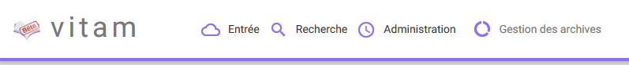
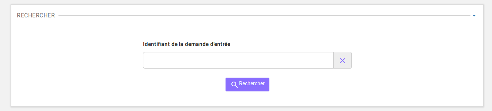
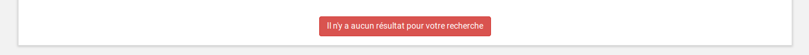
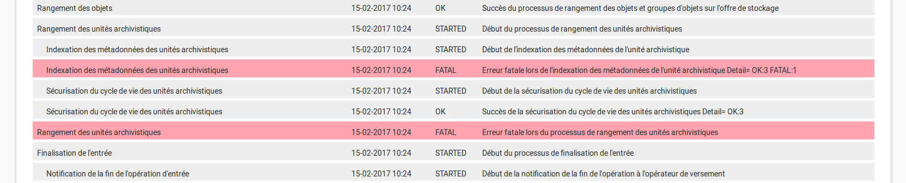
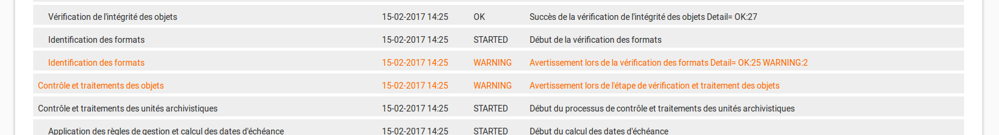
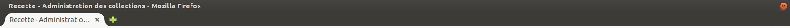

Généralités
###########

Menu
=====

Le menu est situé en haut des pages. Il est présent sur toutes les pages et est découpé en 4 grandes sections :

- Entrée
- Recherche
- Administration
- Gestion des archives

Chaque section comprend plusieurs sous-menus permettant de naviguer sur les différentes pages.

Fil d'Ariane
============

Le fil d'Ariane est un élément qui permet de visualiser le chemin d'accès à la page affichée. Il est situé sur toutes les pages, en dessous du menu.

La racine est toujours inactive (sans lien), elle correspond au nom du menu où est située la page.

Suite à la racine, les pages parentes sont listées et sont séparées par un "/" et, contrairement à la racine, elles sont toutes cliquables.
Un clic sur un lien redirige sur la page idoine.

.. image:: images/ariane.png

Formulaires de Recherche
========================

Deux types de formulaire sont utilisés dans la solution logicielle Vitam :

- Les formulaires de recherche simple
- Les formulaires de recherche avancée

Formulaires de recherche simple
-------------------------------

Les formulaires de recherche simple sont constitués d'un champ et d'un bouton "Rechercher". A droite du champ de recherche, l'utilisateur peut cliquer sur une croix pour effacer sa recherche.

Formulaires de recherche avancée
--------------------------------

Les formulaires de recherche avancée sont composés d'au moins deux champs, d'un bouton "Rechercher" et d'un bouton "Effacer". En cliquant sur le bouton "Effacer", toutes les valeurs saisies dans les champs du formulaire sont effacées.

.. image:: images/gen_formulaire_avance.png

Affichage du nombre de résultats
--------------------------------

Le nombre de résultats correspondant au résultat d'une recherche est indiqué sous la forme "Résultats (X)".

.. image:: images/gen_nombre_resultats.png

Si aucun résultat n'est trouvé par la solution logicielle Vitam, alors un message indique à l'utilisateur qu'aucun résultat n'est disponible pour sa recherche.

Visualisation des listes des écrans de détail
=============================================

Trois types d'écran de détail comportant des listes sont disponibles :

- Détail d'une opération d'entrée
- Détail d'un journal du cycle de vie de l'unité archivistique
- Détail d'un journal du cycle de vie du groupe d'objets

Les couleurs de fonds et des polices ont été adaptées en fonction des statutss KO, FATAL et WARNING.

Pour les cas KO ou FATAL, les lignes s'affichent en rouge et le texte est affiché en noir. Au survol avec le pointeur de la souris, le texte passe en blanc.

Pour les cas WARNING, la ligne ne change pas de couleur mais le texte est affiché en orange.

Affichage des dates et heures
=============================

Les dates et heures sont affichées au format jour-mois-année heures:minutes (JJ-MM-AAAA HH:mm). 

.. image:: images/date_heure.png

L'heure affichée s'adapte au fuseau horaire défini dans les paramétrages du poste de consultation.

Dans le cas où aucune heure n'est renseignée dans l'enregistrement, il est par défaut indiqué sur l'interface 00:00, et ceci quel que soit le fuseau horaire.

Titre des pages
===============

Les titres des pages sont visibles sur les onglets des navigateurs Internet. Ils correspondent au dernier noeud du fil d'Ariane. Par exemple :

- Transfert
- Recherche Référentiel des formats
- Recherche Référentiel des règles de gestion

.. image:: images/titre_IHM_demo.png

Sur IHM recette, le titre des pages est celui du dernier noeud du fil d'Ariane, précédé du mot "Recette -". Par exemple :

- Recette - Test SOAP-UI
- Recette - Administration des collections

Gestion des erreurs techniques
------------------------------

En cas d'erreur technique non gérée par le système, une fenêtre pop-up avertit l'utilisateur qu'un problème a eu lieu au travers d'un message généraliste, et lui indique des informations à transmettre à son administrateur technique.

.. image:: images/error_popup.png