Généralités
###########

Menu
=====

Le menu est situé en haut des pages. Il est présent sur toutes les pages et est découpé en 4 grandes sections :

- Entrée
- Recherche
- Administration
- Gestion des archives

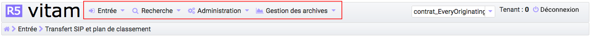

Chaque section comprend plusieurs sous-menus permettant de naviguer sur les différentes pages et accessibles en cliquant sur la flêche au dessous du titre de la section  permettant de naviguer sur les différentes pages.

Fil d'Ariane
============

Le fil d'Ariane est un élément qui permet de visualiser le chemin d'accès à la page affichée. Il est situé sur toutes les pages, en dessous du menu.

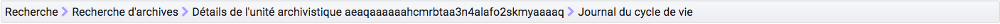

La racine est toujours inactive (sans lien), elle correspond au nom du sous-menu où est située la page.

Après la racine, les pages parentes sont listées et sont séparées par un chevron et, contrairement à la racine, elles sont toutes cliquables.
Un clic sur un lien redirige sur la page idoine.

Titre des pages
===============

Le titre de la page est visible sur les onglets des navigateurs Internet. Il correspond au dernier noeud du fil d'Ariane, précédé du mot "VITAM". Par exemple :

- Vitam_transfert de SIP et plan de classement Vitam.
- Vitam_Recherche d'archives Vitam.
- Vitam_Journal des opérations

|

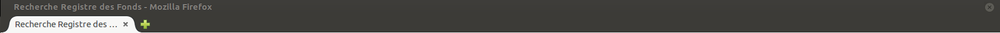

Flèche Retour en haut de page
=============================

- Pour toutes les pages, un bouton "Retour en haut de page" permet de retourner tout en haut de la page en cliquant sur l'icone. 

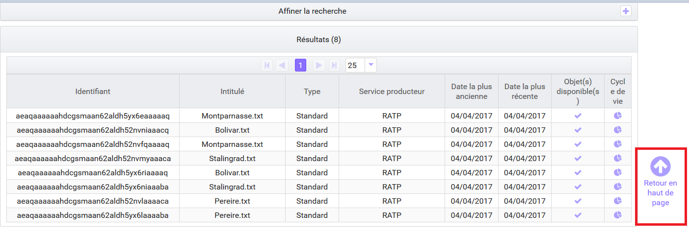

Formulaire de recherche
========================

Deux types de formulaire sont utilisés dans la solution logicielle Vitam :

- Des formulaires de recherche globale
- Des formulaires de recherche avancée

Chaque formulaire est doté d'un bouton "Rechercher" et "Effacer". Le bouton "Rechercher" permet d'effectuer une recherche correspondant aux valeurs entrées par l'utilisateur. Et en cliquant sur le bouton "Effacer", toutes les valeurs saisies dans les champs du formulaire sont effacées et les résultats sont ré-initialisés.

Formulaire de recherche globale
-------------------------------

Les formulaires de recherche globale sont composés d'un seul champ de recherche.

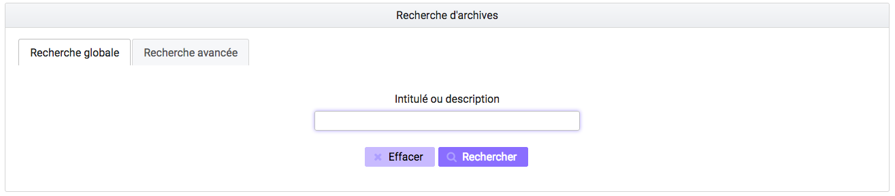

Formulaire de recherche avancée
--------------------------------

Les formulaires de recherche avancée sont composés d'au moins deux champs de recherche .

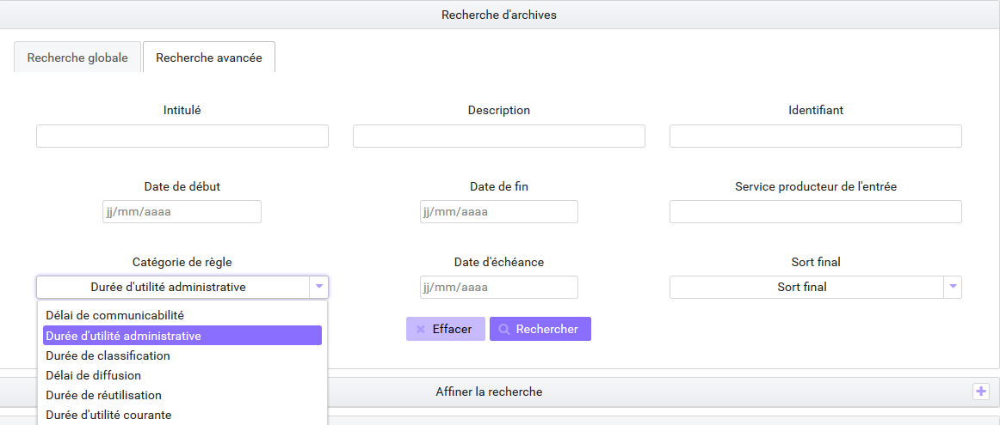

Affichage des résultats
========================

Le nombre de résultats correspondant au résultat d'une recherche est indiqué sous la forme "Résultats (X)".

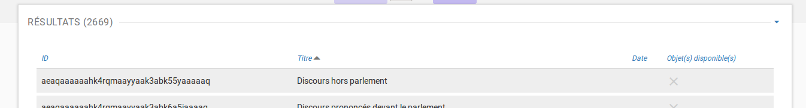

Si aucun résultat n'est trouvé par la solution logicielle Vitam, alors un message indique à l'utilisateur qu'aucun résultat n'est disponible pour sa recherche.

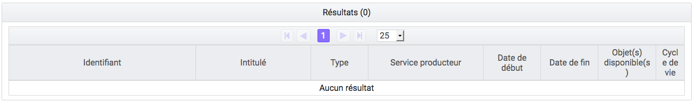

Par défaut, les 25 premiers résultats sont affichés. Une pagination permet de naviguer s'il y a un nombre supérieur de résultats.
Il est également possible d'afficher 5 ou 125 résultats par page en utilisant le sélecteur situé à côté de la pagination. 

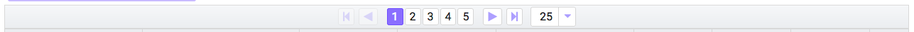

Informations supplémentaires
----------------------------

Il est possible d'afficher des colonnes supplémentaires dans certains tableaux. Pour cela, un clic sur le bouton "Informations supplémentaires" ouvre une liste d'options.

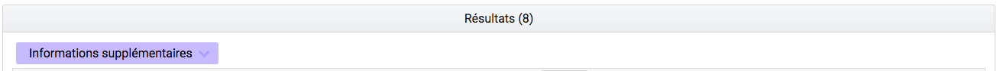

|

    .. image:: images/general_info_options.png
       :scale: 50
   
   
A partir de là, il est possible de choisir les options (colonnes) que l'on souhaite afficher en les cochant. Il est également possible de tout sélectionner par un clic sur la première case, située tout en en haut. 

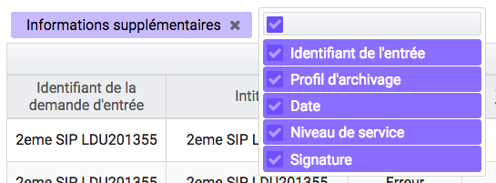

Un clic sur cette même case désélectionne toutes les options préalablement sélectionnées et masque les colonnes associées.

Visualisation des listes des écrans de détail
=============================================

Trois types d'écran de détail comportant des listes sont disponibles :

- Détail d'une opération
- Détail du journal du cycle de vie d'une unité archivistique
- Détail du journal du cycle de vie d'un groupe d'objets

Les couleurs de fond et des polices ont été adaptées en fonction des statuts OK, KO, FATAL et WARNING.

Pour le cas OK, les lignes s'affichent avec des couleurs neutres, le texte est affiché en noir et un pictogramme vert est présent. 

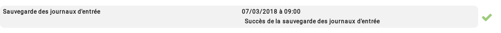

Pour les cas WARNING, la ligne ne change pas de couleur mais le texte est affiché en orange et un pictogramme de point d'exclamation est présent.

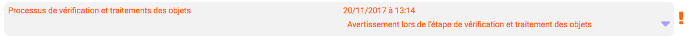

Pour les cas KO ou FATAL, les lignes s'affichent en rouge et le texte est affiché en noir et un pictogramme en forme croix est présent.

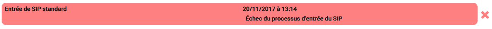

Modification
-------------

Il est possible de modifier certaines données dans les pages de détail. Un clic sur le bouton "Modifier" permet alors d'éditer les champs dont les valeurs peuvent être changées.

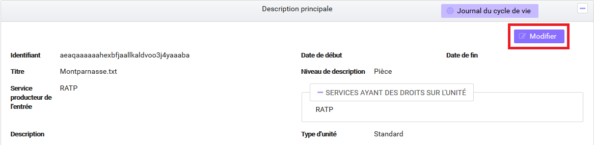

**Etiquettes (tags)**

Certains champs possèdent un système d'étiquettes ou tags permettant d'ajouter plusieurs éléments (généralement, un identifiant). Pour ajouter un nouveau tag, l'utilisateur saisit l'identifiant et valide en appuyant la touche "entrée", un tag sera alors créé (celui-ci sera encadré par un fond de couleur). Pour supprimer un tag, il faut cliquer directement sur la croix de suppression contenue dans le tag (à droite) ou cliquer sur la touche "retour arrière". 

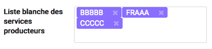

Une fois les modifications effectuées, l'utilisateur peut soit les annuler en cliquant sur "Annuler" et tous les champs reviennent à leur état initial soit enregistrer les modifications en cliquant sur "Sauvegarder", les champs modifiés sont alors mis à jour et enregistrés dans la solution logicielle Vitam.

Affichage des dates et heures
=============================

Les dates et heures sont affichées soit au format jour-mois-année heures:minutes (JJ-MM-AAAA HH:mm), soit au format jour-mois-année (JJ-MM-AAAA).

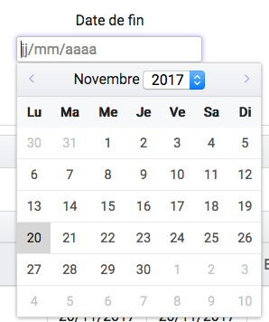

L'heure affichée s'adapte au fuseau horaire défini dans les paramétrages du poste de consultation de l'utilisateur. 

Dans le cas où aucune heure n'est renseignée dans l'enregistrement, il est par défaut indiqué sur l'interface 00:00, et ceci quel que soit le fuseau horaire.

Import de fichier ou dossier
============================

La solution logicielle Vitam permet d'importer des fichiers ou des dossiers compressés de différents formats. 
Les formats acceptés sont: 

* Pour les entrées : .zip, .tar,  .tar.gz, .tar.bz2 et tar.gz2. 
* Pour les contextes, les contrats d'entrée, les contrats d'accès, les notices de profils d'archivage, les ontologies, les profils d'unité archivistiques: Json 
* Pour les référentiels des services agents, les réferentiels des règles de gestion : CSV
* Pour les référentiels des formats: xml
* Pour les profils d'archivage: rng ou xsd

Il existe deux façons d'importer un fichier ou dossier :

- De façon classique en sélectionnant le fichier ou dossier via l'interface du navigateur de l'utilisateur en cliquant sur le lien "sélectionner un fichier"
- De façon plus intuitive en faisant glisser le fichier ou dossier de l'ordinateur à la page d'import. Pour cela le fichier ou dossier doit être déplacé dans la zone grisée de téléchargement en cliquant sur le fichier, et en le faisant glisser vers la zone de téléchargement 

|

    .. image:: images/zone_dl.png
       :scale: 50

Dans les deux cas, le nom du fichier ou dossier s'inscrit en bas de la zone de téléchargement.

|

    .. image:: images/zone_dl_file.png
       :scale: 50
   
   
Référentiels
-------------

Le processus d'import d'un référentiel se décrit comme ceci :

- aller sur l'interface d'import du référentiel à importer
- cliquer sur le bouton "sélectionner un fichier" ou faire glisser le fichier sur l'espace de téléchargement
- cliquer sur le bouton "Importer"
- le système vérifie l'intégrité et la cohérence du fichier

A partir de cet écran, il est possible d'accèder à l'import d'autres référentiels. Un menu déroulant permet en effet de sélectionner la catégorie de référentiel à importer. 

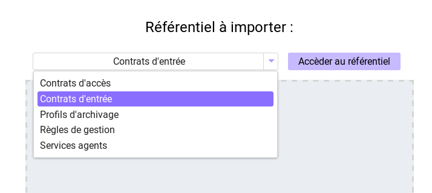

A l'issue de ce contrôle, deux cas sont possibles :

- En cas d'erreur de fichier : la solution logicielle Vitam détecte des erreurs contenues dans le fichier, l'import de ce dernier n'est pas possible, un message d'erreur s'affiche. L'utilisateur doit corriger ces erreurs et soumettre à nouveau le fichier s'il souhaite toujours effectuer son import.Le détail des erreurs au moment de l'import pour les référentiels sont détaillées dans les sections correspondantes. 

Note: les erreurs communes pour tous les référentiels sont liées au format du fichier, et au fait que certaines données obligatoires ne sont pas présentes. 

|

.. image:: images/import_ko.png
   :scale: 50

- En cas de succès : La solution logicielle Vitam crée le référentiel à partir des informations contenues dans le fichier soumis et affiche un message de succès.

|

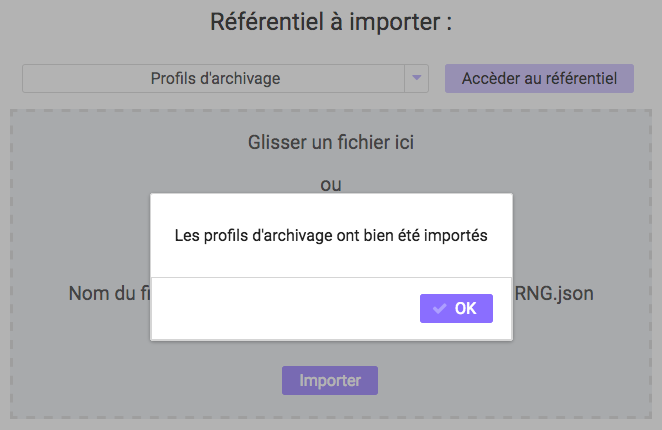

Gestion des erreurs techniques
==============================

En cas d'erreur technique non gérée par le système, une fenêtre pop-up avertit l'utilisateur qu'un problème a eu lieu au travers d'un message généraliste et lui donne des informations à transmettre à son administrateur technique.

|

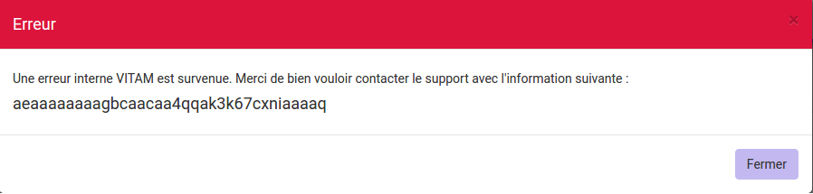

Tenants
=======

Le tenant correspond à un espace réservé à une entité utilisatrice. Par exemple, un lot d'archives versé sur le tenant numéro deux ne sera pas consultable depuis les autres tenants.

Il est obligatoire de sélectioner un tenant lors de la connection. Certaines références et certaines opérations d'administration peuvent être trans-tenants ( les Formats et les contextes par exemple ) 

Le tenant d'administration permet de réaliser les opérations qui concernent plusieurs tenants, notamment l'import du réferentiel des formats, des contextes, leur purge, leur journalisation,...

Utilisation du panier
=====================

Il est possible de créer une sélection, accessible sous la forme d'un panier afin d'appliquer une action sur plusieurs unités archivistiques provenant d'un ou plusieurs services producteurs.

Accès au panier: 
----------------

L'accès au Panier se fait via le Menu principal , une icône "Mon panier" est affichée, sous le bouton "Déconnexion" . 

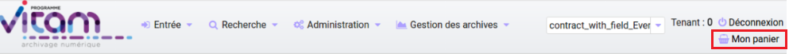

Note: lorsque l'utilisateur utilise le même navigateur, il est possible de se retrouver la sélection lors d'une déconnexion - reconnexion, après avoir sélectionné le contrat d'accès qui permet d'avoir accès aux unités archivistiques 

Note: même si le panier est vide, l'utilisateur a quand même accès à la page liée "panier".

Placer des Unités Archivistiques dans le panier
------------------------------------------------

Il y a deux façons de rajouter des unités archivistiques dans le panier : soit via le détail de ces unités archivistiques, soit en accédant au panier, et en cliquant sur le bouton "Ajouter des unités archivistiques"

Via le détail des unités archivistiques: tout en bas de la page, une section "Ajouter au panier", et un bouton radio permet de sélectionner la partie à insérer dans la sélection: 

	* L'unité archivistique  
	* L'unité archivistique et sa descendance 
	* L'ensemble de l'entrée 

Un bouton " Ajouter au panier " permet d'ajouter le ou les éléments voulus au panier. Un pop-up de confirmation s'affiche lors de l'ajout à la sélection. 

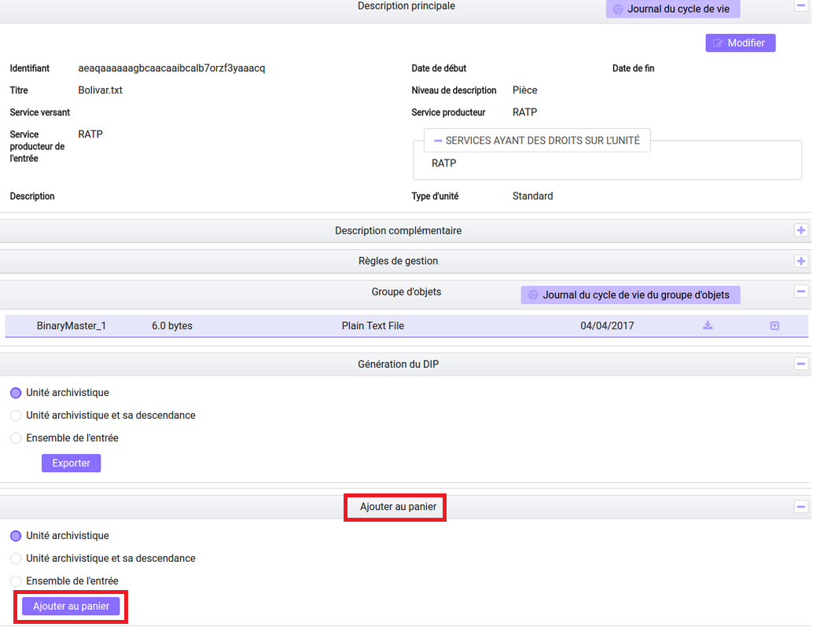

Via le panier directement : 
Le bouton "Ajouter des unités archivistiques" permet d'accèder directement à la page de recherche, afin d'ajouter des unités archivistiques à la sélection. 

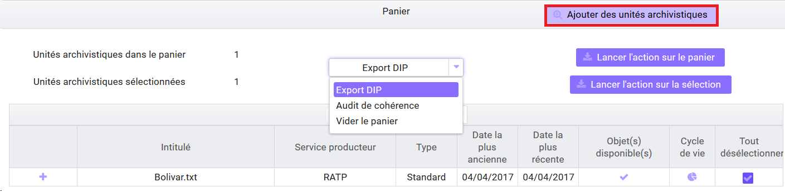

Note: il est possible de créer une sélection d'unités archivistiques provenant de services producteurs différents. 

Visualisation du Panier: 
------------------------

L'affichage du panier permet de visualiser sous la forme d'un tableau, l'ensemble des unités archivistiques sélectionnées ainsi que leur descendance si celle ci a été sélectionnée aussi. Le tableau offre une pagination permettant de passer d'une page à l'autre. 

Le nombre d'unités archivistiques présentes dans le panier est affiché. 

Les informations affichées sont les suivantes : 
        - La première colonne indique si l'unité archivistique a été sélectionnée avec sa descendance, et un clic sur l' icône permet de plier et de déplier la liste, afin d'afficher les unités archivistiques. Les unités archivistiques déscendantes sont affichées en italiques. 
	- Intitulé
	- Service Producteur
	- Type
	- Date la plus ancienne
	- Date la plus récente
	- Objet(s) disponible(s)
	- Cycle de vie
        - La dernière colonne permet de sélectionner / désélectionner l'unité archivistique ainsi que sa descendance.

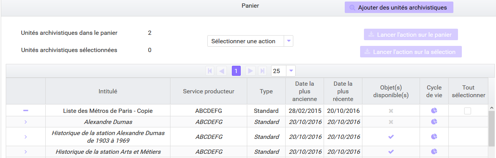

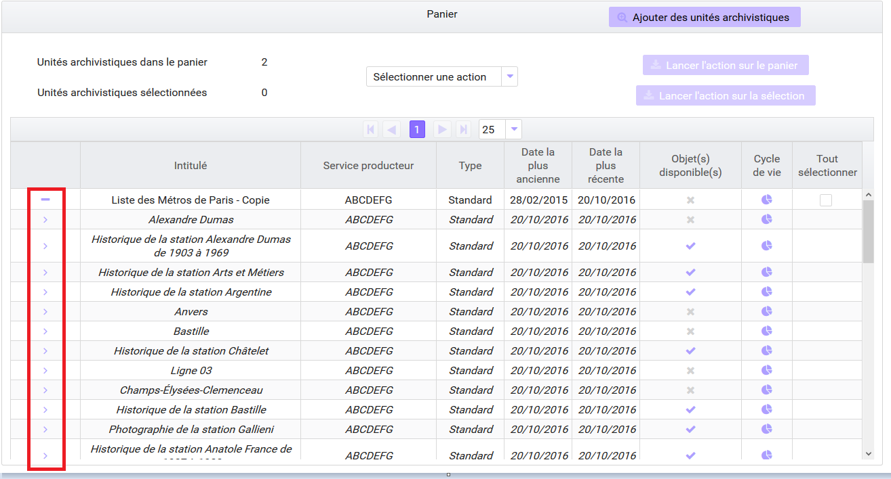

Note: un clic sur chaque ligne permet de retourner à la page de détail de l'unité archivistique, de la même façon que via la page de recherche. 

Note: les unités archivistiques de la descendance ne sont pas sélectionnables individuellement. 

Créer une sélection dans le panier 
----------------------------------

Il est possible de créer une sélection pour travailler seulement sur certaines unités archivistiques dans le panier.
Pour cela, il suffit de sélectionner les unités archivistiques voulues avec les coches de sélection sur la colonne de droite. 

Il est possible de sélectionner toute la liste en cliquant sur l'en-tête de la colonne de droite, et aussi de tout sélectionner en recliquant. 

Pour retirer une unité archivistique de la sélection: 

il suffit de la sélectionner via les coches, de sélectionner l'action "vider le panier" et de cliquer sur le bouton "Lancer l'action sur la sélection". 

Un pop-up de confirmation s'affiche pour valider la suppression du panier 

Les unités archivistiques sont cependant toujours disponibles sur le tenant, et accessibles via la page de recherche.

Vider le panier 
---------------

Le fait de vider le panier ou de retirer une unité archivistique ne les supprime pas de la base de donnée.

Pour vider le panier de la totalité des unités archivistiques, il faut sélectionner l'action "Vider le panier", et cliquer sur le bouton "Lancer l'action sur le panier". Une pop up de confirmation s'affiche lorsque les unités archivistiques sont bien supprimées du panier. 

Appliquer une action sur la sélection
-------------------------------------

Actuellement, plusieurs actions sont possibles : exporter le panier sous la forme d'un DIP, vider le panier, effectuer une modification de métadonnées en masse, une élimination ou bien effectuer un audit de cohérence sur les unités archivistiques.

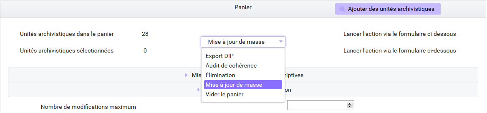

Ces actions peuvent soit être effectuées sur la totalité des unités archivistiques du panier, soit seulement sur celles que l'on sélectionne en utilisant les coches de sélection dans la dernière colonne. 

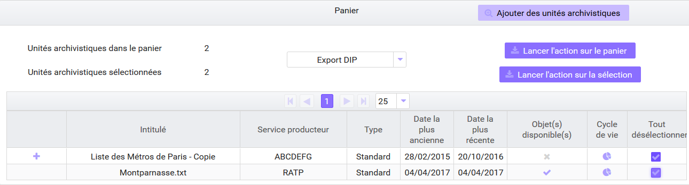

Note: si aucune unité archivistique n'est sélectionnée, les boutons correspondants aux actions relatives à la sélection uniquement seront grisés, et les actions seront uniquement disponibles pour la totalité du panier. 

