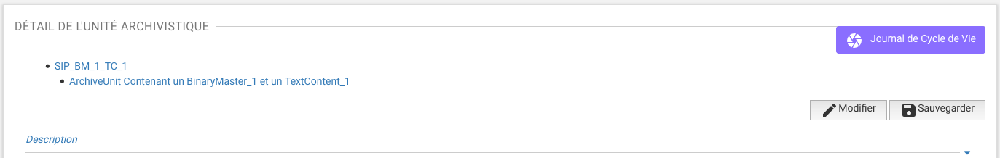
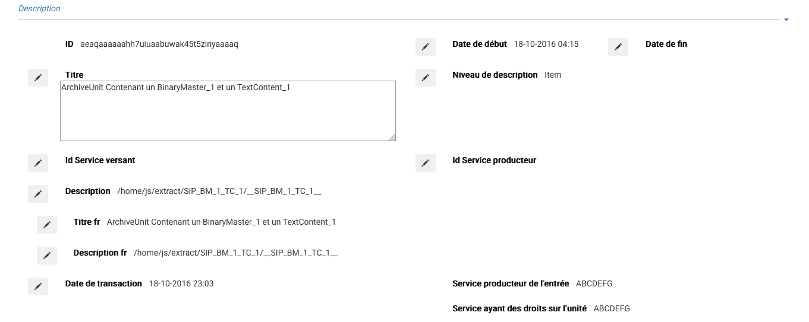

Gestion des archives existantes
################################

Cette partie décrit les fonctionnalités de gestion et modification des archives dans Vitam.

NB : Cette partie est disponible via l'IHM de démonstration.

Modification des métadonnées
============================

La modification des métadonnées d'une unité archivistique s'effectue depuis son écran de détail.

Un clic sur le bouton "Modifier" situé dans la partie droite de l'écran permet de faire apparaître des pictogrammes de stylos à gauche des champs modifiables, le bouton devient un bouton "Annuler" afin de pouvoir annuler l'opération et revenir à l'état initial, sans prendre en compte aucune modification.

.. image:: images/GESTION_modif_annuler.png

Un clic sur le "stylo" permet de modifier la métadonnée correspondante. Une fois toutes les modifications effectuées, un clic sur le bouton "Sauvegarder" va enregistrer les modifications.

