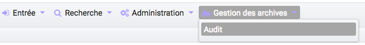
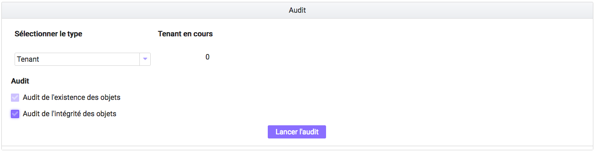

Gestion des archives 
#####################

Cette partie décrit les fonctionnalités permettant de gérer les archives conservées dans la solution logicielle Vitam. 

Audit 
=====

L'audit est une action d'évaluation, de vérification, de contrôle et de correction permettant de s'assurer que l'état de la plateforme est toujours conforme à ses exigences de qualité et de sécurité.

Pour lancer un audit, l'utilisateur clique le menu "Gestion des Archives", puis sélectionne "Audit".

Lancement d'un audit de l'existence des objets
-----------------------------------------------

Un audit de l'existence des objets se lance sur un service producteur ou sur un tenant. Il permet de vérifier que, pour chaque objet du tenant ou du producteur choisi:

* Il n'y a pas d'incohérence sur la stratégie de stockage. L'audit vérifie que la liste des offres de stockage définies dans le groupe d'objets est bien la même que celle définie dans la stratégie de stockage

* Tous les objets ont leurs copies. L'audit vérifie que tous les fichiers correspondant aux objets existent sur les offres déclarées, avec le nombre de copie spécifié par la stratégie de stockage

Pour débuter l'audit, il suffit de sélectionner comme type "Tenant" ou "Service producteur". L'audit du tenant prend automatiquement comme valeur le tenant en cours.
Celui du service producteur demande de sélectionner un service producteur dans la liste. Cette liste est construite à partir des services producteurs ayant déjà effectué une entrée dans la solution logicielle Vitam.

Il faut ensuite cocher le type d'audit désiré, ici "Audit de l'existence des objets", et de cliquer sur le bouton "Lancer l'audit". Un message de confirmation apparaît pour notifier le lancement du processus.

.. image:: images/detail_audit.png

Comme pour toutes les opérations, le résultat de l'audit est consultable via journal des opérations.

Lancement d'un audit de l'intégrité des objets
-----------------------------------------------

L'audit de l'intégrité des objets est un contrôle additionnel de l'audit de l'existence des objets. Il permet de vérifier que, pour chaque objet du tenant choisi ou chaque objet appartenant à ce service producteur, ces objets n'ont pas été altérés à l'insu de la solution logicielle Vitam.

L'opération consiste à vérifier que pour chaque objet audité, l'empreinte de cet objet enregistrée dans la base de données est toujours la même que l'empreinte calculée par l'offre de stockage.L'empreinte d'un objet est une représentation mathématique considérée comme unique par objet. Si l'objet est modifié d'une quelconque manière que ce soit, son empreinte change de manière radicale.

L'audit de l'existence des objets se lance depuis le menu "Gestion des archives", sur le même mode que l'audit de l'existence des objets, en cochant la case "Audit de l'intégrité des objets". Etant donné qu'il s'agit d'un contrôle additionnel, il est impossible dans l'IHM de lancer l'audit de l'intégrité des objets sans lancer l'audit de l'existence des objets : la case de ce dernier se cochant automatiquement si cela n'était pas déjà fait.

Une fois l'audit lancé, une fenêtre modale s'ouvre pour en informer l'utilisateur, le résultat de l'audit est consultable via journal des opérations.

Lancement d'un audit de cohérence
---------------------------------

L'audit de cohérence des objets est un contrôle de sécurité des objets.
Il permet de vérifier que, pour une sélection d'objets appartenant à un ou plusieurs services producteurs, ces objets n'ont pas été altérés à l'insu de la solution logicielle Vitam.

L'opération consiste à vérifier que pour chaque objet audité, l'empreinte contenue dans le fichier sécurisé créé au moment de l'import, est identique à l'empreinte de cet objet enregistrée dans la base de données et à l'empreinte calculée par l'offre de stockage.

L'empreinte d'un objet est une représentation mathématique considérée comme unique par objet. Si l'objet est modifié d'une quelconque manière que ce soit, son empreinte change de manière radicale.

L'audit de cohérence des objets se lance via la fonctionnalité du panier, et peut se lancer sur une sélection précise du panier ou bien sur la totalité de la sélection. 

.. image:: images/detail_audit_coherence.png

Une fois l'audit lancé, une fenêtre modale s'ouvre pour en informer l'utilisateur, et le résultat de l'audit est consultable via journal des opérations.

Résultat et rapport d'audit
============================

Le résultat de l'audit est disponible dans le journal des opérations ainsi que le rapport d'audit généré. Pour les consulter, l'utilisateur doit aller dans le journal des opérations et cliquer sur "Informations complémentaires" puis sélectionner le champ "Rapport". Une colonne "Rapport" apparaît dans le détail de l'opération d'audit et le rapport peut être téléchargé en cliquant sur l'icône de téléchargement. 

Ce rapport détaille l'état de la plateforme : 

* Tout d'abord en listant l'ensemble des opérations d'entrées associées à un groupe d'objet ayant été audité (en succès ou échec)
* Puis l'ensemble des objets pour lesquels l'audit a rencontré un échec. 
* La structure de ce rapport est détaillée dans le document modèle de données, les différents statuts possibles sont décrits dans la documentation "modèle de workflow" dans la partie liée aux audits. 

Ce rapport est formaté de telle manière à faciliter son intégration dans des systèmes d'information, il n'a pas pour objet principal d'être lu par un humain tel quel, même si cela reste possible.
