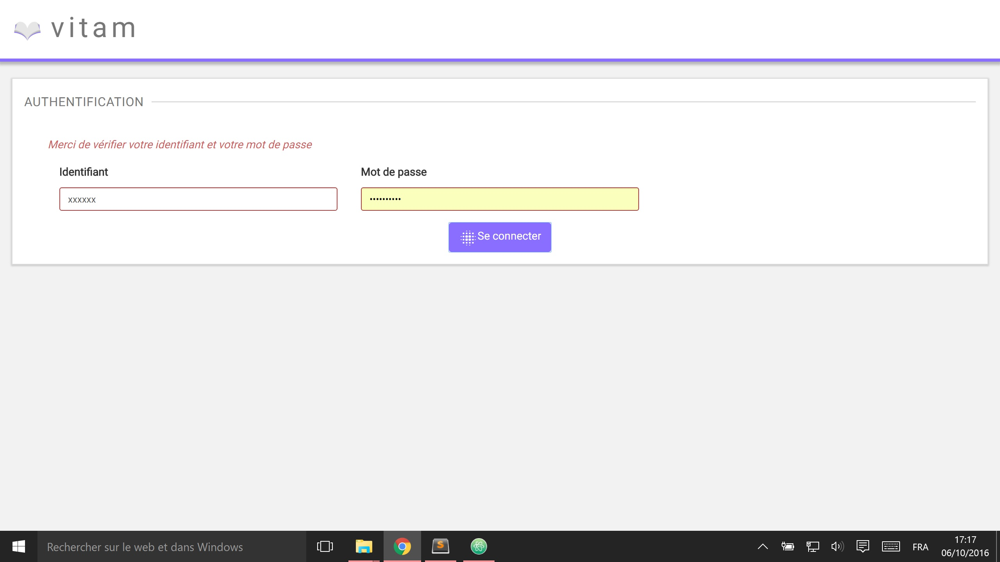

Manuel utilisateur - IHM Authentification
###########################################

Introduction
============
Ce manuel est destiné à expliquer les fonctionnalités du système d'authentification qui s'affiche dès qu'un utilisateur souhaite se connecter à VITAM.

-------------------

L'utilisateur doit entrer son Identifiant dans le champ du même nom, puis taper son mot de passe dans le champ suivant. Un clic sur "Se connecter" lance l'authentification.

.. image:: images/authentification_OK.jpg

En cas d'erreur, un message s'affiche.

Si l'utilisateur entre une URL vers une page de VITAM ou si sa session a été close, une fois l'authentification effectuée, il sera redirigé vers la page demandée. Par défaut la page d'entrée d'un SIP est affiché.
