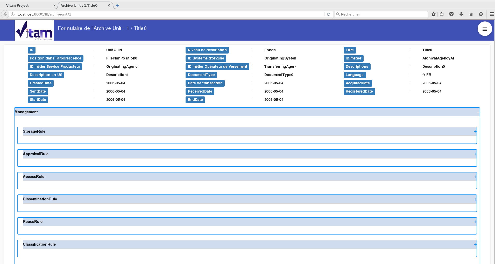

Manuel utilisateur - IHM Détail d'un résultat
#######################################################

Note
Ce manuel est destiné à expliquer les fonctionnalités de consultation d'un archiveUnit dans Vitam pour les utilisateurs de l'IHM minimale. 

Suite à la recherche d'un ArchiveUnit, l'utilisateur peut décider de consulter en détail le contenu d'un ArchiveUnit. (Cf Manuel utilisateur 'IHM recherche ArchiveUnit')
La consultation de ce détail s'affiche dans un nouvel onglet, dans le but de ne pas perdre la liste des résultats. 

L'utilisateur retrouve sur cet écran toutes les informations conteu dans le bordereau SEDA, récupéré lors de l'entrée de cette archive dans VItam. 

On retrouve entre autre, les métadonnées descriptives (et dans les futurs implémentations, les métadonnées de gestion et techniques ainsi que l'accès en consultation des objets associés)