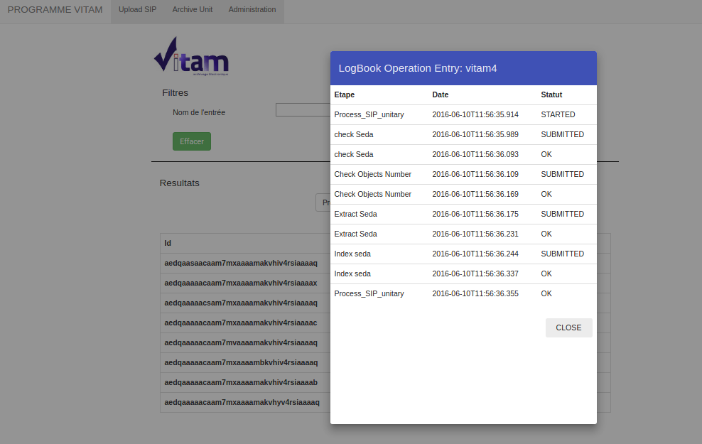

Manuel utilisateur - IHM Administration Fonctionnelle : Détail du journal des opérations d'entrée
##################################################################################################

Note
Ce manuel est destiné à expliquer les fonctionnalités de consultation d'une opération d'entrée dans Vitam pour les utilisateurs de l'IHM d'Administration Fonctionnelle. 

Suite à la recherche d'une opération d'entrée, l'utilisateur peut décider de consulter en détail son contenu. (cf. manuel utilisateur 'IHM Administration Fonctionnelle : Journal des opérations d'entrée').
La consultation de ce détail s'affiche dans un fenêtre type 'modale', dans le but de ne pas perdre le focus sur la liste des résultats. 

L'utilisateur retrouve sur cet écran toutes les informations conteu dans le journal des opérations associé à cette entrée.

On retrouve entre autres, le processus d'entrée étape par étape et les status correspondants. 