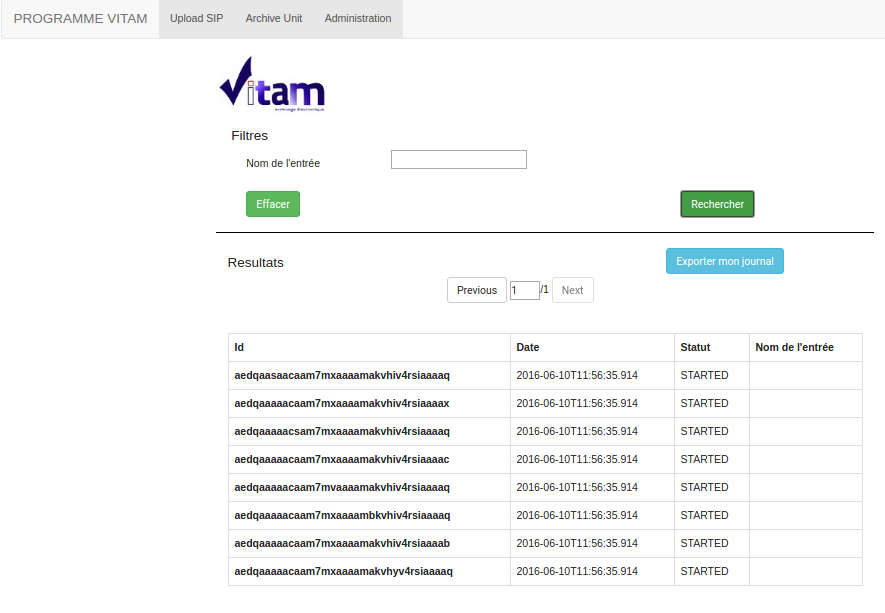

Manuel utilisateur - IHM Administration Fonctionnelle : Journal des opérations d'entrée
########################################################################################

Note
Ce manuel est destiné à expliquer les fonctionnalités de recherche dans le journal des opérations d'entrée de l'IHM d'Administration Fonctionnelle. 

Pour débuter une recherche, l'utilisateur doit se rendre sur l'IHM d'Administration.

Via le formulaire de recherche, l'utilisateur a la possibilité de rechercher via le champs Nom de l'entrée (Message Identifier dans le manifeste SEDA). La recherche s'effectue de façon stricte, c'est à dire que seul le nom de l'entrée comprenant strictement la chaine de caractère recherchée devra être retourné. 

Pour lancer la recherche, l'utilisateur clique sur le bouton "Rechercher". Si le champ de recherche est vide, l'ensemble des opérations d'entrée sont affichées.

Le résultat de la recherche est affiché sous forme de tableau. Nous retrouvons les colonnes ID, date, statut, nom de l'entrée. Depuis cette liste de résultat, l'utilisateur peut consulter le détail d'un résultat en cliquant sur la ligne voulue (voir manuel utilisateur correspondant). 

Les résultats sont paginés et il est possible de naviguer entre les pages par l'intermédiaire des flêches. 