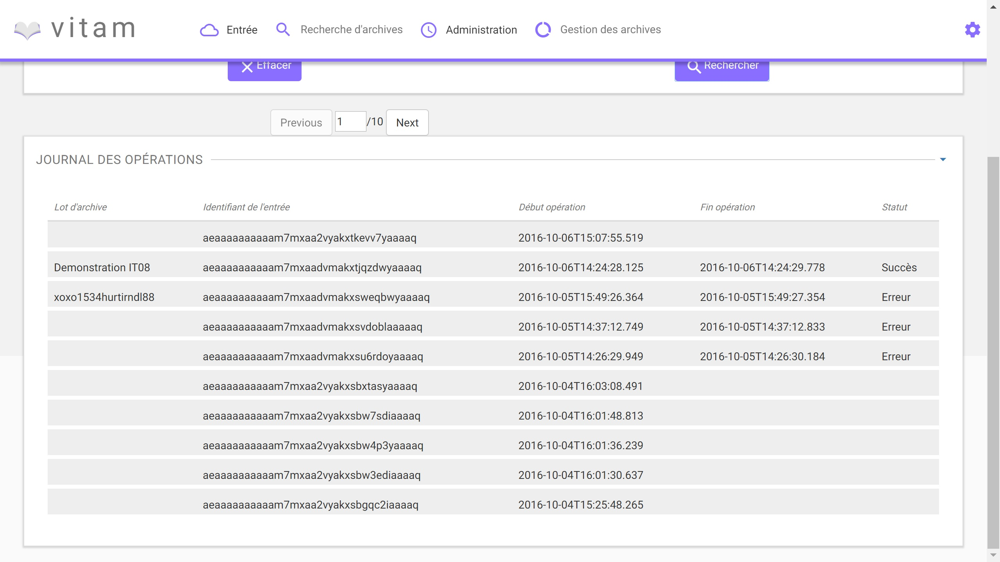
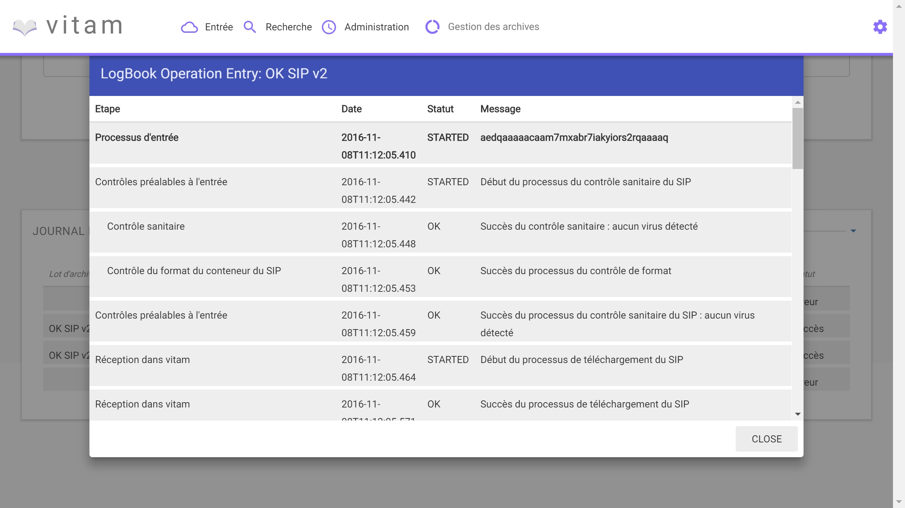

Manuel utilisateur - Journal des opérations d'entrée
########################################################################################

Introduction
============
Ce manuel est destiné à expliquer les fonctionnalités de recherche dans le journal des opérations d'entrée de VITAM.

Pour débuter une recherche, l'utilisateur doit séléctionner "Suivi des opérations d'entrées" dans le menu "Entrées".

Par défaut l'ensemble des opérations d'entrées est affiché.

**Formulaire de recherche**

La recherche s'effectue en utilisant un ou plusieurs champs suivant :

- Nom de l'entrée (Message Identifier dans le manifeste SEDA)
- Statut
- Dates Extrêmes

Pour initier la recherche, l'utilisateur clique sur le bouton "Rechercher".

La recherche s'effectue de façon stricte, c'est à dire que seul le nom de l'entrée comprenant strictement la chaine de caractère recherchée sera retourné.

.. image:: images/op_entree.jpg

**Affichage des résultats**
Le résultat de la recherche est affiché sous forme de tableau, les colonnes sont triées par Date de versemment décroissante. Chaque ligne renseigne:

- ID
- Date
- Statut
- Nom de l'entrée

Depuis cette liste de résultat, l'utilisateur peut consulter le détail d'une opération en cliquant sur sa ligne (se référer au manuel utilisateur "Détail d'une opération d'entrée").

----------------------

**Consultation du détail**

Suite à la recherche d'une opération d'entrée, l'utilisateur peut choisir de consulter le détail de son contenu.
La consultation de ce détail s'affiche dans un fenêtre type 'modale', afin de ne pas perdre le focus sur la liste des résultats.

L'utilisateur retrouve sur cet écran toutes les informations contenues dans le journal des opérations associé à cette entrée.
Le processus d'entrée est listé étape par étape avec message correspondant au résultat de chaque opération.

Chaque ligne renseigne:

- Etape (nom de l'étape correspondante)
- Date (date à laquelle l'opération a été effectuée)
- Statut (statut final de l'étape)
- Message (message expicatif)

Un clic sur la croix ou hors de la fenêtre modale referme celle-ci.
