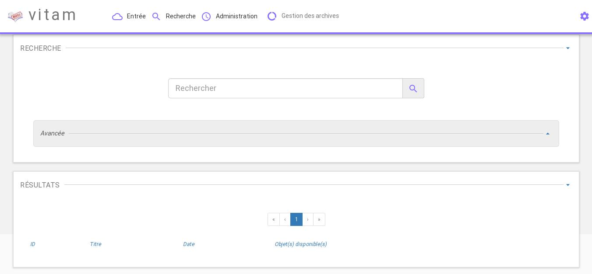
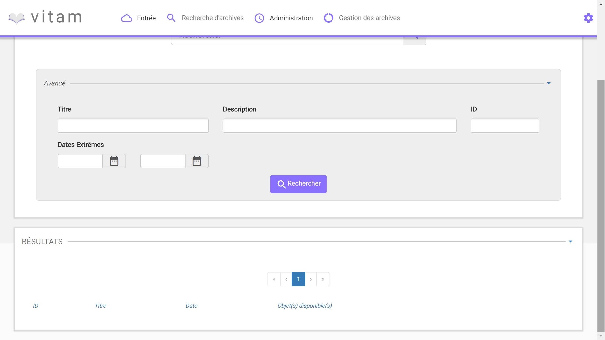

Recherche d'une Unité Archivistique
#######################################################

Introduction
============

Ce manuel est destiné à expliquer les fonctionnalités de recherche d'une Unité Archivistique dans Vitam.

La consultation de la page de recherche s'effectue en sélectionnant "Recherche d'archives" via le menu.

----------------

**Recherche simple**

La recherche simple s'effectue en utilisant le champ principal. Le ou les mots entrés vont être ensuite recherchés dans le champ Titre et Description des Unités Archivistiques.

Pour initier la recherche, l'utilisateur presse le bouton "Entrée" ou clique sur le pictogramme de loupe. Un pictogramme en forme de croix permet de supprimer le texte entré dans le champ.

Une recherche libre est effectuée (c'est-à-dire que pour une recheche du mot "acte" sera remonté par exemple "acte de naissance" ou "Divers actes de mariage"), les contraintes sont les suivantes :

- La recherche n'est pas sensible à la case
- Les résultats ne tiennent pas compte des accents / c cédilles
- Les résultats ignorent les caractères spéciaux

**Recherche avancée**

La recherche avancée permet de rechercher dans un ou plusieurs champs précis de l'Unité Archivistique :

- Titre
- Description
- ID
- Dates Extrêmes

La recherche ID est particulière dans ce cas. L'ID étant unique, il n'est pas possible d'effectuer une combinaison de recherche par ID et tout autre champs.

**Résultats de recherche**

Les résultats de la recherche sont affichés sous forme de tableau affichant les colonnes ID, titre, date ainsi que la disponibilté d'objet (coche = objet présent, croix = aucun objet). Depuis cette liste de résultat. L'utilisateur peut consulter le détail d'un résultat en cliquant sur la ligne voulue (le détail d'un résultat sera décrit dans détail_archive_unit.rst).

L'îcone "Résultat (X)" indique le nombre de résultat trouvé lorsque l'utilisateur effectue une recherche.

.. image:: images/liste_resultats.jpg
