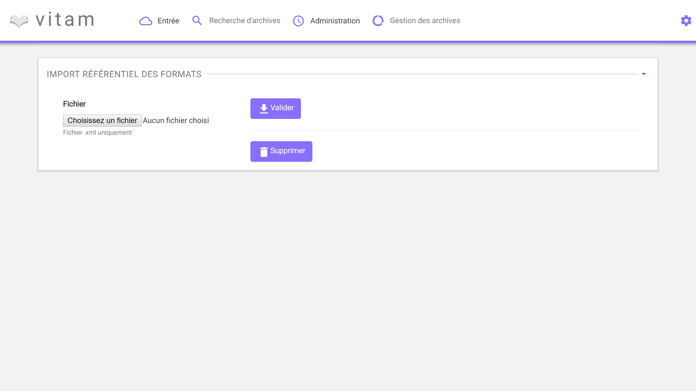
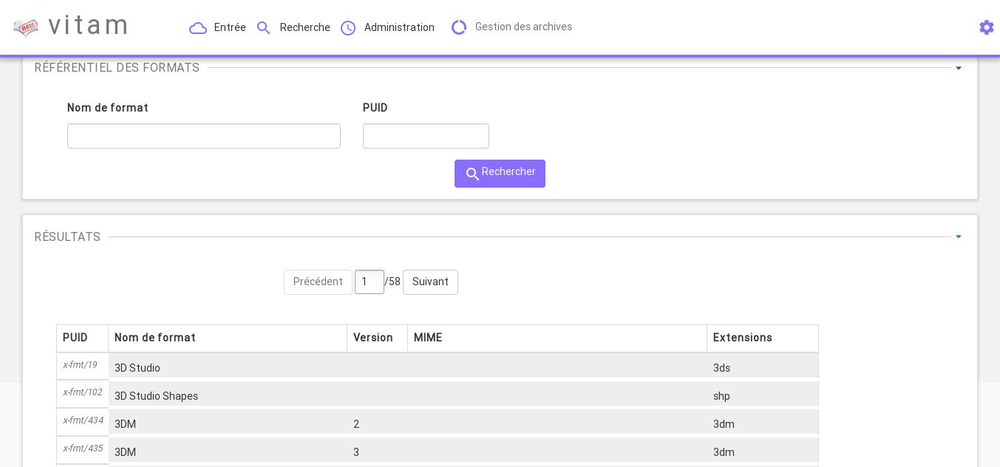
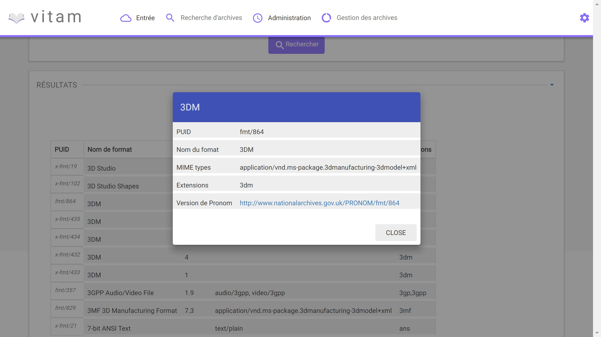

Le référentiel des formats
############################

Introduction
============

Ce manuel s'adresse à un administrateur fonctionnel et décrit la méthode pour importer une première fois un référentiel de format, basé sur une version récente du référentiel Pronom, pour
ensuite le consulter et rechercher des formats en particuliers.

-----------

A/ Import du référentiel de formats
---------------------------------------------

**I/ Récupération du fichier de format**

L'administrateur possède ou récupère le fichier Pronom.

La récupération peut se faire sur le site des archives nationales anglaises :
<http://www.nationalarchives.gov.uk/>

Section "Pronoms" > "DROID signature files. Au 28/07/2016, le référentiel est disponible en version V86.

**II/ Importation du format**

1/ L'administrateur accède à l'interface d'importation du référentiel de format et clique sur le bouton pour sélectionner un fichier

2/ Le fichier à selectionner est le fichier XML Pronoms récupéré précédemment. L'administrateur valide son choix

3/ Le système vérifie l'intégrité et la cohérence du fichier. A l'issue

En cas d'erreur :
Le système remonte la liste des erreurs contenues dans le fichier et l'importation de ce dernier n'est pas possible. L'administrateur doit corriger ces erreurs et soumettre à nouveau ce fichier s'il souhaite toujours effectuer son import.

En cas de succès :
Le système indique à l'administrateur que son fichier est admissibile et lui propose l'import définitif du fichier.

4/ L'administrateur accepte l'import définitif, et le référentiel format est créé ou mis à jour à partir des informations contenues dans le fichier soumis.

-----------

B/ Recherche et consultation du référentiel
------------------------------------------------------

**I/ Affichage général**

Dans l'IHM du référentiel de format, l'administrateur peut afficher la totalité du référentiel. Pour le parcourir, il peut s'appuyer sur les boutons de page précédente ou suivante.

Le champ de recherche permet de trouver une règle ou un ensemble de règles en particuliers, en se basant sur son intitulé.
Pour ce faire, l'administrateur saisit un texte dans le champ de recherche et valide son action : la liste du référentiel est alors actualité avec les résultats correspondants à la recherche.

**II/ Affichage détaillé**

Pour accéder au détail de chaque format, l'administrateur peut cliquer sur la ligne du format désiré.
Une fenêtre s'ouvre alors avec ce détail.

