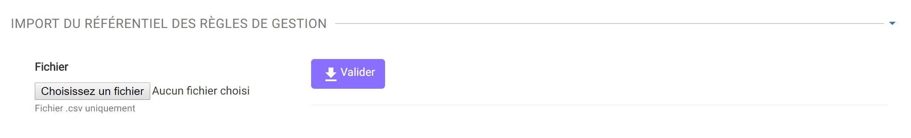
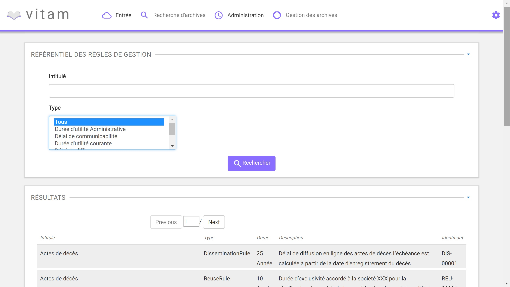
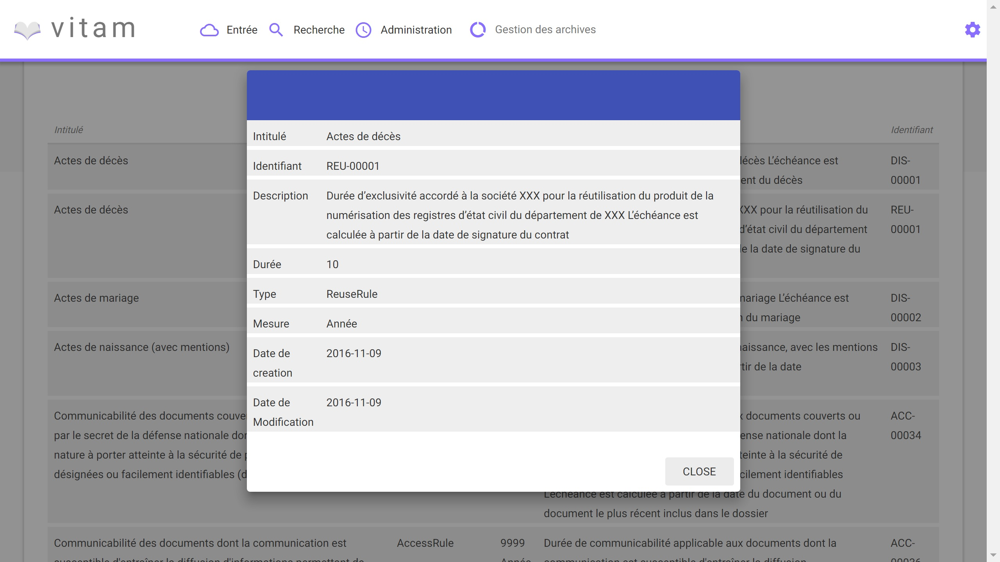

Le référentiel des règles de gestion
####################################

Introduction
============

Ce manuel utilisateur s'adresse à un administrateur fonctionnel et décrit la méthode pour importer une première fois un référentiel des règles de gestion, pour ensuite le consulter et rechercher des règles de gestion. Ces règles de gestion serviront par la suite au calcul des règles liées aux unités d'archives et aux objets lors d'un versement d'un SIP.

-----------

A/ Import du référentiel des règles de gestion
-----------------------------------------------

**I/ Récupération du fichier**

L'administrateur s'assure de posséder (où dans le cas contraire récupère le référentiel des règles de gestion) le référentiel sous format CSV. Seul ce type de fichier pourra être importé.

Plusieurs critères doivent être respecté pour s'assurer de la bonne construction des règles de gestion :

- Identifiants de la règle externe ou métier/FO. Obligatoire : RuleID

Equivalent SEDA : Attribut  <Rule id="xxxx">
Contrainte : le ruleID est unique dans le référentiel
Note : il est de la responsabilité de l'administrateur fonctionnel et du SIP d'avoir des ID qui correspondent entre son front office et le manifest

- Type de règle (énumération :AppraisalRule, AccessRule, StorageRule, DisseminationRule, ReuseRule, ClassificationRule). Obligatoire

  - Durée d'utilité Administrative (DUA) : AppraisalRule
  - Délai de Communicabilité (DCOMM) : AccessRule
  - Durée d'utilité courante (DUC) : StorageRule
  - Délai de diffusion (DDIFF) : DisseminationRule
  - Durée de réutilisation (DREUT) : ReuseRule
  - Durée de classification (DCLASS) : ClassificationRule

- Intitulé de la règle (texte). Obligatoire. Equivalent SEDA: <Rule>Valeur</Rule>

- Durée associée à la règle (entier positif ou nul). Obligatoire

- Unité de valeur associée (énumération : jours, mois, années). Obligatoire

- Description (texte). Optionnel. L'archiviste pourra y mettre plusieurs informations en plus, comme les références légales ou la date de départ de la règle

Un fichier valide est un fichier respectant toutes les conditions suivante :

- Présente un format CSV dont la structure est bien formée
- Possède des valeurs dont le format est correct (pas de texte dans un champ numérique, la valeur soumise pour une énumération doit être égal à une des valeurs de cette énumération)
- Possède des valeurs dans ses champs obligatoires
- Possède des valeurs cohérentes avec le métier (ex : le ruleID est unique)

**II/ Importation du format**

L'administrateur accède à l'interface d'importation du référentiel des règles de gestion et clique sur le bouton pour sélectionner un fichier.

Le fichier à selectionner est le fichier CSV du référentiel des règles de gestion. L'administrateur valide son choix.

Le système vérifie l'intégrité et la cohérence du fichier. A l'issu :

- En cas de succès : Le système indique à l'administrateur que son fichier est admissible et lui propose son import définitif
- En cas d'erreur : Le système remonte la liste des erreurs contenues dans le fichier et l'importation de ce dernier n'est pas possible. L'administrateur doit corriger ces erreurs et soumettre à nouveau ce fichier si il souhaite toujours son import.

L'administrateur accepte l'import définitif, et le référentiel des règles de gestion est créé à partir des informations contenues dans le fichier soumis.

-----------

B/ Recherche et consultation du référentiel
------------------------------------------------------

**I/ Affichage général**

Dans l'IHM du référentiel de format, l'administrateur peut afficher la totalité du référentiel. Pour le parcourir, il peut s'appuyer sur les boutons de page précédente ou suivante.

Le champ de recherche permet de trouver une règle ou un ensemble de règles en particuliers, en se basant sur son intitulé et son type.
Pour ce faire, l'administrateur saisit la recherche souhaitée dans le champ de recherche et valide son action : la liste du référentiel est alors actualité avec les résultats correspondants à la recherche souhaitée.

**II/ Affichage détaillé**

Pour accéder au détail de chaque règle de gestion, l'administrateur peut cliquer sur la ligne de la règle de gestion désirée.
Une fenêtre s'ouvre alors avec ce détail.

